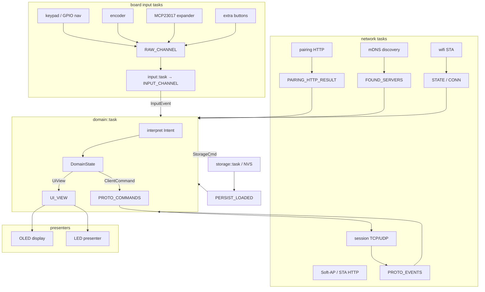
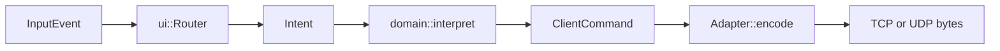
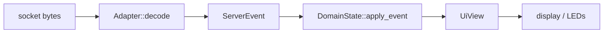

# LongFred — Architecture

LongFred is a wireless physical DCC throttle for [BigFred](../bigfred)
command stations (and generic WiThrottle / Z21 servers). It runs on
ESP32-C6 as `no_std` embassy firmware: keypad or expander input, a
host-testable UI crate, and protocol adapters that never open sockets.

This document is the canonical architecture reference.
Hardware details live in [`docs/hardware/`](docs/hardware/); Soft-AP
provisioning in [`docs/provisioning.md`](docs/provisioning.md);
historical designs in [`docs/plans/`](docs/plans/).

---

## 1. Assumptions

1. **No `alloc` in proto and UI.** Those crates are `#![no_std]` with
   `heapless` storage. Firmware may use a bounded embassy-net heap
   (`esp_alloc`, 72 KiB) for the TCP/IP stack only.
2. **Embassy tasks, static channels.** Cross-task communication is
   `embassy_sync` `Channel` / `Watch` / `Signal` with compile-time
   depths. No `std::thread`, no unbounded queues.
3. **Domain is protocol-blind.** `domain::task` speaks `Intent`,
   `ClientCommand`, and `ServerEvent`. It MUST NOT match on `Protocol`
   identity except where pairing HTTP is gated by `caps().supports_pairing()`.
4. **Ask capabilities, not identity.** UI and domain consult
   `ProtocolCaps` (`supports_source`, `supports_pairing`, `transport`,
   `mdns_service`). The sole `match` on `Protocol` variants in proto is
   `Protocol::info()`. Adapter construction in `net/session.rs` is the
   documented firmware identity boundary.
5. **One NVS sector.** Persist is a tagged binary record (`MAGIC` +
   version + tags) in a single flash sector. Unknown tags are skipped;
   older versions decode with defaults.
6. **Hardware variants are compile-time features.**
   `variant-longfred-standard`, `variant-longfred-mini`,
   `variant-markwtech`, `variant-heiko-wifred` are mutually exclusive.
7. **Closed protocol set, enum dispatch.** WiThrottle, Z21, and BigFred
   are known at compile time. `Adapter` is an enum; no `dyn`, no `Box`
   ([CODING-GUIDELINES.md](CODING-GUIDELINES.md) §8.2).
8. **Host-testable core.** `longfred-proto` and `longfred-ui` run unit
   and integration tests on `x86_64-unknown-linux-gnu`. Firmware is
   `cargo check` / clippy on `riscv32imac-unknown-none-elf`.

### Reliability (connection and pairing)

The throttle fights to stay driving. Manual pairing is a last resort.

1. **Stay connected.** TCP keepalive (`TCP_KEEPALIVE_S`) and a 15 s
   socket timeout detect dead links. WiThrottle reconnect uses bounded
   backoff (`RECONNECT_MIN_MS` … `RECONNECT_MAX_MS`). After a transport
   reconnect the domain reacquires session locos
   (`RESTORE_ACQUIRED_LOCOS`) so speed/functions resume without a roster
   pick.
2. **Re-pair automatically.** `HMNot paired` is a pairing signal, not an
   error overlay. Drive on a non-sentinel DCC address while unpaired
   starts the same flow. With login+PIN in NVS the handset auto-pairs
   (HTTP + function digits) and shows overlay `Pairing...`. The pairing
   code dialog opens only when those credentials are missing.
3. **Long paired sessions.** BigFred keeps each handset session for
   ~3 days of idle time (`RemoteStickySessionIdle`), refreshed on
   activity (`TouchSeen`). On connect, firmware calls
   `POST /api/v1/remotes/handset-session` so an unexpired session skips
   pairing. `POST /api/v1/remotes/handset-pairing` runs only when the
   session is gone.
4. **Sticky credentials.** NVS login, PIN, and last pairing code survive
   reconnect, `PairingFailed`, and HTTP errors. Firmware never clears
   login/PIN except when the operator changes them in provisioning.
5. **Minimise drive interruptions.** Auto-pair uses an overlay on the
   current screen (not `PairingWait`). After pairing succeeds, the
   domain retries acquire of the locos already on the throttle.

---

## 2. High-level architecture



Boot in `crates/firmware/src/bin/main.rs` initializes HAL, optionally
enters Soft-AP programming mode, then spawns wifi, mDNS, session,
pairing HTTP, ping, storage, power, input, domain, and display tasks.

---

## 3. Workspace layout

```
longfred/
├── Cargo.toml                 # workspace
├── rust-toolchain.toml
├── Makefile                   # build / test / lint / size
├── ARCHITECTURE.md            # this file
├── CODING-GUIDELINES.md
├── README.md
├── partitions.csv
├── docs/
│   ├── hardware/              # per-variant board notes
│   ├── provisioning.md
│   └── plans/                 # historical designs
├── .github/workflows/{ci,release}.yml
└── crates/
    ├── proto/                 # wire + persist + catalogues (no I/O)
    ├── ui/                    # screens, router, view (no HAL)
    └── firmware/              # embassy, HAL, sockets, flash
```

`crates/proto/src` groups protocol code by directory: `withrottle/`,
`z21/`, `bigfred/`, `network/`. Shared types (`command`, `caps`,
`catalog`, `persist`, `adapter`) stay at the crate root.

---

## 4. Crate responsibilities

| Crate | Role | I/O? |
|---|---|---|
| **longfred-proto** | `ClientCommand` / `ServerEvent`, `Protocol` + `ProtocolSpec`, adapters, catalogues, persist codec, mDNS PTR helpers, Soft-AP JSON DTOs, pairing HTTP DTOs. `#![no_std]`, host-testable. | none |
| **longfred-ui** | Screens, router, `Intent` / `AppEvent`, i18n, nav profiles, OLED `UiView`. `#![no_std]`, `#![forbid(unsafe_code)]`. | none |
| **longfred-firmware** | Embassy tasks: HAL, wifi, TCP/UDP session, mDNS, pairing HTTP, Soft-AP, NVS, input mapping, domain loop, OLED/LED. | sockets, I2C, GPIO, flash, ADC |

**Dependency direction:** `proto` ← `ui` ← `firmware`. Proto depends on
`heapless` and `serde`/`serde-json-core` only. Firmware is the only crate
that talks to hardware or the network stack.

---

## 5. Tasks and channels

Static embassy primitives in firmware. Depths are compile-time constants.

| Symbol | Kind | Direction | Payload |
|---|---|---|---|
| `INPUT_CHANNEL` | Channel | input map → domain | `InputEvent` |
| `RAW_CHANNEL` | Channel | board tasks → input map | raw key/encoder |
| `PROTO_EVENTS` | Channel | session → domain | `ServerEvent` |
| `PROTO_COMMANDS` | Channel | domain → session | `ClientCommand` |
| `SERVER` | Watch | UI/domain → session | `Option<ServerEndpoint>` |
| `CONN` | Watch | session → domain/UI | `ConnState` |
| `STATE` | Watch | wifi → UI + mDNS | `NetStatus` |
| `DEVICE` | Watch | domain → session | `DeviceIdentity` |
| `FOUND_SERVERS` | Signal | mDNS → domain/UI | `Vec<WitServer>` |
| `MDNS_CTRL` | Channel | domain → mDNS | rescan token |
| `WIFI_CTRL` | Channel | domain → wifi | scan / connect |
| `WIFI_SCAN` | Signal | wifi → UI | `Vec<SsidInfo>` |
| `WIFI_HOSTNAME` | Watch | boot → wifi | hostname |
| `PAIRING_HTTP_CTRL` | Channel | domain → pairing HTTP | request |
| `PAIRING_HTTP_RESULT` | Channel | pairing HTTP → domain | result |
| `STORAGE_CTRL` | Channel | domain → storage | `StorageCmd` |
| `STORAGE_ACK` | Signal | storage → domain | persist ok |
| `PERSIST_LOADED` | Watch | storage → domain | `PersistRecord` |
| `UI_VIEW` | Watch | domain → display | `UiView` |
| `BATTERY` | Watch | ADC → UI | sample |
| `SLEEP_CTRL` | Signal | domain → sleep | reason |

---

## 6. Data flows





1. Input tasks publish raw events; `input::task` maps them through the
   board descriptor into `InputEvent`.
2. `domain::task` feeds events into `longfred-ui` `Router`, collects
   `Intent`s, and turns them into `ClientCommand`s (acquire, speed,
   function, power, pair, …).
3. `net/session.rs` waits for `SERVER`, optionally HTTP-probes BigFred,
   builds an `Adapter`, and runs TCP or UDP from `caps().transport`.
4. Decoded `ServerEvent`s update `DomainState` (roster, slots, track
   power, pairing). The domain publishes `UiView` for the OLED task.

---

## 7. Protocol layer

Each protocol module implements `ProtocolSpec` with a `const INFO:
ProtocolInfo` (caps, HTTP probe, display name, glyph). `Protocol` is
only the NVS/wire identity (`as_u8` / `from_u8`). Accessors
`caps()`, `probe()`, `display_name()`, `glyph()` go through
`Protocol::info()`.

| | WiThrottle | Z21 | BigFred |
|---|---|---|---|
| `ServerRoster` | yes | no | yes |
| `StaticRoster` / `AddressOnly` | yes | yes | yes |
| steal / dead-man / fn labels | yes | no | yes |
| pairing | no | no | yes |
| transport | TCP | UDP | TCP |
| default port | 12090 | 21105 | 12090 |
| mDNS | `_withrottle._tcp` | `_z21._udp` | same as WiThrottle |
| probe | none | none | `GET /api/v1/version` expects `"product":"bigfred"` |

`BigFredAdapter` owns a `WtAdapter` and a pairing FSM (sentinel loco +
momentary function digits). Drive traffic is WiThrottle; pairing is
extra. Firmware handset HTTP (`POST /api/v1/remotes/handset-session`
and `POST /api/v1/remotes/handset-pairing`) runs in its own task so
the session loop stays live.

**Locomotive catalogues.** `LocoSource` is `ServerRoster`,
`StaticRoster`, or `AddressOnly`. `RosterMode` (`Auto` / `Static` /
`AddressOnly`) is the persisted preference. `catalog::resolve_effective`
picks a source the live protocol can honour; fallback is always
`AddressOnly`. After connect, WiThrottle/BigFred wait
`ROSTER_BURST_TIMEOUT_MS` (3 s) for a live roster before treating
`ServerRoster` as unavailable. HUD Menu Left/Right walk the effective
catalogue (`neighbour_index`).

Invariant, enforced by a host test: every protocol’s mask includes
`StaticRoster | AddressOnly`.

---

## 8. Persistence

One flash sector, codec in `crates/proto/src/persist.rs`.

- `MAGIC = 0x4C46_5031` (`LFP1`), `VERSION = 5`.
- Tagged fields: credentials, static roster, network (DHCP/static IP),
  device name/id, hostname, language, programming-mode flag, BigFred
  login/PIN/pairing code, roster mode, last server.
- Older versions decode; missing tags get defaults (pairing code empty,
  `RosterMode::Auto`).
- Soft-AP JSON (`network/provisioning.rs`) maps the same fields so NVS,
  the programming page, and OLED extras stay aligned.

See [docs/provisioning.md](docs/provisioning.md) for the Soft-AP
workflow.

---

## 9. Board variants

| Feature | Display | Input |
|---|---|---|
| `variant-longfred-standard` (default) | OLED 128×64 | GPIO 5-way + F-keys + encoder + MCP23017×2 |
| `variant-longfred-mini` | OLED 128×32 | same as standard |
| `variant-markwtech` | 2.42" OLED | 3×4 keypad + extra tact cluster + encoder |
| `variant-heiko-wifred` | LEDs (no OLED) | expander + pot; Wi-Fi config only |

Nav profiles (`LONGFRED` / `MARKWTECH`) live in `longfred-ui` so host
tests can drive both layouts. `sim` / `sim_bare` skip radio and optional
tasks for Wokwi.

---

## 10. Tests and CI

Local:

```bash
make lint          # rustfmt --check + clippy longfred-ui
make test          # proto + ui host tests (incl. release-assertions)
make build VARIANT=markwtech
```

CI (`.github/workflows/ci.yml`): host tests for proto, rustfmt, clippy
proto, then clippy + release build per variant, then ESP32-C6
flash/RAM budget (`scripts/check-esp32c6-size.sh`).

---

## 11. Limitations / future

- Firmware pairing HTTP is a dedicated embassy-net task; the stack
  socket budget (`NET_SOCKETS`) must cover session + HTTP + Soft-AP/OTA
  together.
- BigFred is detected by an HTTP probe on WiThrottle mDNS hits; there
  is no BigFred-specific mDNS service.
- Headless `heiko-wifred` has no roster UI; address/static lists are
  still provisioned over Soft-AP.
- Historical loco-source and pairing design:
  [docs/plans/loco_sources_and_bigfred_pairing_55b0060a.md](docs/plans/loco_sources_and_bigfred_pairing_55b0060a.md).
  Z21 adapter introduction:
  [docs/plans/z21_protocol_abstraction_17b86eaa.md](docs/plans/z21_protocol_abstraction_17b86eaa.md).
