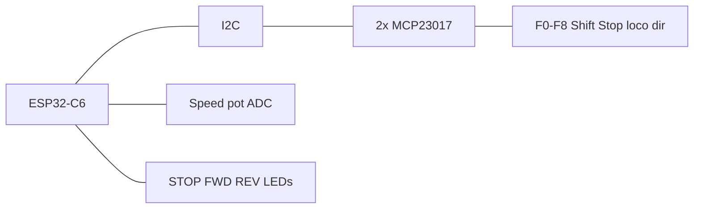

# Heiko wiFred-style (headless)

ESP32-C6-DevKitC-1 with wiFred-like controls: speed pot, direction switch, four loco selectors, F0–F8, yellow Shift, red EStop, and three status LEDs. **No OLED and no on-device menu** — configuration is Wi‑Fi programming only.

| Item | Value |
|------|-------|
| Cargo feature | `variant-heiko-wifred` |
| Display | none (LED presenter) |
| Expanders | 2× MCP23017 |
| Speed | ADC potentiometer |
| Programming chord | **Shift + Stop** 8 s |
| Auto-pair | yes, if NVS has no Wi‑Fi credentials |

## Controls

- Potentiometer → absolute speed 0–126
- Direction switch → forward/reverse
- Four loco enable switches → slots 0–3
- F0–F8; Shift1 raises to F9–F16
- Red Stop; yellow Shift
- HeadlessShell ignores menu/nav events

## LED patterns

| Mode | STOP (red) | FORWARD (green) | REVERSE (green) |
|------|------------|-----------------|-----------------|
| Boot / connecting | blink 1 Hz | off | off |
| Entering pair (2 s) | fast blink | fast blink | fast blink |
| Pairing active | off | alternate | alternate |
| Drive forward | off | solid | off |
| Drive reverse | off | off | solid |
| EStop | solid | blink (dir) | blink (dir) |
| Server lost | blink 1 Hz | last dir held | last dir held |

## Pin map

| Function | GPIO / bus |
|----------|------------|
| I2C SDA / SCL | 6 / 7 |
| MCP23017 | 0x20, 0x21 |
| LED STOP / FWD / REV | 18 / 19 / 20 |
| Speed pot ADC | GPIO 1 (shared battery ADC pin — dedicated pot pin in future revisions) |

## Programming mode

- Auto: first boot with empty Wi‑Fi NVS
- Manual: Shift + Stop 8 s
- Soft-AP `longfred_prog_XXXXXX` — DHCP, then `http://192.168.4.1/` (see [provisioning.md](../provisioning.md))
- Firmware OTA: Soft-AP only (no on-device menu)

## Power / sleep

No OLED, so there is no display blank. After **15 minutes** of no input with no loco moving, the firmware EStops and enters deep sleep (also below **5 %** battery). Headless builds do not wire encoder `SW` on GPIO 0, so wake is a reset or power cycle.
