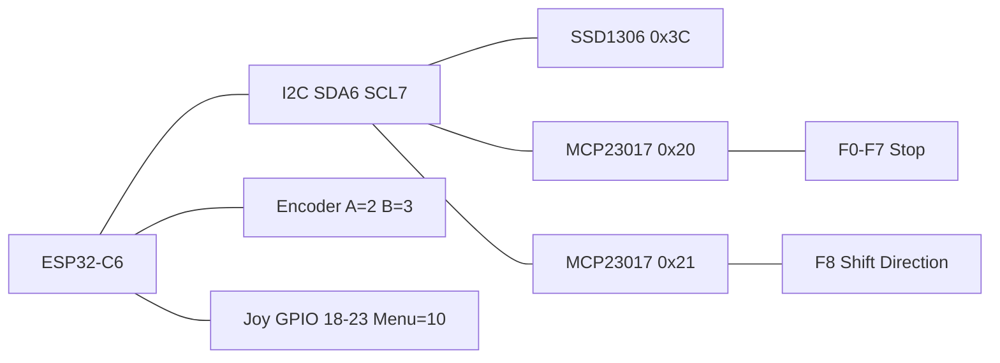

# LongFred Standard

ESP32-C6-DevKitC-1U handheld throttle with OLED **128×64**, MCP23017 expanders, and rotary encoder.

## Features

| Item | Value |
|------|-------|
| MCU | ESP32-C6-DevKitC-1U |
| Display | SSD1306 128×64 I2C `@ 0x3C` |
| I/O | 2× MCP23017 (0x20, 0x21) |
| Speed | KY-040 / EC11 encoder (A/B only) |
| Cargo feature | `variant-longfred-standard` (default) |
| Programming chord | **Shift1 + Stop** held 8 s |

## Controls

- **STOP** — EStop on throttle screen; Cancel/Back in menus
- **Shift1 / Shift2** — F-key layers (F0–F8 / F9–F17 / F18–F26); Shift1 also toggles case in text entry
- **5-way joystick** — Up/Down/Left/Right + center = Menu (Select when already in a menu)
- **Encoder** — speed only
- **Direction** — toggle loco direction
- **F0–F8** — DCC functions (shifted via Shift1/Shift2)

## Pin map

| Function | Connection |
|----------|------------|
| I2C SDA / SCL | GPIO 6 / 7 |
| OLED | I2C 0x3C |
| MCP23017 #0 / #1 | I2C 0x20 / 0x21 |
| Encoder A / B | GPIO 2 / 3 |
| Joy Up/Down/Left/Right/Ok*/Menu | GPIO 18–22 / 10 |
| Battery ADC | GPIO 1 |

\*Center of 5-way is Menu in firmware; legacy Ok GPIO maps through the surface as Menu.

Exact MCP bit map: [`config/board.rs`](../../crates/firmware/src/config/board.rs) `BUTTON_MAP`.

## Power / sleep

- **30 s** without input: OLED off (`DisplayOff`). Any key or encoder detent wakes the panel without running the action, except Stop/EStop which still emergency-stops.
- **5 min** without input and no acquired loco moving: EStop, then deep sleep. Wake on encoder `SW` (GPIO 0).
- Battery below **5 %**: EStop, then deep sleep.

## BOM (core)

- ESP32-C6-DevKitC-1U
- SSD1306 0.96" 128×64 OLED (I2C)
- 2× MCP23017 / Kamod IOEXP16
- KY-040 or EC11 encoder
- Tact switches F0–F8, Stop, Shift×2, Direction
- 5-way joystick module
- LiPo + charging (board-dependent)

## Programming mode

**Stop** during the 2 s boot splash, or hold **Shift1 + Stop** for 8 seconds. Soft-AP `longfred_prog_XXXXXX` at `192.168.4.1` (DHCP). Firmware OTA: pairing page, or Extras → Firmware update on layout Wi‑Fi. See [provisioning.md](../provisioning.md).
