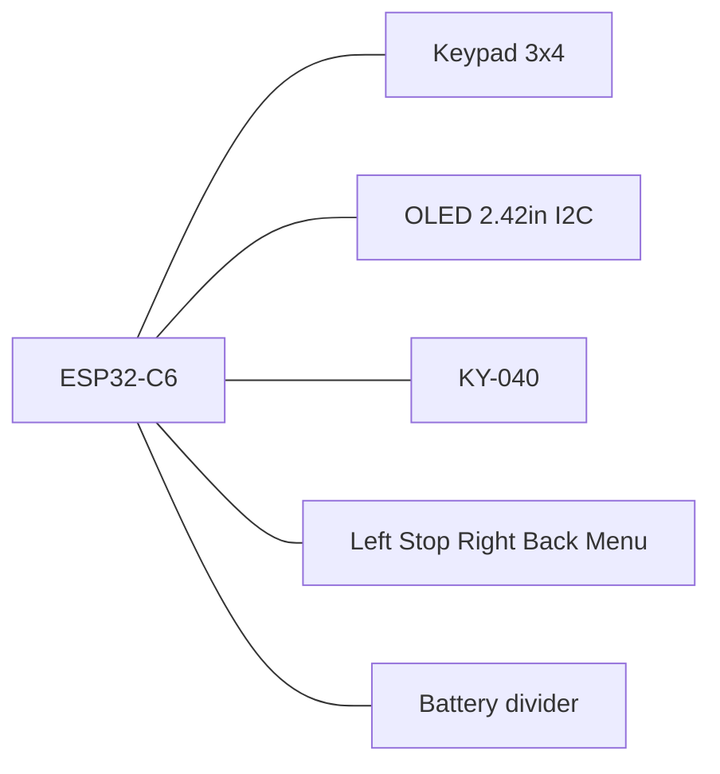

# MarkWTech (WiTcontroller-style)

> Polish version: [markwtech_pl.md](markwtech_pl.md)

ESP32-C6-DevKitC-1 with 3×4 keypad, extra buttons, KY-040 encoder, and 2.42" SSD1309 OLED — inspired by [WiTcontroller](https://github.com/flash62au/WiTcontroller) / [Thingiverse 7029069](https://www.thingiverse.com/thing:7029069), with ESP32-C6 instead of LOLIN32.

| Item | Value |
|------|-------|
| Cargo feature | `variant-markwtech` |
| Display | SSD1309/SSD1306 128×64 I2C |
| Expanders | none |
| Programming chord | **\* (Menu) + Stop** 8 s |

## Controls

- 3×4 keypad: digits, `*` (menu/cancel), `#` (select)
- Five extra GPIO tact switches (left / Stop / right / Back / Menu)
- KY-040 encoder for speed / list scroll
- Dedicated Stop for EStop / programming chord

## Pin map

| Role | GPIOs |
|------|-------|
| Keypad rows | 18, 19, 20, 21 |
| Keypad columns | 22, 23, 10 |
| I2C OLED | SDA 6, SCL 7, address 0x3C |
| Encoder | A 2, B 3, SW 0 |
| Extra left / Stop / right / Back / Menu | 11, 12, 4, 5, 15 |
| Battery ADC | 1 |

Keypad layout (`KEYPAD_MAP`):

```text
     C0   C1   C2
R0    1    2    3
R1    4    5    6
R2    7    8    9
R3    *    0    #
```

Extra buttons: tact switch to **GND**, firmware pull-up, active-low.

| # | Function | GPIO | Notes |
|---|----------|------|-------|
| 1 | Menu left | 11 | `Nav(Left)` — list page prev / cursor |
| 2 | Stop | 12 | EStop on throttle; chord with `*` |
| 3 | Menu right | 4 | `Nav(Right)` — list page next / cursor |
| 4 | Back | 5 | Cancel / back |
| 5 | Menu | 15 | Open menu / select-in-menu |



Constants: `board/variants/markwtech.rs` (`KEYPAD_MAP`, `EXTRA_BUTTON_MAP`).

## Pin budget

Sources: [ESP32-C6-DevKitC-1 user guide](https://docs.espressif.com/projects/esp-dev-kits/en/latest/esp32c6/esp32-c6-devkitc-1/user_guide.html) (Header Block) and [ESP32-C6 Datasheet v1.5](https://documentation.espressif.com/esp32-c6_datasheet_en.html) (chapter 3, Boot Configurations).

The headers expose **23 GPIO** in total — J1 carries `4, 5, 6, 7, 0, 1, 8, 10, 11, 2, 3` and J3 carries `16, 17, 15, 23, 22, 21, 20, 19, 18, 9, 13, 12`. **GPIO 14 is absent**: J3 jumps straight from 18 to 9, then to 13 and 12.

| Class | GPIOs | Count |
|-------|-------|-------|
| Fully free | 0, 1, 2, 3, 6, 7, 10, 11, 18, 19, 20, 21, 22, 23 | 14 |
| Strapping, verified harmless | 4, 5, 15 | 3 |
| Costs the native USB port | 12, 13 | 2 |
| Costs the UART console | 16, 17 | 2 |
| Blocked | 8 (RGB LED), 9 (BOOT button) | 2 |

MarkWTech needs **18** lines (keypad 7 + encoder 3 + I2C 2 + buttons 5 + battery ADC 1). Free plus strapping-safe gives only 17, so exactly one pin must come from the USB pair — Stop takes **GPIO 12**. That leaves **GPIO 13 spare at no extra cost**, because the native USB port is already forfeited by using its `D−` line.

### Why the risky pins are safe

- **GPIO 4 (MTMS) and GPIO 5 (MTDI)** — per datasheet Table 3-4 their strapping value only selects the sampling/driving clock edge of the **SDIO slave** interface, which this project never uses. Both float by default.
- **GPIO 15** — per Table 3-7, with factory eFuses (`DIS_PAD_JTAG=0`, `DIS_USB_JTAG=0`, `JTAG_SEL_ENABLE=0`) the pin is explicitly listed as **Ignored**. The datasheet warning against leaving it high-impedance only applies once `EFUSE_JTAG_SEL_ENABLE` has been burned, which is a deliberate and irreversible act.
- Holding any of these buttons during reset therefore **cannot change the boot mode**. Boot mode is decided by GPIO 8/9 alone (Table 3-3).
- **GPIO 12** works as a plain input because esp-hal calls `disable_usb_pads()` from `init_gpio()` before any input/output use, clearing `usb_pad_enable` and the D+/D− pull resistors (`esp-hal-1.1.1/src/gpio/mod.rs:1669-1709`).

### Deep-sleep wake

Only **GPIO 0–7** belong to the LP power domain (`LP_GPIO0..7`) and can wake the chip from deep sleep. The encoder `SW` on GPIO 0 is the wake source. Menu (15), Menu left (11) and Stop (12) **cannot** wake the throttle.

### Unused / reserved GPIO

| GPIO | Header | Why it is left alone |
|------|--------|----------------------|
| 8 | J1-9 | drives the on-board addressable RGB LED |
| 9 | J3-11 | on-board BOOT button; boot-mode strapping pin |
| 13 | J3-13 | `USB_D+` — spare, free to use if another input is ever needed |
| 16 | J3-2 | `U0TXD` — serial console out |
| 17 | J3-3 | `U0RXD` — serial console in |

The **KAmod MCP23017** expander is owned but deliberately not used: all 18 lines fit directly on the DevKit, and keeping **Stop on a direct GPIO** means an I2C bus fault cannot disable the emergency stop and the display at the same time.

## Full wiring (pin-by-pin)

All modules run on **3.3 V** (not 5 V). Tie a common **GND** to every component.

### OLED 2.42" I2C (SSD1309 / SSD1306)

| ESP GPIO | Firmware | OLED pin (typical) | Notes |
|----------|----------|-------------------|-------|
| **6** | `I2C_SDA` | `SDA` / `DIN` / `DATA` | I2C data |
| **7** | `I2C_SCL` | `SCL` / `CLK` / `SCK` | I2C clock |
| **3V3** | — | `VCC` / `3.3V` | |
| **GND** | — | `GND` | |
| — | address **0x3C** | — | set `ADDR` jumper on module if present |

Common 4-pin order on cheap modules: `GND` · `VCC` · `SCL` · `SDA` (verify your module silkscreen).

### KY-040 rotary encoder

| ESP GPIO | Firmware | KY-040 pin | Notes |
|----------|----------|------------|-------|
| **2** | `ENCODER_A` | **`DT`** (sometimes `B`, `DATA`) | channel A |
| **3** | `ENCODER_B` | **`CLK`** (sometimes `A`) | channel B |
| **0** | `ENCODER_BUTTON` | **`SW`** / `KEY` | encoder push button |
| **3V3** | — | **`+`** / `VCC` | |
| **GND** | — | **`GND`** | |

KY-040 boards often swap `CLK`/`DT` silkscreen labels — wire as above (`DT`→GPIO2, `CLK`→GPIO3). GPIO0 doubles as the deep-sleep wake pin, so the encoder button also wakes the throttle.

### 3×4 membrane keypad (7 pins)

Rows are **outputs** (scanner drives one low at a time). Columns are **inputs** with internal pull-up.

| ESP GPIO | Firmware | Keypad pin | Matrix role |
|----------|----------|------------|-------------|
| **18** | `KEYPAD_ROW_PINS[0]` | **R0** (row 1) | keys `1` `2` `3` |
| **19** | `KEYPAD_ROW_PINS[1]` | **R1** (row 2) | keys `4` `5` `6` |
| **20** | `KEYPAD_ROW_PINS[2]` | **R2** (row 3) | keys `7` `8` `9` |
| **21** | `KEYPAD_ROW_PINS[3]` | **R3** (row 4) | keys `*` `0` `#` |
| **22** | `KEYPAD_COL_PINS[0]` | **C0** (col 1) | keys `1` `4` `7` `*` |
| **23** | `KEYPAD_COL_PINS[1]` | **C1** (col 2) | keys `2` `5` `8` `0` |
| **10** | `KEYPAD_COL_PINS[2]` | **C2** (col 3) | keys `3` `6` `9` `#` |

**Keypad pin order is not standardized.** Identify each row/column with a multimeter (a pressed key shorts its row to its column). If digits come out scrambled, swap wires on the connector — do not change firmware GPIO numbers.

### Five extra tact switches (active-low)

Each switch: one leg → **GPIO**, other leg → **GND**. Firmware enables the internal pull-up (pressed = LOW).

| ESP GPIO | Header | Label | UI function | Suggested silkscreen |
|----------|--------|-------|-------------|----------------------|
| **11** | J1-11 | Menu left | list page prev / cursor left | `LEFT` |
| **12** | J3-14 | **Stop** | EStop on throttle; `*`+Stop chord (8 s) | `STOP` / `E-STOP` |
| **4** | J1-3 | Menu right | list page next / cursor right | `RIGHT` |
| **5** | J1-4 | Back | cancel / back | `BACK` / `ESC` |
| **15** | J3-4 | Menu | open menu / select in menu | `MENU` / `OK` |

```text
GPIOx ────[ tact switch ]──── GND
         (MCU pull-up)
```

### Battery

The DevKit has **no LiPo charger and no battery connector** — unlike the LOLIN32 Lite the original WiTcontroller is built on, which provides both. Running MarkWTech on a cell therefore needs external parts.

| Part | Purpose |
|------|---------|
| LiPo cell 3.7 V, 1200 mAh (503759) | power source; the original gets ~6 h from 400 mAh, so 1200 mAh lasts a full session |
| TP4056 module with protection (`DW01A` + `8205A`) | USB-C charging plus over-charge / over-discharge cut-off |
| **Pololu S7V8F3** buck-boost regulator | cell swings 3.0–4.2 V; this holds a solid 3.3 V across the whole range |
| 2× 47 kΩ resistor | measurement divider into GPIO 1 |
| 100 nF capacitor (recommended) | ADC noise filter, see below |
| KCD1 rocker switch, bistable | master ON/OFF in series with `OUT+` |

**Do not use an AMS1117 or LD1117.** Those need roughly 4.5 V at the input to hold 3.3 V out; a LiPo never gets there. A true low-dropout part (ME6211, AP2112K, XC6220, MCP1826) would work down to about 3.5 V, but the buck-boost is better still because it keeps regulating below 3.3 V and squeezes the last ~35 % out of the cell.

Power chain:

```text
USB-C (TP4056) --charges--> B+ / B- <-- LiPo 1200 mAh
                               |
                          OUT+ / OUT-
                               |
                  [KCD1 rocker, in series on OUT+]
                               |
              +----------------+----------------+
              |                                 |
       S7V8F3 VIN                       47k --+-- 47k -- GND
              |                                |
       S7V8F3 VOUT ---> 3V3 (J1-1)          GPIO 1 (J1-8)
              |                            + 100 nF to GND
       S7V8F3 GND  ---> common ground
```

Take the load from **`OUT+` / `OUT−`**, never from `B+` / `B−` — the protection MOSFETs sit between `B` and `OUT`, so a load on `B` bypasses the over-discharge cut-off.

#### Why the divider is needed and correctly sized

Per the [ESP hardware design guidelines](https://docs.espressif.com/projects/esp-hardware-design-guidelines/en/latest/esp32c6/schematic-checklist.html), the calibrated ADC range at ATTEN=3 (`Attenuation::_11dB`, what the firmware uses) is **0–3300 mV** with ±40 mV total error. A 4.2 V cell would exceed that and damage the input. The 1:2 divider maps a full cell to **2.10 V** and an empty one to **1.50 V**, both comfortably inside range. GPIO 1 is `ADC1_CH1`, a valid ADC channel.

Divider current is `4.2 V / 94 kΩ ≈ 45 µA`, and it sits behind the rocker switch, so it drains nothing when the throttle is off.

Espressif recommends a **0.1 µF capacitor from the ADC pin to ground**. It matters more here than usual because the S7V8F3 is a switching regulator and puts ripple on the rail. The firmware averages `ADC_READS` samples, so the reading works without it, but it will be steadier with it.

If the cell has a third **NTC** lead, leave it unconnected — TP4056 modules ignore it.

#### Calibration

`BATTERY_CONVERSION_FACTOR` in [`config/power.rs`](../../crates/firmware/src/config/power.rs) is inherited from the original project, where it was tuned against the classic ESP32 ADC. Charge the cell fully and read the UART log line `battery: raw=… suggested_factor=…`. Copy `suggested_factor` into the constant. Expect roughly `2600` raw and a factor near `1.6`.

With a working cell the firmware also auto-sleeps: deep sleep below **5 %** charge, and after **4 minutes** of inactivity with no WiThrottle server.

Leaving GPIO 1 unconnected is harmless — the reading is then meaningless noise and the battery icon can be hidden from the menu.

## Master connection table

Header numbering follows the [ESP32-C6-DevKitC-1 user guide](https://docs.espressif.com/projects/esp-dev-kits/en/latest/esp32c6/esp32-c6-devkitc-1/user_guide.html): **J1** is the side carrying `3V3`/`RST`/`5V`, **J3** the side carrying `TX`/`RX`. Ground is available on J1-15, J3-1, J3-12 and J3-15.

**41 wires in total.** `VBAT_SW` and `MID` are junction points, not physical parts — several wires meet there.

### A. Power (15 wires)

| # | From (component + pin) | To (component + pin) | Purpose |
|---|------------------------|----------------------|---------|
| 1 | LiPo **+** (measured; often red, not always) | TP4056 `B+` | cell into the charger |
| 2 | LiPo **−** (measured; often black, not always) | TP4056 `B−` | cell into the charger |
| — | LiPo — white lead (NTC) | *leave unconnected, insulate* | module has no thermistor input |
| 3 | TP4056 `OUT+` | KCD1 rocker — measured pin A | master switch, in series |
| 4 | KCD1 rocker — measured pin B | junction `VBAT_SW` | switched battery rail |
| 5 | `VBAT_SW` | S7V8F3 `VIN` | feeds the regulator |
| 6 | `VBAT_SW` | R1 47 kΩ — leg 1 | top of the divider |
| 7 | R1 47 kΩ — leg 2 | junction `MID` | divider midpoint |
| 8 | `MID` | R2 47 kΩ — leg 1 | bottom of the divider |
| 9 | R2 47 kΩ — leg 2 | common ground | closes the divider |
| 10 | `MID` | DevKit `1` (J1-8) | battery voltage into the ADC |
| 11 | 100 nF — leg 1 | `MID` / GPIO 1 | ADC noise filter (recommended) |
| 12 | 100 nF — leg 2 | common ground | ADC noise filter (recommended) |
| 13 | TP4056 `OUT−` | common ground | current return |
| 14 | S7V8F3 `GND` | common ground | current return |
| 15 | S7V8F3 `VOUT` | DevKit `3V3` (J1-1) | 3.3 V into the board |
| — | S7V8F3 `SHDN` | *leave unconnected* | internal pull-up keeps it enabled |

### B. OLED 2.42" (4 wires)

| # | From | To | Purpose |
|---|------|-----|---------|
| 16 | OLED `VCC` | DevKit `3V3` (J1-1) | power |
| 17 | OLED `GND` | common ground | power return |
| 18 | OLED `SDA` | DevKit `6` (J1-5) | I2C data |
| 19 | OLED `SCL` | DevKit `7` (J1-6) | I2C clock |

### C. KY-040 encoder (5 wires)

| # | From | To | Purpose |
|---|------|-----|---------|
| 20 | KY-040 `+` | DevKit `3V3` (J1-1) | power |
| 21 | KY-040 `GND` | common ground | power return |
| 22 | KY-040 `DT` | DevKit `2` (J1-12) | encoder channel A |
| 23 | KY-040 `CLK` | DevKit `3` (J1-13) | encoder channel B |
| 24 | KY-040 `SW` | DevKit `0` (J1-7) | push button + deep-sleep wake |

### D. 3×4 keypad (7 wires)

| # | From | To | Purpose |
|---|------|-----|---------|
| 25 | Keypad `R0` | DevKit `18` (J3-10) | matrix row (output) |
| 26 | Keypad `R1` | DevKit `19` (J3-9) | matrix row (output) |
| 27 | Keypad `R2` | DevKit `20` (J3-8) | matrix row (output) |
| 28 | Keypad `R3` | DevKit `21` (J3-7) | matrix row (output) |
| 29 | Keypad `C0` | DevKit `22` (J3-6) | matrix column (input) |
| 30 | Keypad `C1` | DevKit `23` (J3-5) | matrix column (input) |
| 31 | Keypad `C2` | DevKit `10` (J1-10) | matrix column (input) |

### E. Five buttons (10 wires)

| # | From | To | Purpose |
|---|------|-----|---------|
| 32 | Button "Menu left" — leg 1 | DevKit `11` (J1-11) | input |
| 33 | Button "Menu left" — leg 2 | common ground | pressed = LOW |
| 34 | Button "Stop" — leg 1 | DevKit `12` (J3-14) | input |
| 35 | Button "Stop" — leg 2 | common ground | pressed = LOW |
| 36 | Button "Menu right" — leg 1 | DevKit `4` (J1-3) | input |
| 37 | Button "Menu right" — leg 2 | common ground | pressed = LOW |
| 38 | Button "Back" — leg 1 | DevKit `5` (J1-4) | input |
| 39 | Button "Back" — leg 2 | common ground | pressed = LOW |
| 40 | Button "Menu" — leg 1 | DevKit `15` (J3-4) | input |
| 41 | Button "Menu" — leg 2 | common ground | pressed = LOW |

## Assembly, step by step

This section assumes **no electronics background**. Every step says what to pick up, where to put it, and why. Wire numbers in parentheses refer to the [master connection table](#master-connection-table).

### Before you start

Get a **multimeter**. It is needed several times, and without it two of the steps are guesswork. The cheapest one will do, as long as it can measure DC voltage (marked `V` with a straight line) and has a continuity mode (a sound-wave or diode symbol).

A few terms that keep coming up:

- **Ground** (`GND`, minus) is the shared reference point for the whole circuit. Every electrical signal is really a **voltage difference against ground** — without a shared ground there is nothing to measure against and the circuit behaves erratically.
- A **pin** is a single leg or hole in a header. The ESP32 board has two headers, **J1** and **J3**, as used in the tables.
- **In series** means "one after the other, current flows through both" — that is how a switch is wired in.
- **Polarity** is which lead is plus (`+`) and which is minus (`−`). Wiring a LiPo backwards destroys the charger and often the cell.

**Check the cell polarity before anything is connected.** Cheap LiPo packs frequently reverse the usual colours, so **do not trust red = plus and black = minus**. Measure:

1. Set the multimeter to DC voltage (`V` with a straight line).
2. Touch the **red** probe to one cell lead and the **black** probe to the other. Do not connect the cell to anything yet.
3. If the display shows a **positive** number (about 3.7–4.2 V): the lead under the red probe is **plus (`+`)**, the lead under the black probe is **minus (`−`)**.
4. If the display shows a **negative** number (a minus sign in front): the leads are the other way around — the lead under the red probe is **minus**, the lead under the black probe is **plus**.
5. Mark the plus lead (a piece of tape is enough) and use that mark, not the factory colour, in every later step.

The third lead, if present, is the NTC thermistor (usually white or yellow). It is neither plus nor minus — leave it alone.

### Step 1 — establish a common ground

Before connecting anything else, plan a **single common ground point**. The simplest approach: pick a `G` pin on the ESP32 board (J1-15 or J3-1) and run ground from there to every component.

Ground goes to: `OUT−` on the charger, `GND` on the regulator, `GND` on the display, `GND` on the encoder, the bottom resistor of the divider, the capacitor, and **all five buttons** — one leg each. *(wires 9, 12, 13, 14, 17, 21, 33, 35, 37, 39, 41)*

**Why:** this is the most common source of trouble in a first build. A button whose ground comes from somewhere other than the board may work once every few presses, or trigger by itself. The ESP32 board has four `G` pins and they are all connected internally, so any of them will do.

### Step 2 — build the power chain

Order matters, because each element protects the next one.

1. **Cell into the charger — follow the measured polarity, not the colour.** The cell **plus (`+`)** lead — *often* red, but only if the check in [Before you start](#before-you-start) confirmed it — goes to pad `B+` on the TP4056. The cell **minus (`−`)** lead — *often* black — goes to pad `B−`. Reverse polarity here destroys the module and often the cell. *(wires 1, 2)*
2. **Leave the white lead loose** and tape it over. It is a temperature sensor (thermistor) this module does not support. A loose, uninsulated lead can touch something and short.
3. **Switch on the charger output.** From the `OUT+` pad to one pin of the rocker switch, from the other rocker pin onward into the circuit. *(wires 3, 4)*
4. **Regulator.** Run the point after the switch to the `VIN` pin of the S7V8F3. Its `GND` pin goes to ground. *(wires 5, 14)*
5. **Regulator output.** The `VOUT` pin goes to the `3V3` pin of the ESP32 board (J1-1). *(wire 15)*
6. **Leave the `SHDN` pin unconnected.** It has an internal pull-up that keeps the regulator enabled by default. Shorting it to ground would switch it off.

**Why take the load from `OUT` and not `B`:** the charger module has built-in over-discharge protection (the `DW01A` and `8205A` chips). That protection sits **between** the `B` pads and the `OUT` pads. Drawing current from `B+` would bypass it and allow the cell to be discharged below its safe threshold, which damages it permanently.

**Why a switching regulator and not a plain one:** a LiPo cell drops from 4.2 V to about 3.0 V as it discharges. A plain regulator such as an AMS1117 needs roughly 4.5 V at its input to produce 3.3 V, so it would essentially never work here. The S7V8F3 is a **buck-boost** type: when the cell is above 3.3 V it steps down, and when it falls below it steps up. That way the full capacity of the cell is used instead of losing the last ~35 %.

**Why 3.3 V and not 5 V:** the ESP32-C6 module runs on 3.3 V and feeding 5 V into the `3V3` pin will destroy it. The board does have a `5V` pin, but it leads into the on-board regulator — using it would mean two voltage conversions instead of one and needless losses.

### Step 3 — build the battery measurement divider

You need two 47 kΩ resistors. Twist or solder them together **end to end**, producing one longer element with three connection points: a start, a **midpoint** (where they join) and an end.

1. **Start** of the divider to the point **after the switch** (the same one that feeds `VIN` on the regulator). *(wire 6)*
2. **End** of the divider to ground. *(wire 9)*
3. **Midpoint** of the divider to pin `1` on the ESP32 board (J1-8). *(wire 10)*
4. If you have the 100 nF capacitor, connect it between the **midpoint** and ground. Polarity does not matter. *(wires 11, 12)*

**Why the divider is necessary:** the ESP32 measurement input accepts at most **3.3 V**, while a fully charged cell sits at **4.2 V**. Feeding 4.2 V straight in would damage the input. Two equal resistors split the voltage exactly **in half**, so the pin sees 2.1 V on a full cell and 1.5 V on an empty one — both safely in range. The firmware knows about this split and converts the reading back.

**Why the divider sits after the switch:** a tiny current flows through it continuously (about 45 microamps). Putting it after the switch means the cell does not discharge at all once the throttle is off.

**What the capacitor is for:** the regulator works by switching rapidly and introduces small disturbances onto the supply. The capacitor smooths them out so the battery percentage does not jump around. The circuit works without it — the reading is simply less steady.

### Step 4 — test the power BEFORE connecting anything else

This is a separate step because a mistake in the previous two can destroy the display and the ESP32 board at the same time.

1. **Do not connect** the display, encoder, keypad or buttons yet.
2. Set the rocker switch to ON.
3. With the multimeter in DC voltage mode, touch the black probe to ground and the red probe to the `3V3` pin (J1-1).
4. **You must see a value between 3.2 and 3.4 V.**

If you see 0 V, check the switch and the cell polarity. If you see the cell voltage (about 3.7–4.2 V), the regulator is being bypassed or is miswired and you **must not** continue. If everything checks out, switch the rocker off and move on.

While you are there, measure the voltage on pin `1` (J1-8) — it should be roughly **half** the cell voltage. That confirms the divider works.

### Step 5 — connect the OLED display

Four wires. *(wires 16–19)*

| Display pin | Goes to |
|---|---|
| `VCC` | `3V3` on the board (J1-1) |
| `GND` | ground |
| `SDA` | pin `6` (J1-5) |
| `SCL` | pin `7` (J1-6) |

**Watch the pin order.** On cheap modules it is often `GND · VCC · SCL · SDA`, meaning the **power pins are reversed** relative to intuition. Read the labels printed on the module rather than assuming an order.

**Why only two signal wires:** the display talks over an I2C bus, where one line (`SDA`) carries data and the other (`SCL`) clocks it. That allows the display to be driven with just two pins instead of a dozen.

### Step 6 — connect the KY-040 encoder

Five wires. *(wires 20–24)*

| Encoder pin | Goes to |
|---|---|
| `+` | `3V3` on the board (J1-1) |
| `GND` | ground |
| `DT` | pin `2` (J1-12) |
| `CLK` | pin `3` (J1-13) |
| `SW` | pin `0` (J1-7) |

**Note:** KY-040 manufacturers routinely swap the `CLK` and `DT` labels. Wire it as in the table, and if the knob turns out to work backwards after power-up, swap those two wires. Nothing gets damaged by this.

**Why `SW` goes to pin 0 specifically:** only pins 0 through 7 can wake the chip from deep sleep. Putting the encoder button on pin 0 makes it double as the "wake the throttle" button. None of the other five buttons can do this.

### Step 7 — connect the keypad

The keypad has **7 leads**: four for rows and three for columns. The catch is that **the lead order is not standardized** and varies between units, so you have to work it out yourself.

**How to do it with a multimeter:**

1. Set the multimeter to continuity mode (the beeper).
2. Press and hold key **`1`**. Look for the pair of leads that makes the meter beep — those are row R0 and column C0 for that key.
3. Repeat for key **`2`**: the lead shared with the previous test is row R0, the new one is column C1.
4. Working through keys `3`, `4`, `7` and `*` maps out all seven leads.

Then wire it according to the table. *(wires 25–31)*

| Lead | Goes to | Keys |
|---|---|---|
| `R0` | pin `18` (J3-10) | `1` `2` `3` |
| `R1` | pin `19` (J3-9) | `4` `5` `6` |
| `R2` | pin `20` (J3-8) | `7` `8` `9` |
| `R3` | pin `21` (J3-7) | `*` `0` `#` |
| `C0` | pin `22` (J3-6) | `1` `4` `7` `*` |
| `C1` | pin `23` (J3-5) | `2` `5` `8` `0` |
| `C2` | pin `10` (J1-10) | `3` `6` `9` `#` |

**If the digits come out wrong after power-up, move the wires — do not change the firmware.** The pin numbers are baked into the code, and changing them makes the documentation disagree with reality.

**Why 7 pins are enough for 12 keys:** the keys are arranged in a grid. The board activates one row at a time and checks which column responds. The intersection of the active row and the responding column identifies the pressed key unambiguously. That is why 4 + 3 pins suffice instead of 12 separate ones.

### Step 8 — connect the five buttons

Each button has **two legs** and is wired identically: **one leg to its assigned pin, the other to ground**. *(wires 32–41)*

| Button | Board pin | Header |
|---|---|---|
| Menu left | `11` | J1-11 |
| **Stop** | `12` | J3-14 |
| Menu right | `4` | J1-3 |
| Back | `5` | J1-4 |
| Menu | `15` | J3-4 |

**How to pick the right legs:** 12 mm buttons usually have exactly two terminals, in which case there is nothing to choose. If yours has more, set the multimeter to continuity and find the pair that **beeps only while the button is pressed** and stays silent at rest.

**Why one leg goes to ground:** the board enables an internal pull-up resistor that holds the pin high while nothing is happening. Pressing the button connects the pin to ground and pulls it low, and that transition is what the firmware reads as a press. No external resistors are needed.

**Why these particular pins:** all of them were checked against their special functions. Pins 4, 5 and 15 are so-called strapping pins, but with factory chip settings their state at start-up affects nothing that matters here — you can hold these buttons while powering up and the board will boot normally. Pin 12 is a native USB line, so that port will not work; the firmware is flashed through the second USB port, which is entirely sufficient.

### Step 9 — first power-up and battery calibration

1. **Set the rocker to OFF.** This matters: never power the board from the battery and USB at the same time.
2. Connect the computer to the **USB-to-UART** port on the board (the one wired to the bridge chip, not the native one) and flash the firmware.
3. Disconnect USB, set the rocker to ON, and check that the display lights up, the keypad responds and the knob changes values.
4. **Battery calibration:** charge the cell fully through the USB-C port on the charger module (the LED on it will change colour). From the UART log, copy `suggested_factor` out of the line `battery: raw=… suggested_factor=…` into `BATTERY_CONVERSION_FACTOR` in [`config/power.rs`](../../crates/firmware/src/config/power.rs). Expect a reading around 2600 and a factor close to 1.6.
5. Flash the firmware again (rocker off once more) and check that a full cell reads 100 %.

### Safety warnings

- **Never power the board over USB with the rocker switched on.** That would put two voltage sources on the same 3.3 V rail, fighting each other. Switch the rocker off before every firmware flash.
- **Do not swap `B+` and `B−`** on the charger module, and **do not trust the cell wire colours**. Measure polarity first ([Before you start](#before-you-start)). Reverse polarity destroys the module and often the cell as well.
- **The white cell lead (NTC) stays unconnected and insulated.** Do not connect it anywhere "just in case".
- **LiPo cells are delicate.** Do not bend, puncture, or solder directly to the cell terminals. Retire a swollen or damaged cell immediately.
- **Leave the regulator `SHDN` pin free.** It has an internal pull-up, and an accidental short to ground will cut the power.
- The ESP32 board has a **power indicator LED** that draws current continuously whenever the circuit is on. If you want maximum run time it can be desoldered — nothing depends on it.
- **Before the first power-up, check with the multimeter that `3V3` and ground are not shorted.** A beep between those points means an assembly error, and switching on in that state will damage the regulator.

## BOM

Core:

- ESP32-C6-DevKitC-1 V1.4 (ESP32-C6-WROOM-1, 8 MB flash)
- 2.42" OLED 128×64 SSD1309, I2C, 4-pin
- 3×4 membrane keypad, 7-pin
- KY-040 rotary encoder
- 5× momentary panel push button, 12 mm
- Case: Thingiverse 7029069 (adapted)

Battery:

- LiPo cell 3.7 V, 1200 mAh, format 503759 (5.0 × 37 × 59 mm), with NTC lead
- TP4056 charging module, USB-C, with `DW01A` + `8205A` protection
- Pololu S7V8F3 buck-boost regulator (2.7–11.8 V in, 3.3 V out, up to 1 A)
- 2× 47 kΩ resistor
- 1× 100 nF capacitor (recommended, ADC filter)
- KCD1 rocker switch, 21 × 15 mm, bistable ON/OFF

Owned but not used:

- KAmod I2C-IOexp16 (MCP23017) — see [Pin budget](#pin-budget)

## Flashing

Use the **USB Type-C to UART** port (the one wired to the on-board bridge) — no extra wiring. The other Type-C port is the chip's native USB, which is unavailable because Stop occupies `USB_D−`. Switch the battery **off** before connecting USB.

## Programming mode

Hold **\* + Stop** for 8 seconds. Soft-AP gets DHCP; firmware OTA from the pairing page or Extras → Firmware update on layout Wi‑Fi. See [provisioning.md](../provisioning.md).
