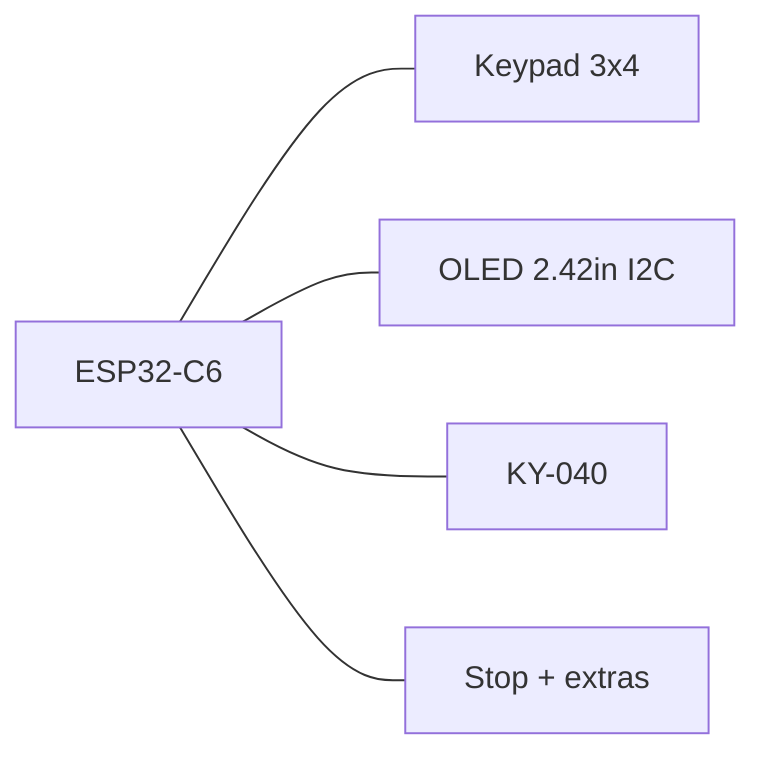

# MarkWTech (WiTcontroller-style)

ESP32-C6-DevKitC-1 with 3×4 keypad, extra buttons, KY-040 encoder, and 2.42" SSD1309 OLED — inspired by [WiTcontroller](https://github.com/flash62au/WiTcontroller) / [Thingiverse 7029069](https://www.thingiverse.com/thing:7029069), with ESP32-C6 instead of LOLIN32.

| Item | Value |
|------|-------|
| Cargo feature | `variant-markwtech` |
| Display | SSD1309/SSD1306 128×64 I2C |
| Expanders | none |
| Programming chord | **\* (Menu) + Stop** 8 s |

## Controls

- 3×4 keypad: digits, `*` (menu/cancel), `#` (select)
- Extra GPIO buttons (mapped as function keys)
- KY-040 encoder for speed / list scroll
- Dedicated Stop for EStop / programming chord

## Pin map (keypad)

| Role | GPIOs |
|------|-------|
| Keypad rows | 18, 19, 20, 21 |
| Keypad columns | 22, 23, 10 |
| I2C OLED | SDA 6, SCL 7 |
| Encoder | A 2, B 3 (shared family defaults) |

Key layout constants: `board/variants/markwtech.rs` (`KEYPAD_MAP`).

## BOM

- ESP32-C6-DevKitC-1
- 2.42" OLED 128×64 SSD1309 (I2C)
- 3×4 membrane keypad
- KY-040 encoder
- Extra tact switches (Stop + up to 5 optional)
- Case: Thingiverse 7029069 (adapted)

## Programming mode

Hold **\* + Stop** for 8 seconds. See [provisioning.md](../provisioning.md).
