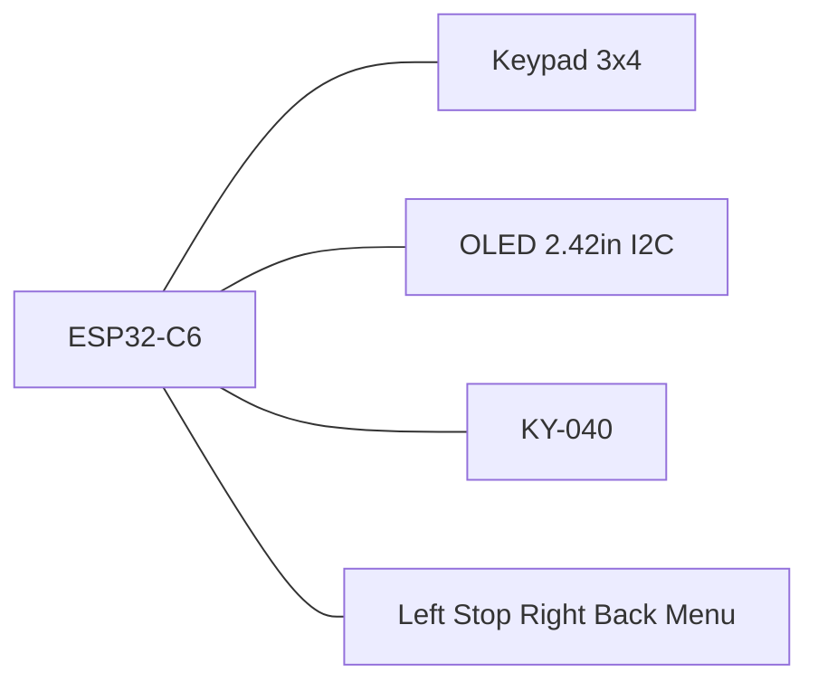

# MarkWTech (WiTcontroller-style)

ESP32-C6-DevKitC-1 with 3×4 keypad, extra buttons, KY-040 encoder, and 2.42" SSD1309 OLED — inspired by [WiTcontroller](https://github.com/flash62au/WiTcontroller) / [Thingiverse 7029069](https://www.thingiverse.com/thing:7029069), with ESP32-C6 instead of LOLIN32.

| Item | Value |
|------|-------|
| Cargo feature | `variant-markwtech` |
| Display | SSD1309/SSD1306 128×64 I2C |
| Expanders | none |
| Programming chord | **\* (Menu) + Stop** 8 s |

## Controls

- 3×4 keypad: digits, `*` (menu/cancel), `#` (select)
- Five extra GPIO tact switches (left / Stop / right / Back / Menu)
- KY-040 encoder for speed / list scroll
- Dedicated Stop for EStop / programming chord

## Pin map

| Role | GPIOs |
|------|-------|
| Keypad rows | 18, 19, 20, 21 |
| Keypad columns | 22, 23, 10 |
| I2C OLED | SDA 6, SCL 7, address 0x3C |
| Encoder | A 2, B 3, SW 0 |
| Extra left / Stop / right / Back / Menu | 11, 12, 4, 5, 15 |
| Battery ADC | 1 |

Keypad layout (`KEYPAD_MAP`):

```text
     C0   C1   C2
R0    1    2    3
R1    4    5    6
R2    7    8    9
R3    *    0    #
```

Extra buttons: tact switch to **GND**, firmware pull-up, active-low.

| # | Function | GPIO | Notes |
|---|----------|------|-------|
| 1 | Menu left | 11 | `Nav(Left)` — list page prev / cursor |
| 2 | Stop | 12 | EStop on throttle; chord with `*` |
| 3 | Menu right | 4 | `Nav(Right)` — list page next / cursor |
| 4 | Back | 5 | Cancel / back |
| 5 | Menu | 15 | Open menu / select-in-menu |

Pin choice is constrained — ESP32-C6-WROOM-1 exposes only GPIO `0–13, 15–23`:

- **GPIO 14 does not exist on the module.** It is present on the bare SoC, so `AnyPin::steal(14)` still compiles, but nothing is routed to the headers.
- **GPIO 4, 5, 15** are strapping pins. Boot mode is decided solely by GPIO 8/9; with default eFuses these three have no effect at reset, and the internal pull-up keeps them idle HIGH.
- **GPIO 12** is `USB_D−`. Wiring Stop here rules out the native USB Serial/JTAG port. Flashing and logs go through the **USB-UART** port instead, which uses GPIO 16/17 — left free on purpose.
- **GPIO 8** drives the on-board RGB LED and **GPIO 9** is the BOOT button, so neither is usable.
- **GPIO 1** is reserved for the battery divider.



Constants: `board/variants/markwtech.rs` (`KEYPAD_MAP`, `EXTRA_BUTTON_MAP`).

## Full wiring (pin-by-pin)

All modules run on **3.3 V** (not 5 V). Tie a common **GND** to every component.

### Power

| ESP32-C6 | Module label | Notes |
|----------|--------------|-------|
| **3V3** | `VCC` / `+` / `3.3V` | OLED, KY-040 |
| **GND** | `GND` | common ground rail |

### OLED 2.42" I2C (SSD1309 / SSD1306)

| ESP GPIO | Firmware | OLED pin (typical) | Notes |
|----------|----------|-------------------|-------|
| **6** | `I2C_SDA` | `SDA` / `DIN` / `DATA` | I2C data |
| **7** | `I2C_SCL` | `SCL` / `CLK` / `SCK` | I2C clock |
| **3V3** | — | `VCC` / `3.3V` | |
| **GND** | — | `GND` | |
| — | address **0x3C** | — | set `ADDR` jumper on module if present |

Common 4-pin FPC order on cheap modules: `GND` · `VCC` · `SCL` · `SDA` (verify your module silkscreen).

### KY-040 rotary encoder

| ESP GPIO | Firmware | KY-040 pin | Notes |
|----------|----------|------------|-------|
| **2** | `ENCODER_A` | **`DT`** (sometimes `B`, `DATA`) | channel A |
| **3** | `ENCODER_B` | **`CLK`** (sometimes `A`) | channel B |
| **0** | `ENCODER_BUTTON` | **`SW`** / `KEY` | encoder push button |
| **3V3** | — | **`+`** / `VCC` | |
| **GND** | — | **`GND`** | |

KY-040 boards often swap `CLK`/`DT` silkscreen labels — wire as above (`DT`→GPIO2, `CLK`→GPIO3). GPIO0 doubles as the deep-sleep wake pin, so the encoder button also wakes the throttle.

### 3×4 membrane keypad (7 pins)

Rows are **outputs** (scanner drives one low at a time). Columns are **inputs** with internal pull-up.

| ESP GPIO | Firmware | Keypad pin | Matrix role |
|----------|----------|------------|-------------|
| **18** | `KEYPAD_ROW_PINS[0]` | **R0** (row 1) | keys `1` `2` `3` |
| **19** | `KEYPAD_ROW_PINS[1]` | **R1** (row 2) | keys `4` `5` `6` |
| **20** | `KEYPAD_ROW_PINS[2]` | **R2** (row 3) | keys `7` `8` `9` |
| **21** | `KEYPAD_ROW_PINS[3]` | **R3** (row 4) | keys `*` `0` `#` |
| **22** | `KEYPAD_COL_PINS[0]` | **C0** (col 1) | keys `1` `4` `7` `*` |
| **23** | `KEYPAD_COL_PINS[1]` | **C1** (col 2) | keys `2` `5` `8` `0` |
| **10** | `KEYPAD_COL_PINS[2]` | **C2** (col 3) | keys `3` `6` `9` `#` |

**Keypad FPC pin order is not standardized** (e.g. `R1 R2 R3 R4 C1 C2 C3` or other). Identify which physical pin is each row/column with a multimeter (pressed key = row shorted to column). If digits are scrambled, swap row/column assignments on the connector — do not change firmware GPIO numbers.

### Five extra tact switches (active-low)

Each switch: one leg → **GPIO**, other leg → **GND**. Firmware enables internal pull-up (pressed = LOW).

| ESP GPIO | Header | Label | UI function | Suggested silkscreen |
|----------|--------|-------|-------------|----------------------|
| **11** | J1-11 | Menu left | list page prev / cursor left | `◀` / `LEFT` |
| **12** | J3-14 | **Stop** | EStop on throttle; `*`+Stop chord (8 s) | `STOP` / `E-STOP` |
| **4** | J1-3 | Menu right | list page next / cursor right | `▶` / `RIGHT` |
| **5** | J1-4 | Back | cancel / back | `BACK` / `ESC` |
| **15** | J3-4 | Menu | open menu / select in menu | `MENU` / `OK` |

```text
GPIOx ────[ tact switch ]──── GND
         (MCU pull-up)
```

### Battery

The DevKit has **no LiPo charger and no battery connector** — unlike the LOLIN32 Lite the original WiTcontroller is built on, which provides both. Running MarkWTech on a cell therefore needs external parts.

| Part | Purpose |
|------|---------|
| LiPo cell 3.7 V (e.g. 1200 mAh, 503759) | power source; ~400 mAh gives roughly 6 h, so 1200 mAh lasts most of a day |
| TP4056 module with protection | USB charging plus over-charge / over-discharge cut-off |
| 3.3 V LDO (HT7333, ME6211 or similar) | cell is 3.0–4.2 V; the WROOM-1 module needs 3.0–3.6 V, so 4.2 V must not reach `3V3` directly |
| 2× 47 kΩ resistor | measurement divider into GPIO 1 |
| Power switch on the cell positive lead | the divider draws current continuously |

Divider (same values as the original project):

```text
Cell +  ──┬── 47k ──┬── 47k ── GND
          │         │
     (to LDO in)    └── GPIO 1  (ADC)
```

A 1:2 divider turns a full 4.2 V cell into ~2.1 V at the pin, inside the ADC range.

| ESP GPIO | Header | Firmware | Connection |
|----------|--------|----------|------------|
| **1** | J1-8 | `BATTERY_ADC` | divider midpoint |

If the cell has a third **NTC** lead (thermistor), leave it unconnected — basic TP4056 modules ignore it.

**Calibration is required.** `BATTERY_CONVERSION_FACTOR` in [`config/power.rs`](../../crates/firmware/src/config/power.rs) is inherited from the original project, where it was tuned against the classic ESP32 ADC. ESP32-C6 has different ADC characteristics, so charge the cell fully, read the reported percentage, and scale the constant until a full cell shows 100 %.

Leaving GPIO 1 unconnected is harmless — the reading is then meaningless noise and the battery icon can be hidden from the menu.

### Master table (one wire per row)

Header numbering follows the [ESP32-C6-DevKitC-1 user guide](https://docs.espressif.com/projects/esp-dev-kits/en/latest/esp32c6/esp32-c6-devkitc-1/user_guide.html): **J1** is the side carrying `3V3`/`RST`/`5V`, **J3** the side carrying `TX`/`RX`.

| ESP GPIO | Header | Component | Component pin | Direction |
|----------|--------|-----------|---------------|-----------|
| 0 | J1-7 | KY-040 | `SW` | input, active-low |
| 1 | J1-8 | Battery | divider midpoint | ADC input |
| 2 | J1-12 | KY-040 | `DT` | encoder A |
| 3 | J1-13 | KY-040 | `CLK` | encoder B |
| 4 | J1-3 | Tact | Menu right | → GND |
| 5 | J1-4 | Tact | Back | → GND |
| 6 | J1-5 | OLED | `SDA` | I2C data |
| 7 | J1-6 | OLED | `SCL` | I2C clock |
| 10 | J1-10 | Keypad | `C2` | matrix column |
| 11 | J1-11 | Tact | Menu left | → GND |
| 12 | J3-14 | Tact | Stop | → GND |
| 15 | J3-4 | Tact | Menu | → GND |
| 18 | J3-10 | Keypad | `R0` | matrix row (output) |
| 19 | J3-9 | Keypad | `R1` | matrix row (output) |
| 20 | J3-8 | Keypad | `R2` | matrix row (output) |
| 21 | J3-7 | Keypad | `R3` | matrix row (output) |
| 22 | J3-6 | Keypad | `C0` | matrix column |
| 23 | J3-5 | Keypad | `C1` | matrix column |
| 3V3 | J1-1 | OLED, KY-040 | `VCC` / `+` | power |
| GND | J1-15 / J3-1 | all | `GND` | ground |

### Unused / reserved GPIO

| GPIO | Header | Why it is left alone |
|------|--------|----------------------|
| 8 | J1-9 | drives the on-board addressable RGB LED |
| 9 | J3-11 | on-board BOOT button; boot-mode strapping pin |
| 13 | J3-13 | `USB_D+` — keep paired with 12 rather than half-breaking the port |
| 16 | J3-2 | `U0TXD` — serial console out |
| 17 | J3-3 | `U0RXD` — serial console in |

GPIO **14** is not listed because the ESP32-C6-WROOM-1 module does not break it out; only `0–13` and `15–23` reach the headers.

### Flashing

Use the **USB Type-C to UART** port (the one wired to the on-board bridge) — no extra wiring. The other Type-C port is the chip's native USB, which is unavailable because Stop occupies `USB_D−`. Enter provisioning: hold **`*`** (keypad) + **Stop** (GPIO 12) for **8 s**.

## BOM

- ESP32-C6-DevKitC-1
- 2.42" OLED 128×64 SSD1309 (I2C)
- 3×4 membrane keypad
- KY-040 encoder
- 5 tact switches (left, Stop, right, Back, Menu)
- Case: Thingiverse 7029069 (adapted)

Battery (optional, see [Battery](#battery)):

- LiPo cell 3.7 V, 1200 mAh (503759) or larger
- TP4056 charging module with protection
- 3.3 V LDO (HT7333 / ME6211)
- 2× 47 kΩ resistor
- Power switch

## Programming mode

Hold **\* + Stop** for 8 seconds. See [provisioning.md](../provisioning.md).
