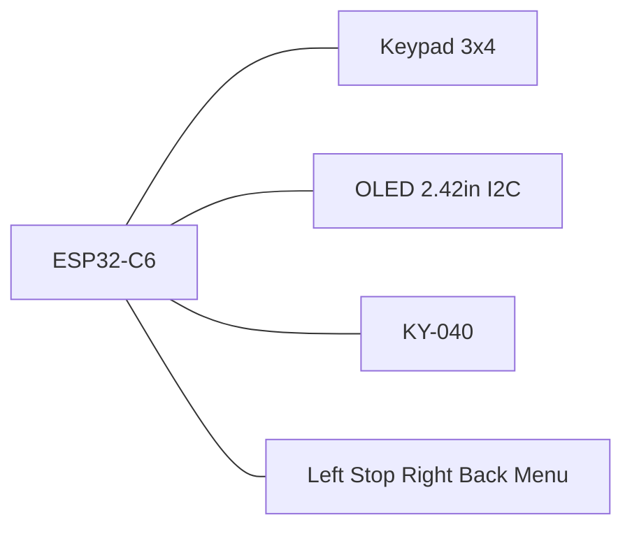

# MarkWTech (WiTcontroller-style)

ESP32-C6-DevKitC-1 with 3×4 keypad, extra buttons, KY-040 encoder, and 2.42" SSD1309 OLED — inspired by [WiTcontroller](https://github.com/flash62au/WiTcontroller) / [Thingiverse 7029069](https://www.thingiverse.com/thing:7029069), with ESP32-C6 instead of LOLIN32.

| Item | Value |
|------|-------|
| Cargo feature | `variant-markwtech` |
| Display | SSD1309/SSD1306 128×64 I2C |
| Expanders | none |
| Programming chord | **\* (Menu) + Stop** 8 s |

## Controls

- 3×4 keypad: digits, `*` (menu/cancel), `#` (select)
- Five extra GPIO tact switches (left / Stop / right / Back / Menu)
- KY-040 encoder for speed / list scroll
- Dedicated Stop for EStop / programming chord

## Pin map

| Role | GPIOs |
|------|-------|
| Keypad rows | 18, 19, 20, 21 |
| Keypad columns | 22, 23, 10 |
| I2C OLED | SDA 6, SCL 7, address 0x3C |
| Encoder | A 2, B 3, SW 0 |
| Extra left / Stop / right / Back / Menu | 11, 12, 13, 14, 15 |

Keypad layout (`KEYPAD_MAP`):

```text
     C0   C1   C2
R0    1    2    3
R1    4    5    6
R2    7    8    9
R3    *    0    #
```

Extra buttons: tact switch to **GND**, firmware pull-up, active-low.

| # | Function | GPIO | Notes |
|---|----------|------|-------|
| 1 | Menu left | 11 | `Nav(Left)` — list page prev / cursor |
| 2 | Stop | 12 | EStop on throttle; chord with `*` |
| 3 | Menu right | 13 | `Nav(Right)` — list page next / cursor |
| 4 | Back | 14 | Cancel / back |
| 5 | Menu | 15 | Open menu / select-in-menu |

GPIO 12/13 are USB D−/D+ (fine when flashing via the USB-UART bridge). GPIO 15 is a strapping pin (JTAG source selection when a specific eFuse is burned; on stock DevKitC-1 it is effectively ignored at boot). UART0 TX/RX stay on GPIO 16/17.



Constants: `board/variants/markwtech.rs` (`KEYPAD_MAP`, `EXTRA_BUTTON_MAP`).

## Full wiring (pin-by-pin)

All modules run on **3.3 V** (not 5 V). Tie a common **GND** to every component.

### Power

| ESP32-C6 | Module label | Notes |
|----------|--------------|-------|
| **3V3** | `VCC` / `+` / `3.3V` | OLED, KY-040 |
| **GND** | `GND` | common ground rail |

### OLED 2.42" I2C (SSD1309 / SSD1306)

| ESP GPIO | Firmware | OLED pin (typical) | Notes |
|----------|----------|-------------------|-------|
| **6** | `I2C_SDA` | `SDA` / `DIN` / `DATA` | I2C data |
| **7** | `I2C_SCL` | `SCL` / `CLK` / `SCK` | I2C clock |
| **3V3** | — | `VCC` / `3.3V` | |
| **GND** | — | `GND` | |
| — | address **0x3C** | — | set `ADDR` jumper on module if present |

Common 4-pin FPC order on cheap modules: `GND` · `VCC` · `SCL` · `SDA` (verify your module silkscreen).

### KY-040 rotary encoder

| ESP GPIO | Firmware | KY-040 pin | Notes |
|----------|----------|------------|-------|
| **2** | `ENCODER_A` | **`DT`** (sometimes `B`, `DATA`) | channel A |
| **3** | `ENCODER_B` | **`CLK`** (sometimes `A`) | channel B |
| **0** | `ENCODER_BUTTON` | **`SW`** / `KEY` | encoder push button |
| **3V3** | — | **`+`** / `VCC` | |
| **GND** | — | **`GND`** | |

KY-040 boards often swap `CLK`/`DT` silkscreen labels — wire as above (`DT`→GPIO2, `CLK`→GPIO3). GPIO0 is also the boot pin; avoid holding `SW` low during reset.

### 3×4 membrane keypad (7 pins)

Rows are **outputs** (scanner drives one low at a time). Columns are **inputs** with internal pull-up.

| ESP GPIO | Firmware | Keypad pin | Matrix role |
|----------|----------|------------|-------------|
| **18** | `KEYPAD_ROW_PINS[0]` | **R0** (row 1) | keys `1` `2` `3` |
| **19** | `KEYPAD_ROW_PINS[1]` | **R1** (row 2) | keys `4` `5` `6` |
| **20** | `KEYPAD_ROW_PINS[2]` | **R2** (row 3) | keys `7` `8` `9` |
| **21** | `KEYPAD_ROW_PINS[3]` | **R3** (row 4) | keys `*` `0` `#` |
| **22** | `KEYPAD_COL_PINS[0]` | **C0** (col 1) | keys `1` `4` `7` `*` |
| **23** | `KEYPAD_COL_PINS[1]` | **C1** (col 2) | keys `2` `5` `8` `0` |
| **10** | `KEYPAD_COL_PINS[2]` | **C2** (col 3) | keys `3` `6` `9` `#` |

**Keypad FPC pin order is not standardized** (e.g. `R1 R2 R3 R4 C1 C2 C3` or other). Identify which physical pin is each row/column with a multimeter (pressed key = row shorted to column). If digits are scrambled, swap row/column assignments on the connector — do not change firmware GPIO numbers.

### Five extra tact switches (active-low)

Each switch: one leg → **GPIO**, other leg → **GND**. Firmware enables internal pull-up (pressed = LOW).

| ESP GPIO | Label | UI function | Suggested silkscreen |
|----------|-------|-------------|----------------------|
| **11** | Menu left | list page prev / cursor left | `◀` / `LEFT` |
| **12** | **Stop** | EStop on throttle; `*`+Stop chord (8 s) | `STOP` / `E-STOP` |
| **13** | Menu right | list page next / cursor right | `▶` / `RIGHT` |
| **14** | Back | cancel / back | `BACK` / `ESC` |
| **15** | Menu | open menu / select in menu | `MENU` / `OK` |

```text
GPIOx ────[ tact switch ]──── GND
         (MCU pull-up)
```

### Battery ADC (optional — not in BOM)

| ESP GPIO | Firmware | Connection | Notes |
|----------|----------|------------|-------|
| **1** | `BATTERY_ADC` | voltage divider from LiPo | extra hardware required; leave **unconnected** if not used |

Firmware has `USE_BATTERY_TEST = true` globally; without a divider on GPIO1 the reading is meaningless but harmless.

### Master table (one wire per row)

| ESP GPIO | DevKit silk | Component | Component pin | Direction |
|----------|-------------|-----------|---------------|-----------|
| 0 | GPIO0 | KY-040 | `SW` | input, active-low |
| 2 | GPIO2 | KY-040 | `DT` | encoder A |
| 3 | GPIO3 | KY-040 | `CLK` | encoder B |
| 6 | GPIO6 | OLED | `SDA` | I2C data |
| 7 | GPIO7 | OLED | `SCL` | I2C clock |
| 10 | GPIO10 | Keypad | `C2` | matrix column |
| 11 | GPIO11 | Tact | Menu left | → GND |
| 12 | GPIO12 | Tact | Stop | → GND |
| 13 | GPIO13 | Tact | Menu right | → GND |
| 14 | GPIO14 | Tact | Back | → GND |
| 15 | GPIO15 | Tact | Menu | → GND |
| 18 | GPIO18 | Keypad | `R0` | matrix row (output) |
| 19 | GPIO19 | Keypad | `R1` | matrix row (output) |
| 20 | GPIO20 | Keypad | `R2` | matrix row (output) |
| 21 | GPIO21 | Keypad | `R3` | matrix row (output) |
| 22 | GPIO22 | Keypad | `C0` | matrix column |
| 23 | GPIO23 | Keypad | `C1` | matrix column |
| 3V3 | 3V3 | OLED, KY-040 | `VCC` / `+` | power |
| GND | GND | all | `GND` | ground |

### Unused / reserved GPIO

Not used by MarkWTech: **1** (optional battery ADC), **4, 5, 8, 9, 16, 17** and any GPIO not listed above. **GPIO 16/17** are UART0 (serial console via the USB-UART bridge) — leave free for debug.

### Flashing

Flash firmware over the DevKit USB port (UART or USB-JTAG) — no extra wiring. Enter provisioning: hold **`*`** (keypad) + **Stop** (GPIO 12) for **8 s**.

## BOM

- ESP32-C6-DevKitC-1
- 2.42" OLED 128×64 SSD1309 (I2C)
- 3×4 membrane keypad
- KY-040 encoder
- 5 tact switches (left, Stop, right, Back, Menu)
- Case: Thingiverse 7029069 (adapted)

## Programming mode

Hold **\* + Stop** for 8 seconds. See [provisioning.md](../provisioning.md).
