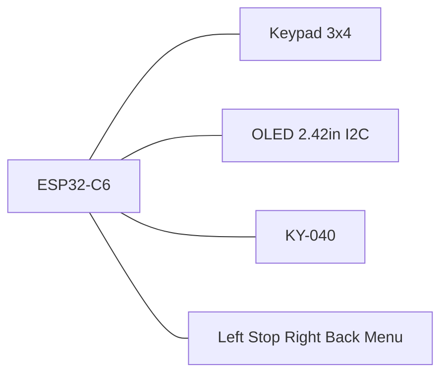

# MarkWTech (WiTcontroller-style)

ESP32-C6-DevKitC-1 with 3×4 keypad, extra buttons, KY-040 encoder, and 2.42" SSD1309 OLED — inspired by [WiTcontroller](https://github.com/flash62au/WiTcontroller) / [Thingiverse 7029069](https://www.thingiverse.com/thing:7029069), with ESP32-C6 instead of LOLIN32.

| Item | Value |
|------|-------|
| Cargo feature | `variant-markwtech` |
| Display | SSD1309/SSD1306 128×64 I2C |
| Expanders | none |
| Programming chord | **\* (Menu) + Stop** 8 s |

## Controls

- 3×4 keypad: digits, `*` (menu/cancel), `#` (select)
- Five extra GPIO tact switches (left / Stop / right / Back / Menu)
- KY-040 encoder for speed / list scroll
- Dedicated Stop for EStop / programming chord

## Pin map

| Role | GPIOs |
|------|-------|
| Keypad rows | 18, 19, 20, 21 |
| Keypad columns | 22, 23, 10 |
| I2C OLED | SDA 6, SCL 7, address 0x3C |
| Encoder | A 2, B 3, SW 0 |
| Extra left / Stop / right / Back / Menu | 11, 12, 13, 14, 15 |

Keypad layout (`KEYPAD_MAP`):

```text
     C0   C1   C2
R0    1    2    3
R1    4    5    6
R2    7    8    9
R3    *    0    #
```

Extra buttons: tact switch to **GND**, firmware pull-up, active-low.

| # | Function | GPIO | Notes |
|---|----------|------|-------|
| 1 | Menu left | 11 | `Nav(Left)` — list page prev / cursor |
| 2 | Stop | 12 | EStop on throttle; chord with `*` |
| 3 | Menu right | 13 | `Nav(Right)` — list page next / cursor |
| 4 | Back | 14 | Cancel / back |
| 5 | Menu | 15 | Open menu / select-in-menu |

GPIO 12/13 are USB D−/D+ (fine when flashing via the USB-UART bridge). GPIO 15 is a strapping pin — do not hold Menu during reset/boot (idle HIGH via pull-up is the safe default). UART0 TX/RX stay on GPIO 16/17.



Constants: `board/variants/markwtech.rs` (`KEYPAD_MAP`, `EXTRA_BUTTON_MAP`).

## BOM

- ESP32-C6-DevKitC-1
- 2.42" OLED 128×64 SSD1309 (I2C)
- 3×4 membrane keypad
- KY-040 encoder
- 5 tact switches (left, Stop, right, Back, Menu)
- Case: Thingiverse 7029069 (adapted)

## Programming mode

Hold **\* + Stop** for 8 seconds. See [provisioning.md](../provisioning.md).
