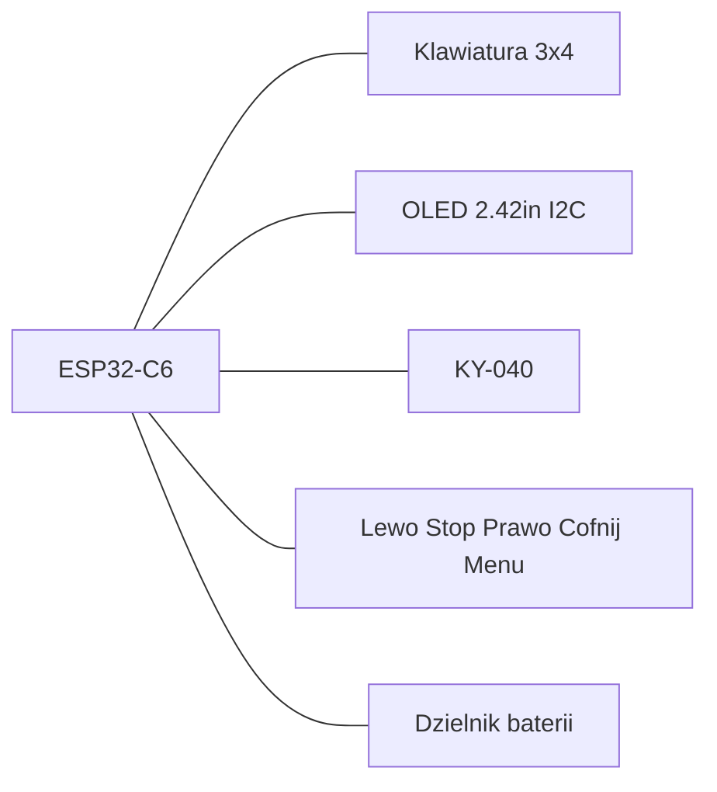

# MarkWTech v1.0 (ESP32-C6-DevKitC-1)

> English version: [1.0.md](1.0.md) · wersja TinyC6: [v1.1_pl.md](v1.1_pl.md)

ESP32-C6-DevKitC-1 z klawiaturą 3×4, dodatkowymi przyciskami, enkoderem KY-040 i wyświetlaczem OLED 2,42" SSD1309 — inspirowany projektem [WiTcontroller](https://github.com/flash62au/WiTcontroller) / [Thingiverse 7029069](https://www.thingiverse.com/thing:7029069), z układem ESP32-C6 zamiast LOLIN32.

Ten plik to **rewizja 1.0** (Espressif DevKitC-1). Późniejsza płytka TinyC6 jest w [v1.1](v1.1_pl.md) — te same sterowanie, **inne GPIO**, niekompatybilne okablowaniem.

| Pozycja | Wartość |
|---------|---------|
| Feature Cargo | `variant-markwtech` |
| `make` | `VARIANT=markwtech` |
| `id` deskryptora | `markwtech` |
| Płytka | [ESP32-C6-DevKitC-1](https://docs.espressif.com/projects/esp-dev-kits/en/latest/esp32c6/esp32-c6-devkitc-1/user_guide.html) |
| Wyświetlacz | SSD1309/SSD1306 128×64 I2C |
| Ekspandery | brak |
| Konsola | UART0 `/dev/ttyUSB0` |
| Skrót do trybu programowania | **\* (Menu) + Stop** przez 8 s, albo **Stop** podczas 2 s splashu |

## Sterowanie

- Klawiatura 3×4: cyfry, `*` (menu/anuluj), `#` (wybierz)
- Pięć dodatkowych przycisków na GPIO (w lewo / Stop / w prawo / Cofnij / Menu)
- Enkoder KY-040 do prędkości i przewijania list
- Dedykowany Stop do zatrzymania awaryjnego, wejścia w programowanie ze splashu i skrótu z `*`
- **W lewo / w prawo** przewija strony list (i podstrony Diagnostyki). **Stop** w Diagnostyce przechodzi do następnej podstrony.
- **Extras → Diagnostyka**: bateria, wersja, oprogramowanie, zasięg Wi‑Fi, IP/MAC, ping do stacji.

## Mapa pinów (v1.0 DevKitC-1)

Grupy wiązek siedzą na sąsiednich goldpinach. **Ta mapa zrywa wcześniejsze okablowanie v1.0** (C2 schodzi z GPIO 10; enkoder z 2/3; Stop z USB_D−).

| Rola | GPIO | Złącze |
|------|------|--------|
| Wiersze klawiatury | 18, 19, 20, 21 | J3 |
| Kolumny klawiatury | 22, 23, **15** | J3-4…J3-10 razem z wierszami (7 sąsiadów) |
| OLED po I2C | SDA 6, SCL 7, adres 0x3C | J1-5, J1-6 |
| Enkoder | A **4**, B **5**, SW 0 | J1-3, J1-4; SW na J1-7 |
| Przyciski: w lewo / Stop / w prawo | **10**, **2**, **11** | J1-10…J1-12 |
| Cofnij / Menu | **13**, **12** | J3-13, J3-14 |
| ADC baterii | 1 | J1-8 (zewnętrzny 47 kΩ/47 kΩ) |

Układ klawiatury (`KEYPAD_MAP`):

```text
     C0   C1   C2
R0    1    2    3
R1    4    5    6
R2    7    8    9
R3    *    0    #
```

Dodatkowe przyciski: styk do **GND**, podciąganie włączone w firmware, stan aktywny niski.

| # | Funkcja | GPIO | Uwagi |
|---|---------|------|-------|
| 1 | Menu w lewo | 10 | `Nav(Left)` — poprzednia strona listy / kursor |
| 2 | Stop | 2 | Zatrzymanie awaryjne; skrót z `*` |
| 3 | Menu w prawo | 11 | `Nav(Right)` — następna strona listy / kursor |
| 4 | Cofnij | 13 | Anuluj / wstecz (`USB_D+`) |
| 5 | Menu | 12 | Otwórz menu / wybierz w menu (`USB_D−`) |



Stałe: `board/variants/markwtech/` (`KEYPAD_MAP`, `EXTRA_BUTTON_MAP`; GPIO w `pins_v1_0.rs`).

## Budżet pinów

Źródła: [user guide ESP32-C6-DevKitC-1](https://docs.espressif.com/projects/esp-dev-kits/en/latest/esp32c6/esp32-c6-devkitc-1/user_guide.html) (sekcja Header Block) oraz [ESP32-C6 Datasheet v1.5](https://documentation.espressif.com/esp32-c6_datasheet_en.html) (rozdział 3, Boot Configurations).

Listwy wyprowadzają łącznie **23 GPIO** — na J1 znajdują się `4, 5, 6, 7, 0, 1, 8, 10, 11, 2, 3`, a na J3 `16, 17, 15, 23, 22, 21, 20, 19, 18, 9, 13, 12`. **GPIO 14 nie istnieje**: J3 przeskakuje z 18 na 9, a potem na 13 i 12.

| Kategoria | GPIO | Liczba |
|-----------|------|--------|
| W pełni wolne | 0, 1, 2, 3, 6, 7, 10, 11, 18, 19, 20, 21, 22, 23 | 14 |
| Strappingowe, zweryfikowane jako bezpieczne | 4, 5, 15 | 3 |
| Kosztują natywny port USB | 12, 13 | 2 |
| Kosztują konsolę UART | 16, 17 | 2 |
| Zablokowane | 8 (dioda RGB), 9 (przycisk BOOT) | 2 |

MarkWTech potrzebuje **18** linii (klawiatura 7 + enkoder 3 + I2C 2 + przyciski 5 + ADC baterii 1). Piny wolne wraz z bezpiecznymi strappingowymi dają tylko 17, więc Cofnij i Menu biorą parę USB (**GPIO 13 / 12**). Stop siedzi na GPIO 2, a nie samotnie na `USB_D−`. Natywny USB i tak odpada.

### Dlaczego ryzykowne piny są bezpieczne

- **GPIO 4 (MTMS) i GPIO 5 (MTDI)** — według tabeli 3-4 z datasheetu ich stan strappingowy wybiera wyłącznie zbocze próbkowania i wystawiania danych interfejsu **SDIO slave**, którego ten projekt w ogóle nie używa. Oba są domyślnie w stanie nieustalonym. Niosą kanały A/B enkodera (wejścia z podciąganiem).
- **GPIO 15** — według tabeli 3-7, przy fabrycznych bezpiecznikach eFuse (`DIS_PAD_JTAG=0`, `DIS_USB_JTAG=0`, `JTAG_SEL_ENABLE=0`) pin jest wprost oznaczony jako **ignorowany**. Ostrzeżenie z datasheetu przed pozostawieniem go w stanie wysokiej impedancji dotyczy dopiero sytuacji po wypaleniu `EFUSE_JTAG_SEL_ENABLE`, co jest czynnością świadomą i nieodwracalną. Kolumna C2 klawiatury używa go jako wejścia.
- Trzymanie któregokolwiek z tych przycisków podczas resetu **nie może więc zmienić trybu bootowania**. O trybie decydują wyłącznie GPIO 8 i 9 (tabela 3-3).
- **GPIO 12 / 13** działają jako zwykłe wejścia, ponieważ esp-hal wywołuje `disable_usb_pads()` z funkcji `init_gpio()` przed każdym użyciem pinu, czyszcząc `usb_pad_enable` oraz rezystory podciągające linii D+/D− (`esp-hal-1.1.1/src/gpio/mod.rs:1669-1709`).

### Wybudzanie z głębokiego uśpienia

Tylko **GPIO 0–7** należą do domeny niskiego poboru (`LP_GPIO0..7`) i mogą wybudzić układ z głębokiego uśpienia. Skonfigurowanym źródłem wybudzenia jest `SW` enkodera na GPIO 0. Stop jest na GPIO 2 (też LP), ale nie jest pinem wake. Menu (12), Menu w lewo (10), Menu w prawo (11) i Cofnij (13) **nie wybudzą** manipulatora.

### Piny nieużywane i zarezerwowane

| GPIO | Listwa | Dlaczego zostaje wolny |
|------|--------|------------------------|
| 3 | J1-13 | zapas |
| 8 | J1-9 | steruje wbudowaną adresowalną diodą RGB |
| 9 | J3-11 | wbudowany przycisk BOOT; pin strappingowy trybu startu |
| 16 | J3-2 | `U0TXD` — wyjście konsoli szeregowej |
| 17 | J3-3 | `U0RXD` — wejście konsoli szeregowej |

Ekspander **KAmod MCP23017** jest w zestawie, ale świadomie nieużywany: wszystkie 18 linii mieści się bezpośrednio na płytce, a pozostawienie **przycisku Stop na bezpośrednim GPIO** sprawia, że awaria magistrali I2C nie unieruchomi jednocześnie zatrzymania awaryjnego i wyświetlacza.

## Pełne okablowanie (pin po pinie)

Wszystkie moduły pracują na **3,3 V** (nie 5 V). Do każdego elementu doprowadź wspólną **masę**.

### OLED 2,42" I2C (SSD1309 / SSD1306)

| GPIO | Firmware | Pin wyświetlacza (typowy) | Uwagi |
|------|----------|---------------------------|-------|
| **6** | `I2C_SDA` | `SDA` / `DIN` / `DATA` | dane I2C |
| **7** | `I2C_SCL` | `SCL` / `CLK` / `SCK` | zegar I2C |
| **3V3** | — | `VCC` / `3.3V` | |
| **GND** | — | `GND` | |
| — | adres **0x3C** | — | ustaw zworkę `ADDR` na module, jeśli jest |

Typowa kolejność czterech pinów na tanich modułach: `GND` · `VCC` · `SCL` · `SDA` (sprawdź opisy na swoim module).

### Enkoder obrotowy KY-040

| GPIO | Firmware | Pin KY-040 | Uwagi |
|------|----------|------------|-------|
| **4** | `ENCODER_A` | **`DT`** (czasem `B`, `DATA`) | kanał A |
| **5** | `ENCODER_B` | **`CLK`** (czasem `A`) | kanał B |
| **0** | `ENCODER_BUTTON` | **`SW`** / `KEY` | przycisk enkodera |
| **3V3** | — | **`+`** / `VCC` | |
| **GND** | — | **`GND`** | |

Moduły KY-040 często mają zamienione opisy `CLK` i `DT` — podłącz jak w tabeli (`DT`→GPIO 4, `CLK`→GPIO 5). GPIO 0 pełni jednocześnie rolę pinu wybudzania, więc przycisk enkodera budzi manipulator.

### Klawiatura membranowa 3×4 (7 pinów)

Wiersze są **wyjściami** (skaner ściąga po kolei jeden do stanu niskiego). Kolumny są **wejściami** z wewnętrznym podciąganiem.

| GPIO | Firmware | Pin klawiatury | Rola w matrycy |
|------|----------|----------------|----------------|
| **18** | `KEYPAD_ROW_PINS[0]` | **R0** (wiersz 1) | klawisze `1` `2` `3` |
| **19** | `KEYPAD_ROW_PINS[1]` | **R1** (wiersz 2) | klawisze `4` `5` `6` |
| **20** | `KEYPAD_ROW_PINS[2]` | **R2** (wiersz 3) | klawisze `7` `8` `9` |
| **21** | `KEYPAD_ROW_PINS[3]` | **R3** (wiersz 4) | klawisze `*` `0` `#` |
| **22** | `KEYPAD_COL_PINS[0]` | **C0** (kolumna 1) | klawisze `1` `4` `7` `*` |
| **23** | `KEYPAD_COL_PINS[1]` | **C1** (kolumna 2) | klawisze `2` `5` `8` `0` |
| **15** | `KEYPAD_COL_PINS[2]` | **C2** (kolumna 3) | klawisze `3` `6` `9` `#` |

**Kolejność wyprowadzeń klawiatury nie jest ustandaryzowana.** Wyznacz każdy wiersz i kolumnę multimetrem (wciśnięty klawisz zwiera swój wiersz z kolumną). Jeśli cyfry się mylą, przełóż przewody na złączu — nie zmieniaj numerów GPIO w firmware.

### Pięć dodatkowych przycisków (stan aktywny niski)

Każdy przycisk: jedna nóżka → **GPIO**, druga → **GND**. Firmware włącza wewnętrzne podciąganie (wciśnięty = stan niski).

| GPIO | Listwa | Etykieta | Funkcja w interfejsie | Sugerowany opis |
|------|--------|----------|-----------------------|-----------------|
| **10** | J1-10 | Menu w lewo | poprzednia strona listy / kursor w lewo | `LEFT` |
| **2** | J1-12 | **Stop** | zatrzymanie awaryjne; skrót `*`+Stop (8 s) | `STOP` / `E-STOP` |
| **11** | J1-11 | Menu w prawo | następna strona listy / kursor w prawo | `RIGHT` |
| **13** | J3-13 | Cofnij | anuluj / wstecz | `BACK` / `ESC` |
| **12** | J3-14 | Menu | otwórz menu / wybierz w menu | `MENU` / `OK` |

```text
GPIOx ────[ przycisk ]──── GND
        (podciąganie w MCU)
```

### Bateria

Płytka **nie ma ładowarki LiPo ani złącza akumulatora** — w przeciwieństwie do LOLIN32 Lite, na której zbudowano oryginalny WiTcontroller i która ma jedno i drugie. Zasilanie MarkWTech z ogniwa wymaga więc zewnętrznych elementów.

| Element | Przeznaczenie |
|---------|---------------|
| Ogniwo LiPo 3,7 V, 1200 mAh (503759) | źródło zasilania; oryginał osiąga ~6 h z 400 mAh, więc 1200 mAh starcza na całą sesję |
| Moduł TP4056 z zabezpieczeniem (`DW01A` + `8205A`) | ładowanie z USB-C oraz ochrona przed prze- i niedoładowaniem |
| Przetwornica **Pololu S7V8F3** | ogniwo waha się w zakresie 3,0–4,2 V; przetwornica utrzymuje stabilne 3,3 V w całym tym zakresie |
| 2× rezystor 47 kΩ | dzielnik pomiarowy na GPIO 1 |
| Kondensator 100 nF (zalecany) | filtr zakłóceń dla ADC, patrz niżej |
| Przełącznik kołyskowy KCD1, bistabilny | główny wyłącznik szeregowo z `OUT+` |

**Nie używaj układów AMS1117 ani LD1117.** Potrzebują one około 4,5 V na wejściu, żeby wydać 3,3 V, a ogniwo LiPo nigdy tyle nie ma. Prawdziwy stabilizator o niskim spadku (ME6211, AP2112K, XC6220, MCP1826) poradziłby sobie do około 3,5 V, ale przetwornica buck-boost jest jeszcze lepsza, bo reguluje również poniżej 3,3 V i wyciąga z ogniwa ostatnie ~35 % energii.

Tor zasilania:

```text
USB-C (TP4056) --ładuje--> B+ / B- <-- LiPo 1200 mAh
                               |
                          OUT+ / OUT-
                               |
              [kołyskowy KCD1, szeregowo na OUT+]
                               |
              +----------------+----------------+
              |                                 |
       S7V8F3 VIN                       47k --+-- 47k -- GND
              |                                |
       S7V8F3 VOUT ---> 3V3 (J1-1)          GPIO 1 (J1-8)
              |                          + 100 nF do masy
       S7V8F3 GND  ---> masa wspólna
```

Obciążenie bierz z **`OUT+` / `OUT−`**, nigdy z `B+` / `B−` — tranzystory ochronne siedzą pomiędzy `B` a `OUT`, więc obciążenie na `B` omija zabezpieczenie przed nadmiernym rozładowaniem.

#### Dlaczego dzielnik jest konieczny i dobrze dobrany

Według [wytycznych projektowych Espressif](https://docs.espressif.com/projects/esp-hardware-design-guidelines/en/latest/esp32c6/schematic-checklist.html) skalibrowany zakres ADC przy ATTEN=3 (`Attenuation::_11dB`, którego używa firmware) wynosi **0–3300 mV** przy błędzie całkowitym ±40 mV. Ogniwo 4,2 V przekroczyłoby ten zakres i uszkodziło wejście. Dzielnik 1:2 odwzorowuje pełne ogniwo na **2,10 V**, a rozładowane na **1,50 V** — obie wartości z zapasem mieszczą się w zakresie. GPIO 1 to `ADC1_CH1`, czyli prawidłowy kanał przetwornika.

Prąd dzielnika wynosi `4,2 V / 94 kΩ ≈ 45 µA`, a sam dzielnik siedzi za wyłącznikiem, więc przy wyłączonym manipulatorze nie pobiera nic.

Espressif zaleca **kondensator 0,1 µF między pinem ADC a masą**. Tutaj ma to większe znaczenie niż zwykle, bo S7V8F3 jest przetwornicą impulsową i wprowadza tętnienia na szynę zasilania. Firmware uśrednia `ADC_READS` próbek, więc pomiar działa i bez kondensatora, ale z nim jest stabilniejszy.

Jeśli ogniwo ma trzeci przewód **NTC**, zostaw go niepodłączony — moduły TP4056 go ignorują.

#### Kalibracja

Stała `BATTERY_CONVERSION_FACTOR` w [`board/pins.rs`](../../../crates/firmware/src/board/pins.rs) (re-eksport z [`config/power.rs`](../../../crates/firmware/src/config/power.rs)) startuje od **1,7** dla dzielnika 47 kΩ/47 kΩ. Naładuj ogniwo do pełna i odczytaj z logu UART linię `battery: raw=… suggested_factor=…`. Wartość `suggested_factor` wpisz do mapy pinów v1.0. Spodziewaj się odczytu około `2600` i współczynnika bliskiego `1,6`.

Przy działającym ogniwie firmware sam usypia manipulator: głębokie uśpienie poniżej **5 %** naładowania oraz po **5 minutach** bez inputu, gdy żadna lokomotywa nie jedzie (speed 0). Przed snem idzie EStop. Po **30 s** bezczynności gaśnie OLED (`DisplayOff`); dowolny klawisz lub detent enkodera budzi panel bez wykonania akcji, wyjątek to Stop/EStop (hamulec awaryjny). Z głębokiego snu budzi nadal `SW` enkodera na GPIO 0.

Pozostawienie GPIO 1 niepodłączonego jest nieszkodliwe — odczyt jest wtedy bezsensownym szumem, a ikonę baterii można ukryć w menu.

## Tabela połączeń

Numeracja listew według [user guide ESP32-C6-DevKitC-1](https://docs.espressif.com/projects/esp-dev-kits/en/latest/esp32c6/esp32-c6-devkitc-1/user_guide.html): **J1** to strona z pinami `3V3`/`RST`/`5V`, **J3** to strona z `TX`/`RX`. Masa jest dostępna na J1-15, J3-1, J3-12 i J3-15.

**Łącznie 41 przewodów.** `VBAT_SW` i `MID` to punkty węzłowe, a nie fizyczne elementy — schodzi się w nich po kilka przewodów.

### A. Zasilanie (15 przewodów)

| # | Skąd (element + pin) | Dokąd (element + pin) | Po co |
|---|----------------------|-----------------------|-------|
| 1 | LiPo **+** (zmierzony; często czerwony, nie zawsze) | TP4056 `B+` | ogniwo do ładowarki |
| 2 | LiPo **−** (zmierzony; często czarny, nie zawsze) | TP4056 `B−` | ogniwo do ładowarki |
| — | LiPo — przewód biały (NTC) | *zostaw wolny, zaizoluj* | moduł nie ma wejścia termistora |
| 3 | TP4056 `OUT+` | kołyskowy KCD1 — zmierzony pin A | wyłącznik główny, szeregowo |
| 4 | kołyskowy KCD1 — zmierzony pin B | węzeł `VBAT_SW` | przełączana szyna baterii |
| 5 | `VBAT_SW` | S7V8F3 `VIN` | zasilanie przetwornicy |
| 6 | `VBAT_SW` | R1 47 kΩ — nóżka 1 | góra dzielnika |
| 7 | R1 47 kΩ — nóżka 2 | węzeł `MID` | środek dzielnika |
| 8 | `MID` | R2 47 kΩ — nóżka 1 | dół dzielnika |
| 9 | R2 47 kΩ — nóżka 2 | masa wspólna | zamknięcie dzielnika |
| 10 | `MID` | płytka, pin `1` (J1-8) | napięcie ogniwa do przetwornika |
| 11 | 100 nF — nóżka 1 | `MID` / GPIO 1 | filtr zakłóceń ADC (zalecany) |
| 12 | 100 nF — nóżka 2 | masa wspólna | filtr zakłóceń ADC (zalecany) |
| 13 | TP4056 `OUT−` | masa wspólna | powrót prądu |
| 14 | S7V8F3 `GND` | masa wspólna | powrót prądu |
| 15 | S7V8F3 `VOUT` | płytka, pin `3V3` (J1-1) | 3,3 V do płytki |
| — | S7V8F3 `SHDN` | *zostaw niepodłączony* | wewnętrzne podciąganie trzyma włączone |

### B. OLED 2,42" (4 przewody)

| # | Skąd | Dokąd | Po co |
|---|------|-------|-------|
| 16 | OLED `VCC` | płytka, pin `3V3` (J1-1) | zasilanie |
| 17 | OLED `GND` | masa wspólna | powrót zasilania |
| 18 | OLED `SDA` | płytka, pin `6` (J1-5) | dane I2C |
| 19 | OLED `SCL` | płytka, pin `7` (J1-6) | zegar I2C |

### C. Enkoder KY-040 (5 przewodów)

| # | Skąd | Dokąd | Po co |
|---|------|-------|-------|
| 20 | KY-040 `+` | płytka, pin `3V3` (J1-1) | zasilanie |
| 21 | KY-040 `GND` | masa wspólna | powrót zasilania |
| 22 | KY-040 `DT` | płytka, pin `4` (J1-3) | kanał A enkodera |
| 23 | KY-040 `CLK` | płytka, pin `5` (J1-4) | kanał B enkodera |
| 24 | KY-040 `SW` | płytka, pin `0` (J1-7) | przycisk + wybudzanie |

### D. Klawiatura 3×4 (7 przewodów)

| # | Skąd | Dokąd | Po co |
|---|------|-------|-------|
| 25 | Klawiatura `R0` | płytka, pin `18` (J3-10) | wiersz matrycy (wyjście) |
| 26 | Klawiatura `R1` | płytka, pin `19` (J3-9) | wiersz matrycy (wyjście) |
| 27 | Klawiatura `R2` | płytka, pin `20` (J3-8) | wiersz matrycy (wyjście) |
| 28 | Klawiatura `R3` | płytka, pin `21` (J3-7) | wiersz matrycy (wyjście) |
| 29 | Klawiatura `C0` | płytka, pin `22` (J3-6) | kolumna matrycy (wejście) |
| 30 | Klawiatura `C1` | płytka, pin `23` (J3-5) | kolumna matrycy (wejście) |
| 31 | Klawiatura `C2` | płytka, pin `15` (J3-4) | kolumna matrycy (wejście) |

### E. Pięć przycisków (10 przewodów)

| # | Skąd | Dokąd | Po co |
|---|------|-------|-------|
| 32 | Przycisk „Menu w lewo" — nóżka 1 | płytka, pin `10` (J1-10) | wejście |
| 33 | Przycisk „Menu w lewo" — nóżka 2 | masa wspólna | wciśnięty = stan niski |
| 34 | Przycisk „Stop" — nóżka 1 | płytka, pin `2` (J1-12) | wejście |
| 35 | Przycisk „Stop" — nóżka 2 | masa wspólna | wciśnięty = stan niski |
| 36 | Przycisk „Menu w prawo" — nóżka 1 | płytka, pin `11` (J1-11) | wejście |
| 37 | Przycisk „Menu w prawo" — nóżka 2 | masa wspólna | wciśnięty = stan niski |
| 38 | Przycisk „Cofnij" — nóżka 1 | płytka, pin `13` (J3-13) | wejście |
| 39 | Przycisk „Cofnij" — nóżka 2 | masa wspólna | wciśnięty = stan niski |
| 40 | Przycisk „Menu" — nóżka 1 | płytka, pin `12` (J3-14) | wejście |
| 41 | Przycisk „Menu" — nóżka 2 | masa wspólna | wciśnięty = stan niski |

## Montaż krok po kroku

Ta część zakłada **zero wiedzy elektronicznej**. Każdy krok mówi wprost co wziąć do ręki, gdzie to wetknąć i dlaczego akurat tak. Numery przewodów w nawiasach odsyłają do [tabeli połączeń](#tabela-połączeń) powyżej.

### Zanim zaczniesz

Przygotuj **multimetr** — będzie potrzebny kilka razy i bez niego dwa kroki są zgadywanką. Wystarczy najtańszy, byle miał tryb pomiaru napięcia stałego (oznaczenie `V` z prostą kreską) i tryb „przejścia" z brzęczykiem (symbol fali dźwiękowej albo diody).

Kilka pojęć, które będą się powtarzać:

- **Masa** (`GND`, minus) to wspólny punkt odniesienia dla całego układu. Każdy sygnał elektryczny to tak naprawdę **różnica napięć względem masy** — bez wspólnej masy układ nie ma względem czego mierzyć i zachowuje się losowo.
- **Pin** to pojedyncza nóżka albo otwór w listwie. Na płytce ESP32 listwy są dwie: **J1** i **J3**, opisane w tabelach.
- **Szeregowo** znaczy „jedno za drugim, prąd płynie przez oba po kolei" — tak wpina się wyłącznik.
- **Polaryzacja** to to, który przewód jest plusem (`+`), a który minusem (`−`). Podłączenie ogniwa LiPo odwrotnie niszczy ładowarkę, a często i ogniwo.

**Zanim cokolwiek podepniesz, zmierz polaryzację ogniwa.** Tanie pakiety LiPo często mają kolory przewodów na odwrót, więc **nie ufaj, że czerwony to plus, a czarny to minus**. Zmierz:

1. Ustaw multimetr na napięcie stałe (`V` z prostą kreską).
2. Dotknij **czerwoną** sondą jednego przewodu ogniwa, a **czarną** sondą drugiego. Ogniwa jeszcze nigdzie nie podłączaj.
3. Jeśli na wyświetlaczu jest liczba **dodatnia** (około 3,7–4,2 V): przewód pod czerwoną sondą to **plus (`+`)**, przewód pod czarną sondą to **minus (`−`)**.
4. Jeśli na wyświetlaczu jest liczba **ujemna** (minus z przodu): przewody są na odwrót — pod czerwoną sondą jest **minus**, pod czarną **plus**.
5. Oznacz przewód plusa (wystarczy kawałek taśmy) i od tej pory kieruj się tym oznaczeniem, a nie fabrycznym kolorem.

Trzeci przewód, jeśli jest, to termistor NTC (zwykle biały albo żółty). To ani plus, ani minus — zostaw go w spokoju.

### Krok 1 — zrób wspólną masę

Zanim podłączysz cokolwiek innego, zaplanuj **jeden wspólny punkt masy**. Najprościej: wybierz pin `G` na płytce ESP32 (J1-15 albo J3-1) i od niego poprowadź masę do wszystkich elementów.

Do masy trafiają: `OUT−` z ładowarki, `GND` przetwornicy, `GND` wyświetlacza, `GND` enkodera, dolny rezystor dzielnika, kondensator i **wszystkie pięć przycisków** — po jednej nóżce z każdego. *(przewody 9, 12, 13, 14, 17, 21, 33, 35, 37, 39, 41)*

**Dlaczego:** to najczęstsze źródło problemów przy pierwszym montażu. Jeśli przycisk ma masę wziętą skądinąd niż płytka, potrafi działać raz na kilka naciśnięć albo wyzwalać się sam. Płytka ESP32 ma cztery piny `G` i wszystkie są ze sobą połączone wewnątrz — możesz korzystać z dowolnego.

### Krok 2 — złóż zasilanie

Kolejność ma znaczenie, bo każdy kolejny element zabezpiecza następny.

1. **Ogniwo do ładowarki — kieruj się zmierzoną polaryzacją, nie kolorem.** Przewód **plus (`+`)** ogniwa — *często* czerwony, ale tylko jeśli potwierdził to pomiar z [Zanim zaczniesz](#zanim-zaczniesz) — idzie do pola `B+` na module TP4056. Przewód **minus (`−`)** — *często* czarny — idzie do pola `B−`. Odwrotna polaryzacja niszczy tu moduł, a często i ogniwo. *(przewody 1, 2)*
2. **Biały przewód ogniwa zostaw luzem** i zaizoluj taśmą. To termistor (czujnik temperatury), którego ten moduł nie obsługuje. Luźny, nieizolowany przewód może się o coś oprzeć i zewrzeć.
3. **Wyłącznik na wyjściu ładowarki.** Z pola `OUT+` przewód do jednego pinu kołyskowego, z drugiego pinu kołyskowego dalej w głąb układu. *(przewody 3, 4)*
4. **Przetwornica.** Punkt za wyłącznikiem prowadzisz do pinu `VIN` przetwornicy S7V8F3. Pin `GND` przetwornicy do masy. *(przewody 5, 14)*
5. **Wyjście przetwornicy.** Pin `VOUT` do pinu `3V3` płytki ESP32 (J1-1). *(przewód 15)*
6. **Pin `SHDN` przetwornicy zostaw niepodłączony.** Ma wewnętrzne podciągnięcie, dzięki czemu przetwornica jest domyślnie włączona. Zwarcie go do masy by ją wyłączyło.

**Dlaczego obciążenie z `OUT`, a nie z `B`:** moduł ładowarki ma wbudowaną ochronę przed nadmiernym rozładowaniem ogniwa (układy `DW01A` i `8205A`). Ta ochrona siedzi **pomiędzy** polami `B` a `OUT`. Gdybyś pobierał prąd z `B+`, ochrona zostałaby ominięta i dałoby się rozładować ogniwo poniżej bezpiecznego progu, co trwale je uszkadza.

**Dlaczego przetwornica, a nie zwykły stabilizator:** ogniwo LiPo w trakcie pracy schodzi z 4,2 V do około 3,0 V. Zwykły stabilizator (np. AMS1117) potrzebuje na wejściu około 4,5 V, żeby wydać 3,3 V — z ogniwem nie zadziała praktycznie nigdy. Przetwornica S7V8F3 jest typu **buck-boost**: gdy napięcie ogniwa jest wyższe od 3,3 V, obniża je, a gdy spadnie poniżej — podnosi. Dzięki temu wykorzystujesz całą pojemność ogniwa zamiast tracić ostatnie ~35 %.

**Dlaczego 3,3 V, a nie 5 V:** moduł ESP32-C6 pracuje na 3,3 V i podanie mu 5 V na pin `3V3` go zniszczy. Pin `5V` na płytce istnieje, ale prowadzi do wbudowanego stabilizatora — nie używamy go, bo mielibyśmy dwie konwersje napięcia zamiast jednej i niepotrzebne straty.

### Krok 3 — zbuduj dzielnik napięcia do pomiaru baterii

Potrzebujesz dwóch rezystorów 47 kΩ. Skręć albo zlutuj je ze sobą **końcami**, tak żeby powstał jeden dłuższy element z trzema wyprowadzeniami: początek, **środek** (miejsce ich połączenia) i koniec.

1. **Początek** dzielnika do punktu **za wyłącznikiem** (tego samego, z którego idzie `VIN` przetwornicy). *(przewód 6)*
2. **Koniec** dzielnika do masy. *(przewód 9)*
3. **Środek** dzielnika do pinu `1` płytki ESP32 (J1-8). *(przewód 10)*
4. Jeśli masz kondensator 100 nF, wepnij go między **środek** dzielnika a masę. Biegunowość nie ma znaczenia. *(przewody 11, 12)*

**Dlaczego dzielnik jest konieczny:** wejście pomiarowe ESP32 przyjmuje maksymalnie **3,3 V**, a naładowane ogniwo ma **4,2 V**. Podanie 4,2 V wprost uszkodziłoby wejście. Dwa jednakowe rezystory dzielą napięcie dokładnie **na pół**, więc na pinie pojawia się 2,1 V przy pełnym ogniwie i 1,5 V przy rozładowanym — obie wartości bezpiecznie w zakresie. Firmware zna ten podział i przelicza wynik z powrotem.

**Dlaczego dzielnik jest za wyłącznikiem:** przez dzielnik cały czas płynie mikroskopijny prąd (około 45 mikroamperów). Umieszczenie go za wyłącznikiem sprawia, że po wyłączeniu manipulatora ogniwo nie rozładowuje się w ogóle.

**Po co kondensator:** przetwornica pracuje impulsowo i wprowadza na zasilanie drobne zakłócenia. Kondensator je wygładza, dzięki czemu wskazanie procentu baterii nie skacze. Bez niego układ też działa — odczyt będzie po prostu bardziej rozchwiany.

### Krok 4 — sprawdź zasilanie ZANIM podłączysz cokolwiek innego

To osobny krok, bo błąd w poprzednich dwóch potrafi zniszczyć jednocześnie wyświetlacz i płytkę ESP32.

1. Do płytki ESP32 **nie podłączaj jeszcze** wyświetlacza, enkodera, klawiatury ani przycisków.
2. Ustaw kołyskowy w pozycję ON.
3. Multimetrem w trybie napięcia stałego dotknij czarną sondą masy, a czerwoną pinu `3V3` (J1-1).
4. **Musisz zobaczyć wartość między 3,2 a 3,4 V.**

Jeśli widzisz 0 V — sprawdź wyłącznik i polaryzację ogniwa. Jeśli widzisz napięcie ogniwa (około 3,7–4,2 V) — przetwornica jest pominięta albo źle podłączona i **nie wolno iść dalej**. Jeśli wszystko się zgadza, wyłącz kołyskowy i przejdź dalej.

Przy okazji zmierz napięcie na pinie `1` (J1-8) — powinno wynosić mniej więcej **połowę** napięcia ogniwa. To potwierdza, że dzielnik działa.

### Krok 5 — podłącz wyświetlacz OLED

Cztery przewody. *(przewody 16–19)*

| Pin wyświetlacza | Gdzie |
|---|---|
| `VCC` | `3V3` płytki (J1-1) |
| `GND` | masa |
| `SDA` | pin `6` (J1-5) |
| `SCL` | pin `7` (J1-6) |

**Uwaga na kolejność pinów.** Na tanich modułach kolejność bywa `GND · VCC · SCL · SDA`, czyli **zasilanie na odwrót** względem intuicji. Przeczytaj opisy nadrukowane na module, nie zakładaj kolejności.

**Dlaczego akurat dwa przewody sygnałowe:** wyświetlacz komunikuje się magistralą I2C, w której jedna linia (`SDA`) przenosi dane, a druga (`SCL`) taktuje ich odczyt. To pozwala obsłużyć wyświetlacz zaledwie dwoma pinami zamiast kilkunastu.

### Krok 6 — podłącz enkoder KY-040

Pięć przewodów. *(przewody 20–24)*

| Pin enkodera | Gdzie |
|---|---|
| `+` | `3V3` płytki (J1-1) |
| `GND` | masa |
| `DT` | pin `4` (J1-3) |
| `CLK` | pin `5` (J1-4) |
| `SW` | pin `0` (J1-7) |

**Uwaga:** producenci modułów KY-040 notorycznie zamieniają opisy `CLK` i `DT` miejscami. Podłącz zgodnie z tabelą, a jeśli po uruchomieniu okaże się, że pokrętło działa w odwrotną stronę — zamień te dwa przewody miejscami. Nic się przez to nie zepsuje.

**Dlaczego `SW` trafia akurat na pin 0:** tylko piny od 0 do 7 potrafią wybudzić układ z głębokiego uśpienia. Przycisk enkodera na pinie 0 jest więc jednocześnie przyciskiem „obudź manipulator". Żaden z pięciu pozostałych przycisków tego nie potrafi.

### Krok 7 — podłącz klawiaturę

Klawiatura ma **7 wyprowadzeń**: cztery odpowiadają rzędom, trzy kolumnom. Problem w tym, że **kolejność wyprowadzeń nie jest ustandaryzowana** i różni się między egzemplarzami — trzeba ją wyznaczyć samodzielnie.

**Jak to zrobić multimetrem:**

1. Ustaw multimetr w tryb „przejścia" (brzęczyk).
2. Wciśnij i przytrzymaj klawisz **`1`**. Szukaj pary wyprowadzeń, między którymi multimetr zapiszczy — to rząd R0 i kolumna C0 tego klawisza.
3. Powtórz dla klawisza **`2`**: wspólne z poprzednim będzie wyprowadzenie rzędu R0, nowe to kolumna C1.
4. Idąc dalej po klawiszach `3`, `4`, `7`, `*` rozpiszesz wszystkie siedem wyprowadzeń.

Następnie podłącz według tabeli. *(przewody 25–31)*

| Wyprowadzenie | Gdzie | Klawisze |
|---|---|---|
| `-`  | -                | Pierwszy PIN zostawiamy niepodłączony |
| `R0` | pin `18` (J3-10) | `1` `2` `3` |
| `R1` | pin `19` (J3-9) | `4` `5` `6` |
| `R2` | pin `20` (J3-8) | `7` `8` `9` |
| `R3` | pin `21` (J3-7) | `*` `0` `#` |
| `C0` | pin `22` (J3-6) | `1` `4` `7` `*` |
| `C1` | pin `23` (J3-5) | `2` `5` `8` `0` |
| `C2` | pin `15` (J3-4) | `3` `6` `9` `#` |

**Jeśli po uruchomieniu cyfry się mylą — przełóż przewody, nie zmieniaj firmware.** Numery pinów są zaszyte w kodzie i zmienianie ich rozjeżdża dokumentację z rzeczywistością.

**Dlaczego klawiatura potrzebuje tylko 7 pinów na 12 klawiszy:** klawisze są ułożone w siatkę. Płytka po kolei „odpytuje" każdy rząd i sprawdza, w której kolumnie pojawi się odpowiedź. Przecięcie odpytywanego rzędu z odpowiadającą kolumną jednoznacznie wskazuje wciśnięty klawisz. Dzięki temu wystarczy 4 + 3 zamiast 12 osobnych pinów.

### Krok 8 — podłącz pięć przycisków

Każdy przycisk ma **dwie nóżki** i podłącza się identycznie: **jedna nóżka do wyznaczonego pinu, druga do masy**. *(przewody 32–41)*

| Przycisk | Pin płytki | Listwa |
|---|---|---|
| Menu w lewo | `10` | J1-10 |
| **Stop** | `2` | J1-12 |
| Menu w prawo | `11` | J1-11 |
| Cofnij | `13` | J3-13 |
| Menu | `12` | J3-14 |

**Jak wybrać właściwe nóżki:** przyciski 12 mm mają zwykle dokładnie dwa wyprowadzenia i wtedy nie ma czego wybierać. Jeśli twój egzemplarz ma ich więcej, ustaw multimetr na brzęczyk i znajdź parę, która **piszczy dopiero po wciśnięciu** przycisku, a w spoczynku milczy.

**Dlaczego jedna nóżka idzie do masy:** płytka włącza wewnętrzny rezystor podciągający, który utrzymuje pin w stanie wysokim, dopóki nic się nie dzieje. Wciśnięcie przycisku zwiera pin do masy i ściąga go w stan niski — i to właśnie firmware rozpoznaje jako naciśnięcie. Dzięki temu nie potrzebujesz żadnych zewnętrznych rezystorów.

**Dlaczego akurat te piny:** wszystkie zostały sprawdzone pod kątem funkcji specjalnych. Piny 4 i 5 (enkoder) oraz 15 (kolumna C2) są tak zwanymi pinami strappingowymi, ale przy fabrycznych ustawieniach układu ich stan przy starcie nie wpływa na nic istotnego. Piny 12 i 13 to linie natywnego portu USB (Menu / Cofnij), dlatego ten port nie będzie działał; firmware wgrywa się drugim portem USB i to w zupełności wystarcza. Stop jest na GPIO 2.

### Krok 9 — pierwsze uruchomienie i kalibracja baterii

1. **Ustaw kołyskowy na OFF.** To ważne: nigdy nie zasilaj płytki jednocześnie z baterii i z USB.
2. Podłącz komputer kablem USB do portu **USB-to-UART** płytki (tego wpiętego w mostek, nie natywnego) i wgraj firmware.
3. Odłącz USB, ustaw kołyskowy na ON i sprawdź, czy wyświetlacz się zapala, klawiatura reaguje, a pokrętło zmienia wartości.
4. **Kalibracja baterii:** naładuj ogniwo do pełna przez port USB-C ładowarki (dioda na module zmieni kolor). Z logu UART skopiuj `suggested_factor` z linii `battery: raw=… suggested_factor=…` do `BATTERY_CONVERSION_FACTOR` w [`pins_v1_0.rs`](../../../crates/firmware/src/board/variants/markwtech/pins_v1_0.rs). Spodziewaj się odczytu w okolicach 2600 i współczynnika bliskiego 1,6.
5. Wgraj firmware ponownie (znów przy kołyskowym na OFF) i sprawdź, czy pełne ogniwo pokazuje 100 %.

### Ostrzeżenia

- **Nigdy nie zasilaj płytki z USB przy włączonym kołyskowym.** Byłyby wtedy dwa źródła napięcia na tej samej szynie 3,3 V, walczące ze sobą. Przed każdym wgrywaniem firmware wyłączaj kołyskowy.
- **Nie zamieniaj `B+` z `B−`** na module ładowarki i **nie ufaj kolorom przewodów ogniwa**. Najpierw zmierz polaryzację ([Zanim zaczniesz](#zanim-zaczniesz)). Odwrotna polaryzacja niszczy moduł, a często i ogniwo.
- **Biały przewód ogniwa (NTC) zostaje niepodłączony i zaizolowany.** Nie wpinaj go „na wszelki wypadek" nigdzie.
- **Ogniwa LiPo są wrażliwe.** Nie zginaj, nie przekłuwaj, nie lutuj bezpośrednio do styków ogniwa. Spuchnięte albo uszkodzone ogniwo natychmiast wycofaj z użycia.
- **Pin `SHDN` przetwornicy zostaw wolny.** Ma wewnętrzne podciągnięcie i przypadkowe zwarcie do masy wyłączy zasilanie.
- Płytka ESP32 ma **diodę sygnalizującą zasilanie**, która pobiera prąd cały czas, gdy układ jest włączony. Jeśli zależy ci na maksymalnym czasie pracy, można ją wylutować — nie jest do niczego potrzebna.
- **Przed pierwszym włączeniem sprawdź multimetrem, czy `3V3` i masa nie są zwarte.** Brzęczyk multimetru między tymi punktami oznacza błąd montażu; włączenie zasilania w takim stanie uszkodzi przetwornicę.

## Lista części

Podstawa:

- ESP32-C6-DevKitC-1 V1.4 (moduł ESP32-C6-WROOM-1, 8 MB flash)
- OLED 2,42" 128×64 SSD1309, I2C, 4 piny
- Klawiatura membranowa 3×4, 7 wyprowadzeń
- Enkoder obrotowy KY-040
- 5× przycisk monostabilny panelowy, 12 mm
- Obudowa: Thingiverse 7029069 (zaadaptowana)

Bateria:

- Ogniwo LiPo 3,7 V, 1200 mAh, format 503759 (5,0 × 37 × 59 mm), z przewodem NTC
- Moduł ładowania TP4056, USB-C, z zabezpieczeniem `DW01A` + `8205A`
- Przetwornica buck-boost Pololu S7V8F3 (wejście 2,7–11,8 V, wyjście 3,3 V, do 1 A)
- 2× rezystor 47 kΩ
- 1× kondensator 100 nF (zalecany, filtr ADC)
- Przełącznik kołyskowy KCD1, 21 × 15 mm, bistabilny ON/OFF

Kupione, ale nieużywane:

- KAmod I2C-IOexp16 (MCP23017) — patrz [Budżet pinów](#budżet-pinów)

## Wgrywanie firmware

Użyj portu **USB Type-C to UART** (tego wpiętego we wbudowany mostek) — nie wymaga żadnego dodatkowego okablowania. Drugi port Type-C to natywne USB układu, niedostępne, bo przycisk Stop zajmuje linię `USB_D−`. Przed podłączeniem USB **wyłącz** zasilanie bateryjne.

## Tryb programowania

- **Splash przy starcie (2 s):** **Stop** wchodzi w Soft-AP. W prawym dolnym rogu jest `[STOP - Programming mode]`.
- **W dowolnym momencie po starcie:** przytrzymaj **\* + Stop** przez 8 sekund.
- W Soft-AP OLED pyta, czy połączyłeś się z AP (**lewe menu** = anuluj / restart, **prawe menu** = dalej), potem pokazuje kod QR na `http://192.168.4.1/`.

Po splashu (i jednorazowym wyborze języka, zapisanym w NVS; później **Extras → Language**):

1. Jeśli sieć Wi-Fi jest zapisana, urządzenie próbuje jej przez 5 s. Przy porażce pokazuje `Cannot connect` / `choose other network`, potem listę ze skanowaniem. **Cofnij** pomija Wi-Fi i przechodzi do listy serwerów.
2. Jeśli serwer jest zapisany, próbuje połączenia 5 s i przy sukcesie pomija listę. W przeciwnym razie mDNS wypełnia listę. **Lewe menu** otwiera ręczne IP:port (WiThrottle).

Soft-AP ma DHCP; aktualizacja firmware ze strony parowania albo Extras → Aktualizacja FW w sieci layoutu. Zobacz [provisioning.md](../../provisioning.md).

## Grupowanie wiązek (v1.0)

Grupy GPIO odpowiadają sąsiednim goldpinom, żeby każda wiązka była krótkim Dupontem/JST.

```text
J3 (TX/RX)                         J1 (3V3/RST/5V)
 1  G                              1  3V3     ── zasilanie OLED+enkoder (2-pin z G)
 2  TX  (konsola — zostaw)         2  RST     (nie ruszać)
 3  RX  (konsola — zostaw)         3  GPIO4   ┐ enkoder DT
 4  GPIO15 ┐                       4  GPIO5   ┘ enkoder CLK
 5  GPIO23 │                       5  GPIO6   ┐ OLED SDA
 6  GPIO22 │ klawiatura            6  GPIO7   ┘ OLED SCL
 7  GPIO21 │                       7  GPIO0     enkoder SW (wybudzanie)
 8  GPIO20 │                       8  GPIO1     ADC baterii
 9  GPIO19 │                       9  GPIO8     LED — zostaw
10  GPIO18 ┘                      10  GPIO10  ┐
11  GPIO9   BOOT — zostaw         11  GPIO11  │ lewo, prawo, stop
12  G                             12  GPIO2   ┘
13  GPIO13 ┐ cofnij, menu         13  GPIO3     zapas
14  GPIO12 ┘                      14  5V
15  G                             15  G
```

| Wtyczka | Piny listwy (kolejność na goldpinie) | GPIO |
|---------|--------------------------------------|------|
| Klawiatura | J3-4 … J3-10 | 15, 23, 22, 21, 20, 19, 18 (C2, C1, C0, R3…R0) |
| Enkoder A/B | J1-3, J1-4 | 4, 5 (+ SW osobno na 0) |
| OLED | J1-5, J1-6 | 6, 7 |
| Lewo / prawo / stop | J1-10 … J1-12 | 10, 11, 2 |
| Cofnij / Menu | J3-13, J3-14 | 13, 12 |

`3V3` jest na J1-1, masa na końcach listew. Zasilanie OLED/enkodera osobno: dwupin `3V3` + `G`.

GPIO **3** zostaje zapasem. A/B enkodera nie da się spiąć z SW jedną wtyczką: między nimi jest ADC (1) i LED (8).

## Zobacz też

- [MarkWTech v1.1 (TinyC6)](v1.1_pl.md) — ten sam manipulator, mapa pinów Unexpected Maker TinyC6 i wbudowana ładowarka.
