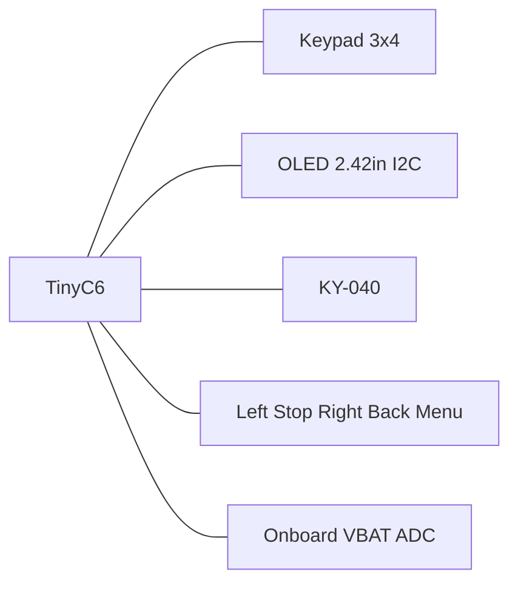

# MarkWTech v1.1 (Unexpected Maker TinyC6)

> Polish version: [v1.1_pl.md](v1.1_pl.md) · DevKitC-1 build: [1.0.md](1.0.md)

Same throttle as [v1.0](1.0.md) (3×4 keypad, five extra buttons, KY-040, 2.42" OLED) on an [Unexpected Maker TinyC6](https://unexpectedmaker.com/shop.html#!/TinyC6/p/602208790/category=0) ([Kamami](https://kamami.pl/esp32/1201003-tinyc6-esp32-c6-plytka-rozwojowa-z-modulem-esp32-c6-zlacze-ufl-5902186336612.html), [schematic / pin card](https://github.com/UnexpectedMaker/esp32c6)).

**Do not reuse a v1.0 wiring harness.** GPIO numbers are different. TinyC6 also has an onboard LiPo charger, 3.3 V regulator, JST battery connector, and battery ADC — you do **not** add a TP4056, Pololu, or resistor divider.

| Item | Value |
|------|-------|
| Cargo feature | `variant-markwtech-v1-1` (implies `variant-markwtech`) |
| `make` | `VARIANT=markwtech-v1-1` |
| Descriptor `id` | `markwtech-v1.1` |
| MCU board | Unexpected Maker TinyC6 (ESP32-C6, USB-C) |
| Display | SSD1309/SSD1306 128×64 I2C, address **0x3C** |
| Expanders | none |
| Console / flash | USB Serial/JTAG on the TinyC6 USB-C port (`esp-println` `jtag-serial`) |
| Programming chord | **\* (Menu) + Stop** 8 s, or **Stop** during the 2 s boot splash |
| Firmware constants | [`pins_v1_1.rs`](../../../crates/firmware/src/board/variants/markwtech/pins_v1_1.rs) |

## Controls

Same as v1.0:

- 3×4 keypad: digits, `*` (menu/cancel), `#` (select)
- Five extra GPIO tact switches (left / Stop / right / Back / Menu)
- KY-040 encoder for speed / list scroll (push also wakes from deep sleep)
- Dedicated Stop for EStop, boot-splash programming, and the 8 s chord
- **Left / Right** page lists (and Diagnostics subpages). **Stop** on Diagnostics advances to the next subpage.
- **Extras → Diagnostics**: battery, version, software, Wi‑Fi range, IP/MAC, ping to the command station.

## How to read the TinyC6 headers (do this first)

TinyC6 has **two rows of holes**, not the DevKitC-1 `J1`/`J3` silk.

1. Hold the board so the **USB-C connector is at the top**.
2. The **left** row has **12 holes**. The hole nearest USB is labelled **`21`** (GPIO 21). This row is **J4** in the tables below.
3. The **right** row has **11 holes**. The hole nearest USB is labelled **`BAT`** (battery). This row is **J3**.
4. Count **down from USB** as pin 1, 2, 3, … on each row.

```text
 USB-C
  ┌─────────────────────────────────┐
  │                                 │
  │  J4-1  21          BAT   J3-1   │
  │  J4-2  20          GND   J3-2   │
  │  J4-3  19          5V    J3-3   │
  │  J4-4  18          3V3   J3-4   │
  │  J4-5   7            3   J3-5   │
  │  J4-6   6            2   J3-6   │
  │  J4-7   5            1   J3-7   │
  │  J4-8  15            0   J3-8   │
  │  J4-9 RST           11   J3-9   │
  │ J4-10 GND            8   J3-10  │
  │ J4-11  TX           9   J3-11  │
  │ J4-12  RX                       │
  └─────────────────────────────────┘
```

Silkscreen on the PCB says `21`, `BAT`, `TX`, `RX`, `3V3`, and so on. Trust **those labels**, then match them to the tables. Do not guess by colour of jumper wires.

**17 header GPIOs:** 0, 1, 2, 3, 5, 6, 7, 8, 9, 11, 15, 16, 17, 18, 19, 20, 21. This variant uses **all of them**.

## Pin map (firmware 1:1)

| Role | GPIO | Header hole (USB at top) |
|------|------|--------------------------|
| Keypad rows R0–R3 | 21, 20, 19, 18 | J4-1 … J4-4 (`21` `20` `19` `18`) |
| Keypad columns C0–C2 | 7, 6, 5 | J4-5 … J4-7 (`7` `6` `5`) |
| Menu left | 15 | J4-8 (`15`) |
| Stop | 16 | J4-11 (`TX`) |
| Menu right | 17 | J4-12 (`RX`) |
| OLED SDA | 3 | J3-5 (`3`) |
| OLED SCL | 2 | J3-6 (`2`) |
| Encoder A (`DT`) | 1 | J3-7 (`1`) |
| Encoder SW | 0 | J3-8 (`0`) — deep-sleep wake |
| Encoder B (`CLK`) | 11 | J3-9 (`11`) |
| Menu | 8 | J3-10 (`8`) |
| Back | 9 | J3-11 (`9`) — also onboard BOOT |
| Battery ADC | 4 | **not on the header** (onboard divider) |

Keypad layout (`KEYPAD_MAP`):

```text
     C0   C1   C2
R0    1    2    3
R1    4    5    6
R2    7    8    9
R3    *    0    #
```

Extra buttons: tact switch to **GND**, firmware pull-up, active-low.

| # | Function | GPIO | Header | Notes |
|---|----------|------|--------|-------|
| 1 | Menu left | 15 | J4-8 | `Nav(Left)` — list page prev / cursor |
| 2 | Stop | 16 | J4-11 `TX` | EStop; chord with `*` |
| 3 | Menu right | 17 | J4-12 `RX` | `Nav(Right)` — list page next / cursor |
| 4 | Back | 9 | J3-11 | Cancel / back. **Holding at reset enters download mode** |
| 5 | Menu | 8 | J3-10 | Open menu / select-in-menu |



### Do not use as ordinary I/O

| GPIO / pad | Why |
|------------|-----|
| 4 | Onboard **VBAT** divider (`ADC1_CH4`). Not a goldpin. |
| 10 | Onboard **VBUS** sense, **not on the header**. |
| 12 / 13 | Native USB D−/D+, not broken out. Needed for flashing. |
| 22 / 23 | NeoPixel power / data, not on the header. |
| J4-9 `RST` | Reset. Leave unconnected. |
| J3-3 `5V` | 5 V from USB. **Never** feed this into the OLED or encoder `VCC`. |
| GPIO 9 as a **keypad row** (output) | Onboard BOOT shorts this pin to GND. Firmware uses it only as an **input** (Back). |
| GPIO 8 **and** 9 both held at reset | Invalid strap — do not press Menu and Back together while resetting. |

GPIO 8 is ignored at boot when GPIO 9 is high (normal). Holding **Menu alone** at reset is fine. Holding **Back** at reset enters download. Holding **Menu and Back together at reset** is the invalid strap.

UART0 (`TX`/`RX` = GPIO 16/17) are **Stop** and **Menu right**. Logs and flashing go through USB Serial/JTAG on USB-C, not through those pins.

### Deep-sleep wake

Only GPIO **0–7** can wake the chip from deep sleep. Encoder `SW` on GPIO 0 is the wake source. Left (15), Stop (16), Right (17), Back (9) and Menu (8) **cannot** wake the throttle.

## Full wiring (pin-by-pin)

All modules run on **3.3 V** from TinyC6 `3V3`. Tie a common **GND** to every component.

### Power (onboard charger — no extra modules)

| TinyC6 | What to connect |
|--------|-----------------|
| **JST** socket on the **underside** | LiPo **+** / **−** after you have **measured** polarity (do not trust wire colour). If there is no room for the plug under the board, skip JST and use the header pins below. |
| USB-C | Charging and firmware flash. USB and battery may be connected at the same time on this board. |
| `3V3` (J3-4) | OLED `VCC` and encoder `+` |
| `GND` (J3-2 and/or J4-10) | Every module ground and every button’s second leg. In the header-pin variant: also the **cell minus** on J3-2. |
| `BAT` (J3-1) | Alternative to JST **+**: cell plus when the underside JST does not fit. Or the far side of a rocker on plus. If the cell is in the JST and there is no rocker — leave unused. |

If the cell has a third **NTC / white** lead, leave it unconnected and insulated.

Optional master switch: always in series on **plus**. With JST: between cell plus and JST `+`. With header pins: between cell plus and J3-1 `BAT`. Minus goes straight to JST `−` or J3-2 `GND` — do not switch ground only.

Pick **one** cell path: the JST pair, **or** the J3-1/`BAT` + J3-2/`GND` pair. Not both.

**Do not** add TP4056, a Pololu, or a 47 kΩ divider. TinyC6 already charges the cell, regulates 3.3 V, and measures battery on GPIO 4 (442 kΩ / 160 kΩ). Firmware reads the ADC with curve calibration (millivolts at the pin) and multiplies by the resistor ratio, factor **3.76**.

### OLED 2.42" I2C (SSD1309 / SSD1306)

| TinyC6 | Firmware | OLED pin (typical) | Notes |
|--------|----------|-------------------|-------|
| **J3-5** GPIO **3** | `I2C_SDA` | `SDA` / `DIN` / `DATA` | I2C data |
| **J3-6** GPIO **2** | `I2C_SCL` | `SCL` / `CLK` / `SCK` | I2C clock |
| **J3-4** `3V3` | — | `VCC` / `3.3V` | **not** `5V` |
| **J3-2** `GND` | — | `GND` | |
| — | address **0x3C** | — | set `ADDR` jumper on the module if present |

Common 4-pin order on cheap modules: `GND` · `VCC` · `SCL` · `SDA` (read **your** silkscreen).

### KY-040 rotary encoder

| TinyC6 | Firmware | KY-040 pin | Notes |
|--------|----------|------------|-------|
| **J3-7** GPIO **1** | `ENCODER_A` | **`DT`** (sometimes `B`, `DATA`) | channel A |
| **J3-9** GPIO **11** | `ENCODER_B` | **`CLK`** (sometimes `A`) | channel B |
| **J3-8** GPIO **0** | `ENCODER_BUTTON` | **`SW`** / `KEY` | push + deep-sleep wake |
| **J3-4** `3V3` | — | **`+`** / `VCC` | |
| **J3-2** `GND` | — | **`GND`** | |

KY-040 boards often swap `CLK`/`DT` labels — wire as above. If the knob runs backwards after boot, swap `DT` and `CLK` only.

### 3×4 membrane keypad (7 cores; 8-pin ribbon)

Rows are **outputs**. Columns are **inputs** with internal pull-up.

Firmware stays on GPIO 21/20/19/18 (rows) and 7/6/5 (columns). **Do not plug the ribbon 1:1 into J4-1…J4-7** — the conductor order is not R0…R3, C0…C2.

Ribbon pin numbers from the continuity map (a pressed key shorts its row pin to its column pin). Pin **1** is not in any key — leave it open.

| Ribbon pin | Role | Keys | TinyC6 |
|------------|------|------|--------|
| 1 | — | unused | do not connect |
| **3** | **R0** | `1` `2` `3` | **J4-1** GPIO **21** |
| **8** | **R1** | `4` `5` `6` | **J4-2** GPIO **20** |
| **7** | **R2** | `7` `8` `9` | **J4-3** GPIO **19** |
| **5** | **R3** | `*` `0` `#` | **J4-4** GPIO **18** |
| **4** | **C0** | `1` `4` `7` `*` | **J4-5** GPIO **7** |
| **2** | **C1** | `2` `5` `8` `0` | **J4-6** GPIO **6** |
| **6** | **C2** | `3` `6` `9` `#` | **J4-7** GPIO **5** |

```text
  ribbon pin:  1    2    3    4    5    6    7    8
  role:       (—)  C1   R0   C0   R3   C2   R2   R1
  GPIO:            6    21    7   18    5   19   20
  hole:          J4-6 J4-1 J4-5 J4-4 J4-7 J4-3 J4-2
```

Measured pairs: `3+4=1`, `3+2=2`, `3+6=3`, `8+4=4`, `8+2=5`, `8+6=6`, `7+4=7`, `7+2=8`, `7+6=9`, `5+4=*`, `5+2=0`, `5+6=#`.

If digits are still wrong, check that ribbon pin 1 is the same edge you used on the meter — do not change firmware GPIO numbers.

### Five extra tact switches (active-low)

Each switch: one leg → **GPIO hole**, other leg → **GND**. Firmware enables the internal pull-up (pressed = LOW).

| TinyC6 | Header | Label | UI function | Suggested silkscreen |
|--------|--------|-------|-------------|----------------------|
| GPIO **15** | J4-8 | Menu left | list page prev / cursor left | `LEFT` |
| GPIO **16** | J4-11 `TX` | **Stop** | EStop; `*`+Stop chord (8 s) | `STOP` / `E-STOP` |
| GPIO **17** | J4-12 `RX` | Menu right | list page next / cursor right | `RIGHT` |
| GPIO **9** | J3-11 | Back | cancel / back | `BACK` / `ESC` |
| GPIO **8** | J3-10 | Menu | open menu / select in menu | `MENU` / `OK` |

```text
GPIOx ────[ tact switch ]──── GND
         (MCU pull-up)
```

Left / Stop / Right are **not** three adjacent holes: Left is J4-8 (`15`), then `RST` and `GND`, then Stop (`TX`) and Right (`RX`). Do not put Stop on `RST`.

## Master connection table

**28 wires** without a panel rocker (30 if you add one). `GND` is any TinyC6 ground (J3-2, J4-10, or the JST minus after the cell is connected).

### A. Power (2 wires, or 4 with a rocker)

| # | From | To | Purpose |
|---|------|-----|---------|
| 1 | LiPo **+** (measured) | TinyC6 JST **+** *or* J3-1 `BAT` *or* rocker pin A | cell into onboard charger |
| 2 | LiPo **−** (measured) | TinyC6 JST **−** *or* J3-2 `GND` | cell return — **required**, otherwise the board will not run on battery |
| — | LiPo white/NTC | *insulate, leave open* | TinyC6 JST has no NTC pin |
| 3 | *(optional)* rocker pin A | TinyC6 JST **+** *or* J3-1 `BAT` | master switch in series on + |
| 4 | *(optional)* LiPo **+** | rocker pin B | other side of the rocker |

If there is no rocker, wires 3–4 do not exist: cell + goes straight to JST `+` or J3-1 `BAT`. Plus and minus must take **the same path**: both in the JST (underside), or both on header pins J3-1 / J3-2 (edge).

### B. OLED 2.42" (4 wires)

| # | From | To | Purpose |
|---|------|-----|---------|
| 5 | OLED `VCC` | TinyC6 `3V3` (J3-4) | 3.3 V |
| 6 | OLED `GND` | common ground | return |
| 7 | OLED `SDA` | TinyC6 GPIO **3** (J3-5) | I2C data |
| 8 | OLED `SCL` | TinyC6 GPIO **2** (J3-6) | I2C clock |

### C. KY-040 encoder (5 wires)

| # | From | To | Purpose |
|---|------|-----|---------|
| 9 | KY-040 `+` | TinyC6 `3V3` (J3-4) | 3.3 V |
| 10 | KY-040 `GND` | common ground | return |
| 11 | KY-040 `DT` | TinyC6 GPIO **1** (J3-7) | channel A |
| 12 | KY-040 `CLK` | TinyC6 GPIO **11** (J3-9) | channel B |
| 13 | KY-040 `SW` | TinyC6 GPIO **0** (J3-8) | push + wake |

### D. 3×4 keypad (7 wires)

Ribbon pin numbers as in the continuity map (pin 1 unused).

| # | From | To | Purpose |
|---|------|-----|---------|
| 14 | Ribbon **pin 3** (`R0`) | TinyC6 GPIO **21** (J4-1) | row `1` `2` `3` |
| 15 | Ribbon **pin 8** (`R1`) | TinyC6 GPIO **20** (J4-2) | row `4` `5` `6` |
| 16 | Ribbon **pin 7** (`R2`) | TinyC6 GPIO **19** (J4-3) | row `7` `8` `9` |
| 17 | Ribbon **pin 5** (`R3`) | TinyC6 GPIO **18** (J4-4) | row `*` `0` `#` |
| 18 | Ribbon **pin 4** (`C0`) | TinyC6 GPIO **7** (J4-5) | column `1` `4` `7` `*` |
| 19 | Ribbon **pin 2** (`C1`) | TinyC6 GPIO **6** (J4-6) | column `2` `5` `8` `0` |
| 20 | Ribbon **pin 6** (`C2`) | TinyC6 GPIO **5** (J4-7) | column `3` `6` `9` `#` |

### E. Five buttons (10 wires)

| # | From | To | Purpose |
|---|------|-----|---------|
| 21 | Button "Menu left" — leg 1 | TinyC6 GPIO **15** (J4-8) | input |
| 22 | Button "Menu left" — leg 2 | common ground | pressed = LOW |
| 23 | Button "Stop" — leg 1 | TinyC6 GPIO **16** (J4-11 `TX`) | input |
| 24 | Button "Stop" — leg 2 | common ground | pressed = LOW |
| 25 | Button "Menu right" — leg 1 | TinyC6 GPIO **17** (J4-12 `RX`) | input |
| 26 | Button "Menu right" — leg 2 | common ground | pressed = LOW |
| 27 | Button "Back" — leg 1 | TinyC6 GPIO **9** (J3-11) | input |
| 28 | Button "Back" — leg 2 | common ground | pressed = LOW |
| 29 | Button "Menu" — leg 1 | TinyC6 GPIO **8** (J3-10) | input |
| 30 | Button "Menu" — leg 2 | common ground | pressed = LOW |

## Assembly, step by step

This section assumes **no electronics background**. Wire numbers in parentheses refer to the [master connection table](#master-connection-table).

### Before you start

Get a **multimeter** (DC volts and continuity/beeper).

- **Ground** (`GND`, minus) is the shared reference. Every signal is a voltage against ground.
- A **header hole** is one plated hole in J3 or J4. Count from USB as pin 1.
- **Polarity** is plus vs minus. A reversed LiPo can destroy the TinyC6 charger.

**Measure the cell before plugging it in.** Cheap packs often reverse the usual colours.

1. Set the meter to DC voltage.
2. Red probe on one cell lead, black on the other. Cell still unplugged.
3. Positive reading (~3.7–4.2 V): red-probe lead is **+**. Negative reading: that lead is **−**.
4. Mark **+** with tape. Ignore factory colour after that.
5. Third lead (white/yellow NTC): insulate; do not put it in the JST.

The TinyC6 JST is **2-pin** and sits on the **underside** of the board (the face opposite USB-C and the header silk). Plus goes to the pin marked `+` / battery positive; **the other pin is minus**. If the silk is unclear, use the [UM schematic](https://github.com/UnexpectedMaker/esp32c6). If there is no room for a plug under the board, do not fight the JST — use header pins in Step 2.

### Step 1 — common ground

Pick **J3-2 `GND`** (right row, second hole from USB) as the star point. From there, run ground to:

- OLED `GND`
- encoder `GND`
- **one leg of each of the five buttons**

J4-10 is the same ground internally. Use it if the left-row wires are shorter. *(wires 6, 10, 22, 24, 26, 28, 30)*

**Why:** a button whose “ground” is not the TinyC6 ground will chatter or never register.

If you connect the cell on header pins in Step 2, **the cell minus also lands on J3-2**. That is still the same ground — do not look for a separate “battery minus” pin. If it is crowded: keep cell minus on J3-2 and move the OLED/encoder/button star to J4-10.

### Step 2 — battery (and optional rocker)

The cell has **two** leads and **both** must reach TinyC6: plus *and* minus. Plus alone powers nothing.

The JST socket and battery pads are on the **underside**. The `BAT` / `GND` header pins are on the **edge** (right row, from USB down: `BAT` first, `GND` immediately under it). Pick **one** path — do not plug the cell into the JST and the header at the same time.

```text
Variant A — underside JST             Variant B — edge header pins
                                      (USB-C at top, right row)

  LiPo + ──────► JST +                  LiPo + ──────► J3-1  BAT
  LiPo − ──────► JST −                  LiPo − ──────► J3-2  GND
```

Minus is **always** the neighbour of plus on the same path: the other JST pin, or the `GND` hole right under `BAT`. Do not leave minus floating.

1. **No OLED, encoder, keypad, or buttons yet.**
2. Leave NTC (white/yellow) insulated.
3. Do **variant A or B** below. *(wires 1–2, optional 3–4)*

#### Variant A — JST plug on the underside

Use this when there is room for a plug under the board (or the JST is already soldered and you want to use it).

Minus **must** go to the JST minus pin. Do not leave it floating and do not put it on `3V3` or `5V`.

1. Flip the board. The JST has two pins: silk `+` / battery plus is **plus**; **the adjacent pin is minus** (cell ground).
2. Measured cell **+** → JST **+**.
3. Measured cell **−** → JST **−**. That is the only minus landing in this variant.
4. Do not add a second minus wire on J3-2: JST `−`, J3-2 `GND` and J4-10 are already shorted inside the board.

#### Variant B — header pins when the underside has no room

Use this when the JST plug does not fit under the board, the JST is not soldered, or you want the cell leads out the side. The cell pair then sits on **two neighbouring holes** of the right row.

1. USB-C at the top. Right row, from USB down: hole 1 is silkscreened **`BAT`**, hole 2 is **`GND`**.
2. Measured cell **+** → **J3-1 `BAT`**.
3. Measured cell **−** → **J3-2 `GND`** (just under `BAT`). Minus goes **next to plus on the same header**, not “wherever there is ground” on J4.
4. **Do not also plug into the JST.** Header `BAT` is the same net as JST `+`; `GND` is the same net as JST `−`.

If Step 1 already put a ground bundle on J3-2: cell minus can share that hole (same ground). If the hole is full: cell minus on J3-2, module grounds on J4-10.

#### Optional rocker

Always in series on **plus**. Minus has no switch.

- Variant A: LiPo **+** → rocker → JST **+**; LiPo **−** → JST **−**.
- Variant B: LiPo **+** → rocker → J3-1 `BAT`; LiPo **−** → J3-2 `GND`.

Do not switch ground only.

**Why minus cannot float:** without the cell return, the charger and regulator do not close the circuit — the throttle will not run on battery.

**Why there is no extra charger board:** TinyC6 already has USB-C charging and a 3.3 V regulator. Adding a TP4056 in parallel fights the onboard charger.

**Why there is no resistor divider:** GPIO 4 already sees a scaled copy of the cell voltage on the PCB.

### Step 3 — test 3.3 V before anything else

1. Connect USB-C **or** insert the battery (rocker ON if you fitted one).
2. Meter on DC volts: black probe on `GND` (J3-2), red probe on `3V3` (J3-4).
3. **You must see about 3.2–3.4 V.**

If you see 0 V: USB not seated, battery reversed, or rocker off. If you see ~5 V on `3V3`, stop — the regulator path is wrong (you may have jumped `5V` onto `3V3`). If you see cell voltage (~3.7–4.2 V) on `3V3`, also stop.

Unplug USB / switch off before continuing.

### Step 4 — OLED

Four wires. *(wires 5–8)*

| Display pin | Goes to |
|-------------|---------|
| `VCC` | `3V3` (J3-4) |
| `GND` | ground (J3-2) |
| `SDA` | GPIO **3** (J3-5) |
| `SCL` | GPIO **2** (J3-6) |

Read the labels on the OLED. Cheap modules often order pins `GND · VCC · SCL · SDA`.

Power on briefly: the panel should light after firmware is flashed. A dark panel with 3.3 V present usually means swapped SDA/SCL or the `ADDR` jumper not at 0x3C.

### Step 5 — KY-040 encoder

Five wires. *(wires 9–13)*

| Encoder pin | Goes to |
|-------------|---------|
| `+` | `3V3` (J3-4) |
| `GND` | ground |
| `DT` | GPIO **1** (J3-7) |
| `CLK` | GPIO **11** (J3-9) |
| `SW` | GPIO **0** (J3-8) |

`SW` must stay on GPIO 0 so a press can wake the throttle from deep sleep.

If rotation is backwards, swap `DT` and `CLK`.

### Step 6 — keypad

Seven wires. The ribbon has eight positions; **leave pin 1 open**. Do not drop a 1:1 housing onto J4. *(wires 14–20)*

| Ribbon pin | Goes to | Keys |
|------------|---------|------|
| 3 (`R0`) | GPIO **21** (J4-1) | `1` `2` `3` |
| 8 (`R1`) | GPIO **20** (J4-2) | `4` `5` `6` |
| 7 (`R2`) | GPIO **19** (J4-3) | `7` `8` `9` |
| 5 (`R3`) | GPIO **18** (J4-4) | `*` `0` `#` |
| 4 (`C0`) | GPIO **7** (J4-5) | `1` `4` `7` `*` |
| 2 (`C1`) | GPIO **6** (J4-6) | `2` `5` `8` `0` |
| 6 (`C2`) | GPIO **5** (J4-7) | `3` `6` `9` `#` |

Wrong digits after boot → check which edge is ribbon pin 1 and move wires, do not edit firmware.

### Step 7 — five buttons

Each button: **one leg to the GPIO hole, other leg to ground**. *(wires 21–30)*

| Button | Hole | Silk |
|--------|------|------|
| Menu left | J4-8 | `15` |
| **Stop** | J4-11 | `TX` |
| Menu right | J4-12 | `RX` |
| Back | J3-11 | `9` |
| Menu | J3-10 | `8` |

12 mm buttons usually have two legs. If there are four, use the pair that **beeps only while pressed**.

**Do not wire any button to `RST` (J4-9).** That hole resets the chip.

**Back on GPIO 9:** this is the same net as the onboard BOOT button. That is intended. Do not hold Back while plugging USB if you only want a normal boot (holding it forces download mode). Do not hold Menu and Back together at reset.

### Step 8 — first power-up and battery calibration

1. Build firmware: `make build VARIANT=markwtech-v1-1`.
2. Plug USB-C into TinyC6 (native USB — there is only one USB-C). Battery may stay connected.
3. Flash as usual (`espflash` / `cargo run` with this variant). Serial logs appear on the USB Serial/JTAG device, **not** on `TX`/`RX`.
4. After boot: OLED on, keypad digits correct, encoder changes speed, all five buttons match the labels.
5. **Battery:** charge through TinyC6 USB-C until the onboard charge LED finishes. A full cell should show ~4.2 V / 100 % with ADC around 2100–2600. Only if it does not, copy `sug` from Diagnostics and flash:

   `make flash VARIANT=markwtech-v1-1 BATTERY_FACTOR=<suggested_factor>`

### Safety warnings

- **Never put 5 V on OLED/encoder `VCC` or on `3V3`.** Use J3-4 `3V3` only.
- **Do not add a second charger** (TP4056, etc.) in parallel with TinyC6 USB charging.
- **Measure LiPo polarity** before plugging into the JST or into J3-1/`BAT` and J3-2/`GND`. Reverse polarity can kill the onboard charger.
- **Insulate the NTC lead.**
- **Do not solder to the cell pouch.** Use a ready JST plug on the underside, or leads on header pins J3-1/`BAT` and J3-2/`GND`.
- **Do not hold Back (GPIO 9) at reset** unless you want download mode. **Do not hold Menu + Back at reset.**
- **Do not drive GPIO 9 as an output** (no keypad row on that pin).
- LiPo: no puncture, no swelling — retire damaged cells.
- Before first battery-only run, check that `3V3` and `GND` are not shorted (meter must **not** beep).

## BOM

Core:

- Unexpected Maker TinyC6 (onboard or u.FL antenna as you prefer)
- 2.42" OLED 128×64 SSD1309, I2C, 4-pin
- 3×4 membrane keypad, 7-pin
- KY-040 rotary encoder
- 5× momentary panel push button, 12 mm
- Case: Thingiverse 7029069 (adapted for TinyC6 — smaller than DevKitC-1)

Battery:

- LiPo 3.7 V, ~1200 mAh. **2-pin JST-PH** plug if you use the underside socket; or loose / Dupont leads on J3-1/`BAT` and J3-2/`GND` when there is no room under the board. Confirm polarity.
- Optional: KCD1 rocker on battery +
- **No** TP4056, **no** Pololu, **no** 47 kΩ divider

## Flashing

One USB-C on TinyC6 is enough. Native USB Serial/JTAG stays free (GPIO 12/13 are not used as buttons). Stop/Right occupy UART `TX`/`RX`, which is why this variant logs over JTAG-serial.

```bash
make build VARIANT=markwtech-v1-1
```

## Programming mode

Same as v1.0:

- **Boot splash (2 s):** **Stop** enters Soft-AP. Hint `[STOP - Programming mode]` on the OLED.
- **Anytime after boot:** hold **\* + Stop** for 8 seconds.
- Soft-AP UI: left = cancel / reboot, right = next, then QR for the provisioning URL.

See [provisioning.md](../../provisioning.md).

## Header cheat sheet (USB at top)

```text
J4 left (12)                         J3 right (11)
 1  GPIO21  keypad R0                1  BAT     cell plus (if not JST) / rocker / unused
 2  GPIO20  keypad R1                2  GND     common ground; cell minus on header pins
 3  GPIO19  keypad R2                3  5V      do not use for modules
 4  GPIO18  keypad R3                4  3V3     OLED + encoder power
 5  GPIO7   keypad C0                5  GPIO3   OLED SDA
 6  GPIO6   keypad C1                6  GPIO2   OLED SCL
 7  GPIO5   keypad C2                7  GPIO1   encoder DT
 8  GPIO15  menu left                8  GPIO0   encoder SW (wake)
 9  RST     leave open               9  GPIO11  encoder CLK
10  GND     extra ground            10  GPIO8   Menu
11  GPIO16  Stop (silk TX)          11  GPIO9   Back (BOOT)
12  GPIO17  menu right (silk RX)
```

## See also

- [MarkWTech v1.0 (DevKitC-1)](1.0.md) — larger Espressif board, external charger and divider.
