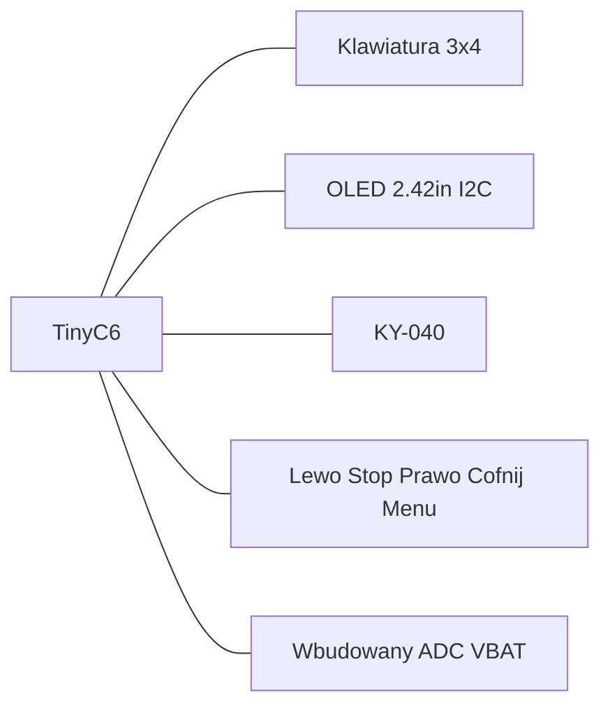

# MarkWTech v1.1 (Unexpected Maker TinyC6)

> English version: [v1.1.md](v1.1.md) · wersja DevKitC-1: [1.0_pl.md](1.0_pl.md)

Ten sam manipulator co [v1.0](1.0_pl.md) (klawiatura 3×4, pięć dodatkowych przycisków, KY-040, OLED 2,42") na płytce [Unexpected Maker TinyC6](https://unexpectedmaker.com/shop.html#!/TinyC6/p/602208790/category=0) ([Kamami](https://kamami.pl/esp32/1201003-tinyc6-esp32-c6-plytka-rozwojowa-z-modulem-esp32-c6-zlacze-ufl-5902186336612.html), [schemat / karta pinów](https://github.com/UnexpectedMaker/esp32c6)).

**Nie używaj wiązki z v1.0.** Numery GPIO są inne. TinyC6 ma wbudowaną ładowarkę LiPo, stabilizator 3,3 V, złącze JST baterii i pomiar ADC — **nie** dokładasz TP4056, Pololu ani dzielnika rezystorowego.

| Pozycja | Wartość |
|---------|---------|
| Feature Cargo | `variant-markwtech-v1-1` (włącza też `variant-markwtech`) |
| `make` | `VARIANT=markwtech-v1-1` |
| `id` deskryptora | `markwtech-v1.1` |
| Płytka MCU | Unexpected Maker TinyC6 (ESP32-C6, USB-C) |
| Wyświetlacz | SSD1309/SSD1306 128×64 I2C, adres **0x3C** |
| Ekspandery | brak |
| Konsola / wgrywanie | USB Serial/JTAG na porcie USB-C TinyC6 (`esp-println` `jtag-serial`) |
| Skrót programowania | **\* (Menu) + Stop** 8 s, albo **Stop** podczas 2 s splashu |
| Stałe firmware | [`pins_v1_1.rs`](../../../crates/firmware/src/board/variants/markwtech/pins_v1_1.rs) |

## Sterowanie

Jak w v1.0:

- Klawiatura 3×4: cyfry, `*` (menu/anuluj), `#` (wybierz)
- Pięć dodatkowych przycisków GPIO (w lewo / Stop / w prawo / Cofnij / Menu)
- Enkoder KY-040 do prędkości / przewijania list (wciśnięcie budzi też z głębokiego uśpienia)
- Dedykowany Stop: EStop, programowanie ze splashu, skrót 8 s
- **W lewo / w prawo** przewija strony list (i podstrony Diagnostyki). **Stop** w Diagnostyce przechodzi do następnej podstrony.
- **Extras → Diagnostyka**: bateria, wersja, oprogramowanie, zasięg Wi‑Fi, IP/MAC, ping do stacji.

## Jak czytać listwy TinyC6 (zrób to najpierw)

TinyC6 ma **dwa rzędy otworów**, nie jedwab `J1`/`J3` jak DevKitC-1.

1. Trzymaj płytkę tak, żeby złącze **USB-C było u góry**.
2. **Lewy** rząd ma **12 otworów**. Otwór najbliżej USB ma nadruk **`21`** (GPIO 21). Ten rząd to **J4** w tabelach poniżej.
3. **Prawy** rząd ma **11 otworów**. Otwór najbliżej USB ma nadruk **`BAT`** (bateria). Ten rząd to **J3**.
4. Numeruj **od USB w dół**: pin 1, 2, 3, … w każdym rzędzie.

```text
 USB-C
  ┌─────────────────────────────────┐
  │                                 │
  │  J4-1  21          BAT   J3-1   │
  │  J4-2  20          GND   J3-2   │
  │  J4-3  19          5V    J3-3   │
  │  J4-4  18          3V3   J3-4   │
  │  J4-5   7            3   J3-5   │
  │  J4-6   6            2   J3-6   │
  │  J4-7   5            1   J3-7   │
  │  J4-8  15            0   J3-8   │
  │  J4-9 RST           11   J3-9   │
  │ J4-10 GND            8   J3-10  │
  │ J4-11  TX           9   J3-11  │
  │ J4-12  RX                       │
  └─────────────────────────────────┘
```

Na PCB są nadruki `21`, `BAT`, `TX`, `RX`, `3V3` itd. Kieruj się **tymi etykietami**, potem dopasuj do tabel. Nie zgaduj po kolorze przewodów.

**17 GPIO na listwach:** 0, 1, 2, 3, 5, 6, 7, 8, 9, 11, 15, 16, 17, 18, 19, 20, 21. Ten wariant używa **wszystkich**.

## Mapa pinów (firmware 1:1)

| Rola | GPIO | Otwór listwy (USB u góry) |
|------|------|---------------------------|
| Wiersze klawiatury R0–R3 | 21, 20, 19, 18 | J4-1 … J4-4 (`21` `20` `19` `18`) |
| Kolumny klawiatury C0–C2 | 7, 6, 5 | J4-5 … J4-7 (`7` `6` `5`) |
| Menu w lewo | 15 | J4-8 (`15`) |
| Stop | 16 | J4-11 (`TX`) |
| Menu w prawo | 17 | J4-12 (`RX`) |
| OLED SDA | 3 | J3-5 (`3`) |
| OLED SCL | 2 | J3-6 (`2`) |
| Enkoder A (`DT`) | 1 | J3-7 (`1`) |
| Enkoder SW | 0 | J3-8 (`0`) — wybudzanie z głębokiego uśpienia |
| Enkoder B (`CLK`) | 11 | J3-9 (`11`) |
| Menu | 8 | J3-10 (`8`) |
| Cofnij | 9 | J3-11 (`9`) — też wbudowany BOOT |
| ADC baterii | 4 | **nie ma na listwie** (dzielnik na PCB) |

Układ klawiatury (`KEYPAD_MAP`):

```text
     C0   C1   C2
R0    1    2    3
R1    4    5    6
R2    7    8    9
R3    *    0    #
```

Dodatkowe przyciski: styk do **GND**, podciąganie w firmware, stan aktywny niski.

| # | Funkcja | GPIO | Listwa | Uwagi |
|---|---------|------|--------|-------|
| 1 | Menu w lewo | 15 | J4-8 | `Nav(Left)` — poprzednia strona listy / kursor |
| 2 | Stop | 16 | J4-11 `TX` | EStop; skrót z `*` |
| 3 | Menu w prawo | 17 | J4-12 `RX` | `Nav(Right)` — następna strona listy / kursor |
| 4 | Cofnij | 9 | J3-11 | Anuluj / wstecz. **Przytrzymanie przy resecie wchodzi w tryb download** |
| 5 | Menu | 8 | J3-10 | Otwórz menu / wybierz w menu |



### Czego nie używać jako zwykłego I/O

| GPIO / pad | Dlaczego |
|------------|----------|
| 4 | Wbudowany dzielnik **VBAT** (`ADC1_CH4`). Nie jest goldpinem. |
| 10 | Wbudowany pomiar **VBUS**, **nie ma na listwie**. |
| 12 / 13 | Natywne USB D−/D+, nie wyprowadzone. Potrzebne do wgrywania. |
| 22 / 23 | Zasilanie / dane NeoPixel, nie ma na listwie. |
| J4-9 `RST` | Reset. Zostaw niepodłączony. |
| J3-3 `5V` | 5 V z USB. **Nigdy** nie podawaj tego na OLED ani enkoder `VCC`. |
| GPIO 9 jako **wiersz klawiatury** (wyjście) | Wbudowany BOOT zwiera ten pin do GND. Firmware używa go tylko jako **wejście** (Cofnij). |
| GPIO 8 **i** 9 jednocześnie przy resecie | Niewłaściwy strap — nie trzymaj Menu i Cofnij razem podczas resetu. |

GPIO 8 jest ignorowany przy starcie, gdy GPIO 9 jest w stanie wysokim (normalny boot). Samo **Menu przy resecie** jest w porządku. **Cofnij przy resecie** wchodzi w download. **Menu i Cofnij razem przy resecie** to niewłaściwy strap.

UART0 (`TX`/`RX` = GPIO 16/17) to **Stop** i **Menu w prawo**. Logi i wgrywanie idą przez USB Serial/JTAG na USB-C, nie przez te piny.

### Wybudzanie z głębokiego uśpienia

Tylko GPIO **0–7** potrafią obudzić układ z głębokiego uśpienia. Źródłem jest `SW` enkodera na GPIO 0. Lewo (15), Stop (16), Prawo (17), Cofnij (9) i Menu (8) **nie obudzą** manipulatora.

## Pełne okablowanie (pin po pinie)

Wszystkie moduły na **3,3 V** z TinyC6 `3V3`. Do każdego elementu doprowadź wspólną **masę**.

### Zasilanie (wbudowana ładowarka — bez dodatkowych płytek)

| TinyC6 | Co podłączyć |
|--------|----------------|
| Wbudowane gniazdo **JST** baterii | LiPo **+** / **−** dopiero po **zmierzeniu** polaryzacji (nie ufaj kolorom) |
| USB-C | Ładowanie i wgrywanie firmware. Na tej płytce USB i bateria mogą być podłączone naraz. |
| `3V3` (J3-4) | OLED `VCC` i enkoder `+` |
| `GND` (J3-2 i/lub J4-10) | Masa każdego modułu i druga nóżka każdego przycisku |
| `BAT` (J3-1) | Opcjonalnie: tylko jeśli dajesz kołyskowy **szeregowo z plusem baterii**. Inaczej zostaw wolny. |

Jeśli ogniwo ma trzeci przewód **NTC / biały**, zostaw go niepodłączony i zaizoluj.

Opcjonalny wyłącznik główny: przetnij **+** baterii i wstaw kołyskowy KCD1 **przed** JST (albo między JST `+` a plus ogniwa). Nie przełączaj samej masy.

**Nie** dokładasz TP4056, Pololu ani dzielnika 47 kΩ. TinyC6 już ładuje ogniwo, reguluje 3,3 V i mierzy baterię na GPIO 4 (442 kΩ / 160 kΩ ≈ współczynnik **3,76** w firmware).

### OLED 2,42" I2C (SSD1309 / SSD1306)

| TinyC6 | Firmware | Pin OLED (typowy) | Uwagi |
|--------|----------|-------------------|-------|
| **J3-5** GPIO **3** | `I2C_SDA` | `SDA` / `DIN` / `DATA` | dane I2C |
| **J3-6** GPIO **2** | `I2C_SCL` | `SCL` / `CLK` / `SCK` | zegar I2C |
| **J3-4** `3V3` | — | `VCC` / `3.3V` | **nie** `5V` |
| **J3-2** `GND` | — | `GND` | |
| — | adres **0x3C** | — | ustaw zworkę `ADDR` na module, jeśli jest |

Typowa kolejność czterech pinów: `GND` · `VCC` · `SCL` · `SDA` (czytaj **swój** nadruk).

### Enkoder obrotowy KY-040

| TinyC6 | Firmware | Pin KY-040 | Uwagi |
|--------|----------|------------|-------|
| **J3-7** GPIO **1** | `ENCODER_A` | **`DT`** (czasem `B`, `DATA`) | kanał A |
| **J3-9** GPIO **11** | `ENCODER_B` | **`CLK`** (czasem `A`) | kanał B |
| **J3-8** GPIO **0** | `ENCODER_BUTTON` | **`SW`** / `KEY` | przycisk + wybudzanie |
| **J3-4** `3V3` | — | **`+`** / `VCC` | |
| **J3-2** `GND` | — | **`GND`** | |

Moduły KY-040 często mają zamienione opisy `CLK`/`DT` — podłącz jak wyżej. Jeśli pokrętło kręci się w inną stronę, zamień tylko `DT` i `CLK`.

### Klawiatura membranowa 3×4 (7 pinów)

Wiersze są **wyjściami**. Kolumny są **wejściami** z wewnętrznym podciąganiem.

| TinyC6 | Firmware | Pin klawiatury | Rola w matrycy |
|--------|----------|----------------|----------------|
| **J4-1** GPIO **21** | `KEYPAD_ROW_PINS[0]` | **R0** | klawisze `1` `2` `3` |
| **J4-2** GPIO **20** | `KEYPAD_ROW_PINS[1]` | **R1** | klawisze `4` `5` `6` |
| **J4-3** GPIO **19** | `KEYPAD_ROW_PINS[2]` | **R2** | klawisze `7` `8` `9` |
| **J4-4** GPIO **18** | `KEYPAD_ROW_PINS[3]` | **R3** | klawisze `*` `0` `#` |
| **J4-5** GPIO **7** | `KEYPAD_COL_PINS[0]` | **C0** | klawisze `1` `4` `7` `*` |
| **J4-6** GPIO **6** | `KEYPAD_COL_PINS[1]` | **C1** | klawisze `2` `5` `8` `0` |
| **J4-7** GPIO **5** | `KEYPAD_COL_PINS[2]` | **C2** | klawisze `3` `6` `9` `#` |

**Kolejność taśmy klawiatury nie jest ustandaryzowana.** Wyznacz każdy wiersz i kolumnę multimetrem (wciśnięty klawisz zwiera wiersz z kolumną). Jeśli cyfry się mylą, przełóż przewody — nie zmieniaj numerów GPIO w firmware.

Te siedem otworów leży pod rząd na J4 (od strony USB). Obudowa Dupont 7-pin może siedzieć na J4-1…J4-7 w kolejności `21, 20, 19, 18, 7, 6, 5`.

### Pięć dodatkowych przycisków (stan aktywny niski)

Każdy przycisk: jedna nóżka → **otwór GPIO**, druga → **GND**. Firmware włącza wewnętrzne podciąganie (wciśnięty = stan niski).

| TinyC6 | Listwa | Etykieta | Funkcja w UI | Sugerowany nadruk |
|--------|--------|----------|--------------|-------------------|
| GPIO **15** | J4-8 | Menu w lewo | poprzednia strona listy / kursor w lewo | `LEFT` |
| GPIO **16** | J4-11 `TX` | **Stop** | EStop; skrót `*`+Stop (8 s) | `STOP` / `E-STOP` |
| GPIO **17** | J4-12 `RX` | Menu w prawo | następna strona listy / kursor w prawo | `RIGHT` |
| GPIO **9** | J3-11 | Cofnij | anuluj / wstecz | `BACK` / `ESC` |
| GPIO **8** | J3-10 | Menu | otwórz menu / wybierz w menu | `MENU` / `OK` |

```text
GPIOx ────[ przycisk ]──── GND
         (podciąganie w MCU)
```

Lewo / Stop / Prawo **nie** są trzema sąsiednimi otworami: Lewo to J4-8 (`15`), potem `RST` i `GND`, potem Stop (`TX`) i Prawo (`RX`). Nie wpinaj Stop w `RST`.

## Tabela połączeń

**28 przewodów** bez kołyskowego na panelu (30 jeśli go dodasz). `GND` to dowolna masa TinyC6 (J3-2, J4-10, albo minus JST po podłączeniu ogniwa).

### A. Zasilanie (2 przewody, albo 4 z kołyskowym)

| # | Skąd | Dokąd | Po co |
|---|------|-------|-------|
| 1 | LiPo **+** (zmierzony) | TinyC6 JST **+** *albo* pin A kołyskowego | ogniwo do wbudowanej ładowarki |
| 2 | LiPo **−** (zmierzony) | TinyC6 JST **−** | powrót ogniwa |
| — | LiPo biały/NTC | *zaizoluj, zostaw wolny* | JST TinyC6 nie ma pinu NTC |
| 3 | *(opcjonalnie)* pin A kołyskowego | TinyC6 JST **+** | wyłącznik główny szeregowo na + |
| 4 | *(opcjonalnie)* LiPo **+** | pin B kołyskowego | druga strona kołyskowego |

Bez kołyskowego nie ma przewodów 3–4: plus ogniwa idzie prosto do JST +.

### B. OLED 2,42" (4 przewody)

| # | Skąd | Dokąd | Po co |
|---|------|-------|-------|
| 5 | OLED `VCC` | TinyC6 `3V3` (J3-4) | 3,3 V |
| 6 | OLED `GND` | masa wspólna | powrót |
| 7 | OLED `SDA` | TinyC6 GPIO **3** (J3-5) | dane I2C |
| 8 | OLED `SCL` | TinyC6 GPIO **2** (J3-6) | zegar I2C |

### C. Enkoder KY-040 (5 przewodów)

| # | Skąd | Dokąd | Po co |
|---|------|-------|-------|
| 9 | KY-040 `+` | TinyC6 `3V3` (J3-4) | 3,3 V |
| 10 | KY-040 `GND` | masa wspólna | powrót |
| 11 | KY-040 `DT` | TinyC6 GPIO **1** (J3-7) | kanał A |
| 12 | KY-040 `CLK` | TinyC6 GPIO **11** (J3-9) | kanał B |
| 13 | KY-040 `SW` | TinyC6 GPIO **0** (J3-8) | przycisk + wybudzanie |

### D. Klawiatura 3×4 (7 przewodów)

| # | Skąd | Dokąd | Po co |
|---|------|-------|-------|
| 14 | Klawiatura `R0` | TinyC6 GPIO **21** (J4-1) | wiersz (wyjście) |
| 15 | Klawiatura `R1` | TinyC6 GPIO **20** (J4-2) | wiersz (wyjście) |
| 16 | Klawiatura `R2` | TinyC6 GPIO **19** (J4-3) | wiersz (wyjście) |
| 17 | Klawiatura `R3` | TinyC6 GPIO **18** (J4-4) | wiersz (wyjście) |
| 18 | Klawiatura `C0` | TinyC6 GPIO **7** (J4-5) | kolumna (wejście) |
| 19 | Klawiatura `C1` | TinyC6 GPIO **6** (J4-6) | kolumna (wejście) |
| 20 | Klawiatura `C2` | TinyC6 GPIO **5** (J4-7) | kolumna (wejście) |

### E. Pięć przycisków (10 przewodów)

| # | Skąd | Dokąd | Po co |
|---|------|-------|-------|
| 21 | Przycisk „Menu w lewo” — nóżka 1 | TinyC6 GPIO **15** (J4-8) | wejście |
| 22 | Przycisk „Menu w lewo” — nóżka 2 | masa wspólna | wciśnięty = stan niski |
| 23 | Przycisk „Stop” — nóżka 1 | TinyC6 GPIO **16** (J4-11 `TX`) | wejście |
| 24 | Przycisk „Stop” — nóżka 2 | masa wspólna | wciśnięty = stan niski |
| 25 | Przycisk „Menu w prawo” — nóżka 1 | TinyC6 GPIO **17** (J4-12 `RX`) | wejście |
| 26 | Przycisk „Menu w prawo” — nóżka 2 | masa wspólna | wciśnięty = stan niski |
| 27 | Przycisk „Cofnij” — nóżka 1 | TinyC6 GPIO **9** (J3-11) | wejście |
| 28 | Przycisk „Cofnij” — nóżka 2 | masa wspólna | wciśnięty = stan niski |
| 29 | Przycisk „Menu” — nóżka 1 | TinyC6 GPIO **8** (J3-10) | wejście |
| 30 | Przycisk „Menu” — nóżka 2 | masa wspólna | wciśnięty = stan niski |

## Montaż krok po kroku

Ta część zakłada **zero wiedzy elektronicznej**. Numery przewodów w nawiasach odsyłają do [tabeli połączeń](#tabela-połączeń).

### Zanim zaczniesz

Przygotuj **multimetr** (napięcie stałe i tryb brzęczyka).

- **Masa** (`GND`, minus) to wspólny punkt odniesienia. Każdy sygnał to napięcie względem masy.
- **Otwór listwy** to jeden metalizowany otwór w J3 albo J4. Numeruj od USB jako pin 1.
- **Polaryzacja** to plus kontra minus. Ogniwo LiPo odwrotnie może zniszczyć ładowarkę TinyC6.

**Zmierz ogniwo zanim włożysz wtyczkę.** Tanie pakiety często mają kolory na odwrót.

1. Ustaw multimetr na napięcie stałe.
2. Czerwona sonda na jednym przewodzie ogniwa, czarna na drugim. Ogniwo jeszcze nigdzie nie wpięte.
3. Odczyt dodatni (~3,7–4,2 V): przewód pod czerwoną sondą to **+**. Odczyt ujemny: ten przewód to **−**.
4. Oznacz **+** taśmą. Od tej pory ignoruj fabryczny kolor.
5. Trzeci przewód (biały/żółty NTC): zaizoluj; nie wkładaj go do JST.

JST TinyC6 ma **2 piny**. Plus idzie do pinu oznaczonego `+` / plus baterii na nadruku (w razie wątpliwości [schemat UM](https://github.com/UnexpectedMaker/esp32c6)).

### Krok 1 — wspólna masa

Wybierz **J3-2 `GND`** (prawy rząd, drugi otwór od USB) jako punkt gwiazdowy. Stamtąd poprowadź masę do:

- OLED `GND`
- enkoder `GND`
- **jednej nóżki każdego z pięciu przycisków**

J4-10 to ta sama masa wewnątrz płytki. Użyj go, jeśli krótsze są przewody z lewego rzędu. *(przewody 6, 10, 22, 24, 26, 28, 30)*

**Dlaczego:** przycisk, którego „masa” nie jest masą TinyC6, będzie trzaskał albo w ogóle nie zadziała.

### Krok 2 — bateria (i opcjonalny kołyskowy)

1. **Jeszcze bez OLED, enkodera, klawiatury i przycisków.**
2. Wepnij zmierzone **+** / **−** do JST TinyC6 (albo przez kołyskowy tylko na **+**). *(przewody 1–2, opcjonalnie 3–4)*
3. NTC zostaw zaizolowany.

**Dlaczego nie ma dodatkowej ładowarki:** TinyC6 już ma ładowanie z USB-C i stabilizator 3,3 V. TP4056 równolegle walczyłby z wbudowaną ładowarką.

**Dlaczego nie ma dzielnika rezystorowego:** GPIO 4 już widzi przeskalowane napięcie ogniwa na PCB.

### Krok 3 — sprawdź 3,3 V zanim podepniesz resztę

1. Podłącz USB-C **albo** włóż baterię (kołyskowy ON, jeśli jest).
2. Multimetr na DC: czarna sonda na `GND` (J3-2), czerwona na `3V3` (J3-4).
3. **Musisz zobaczyć około 3,2–3,4 V.**

Jeśli 0 V: USB niedociśnięty, bateria odwrotnie, albo kołyskowy wyłączony. Jeśli ~5 V na `3V3` — stop, ktoś zmostkował `5V` na `3V3`. Jeśli na `3V3` widać napięcie ogniwa (~3,7–4,2 V) — też stop.

Odłącz USB / wyłącz zasilanie zanim pójdziesz dalej.

### Krok 4 — OLED

Cztery przewody. *(przewody 5–8)*

| Pin wyświetlacza | Dokąd |
|------------------|-------|
| `VCC` | `3V3` (J3-4) |
| `GND` | masa (J3-2) |
| `SDA` | GPIO **3** (J3-5) |
| `SCL` | GPIO **2** (J3-6) |

Przeczytaj opisy na OLED. Tanie moduły często mają kolejność `GND · VCC · SCL · SDA`.

Po wgraniu firmware panel powinien się zapalić. Ciemny panel przy dobrych 3,3 V zwykle oznacza zamienione SDA/SCL albo zworkę `ADDR` nie na 0x3C.

### Krok 5 — enkoder KY-040

Pięć przewodów. *(przewody 9–13)*

| Pin enkodera | Dokąd |
|--------------|-------|
| `+` | `3V3` (J3-4) |
| `GND` | masa |
| `DT` | GPIO **1** (J3-7) |
| `CLK` | GPIO **11** (J3-9) |
| `SW` | GPIO **0** (J3-8) |

`SW` musi zostać na GPIO 0, żeby wciśnięcie budziło manipulator z głębokiego uśpienia.

Jeśli obrót jest wstecz, zamień `DT` i `CLK`.

### Krok 6 — klawiatura

Siedem przewodów. Kolejność taśmy bywa różna — rozpisz ją metrem. *(przewody 14–20)*

1. Tryb przejścia. Przytrzymaj **`1`**. Para, która piszczy, to R0 i C0.
2. Przytrzymaj **`2`**: wspólny przewód to R0, nowy to C1.
3. Dalej `3`, `4`, `7`, `*` aż nazwiesz wszystkie siedem.

| Wyprowadzenie | Dokąd | Klawisze |
|---------------|-------|----------|
| `R0` | GPIO **21** (J4-1) | `1` `2` `3` |
| `R1` | GPIO **20** (J4-2) | `4` `5` `6` |
| `R2` | GPIO **19** (J4-3) | `7` `8` `9` |
| `R3` | GPIO **18** (J4-4) | `*` `0` `#` |
| `C0` | GPIO **7** (J4-5) | `1` `4` `7` `*` |
| `C1` | GPIO **6** (J4-6) | `2` `5` `8` `0` |
| `C2` | GPIO **5** (J4-7) | `3` `6` `9` `#` |

Złe cyfry po starcie → przełóż przewody, nie ruszaj firmware.

### Krok 7 — pięć przycisków

Każdy przycisk: **jedna nóżka do otworu GPIO, druga do masy**. *(przewody 21–30)*

| Przycisk | Otwór | Nadruk |
|----------|-------|--------|
| Menu w lewo | J4-8 | `15` |
| **Stop** | J4-11 | `TX` |
| Menu w prawo | J4-12 | `RX` |
| Cofnij | J3-11 | `9` |
| Menu | J3-10 | `8` |

Przyciski 12 mm mają zwykle dwie nóżki. Jeśli są cztery, użyj pary, która **piszczy tylko po wciśnięciu**.

**Nie wpinaj żadnego przycisku w `RST` (J4-9).** Ten otwór resetuje układ.

**Cofnij na GPIO 9:** to ta sama sieć co wbudowany przycisk BOOT. Tak ma być. Nie trzymaj Cofnij przy wpinaniu USB, jeśli chcesz zwykły start (przytrzymanie wymusza tryb download). Nie trzymaj Menu i Cofnij razem przy resecie.

### Krok 8 — pierwsze uruchomienie i kalibracja baterii

1. Zbuduj firmware: `make build VARIANT=markwtech-v1-1`.
2. Wepnij USB-C do TinyC6 (natywne USB — jest tylko jedno USB-C). Bateria może zostać.
3. Wgraj jak zwykle (`espflash` / `cargo run` z tym wariantem). Logi szeregowe są na urządzeniu USB Serial/JTAG, **nie** na `TX`/`RX`.
4. Po starcie: OLED świeci, cyfry klawiatury się zgadzają, enkoder zmienia prędkość, pięć przycisków zgadza się z etykietami.
5. **Bateria:** ładuj przez USB-C TinyC6, aż dioda ładowania na płytce skończy. Z logu skopiuj `suggested_factor` z linii `battery: raw=… suggested_factor=…` do `BATTERY_CONVERSION_FACTOR` w [`pins_v1_1.rs`](../../../crates/firmware/src/board/variants/markwtech/pins_v1_1.rs). Wartość startowa to **3,76**. Wgraj ponownie i sprawdź 100 % na pełnym ogniwie.

### Ostrzeżenia

- **Nigdy nie dawaj 5 V na `VCC` OLED/enkodera ani na `3V3`.** Tylko J3-4 `3V3`.
- **Nie dokładasz drugiej ładowarki** (TP4056 itd.) równolegle z USB TinyC6.
- **Zmierz polaryzację LiPo** przed JST. Odwrotna polaryzacja może zabić wbudowaną ładowarkę.
- **Zaizoluj przewód NTC.**
- **Nie lutuj do woreczka ogniwa.** Użyj gotowej wtyczki JST.
- **Nie trzymaj Cofnij (GPIO 9) przy resecie**, chyba że chcesz tryb download. **Nie trzymaj Menu + Cofnij przy resecie.**
- **Nie steruj GPIO 9 jako wyjściem** (żaden wiersz klawiatury na tym pinie).
- LiPo: nie przekłuwaj, nie używaj spuchniętego ogniwa.
- Przed pierwszym startem na samej baterii sprawdź, że `3V3` i `GND` nie są zwarte (multimetr **nie** może piszczeć).

## Lista części

Podstawa:

- Unexpected Maker TinyC6 (antena na PCB albo u.FL — jak wolisz)
- OLED 2,42" 128×64 SSD1309, I2C, 4 piny
- Klawiatura membranowa 3×4, 7 wyprowadzeń
- Enkoder obrotowy KY-040
- 5× przycisk monostabilny panelowy, 12 mm
- Obudowa: Thingiverse 7029069 (dopasowana do TinyC6 — mniejsza niż DevKitC-1)

Bateria:

- Ogniwo LiPo 3,7 V, ~1200 mAh, **2-pin JST-PH** pasujący do TinyC6 (sprawdź polaryzację wtyczki)
- Opcjonalnie: kołyskowy KCD1 na plusie baterii
- **Bez** TP4056, **bez** Pololu, **bez** dzielnika 47 kΩ

## Wgrywanie firmware

Wystarczy jedno USB-C na TinyC6. Natywny USB Serial/JTAG zostaje wolny (GPIO 12/13 nie są przyciskami). Stop/Prawo zajmują UART `TX`/`RX`, dlatego ten wariant loguje przez JTAG-serial.

```bash
make build VARIANT=markwtech-v1-1
```

## Tryb programowania

Jak w v1.0:

- **Splash przy starcie (2 s):** **Stop** wchodzi w Soft-AP. Na OLED jest `[STOP - Programming mode]`.
- **W dowolnym momencie po starcie:** przytrzymaj **\* + Stop** przez 8 sekund.
- W Soft-AP: lewo = anuluj / restart, prawo = dalej, potem QR do strony provisioningu.

Zobacz [provisioning.md](../../provisioning.md).

## Ściąga listew (USB u góry)

```text
J4 lewa (12)                         J3 prawa (11)
 1  GPIO21  klawiatura R0            1  BAT     opcjonalny wyłącznik / wolny
 2  GPIO20  klawiatura R1            2  GND     masa wspólna
 3  GPIO19  klawiatura R2            3  5V      nie do modułów
 4  GPIO18  klawiatura R3            4  3V3     zasilanie OLED + enkoder
 5  GPIO7   klawiatura C0            5  GPIO3   OLED SDA
 6  GPIO6   klawiatura C1            6  GPIO2   OLED SCL
 7  GPIO5   klawiatura C2            7  GPIO1   enkoder DT
 8  GPIO15  menu w lewo              8  GPIO0   enkoder SW (wybudzanie)
 9  RST     zostaw wolny             9  GPIO11  enkoder CLK
10  GND     dodatkowa masa          10  GPIO8   Menu
11  GPIO16  Stop (nadruk TX)        11  GPIO9   Cofnij (BOOT)
12  GPIO17  menu w prawo (nadruk RX)
```

## Zobacz też

- [MarkWTech v1.0 (DevKitC-1)](1.0_pl.md) — większa płytka Espressif, zewnętrzna ładowarka i dzielnik.
