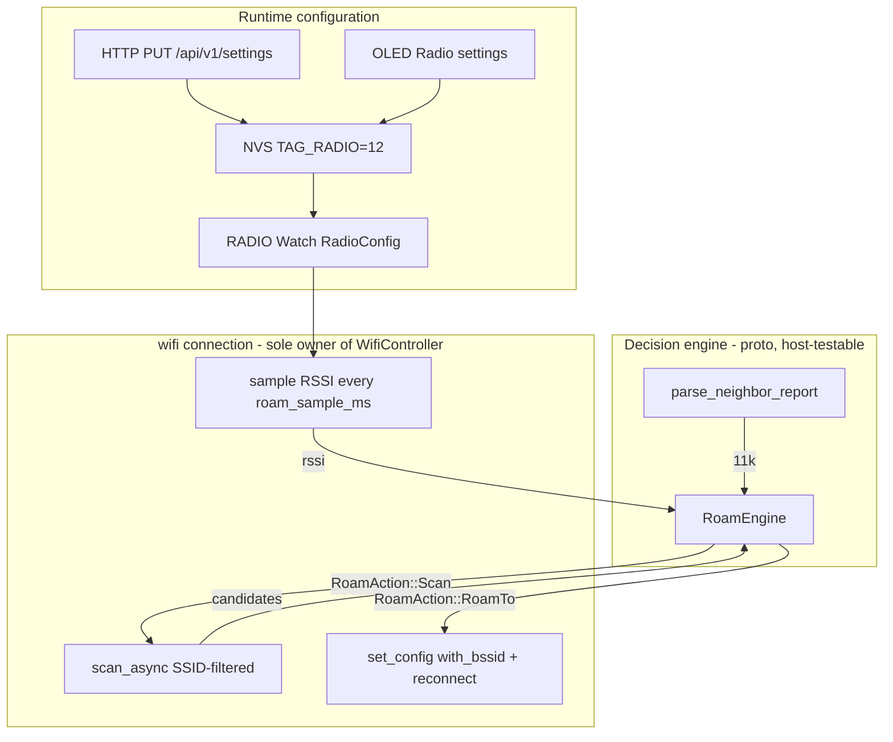

# LongFred: fast Wi-Fi roaming + radio settings

## Findings from upstream verification

Verified against `esp-radio 1.0.0-beta.0` and `esp-wifi-sys-esp32c6 0.2.0` in the cargo registry. Results reshape the work split:

- **Tier A works today, no library changes.** `StationConfig` has `bssid: Option<[u8;6]>` and `channel: Option<u8>`, and `apply_sta_config` passes them through (`bssid_set: config.bssid.is_some()`, `wifi/mod.rs:3163-3165`). `ScanConfig` has `with_ssid`, `bssid`, `channel`, `max`. `AccessPointInfo` carries `bssid` + `channel`.
- **Tier B is a small PR to esp-radio, no blob rebuild.** `libwpa_supplicant.a` already contains `esp_rrm_send_neighbor_report_request`, `esp_rrm_is_rrm_supported_connection`, `esp_wnm_is_btm_supported_connection`, `esp_wnm_send_bss_transition_mgmt_query`. Blockers are purely Rust-side: `apply_sta_config` writes `_bitfield_1: __BindgenBitfieldUnit::new([0; 4])`, which zeroes `rm_enabled`/`btm_enabled`, and `EventInfo` has no `StationNeighborRep` variant, so `from_wifi_event_raw` catches it in `_ => None` (`wifi/event.rs:1265`).
- **Tier C requires a blob rebuild.** Zero `wpa_ft_*` symbols — `CONFIG_ESP_WIFI_11R_SUPPORT=y` is missing.
- `esp_rrm_*` / `esp_wnm_*` are not in the bindgen output (`esp-wifi-sys-esp32c6-0.2.0/src/include.rs` — 0 hits), despite being present in the archive.

Upstream repos: `esp-rs/esp-hal` (crate `esp-radio`), `esp-rs/esp-wifi-sys` (bindgen + blobs in `libs/`), `esp-rs/esp-wireless-drivers-3rdparty` (sdkconfig + blob build).

## Architecture



Principle: `WifiController` stays the sole property of `wifi::connection` (no mutex), so radio actions run in that loop. Decision logic is pure and lives in `longfred-proto`, making it host-testable per ARCHITECTURE.md par. 1.8.

## Stage 0: fork esp-radio via [patch]

Fork `esp-rs/esp-hal` on branch `longfred-radio-11kv`, in `longfred/Cargo.toml`:

```toml
[patch.crates-io]
esp-radio = { git = "https://github.com/<org>/esp-hal", branch = "longfred-radio-11kv" }
```

Note: `esp-radio` has a `links`/blob dependency on `esp-wifi-sys-esp32c6`. If Tier C (11r) needs new blobs, a second patch on `esp-wifi-sys-esp32c6` is added. The fork holds the exact same commits as the upstream PRs, so after merge it is enough to remove the `[patch]` section.

## Stage 1: data model

### `crates/proto/src/persist.rs`

New `RadioConfig` + `PersistRecord.radio: RadioConfig`. Defaults mirror current compile-time behavior, so an upgrade does not change behavior:

```rust
pub struct RadioConfig {
    pub roam_enabled: bool,        // default false - opt-in for the whole roaming feature
    pub rrm_enabled: bool,         // 802.11k, default true  - ready when user enables roam
    pub btm_enabled: bool,         // 802.11v, default true  - ready when user enables roam
    pub ft_enabled: bool,          // 802.11r, default true  - ready when user enables roam
    pub power_save_off: bool,      // default true  (= WIFI_FORCE_POWER_SAVE_NONE)
    pub enable_11ax: bool,         // default true  (= WIFI_ENABLE_11AX)
    pub roam_rssi_threshold: i8,   // -90..=-50, default -72
    pub roam_hysteresis_db: u8,    // 3..=20,    default 8
    pub roam_debounce_samples: u8, // 1..=10,    default 3
    pub roam_scan_interval_s: u8,  // 1..=60,    default 10
    pub roam_sample_ms: u16,       // 100..=2000, default 250
    pub ip_pinning: bool,          // default true  - see Stage 2a
    pub ip_pin_max_gap_s: u16,     // 5..=3600,  default 120 - unpin after this many s of gap
    pub dhcp_discover_timeout_s: u8, // 1..=30,   default 2 (smoltcp default is 10)
}
```

Encoding `TAG_RADIO = 12` (last used is `TAG_SERVER = 11`), `VERSION` 5 -> 6, `6` added to the version allow-list at `persist.rs:451`.

Payload with a length prefix, which other tags do not have — this gives forward-compat within the tag, without further `VERSION` bumps when adding radio fields:

- `len: u8` (payload byte count)
- `flags: u8` — bits 0..6: roam, rrm, btm, ft, power_save_off, enable_11ax, ip_pinning
- `rssi_threshold: i8`, `hysteresis: u8`, `debounce: u8`, `scan_interval: u8`
- `sample_ms: u16` LE
- `ip_pin_max_gap_s: u16` LE
- `dhcp_discover_timeout_s: u8`

Decoder reads `len`, parses known fields, skips the rest. Tag always written (like `TAG_ROSTER`).

Range validation in one place: `RadioConfig::clamped()` called after decode and in `apply_settings_put`.

Risk to accept: older firmware reading a v6 record gets `None` from `decode`, which via `load().unwrap_or_default()` wipes NVS. This is existing behavior for every version bump in this project (unknown tag returns `None`, not skipped — contrary to ARCHITECTURE.md par. 9). Downgrade after deployment = loss of settings.

### `crates/proto/src/network/roam.rs` (new)

Pure logic, no I/O, with host tests:

- `struct RoamEngine` — state: samples-below-threshold counter, `last_scan_ms`, `current_bssid`.
- `fn on_sample(&mut self, rssi: i8, now_ms: u64, cfg: &RadioConfig) -> RoamAction` where `RoamAction` is `Idle | Scan { channels } | RoamTo { bssid, channel }`.
- `fn on_scan_results(&mut self, current_rssi: i8, candidates: &[BssCandidate], cfg: &RadioConfig) -> Option<BssCandidate>` — picks a candidate with the same SSID and `rssi >= current_rssi + hysteresis_db`.
- `fn parse_neighbor_report(bytes: &[u8]) -> heapless::Vec<BssCandidate, N>` — Neighbor Report Element parser (EID 52: BSSID[6], BSSInfo[4], OperatingClass, Channel, PhyType, sub-elements). Feeds the channel list for scan instead of a full scan.
- Anti-ping-pong: hysteresis + `roam_scan_interval_s` as minimum scan gap + cooldown after a successful roam.

Tests: threshold crossing, debounce, candidate rejection in hysteresis, ping-pong between two APs, neighbor report parser on a byte vector.

## Stage 2: firmware radio layer

### `crates/firmware/src/net/mod.rs`

New `RADIO: Watch<CriticalSectionRawMutex, RadioConfig, 2>` (domain publishes, `wifi::connection` consumes). `WifiCmd` extended:

```rust
Connect { ssid: String<32>, password: String<64>, bssid: Option<[u8; 6]>, channel: Option<u8> },
```

`SsidInfo` in `crates/proto/src/network/net_status.rs` gains `bssid: [u8;6]` and `channel: u8` — today `ap_to_ssid_info` in `wifi.rs:36` drops them, so you cannot pick a neighbor from scan results.

### `crates/firmware/src/net/wifi.rs`

- `StationConfig` gets `.with_bssid(pending_bssid)` and `.with_channel(...)`; after successful association the lock is cleared, so auto-rejoin after a drop can freely pick the best AP (`sort_method` is `BY_SIGNAL` anyway).
- After `set_config`, where `config::network::WIFI_FORCE_POWER_SAVE_NONE` and `WIFI_ENABLE_11AX` currently stand (`wifi.rs:167-178`), values come from `RADIO.try_get()`. After Tier B `.with_rm_enabled(cfg.rrm_enabled).with_btm_enabled(cfg.btm_enabled)` is added, after Tier C `.with_ft_enabled(cfg.ft_enabled)`. Deployment-order note: since `rrm_enabled`/`btm_enabled`/`ft_enabled` default to `true` but Tier B/C in esp-radio does not expose them yet, in Stage 2 (before forking) these flags are ignored by firmware — only after Tier B (fork + PR 2) do `rm_enabled`/`btm_enabled` get passed to `apply_sta_config`, and after Tier C (PR 3) `ft_enabled` joins. Until then the enabled flags are simply no-op.
- Connected loop (`wifi.rs:219-246`): `Timer::after(Duration::from_secs(1))` becomes `roam_sample_ms` (default 250 ms). `publish_wifi_link` still runs every ~1 s (every Nth sample), to keep Diagnostics behavior unchanged (it samples `RSSI_SAMPLE_MS = 1000`).
- On each sample: `controller.rssi()` -> `RoamEngine::on_sample`. On `RoamAction::Scan` call `scan_async(&ScanConfig::default().with_ssid(ssid).with_max(...))`, optionally channel-filtered when 11k gave a list. On `RoamAction::RoamTo` set `pending_bssid`, `disconnect_async`, `connect_async`.
- Mandatory fallback: a failed connect with a lock clears `pending_bssid` and retries a plain SSID connect. Without this an FT-fail loop is possible.
- Scan only in associated state and never during `connect_async` — this exception is already documented in `wifi.rs:73-79` (risk of `ESP_ERR_WIFI_STATE`).

## Stage 2a: IPv4 pinning on every link-down

The mechanism applies to **all** link losses, not just roaming: walking out of range, beacon timeout, AP restart, transient interference. Roaming is just one trigger.

### What happens today (verified in sources)

On every link loss DHCP is renegotiated from scratch, and this is most likely the dominant component of recovery time.

`embassy-net-0.9.1/src/lib.rs:898-926` in `poll`:

```rust
if self.link_up {
    if old_link_up != self.link_up {
        socket.reset();          // link UP -> reset
    }
    ...
} else if old_link_up {
    socket.reset();              // link DOWN -> reset
    self.static_v4 = None;       // IP address thrown away
    true
}
```

`smoltcp-0.13.1/src/socket/dhcpv4.rs:732-740` — `reset()` unconditionally sets `ClientState::Discovering`. smoltcp has only three states (`Discovering`, `Requesting`, `Renewing`); there is **no INIT-REBOOT** state from RFC 2131. This means a full DORA (DISCOVER, OFFER, REQUEST, ACK) on every link loss, instead of a two-packet REQUEST with the requested-ip option.

Worse: `RetryConfig::default()` (`dhcpv4.rs:131-141`) is `discover_timeout: 10 s`, `initial_request_timeout: 5 s`, `request_retries: 5`. A lost DISCOVER or OFFER right after coverage returns (highly likely, since the link is still stabilizing) means **10 s without an IP address**. The `test_request_timeout` test in smoltcp shows a lost ACK can take up to 70 s. LongFred does not override `retry_config` — `dhcp_config_with_hostname()` in `wifi.rs:24-34` sets only `hostname`, so defaults apply.

Conclusion: without this change the entire 802.11r gain is eaten by DHCP, and a plain coverage loss can cost over ten seconds.

### Key property: pinning works even after the fact

`Stack::set_config_v4` (`lib.rs:541-546`) calls `set_config_v4` on `Inner` and immediately `apply_static_config()`. The internal `set_config_v4` (`lib.rs:693-748`) for `ConfigV4::Static(c)` sets `self.static_v4 = Some(c)` **and removes the DHCP socket** (the `_ =>` branch, `lib.rs:741-747`).

When `dhcp_socket` is `None`, the entire address-clearing block on link-down is skipped (`lib.rs:927-929` returns `false`). So after pinning the address survives any number of link down/up transitions.

Practical consequence: **you do not need to predict the break**. Pinning can be applied after the link has already dropped and embassy-net has cleared the address. It is enough to make it before the link returns, and that is easy — auto-rejoin has a minimum of `RECONNECT_MIN_MS` (500 ms) plus association time, while the reaction to a link-down event is single milliseconds. Because of this, roam and coverage loss use exactly the same code path.

### Solution: one owner of the address lifecycle

New `LAST_LEASE` in `net/mod.rs` holding `Option<(StaticConfigV4, heapless::String<32> /* ssid */)>`.

The owner is `status_task` (`wifi.rs:276-304`), because it already has `stack`, already handles `wait_link_up` / `wait_config_up` / `wait_link_down`, and already publishes `STA_NET` with the full data (`cfg.address`, `prefix_len`, `gateway`, `dns_servers`). `wifi::connection` does not have a `Stack`, so it could not do this alone — this is an additional argument for keeping it all in `status_task`.

Extended loop:

1. **Config up** — save the lease to `LAST_LEASE` together with the SSID from `WIFI_LINK`. DHCP mode only.
2. **Link down** — if pinning is allowed, `stack.set_config_v4(ConfigV4::Static(lease))` and record `down_at`. Applies equally to roam and coverage loss.
3. **Watchdog during the gap** — if the link has not returned within `ip_pin_max_gap_s`, unpin (return to `ConfigV4::Dhcp`). Unpinning while disconnected is free, since there is nothing to break, and it protects against returning to a completely different network after a long absence.
4. **Link up** — `wait_config_up()` satisfied immediately, since the config is static. Zero DHCP packets, `NetStatus::Ready` right away.
5. **Validation** — if the SSID differs from the remembered one, unpin immediately. Otherwise a single ICMP echo to the gateway with a short timeout (`embassy-net` already has the `icmp` feature, pattern in `net/ping.rs`). Failure means a different subnet or VLAN, so unpin and allow a normal DORA.
6. **After validation** — pinning stays until the end of the session.

Pinning preconditions: `ip_pinning` enabled, `PersistRecord.network` in DHCP mode, `LAST_LEASE` present. On manual network change (`WifiCmd::Connect` with a different SSID) pinning is cleared.

### Why there is no return to DHCP during the session

Transitioning back to `ConfigV4::Dhcp` sets `static_v4 = None` (`lib.rs:698`) and creates a socket in the `Discovering` state. The address disappears **immediately**, before DORA completes, so the open TCP socket loses its source address and the WiThrottle session dies. Background lease renewal is therefore illusory — it would cost exactly what it is meant to prevent.

So we only unpin when there is nothing to break: in step 3 we are disconnected, and in step 5 the link has just returned and the TCP session is not yet reestablished (`session::task` is just about to establish it). We never unpin during an active session. Lease hygiene is moved to the infrastructure: **DHCP reservation per MAC on OC200** for all ~40 controllers. Then the pinned address is by definition the one the server would have assigned anyway, so the conflict risk disappears rather than shrinks.

### Independent, cheap win: shortening DHCP timeouts

In `dhcp_config_with_hostname()` set `retry_config`, since `DhcpConfig.retry_config` is public (`lib.rs:145`) and passed to smoltcp in `lib.rs:718`:

```rust
dhcp.retry_config = RetryConfig {
    discover_timeout: Duration::from_secs(cfg.dhcp_discover_timeout_s as u64), // 2 instead of 10
    initial_request_timeout: Duration::from_secs(1),                            // 1 instead of 5
    request_retries: 3,
    ..Default::default()
};
```

This works independently of roaming and also improves a plain reconnect after a Wi-Fi drop.

### Limitations

- **Without DHCP reservation** the pinned address is not renewed for the whole session. With a short lease the server may assign it to someone else. Reservation removes this problem at the source; `ip_pin_max_gap_s` only bounds the long-absence case.
- **Reboot and deep sleep** clear `LAST_LEASE` (RAM), so after wake-up there is a normal DORA. We deliberately do not store the lease in NVS — after hours of standby it would be stale, and validation would cost more than a clean DORA.
- **Static IP from NVS** makes the whole mechanism moot: without a DHCP socket there is nothing to pin. `ip_pinning` applies only to DHCP mode.

### Protocol session

No changes to session code. A hard roam breaks TCP, but `RESTORE_ACQUIRED_LOCOS` and `reacquire_session_locos` (`domain/task.rs:987-1026`) restore the locomotives. IP pinning removes the entire DHCP time from this path, so the real budget to resume control is roam plus TCP reconnect plus WiThrottle handshake.

## Stage 3: OLED radio settings

Entry: third row in `WifiSettingsItem::ALL` in `crates/ui/src/screens/wifi_settings.rs` (today a two-element array `[Self::Search, Self::Address]`).

Two new `ScreenId` variants in `crates/ui/src/nav.rs` plus entries in `screens/mod.rs` (`mod`, `ScreenState`, `new_screen`, `dispatch_screen!`):

- `RadioSettings` — `PagedList` with 14 rows; each shows a label and the current value, selecting sets `session.radio_field` and calls `nav.go(ScreenId::RadioEdit)`.
- `RadioEdit` — one screen handling both field types. `Screen::key_bindings(&self, cx)` takes `cx`, so it returns `KeyBindings::NAVIGATION` for bool fields and `KeyBindings::TEXT` for numeric fields.

`crates/ui/src/session.rs`: `RadioField` alongside the existing `NetField`, with `label()`, `kind()` (Bool/Number), `max_digits()`, `range()`; plus `pub radio_field: RadioField` and draft `pub radio_cfg: RadioConfig` in `UiSession` (drafts must survive Back, since the router rebuilds screen objects).

Behavior per the agreed spec:

- bool field — numbered list `1: On` / `2: Off` (pattern from `ChoiceScreen::labels` / `activate`),
- numeric field — `TextKeyboard` in `KeyboardMode::Digits` (pattern from `IpEditScreen`), with range clamp on commit,
- `on_select` calls `nav.emit(Intent::SaveRadio(cfg))` and `nav.back()`, so we return to the `RadioSettings` list,
- confirmation: domain calls `state.show_message(i18n::tr().saved_radio)`, exactly like `Intent::SaveNetwork` -> `saved_net` in `domain/task.rs:265`,
- `on_cancel` is the same `nav.back()` without saving.

Note on the negative field: `roam_rssi_threshold` is `i8`. To avoid adding minus-sign handling to the digit keyboard, we edit the absolute value (`50..=90`) with a `-dBm` label.

`Intent::SaveRadio(RadioConfig)` in `crates/ui/src/intent.rs`; `StorageCmd::SaveRadio(RadioConfig)` in `crates/firmware/src/storage/mod.rs` (pattern from `SaveNetwork`); in `interpret()` additionally `RADIO.sender().send(cfg)`, analogous to `NET_CONFIG_CTRL.signal(cfg)`.

## Stage 4: HTTP in programming mode

- `crates/proto/src/network/provisioning.rs`: `RadioView` in `SettingsGet` (alongside `wifi`, `bigfred`, `roster`) and `radio: Option<RadioPut>` in `SettingsPut` with `#[serde(default)]`. Mapping in `serialize_settings` and `apply_settings_put`, range validation via `RadioConfig::clamped()` or new `ApplyError` variants (e.g. `RadioOutOfRange`).
- `crates/firmware/src/net/provisioning/index.html`: new `<fieldset><legend>Radio settings</legend>` with checkboxes for seven flags and `<input type="number">` for seven numeric fields, plus handling in `load()` and `save()`. The page is a static `include_str!`, so this is a pure HTML/JS edit.
- Route unchanged — `PUT /api/v1/settings` already goes through `apply_settings_put` and `StorageCmd::ReplaceRecord` with `STORAGE_ACK`.
- To check: `BODY_MAX = 1536` in `http_server.rs`. The radio section adds ~250 B of JSON; if headroom is tight, raise to 2048.

## Stage 5: upstream PRs

### PR 1 — `esp-rs/esp-wifi-sys`: bindgen for RRM/WNM

Add `esp_rrm.h` and `esp_wnm.h` to the bindgen allowlist so that `esp_rrm_send_neighbor_report_request`, `esp_rrm_is_rrm_supported_connection`, `esp_wnm_is_btm_supported_connection`, `esp_wnm_send_bss_transition_mgmt_query` become callable. No blob changes — the symbols are already in the archive. PR argument: the functions are linkable but unreachable from Rust.

### PR 2 — `esp-rs/esp-hal` (esp-radio): 802.11k/v

The most important and lowest-risk one, since it does not touch blobs.

- `StationConfig`: fields `rm_enabled: bool`, `btm_enabled: bool` (BuilderLite, `#[builder_lite(unstable)]`, default `false` in esp-radio to preserve current upstream behavior — LongFred overrides them to `true` in its `RadioConfig`, so they are on by default for us, but other esp-radio users do not feel a change).
- `apply_sta_config`: instead of `_bitfield_1: __BindgenBitfieldUnit::new([0; 4])` use `wifi_sta_config_t::new_bitfield_1(rm, btm, 0, 0, 0, 0, 0)`.
- `EventInfo::StationNeighborRep { report: [u8; 64], report_len: u16 }` and an arm in `from_wifi_event_raw`; the `StationNeighborRep::report()` wrapper already exists (`event.rs:761`), only the path to the subscriber is missing.
- Optionally thin `WifiController::request_neighbor_report()` and `is_rrm_supported()`.
- Reference the closed [esp-hal#1624](https://github.com/esp-rs/esp-hal/issues/1624), where bjoernQ wrote "feel free to submit a PR" and noted the lack of a test AP — we have Omada with EAP610/613/650, so we attach test results.

### PR 3 — `esp-rs/esp-wireless-drivers-3rdparty` + `esp-rs/esp-wifi-sys`: 802.11r

- `patch/esp32c6/sdkconfig.defaults` (and analogously other chips): add `CONFIG_ESP_WIFI_11R_SUPPORT=y`. The file today has only disables (`CONFIG_ESP_WIFI_DPP_SUPPORT=n` etc.).
- Rebuild `libwpa_supplicant.a`, PR with new blobs to `esp-wifi-sys/libs/`.
- Then in esp-radio: `StationConfig::ft_enabled` + `set_ft_enabled` in the same bitfield as PR 2. Default `false` upstream, LongFred overrides to `true` in `RadioConfig`.
- Risk: supplicant size increase. CI has a flash/RAM budget (`scripts/check-esp32c6-size.sh`), must be measured.

## Stage 6: documentation `longfred/docs/ROAMING.md`

New file in `longfred/docs/`, alongside the existing `provisioning.md` and the `hardware/` subdirectory. Target audience: layout operators and Omada infrastructure configurators, not just Rust developers.

### Structure

1. **Goal and scope** — one-paragraph explanation: fast (<1 s) AP-to-AP transition for LongFred controllers on ESP32-C6, with configuration of the in-house infrastructure (TP-Link Omada OC200 + EAP610/613/650 + TL-SF1006P).
2. **Infrastructure layer** — required Omada configuration:
   - One SSID and one VLAN across all EAPs (otherwise IP pinning and 11r make no sense).
   - 802.11r (FT-PSK, over-the-air), 802.11k (RRM), 802.11v (BTM) enabled in the WLAN profile.
   - Band steering disabled (ESP32-C6 is 2.4 GHz only).
   - TX power tuned so coverage zones overlap heavily (recommended -12 to -15 dBm at the edge).
   - All EAPs on the same L2 (TL-SF1006P without routing between them).
   - **DHCP reservations per MAC on OC200** for all ~40 controllers — removes the IP-conflict risk from pinning and the lease-expiry problem.
3. **Firmware layer — `RadioConfig` parameters** — table of 14 fields with columns: name, range, default, description. For each:
   - `roam_enabled` — master switch. Off = the controller is a sticky client, holding the AP until signal loss. On = `RoamEngine` makes decisions based on RSSI.
   - `rrm_enabled` / `btm_enabled` / `ft_enabled` — 802.11k/v/r. Default `true`, but no-op until Tier B/C lands in esp-radio (see "Upstream status").
   - `power_save_off` — disables TWT/modem-sleep. Default `true` (latency over energy).
   - `enable_11ax` — 802.11ax (OFDMA) on 2.4 GHz. Default `true`.
   - `roam_rssi_threshold` — threshold in -dBm below which `RoamEngine` starts looking for a better AP. Default -72.
   - `roam_hysteresis_db` — minimum RSSI delta between current and candidate for a roam to fire. Default 8. Ping-pong guard.
   - `roam_debounce_samples` — how many consecutive samples below threshold before `RoamEngine` reacts. Default 3. Transient-dip guard.
   - `roam_scan_interval_s` — minimum gap between scans. Default 10.
   - `roam_sample_ms` — RSSI sampling frequency. Default 250.
   - `ip_pinning` — pin IPv4 after link-down (see "IP pinning"). Default `true`.
   - `ip_pin_max_gap_s` — unpin after this many seconds of gap. Default 120.
   - `dhcp_discover_timeout_s` — DISCOVER timeout in smoltcp. Default 2 (instead of 10 in smoltcp).
4. **IP pinning** — operator-facing explanation:
   - After a link-down (roam, coverage loss, AP restart) the firmware pins the previous address as static, instead of re-querying DHCP from scratch.
   - On link return the address is ready immediately — zero seconds for DORA.
   - Validation: ICMP to the gateway. If the new network turns out to be different (different VLAN, different SSID), automatic rollback to DHCP.
   - Watchdog: after `ip_pin_max_gap_s` seconds of absence we unpin, to avoid returning to a completely different network.
   - Why DHCP reservations per MAC on OC200 are recommended: the pinned address is then by definition the one the server would have assigned anyway.
   - Why we do not renew the lease in the background: returning to DHCP kills open TCP sessions (the address disappears immediately). Hygiene is moved to DHCP reservations.
5. **Upstream status of 802.11k/v/r in esp-radio** — honest explanation:
   - Tier A (BSSID lock + scan) works today, no library changes.
   - Tier B (11k/v) needs a PR to esp-radio (exposing `rm_enabled`/`btm_enabled` + `EventInfo::StationNeighborRep`) and a PR to esp-wifi-sys (bindgen). Deployed via a fork with `[patch.crates-io]`.
   - Tier C (11r) additionally requires a supplicant blob rebuild with `CONFIG_ESP_WIFI_11R_SUPPORT=y`. Requires a flash/RAM budget measurement.
   - Until Tier B/C land, the `rrm_enabled`/`btm_enabled`/`ft_enabled` flags are no-op (default `true`, but esp-radio ignores them). `roam_enabled` always works (Tier A).
6. **Editing settings** — three paths:
   - OLED: Wi-Fi settings -> Radio settings -> select field -> edit (bool as 1/2, number via digit keyboard) -> OK -> "Saved" message -> back to list.
   - HTTP in programming mode: `http://192.168.4.1/` -> "Radio settings" section -> Save -> Exit (reboot).
   - Factory reset: via Soft-AP, clearing credentials also resets `RadioConfig` to defaults.
7. **Troubleshooting** — symptom/cause/fix table:
   - Controller does not roam despite weak RSSI: check `roam_enabled`, `roam_rssi_threshold`, whether Tier B/C is deployed.
   - Roam works but TCP session drops for a long time: check `ip_pinning`, DHCP reservations, `dhcp_discover_timeout_s`.
   - Ping-pong between APs: increase `roam_hysteresis_db` and `roam_debounce_samples`.
   - Controller loses address after a long gap: this is intended (watchdog `ip_pin_max_gap_s`), increase the parameter or disable pinning.
   - Different IP after roam than before: no DHCP reservation per MAC, or a different VLAN on the AP — check Omada config.
8. **Measuring roam time** — operator instructions: how to read `wifi` logs (BSSID before/after, time to `NetStatus::Ready`, time to `ConnState::Connected`), how to use the Diagnostics screen (RSSI chart, ping RTT).

### Conventions

- ASCII only (OLED font), no diacritics in interface examples.
- Links to source files via markdown with full paths (pattern from `ARCHITECTURE.md`).
- Mermaid for roam sequence and pinned-IP lifecycle (patterns from `ARCHITECTURE.md` par. 3 and 7).
- Tables via markdown (not via mermaid).
- The "Upstream status" section honestly states that some features are no-op until the PRs land — this is not hiding, just clear communication to the operator.

## Rollout order and checkpoints

0. Shorten DHCP timeouts (Stage 2a, last subsection) — one change in `dhcp_config_with_hostname()`, works immediately and also improves a plain reconnect. Best risk/reward in the whole plan.
1. Stages 1-4 with `roam_enabled=false` and Tier A — works on today's esp-radio from crates.io, no fork. Measurable effect: BSSID lock and neighbor scan. The `rrm_enabled`/`btm_enabled`/`ft_enabled` flags default to `true` but are no-op (esp-radio ignores them until Tier B/C).
2. Enable `ip_pinning` and measure time to `NetStatus::Ready` after walking the controller out of range and back. This removes DORA from the critical path and works independently of roaming, so it has value on its own.
3. Enable `roam_enabled` and measure roam time on Omada (11r/k/v enabled on the OC200 controller, one SSID, one VLAN, overlapping zones). Tier A: full scan + full 4-way handshake.
4. Fork + PR 1 and 2. Now `rrm_enabled`/`btm_enabled` stop being no-op — esp-radio passes them to the supplicant. Expected: shorter discovery phase (neighbor report instead of full scan). `ft_enabled` still no-op (needs PR 3).
5. PR 3. Now `ft_enabled` stops being no-op — the supplicant has rebuilt blobs with `CONFIG_ESP_WIFI_11R_SUPPORT=y`. Expected: shorter transition phase (FT over-the-air instead of full 4-way handshake).

## Verification

- `cargo test -p longfred-proto` — persist v6 codec, roundtrip, v5 decode without `TAG_RADIO`, forward-compat via `len`, `RoamEngine` (threshold, debounce, hysteresis, ping-pong), neighbor report parser, `apply_settings_put` for radio.
- `cargo test -p longfred-ui` — navigation `WifiSettings -> RadioSettings -> RadioEdit -> back`, bool and numeric commit, range clamp.
- `make build VARIANT=markwtech` plus `scripts/check-esp32c6-size.sh`.
- Check `longfred/docs/ROAMING.md` — source-file links work, mermaid renders, parameter tables match `RadioConfig`, "Upstream status" section honestly describes no-op before Tier B/C.
- On hardware: `wifi` logs with BSSID before/after roam, time from threshold crossing to `NetStatus::Ready`, time to `ConnState::Connected`, no ping-pong with two APs at similar RSSI, correct fallback when the locked BSSID disappears.
- IP pinning, coverage-loss scenario: walk the controller out of range for ~10 s and back; compare time to `NetStatus::Ready` with `ip_pinning` on and off. Same for turning the AP power off and on.
- IP pinning, roam scenario: sniffer (tcpdump on a mirror port on the TL-SF1006P or the DHCP server log on OC200) confirming no DORA during AP transition.
- IP pinning, safety paths: a gap longer than `ip_pin_max_gap_s` ends with unpinning and a clean DORA; switching to a different SSID clears pinning; deliberately moving one EAP to a different VLAN triggers rollback after a failed ICMP to the gateway.
- Omada configuration: one SSID and VLAN on EAP610/613/650, 802.11r (FT-PSK, over-the-air), 802.11k, 802.11v enabled, band steering disabled (C6 is 2.4 GHz only), TX power tuned for overlapping zones, DHCP reservations per MAC for all controllers.
