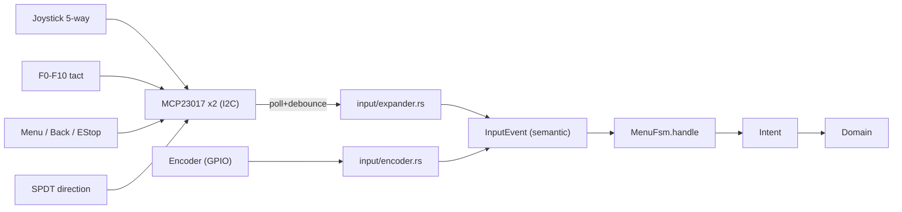
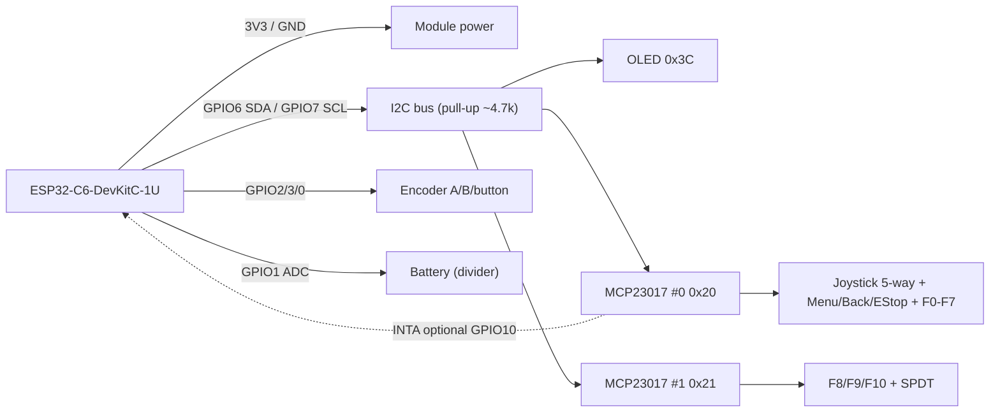

## Input model (new)

Encoder = speed (unchanged). All other functions via expander.

## Pin budget
Direct GPIO: I2C SDA/SCL (shared with OLED), ENC_A/B/BUTTON, BATTERY_ADC, WAKE, optionally EXP_INT (INTA/INTB). Expanders: MCP23017 has 16 I/O per chip, so ~20 inputs = 2x MCP23017 (32 lines, we use ~20). Addresses 0x20/0x21 (A0-A2 jumpers on Kamod IOEXP16 modules). OLED at 0x3C - no collision. Module power 3.3 V.

Line layout (example, 2x16=32, we use 20):
- Chip 0 (0x20), port A: Joy Up/Down/Left/Right/Ok, Menu, Back, EStop (8); port B: F0-F7 (8)
- Chip 1 (0x21), port A: F8, F9, F10, SPDT (4, rest free)

## Power, addresses, and wiring (ESP32-C6-DevKitC-1U)

### Note: power
- Power MCP23017 and OLED from **3V3** pin on DevKitC-1 (NOT 5V). MCP23017 operates 1.8-5.5V, but I2C levels must be 3.3 V - at 5V SDA/SCL lines would present 5V to ESP32-C6 GPIO and could damage it.
- Module GND common with board GND.
- Board power: USB-C (5V) -> onboard LDO 3V3. MCP23017 + OLED current is small, LDO sufficient.

### Note: I2C addresses (single bus)
- OLED SSD1306 = **0x3C**.
- MCP23017 #0: jumpers A2A1A0 = 000 -> **0x20**.
- MCP23017 #1: jumpers A2A1A0 = 001 (A0=1) -> **0x21**.
- No collision. On Kamod IOEXP16 modules address is set via A0-A2 jumpers/lugs.

### Note: I2C pull-ups and RESET
- SDA/SCL require pull-up to 3V3 (~4.7k). OLED module and MCP modules often have their own pull-ups - with 3 modules parallel resistance drops too low. Keep **one** pair (~2.2-4.7k), disconnect/desolder the rest.
- MCP23017 **RESET** pin (active-low) pull up to 3V3 (10k) - otherwise chip held in reset. Modules usually have this done or expose the pin.

### ESP32-C6-DevKitC-1U pins (replace placeholders in board.rs)
Safe, non-strapping GPIO (avoid 4,5,8,9,15 = strapping; 12,13 = USB-JTAG; 16,17 = UART0 console; 24-30 = flash).

- I2C SDA -> **GPIO6** (LP_I2C_SDA)
- I2C SCL -> **GPIO7** (LP_I2C_SCL)
- Encoder A -> **GPIO2**
- Encoder B -> **GPIO3**
- Encoder button -> **GPIO0** (LP_GPIO0 - can wake from deep sleep)
- Battery ADC -> **GPIO1** (ADC1_CH1)
- Deep sleep wake -> **GPIO0** (same as encoder button; as in original)
- MCP23017 INTA (optional, wire-OR both chips, open-drain + pull-up) -> **GPIO10**
- Free for future: GPIO11, GPIO18-23

### MCP23017 #0 map (0x20)
| Pin | Button |
|-----|--------|
| GPA0 | Joystick Up |
| GPA1 | Joystick Down |
| GPA2 | Joystick Left |
| GPA3 | Joystick Right |
| GPA4 | Joystick OK (center) |
| GPA5 | Menu |
| GPA6 | Back |
| GPA7 | EStop |
| GPB0..GPB7 | F0, F1, F2, F3, F4, F5, F6, F7 |

### MCP23017 #1 map (0x21)
| Pin | Button |
|-----|--------|
| GPA0 | F8 |
| GPA1 | F9 |
| GPA2 | F10 |
| GPA3 | SPDT direction |
| GPA4..GPA7, GPB0..GPB7 | free |

### Button wiring (active-low, GPPU pull-ups)
- Each tact switch: one leg -> corresponding GPxx expander input, other leg -> **GND**. Internal pull-up (GPPU=1) gives idle HIGH, press = LOW. No external resistors.
- **Joystick 5-way (6 pins)**: common COM -> GND; Up/Down/Left/Right/Push -> GPA0..GPA4 on chip #0.
- **F0-F10**: one leg each -> mapped input, other -> GND.
- **SPDT direction**: common pole (COM) -> GND; one throw (e.g. "Forward") -> GPA3 on #1. Forward position = input tied to GND (LOW); Reverse position = open -> pull-up HIGH. Driver reads level as `Direction`.
- **EStop**: leg -> GPA7 #0, other -> GND.

### Wiring diagram

## File changes

### 1. Shared I2C bus
Today [display.rs](longfred/crates/firmware/src/ui/display.rs) takes ownership of `I2c`. Must share bus with expanders:
- Add `embassy-embedded-hal` (`shared_bus::asynch::I2cDevice`) + `static Mutex<CriticalSectionRawMutex, I2c<Async>>`.
- [main.rs](longfred/crates/firmware/src/bin/main.rs): create bus once, pass `I2cDevice` to OLED and expander task.
- `display.rs`: `Display` type on `I2cDevice` instead of `I2c` directly.

### 2. Expander driver - new [input/expander.rs](longfred/crates/firmware/src/input/expander.rs)
- Minimal MCP23017 driver: configure `IODIRA/B=0xFF` (inputs) and `GPPUA/B=0xFF` (internal pull-ups ~100k), then read `GPIOA/B` via `write_read`. Inputs **active-low** (button ties to GND). No extra library.
- Async task: iterate over 2 addresses, poll every ~10 ms, debounce (2 stable reads), edge detection -> emit `InputEvent`.
- MCP23017 hardware pull-ups sufficient for tact switches to GND (no external resistors). Optional INTA/INTB can replace continuous polling.
- SPDT: read line level, on change -> `DirectionSet`; read initial state on startup.

### 3. Event contract [input/mod.rs](longfred/crates/firmware/src/input/mod.rs)
New `InputEvent`:
- `Nav(NavDir)` (Up/Down/Left/Right), `Ok`
- `Back`, `Menu`, `EStop`
- `FnPress(u8)` / `FnRelease(u8)` (0..=10)
- `DirectionSet(Direction)`
- `EncoderCw` / `EncoderCcw` / `EncoderButton` (unchanged)

Remove: [input/keypad.rs](longfred/crates/firmware/src/input/keypad.rs), [config/keypad.rs](longfred/crates/firmware/src/config/keypad.rs), `pub mod keypad` in [config/mod.rs](longfred/crates/firmware/src/config/mod.rs) and spawn in main. Encoder [input/encoder.rs](longfred/crates/firmware/src/input/encoder.rs) unchanged.

### 4. Configuration
- [config/board.rs](longfred/crates/firmware/src/config/board.rs): remove `KEYPAD_*`, add 2 MCP23017 addresses (0x20, 0x21) + map (address, port, bit)->logical button (per tables above). Update placeholder pins (classic ESP32) to real C6: I2C SDA=GPIO6, SCL=GPIO7, ENC A=GPIO2, B=GPIO3, button=GPIO0, battery ADC=GPIO1, wake=GPIO0, (opt.) INT=GPIO10.
- [config/buttons.rs](longfred/crates/firmware/src/config/buttons.rs): remove `default_action(char)`; add `FN_TO_DCC: [u8; 11]` (default 0..10), keep encoder options.
- New `config/keyboard.rs`: F0..F10 multitap tables (phone-style character groups, configurable) + numeric mode.

### 5. Text entry engine - new [ui/keyboard.rs](longfred/crates/firmware/src/ui/keyboard.rs)
Encapsulates pending character logic:
- `Nav Up/Down`: cycle pending character through full set.
- `FnPress(k)`: multitap - same key cycles group, different key commits previous and starts new.
- `Nav Right`: commit pending + new position. `Nav Left`/`Back`: backspace / cancel pending.
- `Ok`: commit pending + confirm entire field.
- Numeric variant (IP, Device ID, loco address): `FnPress(0..9)` = digit directly; Up/Down cycles digit.
Replaces today's `step_pw_char` / `pw_char` / `device_name_char` in [menu.rs](longfred/crates/firmware/src/ui/menu.rs).

### 6. Navigation rebuild [ui/menu.rs](longfred/crates/firmware/src/ui/menu.rs) (main work, ~1600 lines)
- Add `cursor: usize` to `MenuFsm`; list-nav helper (Up/Down + paging Left/Right, Ok=select, Back=exit).
- `handle` accepts semantic `InputEvent` instead of `char`; split today's `*_press(char)` into event handling.
- Global events (regardless of screen): `EStop`->`Action::EStop`, `DirectionSet(d)`->`Action::DirectionForward/Reverse`, `Menu`->open Menu, `FnPress/Release` on Throttle -> `Function`.
- List screens (Menu, Extras, Roster/Function/Turnout/Route, SsidScan, ServerList, ServerProto, Language, Device): cursor + Ok.
- Text screens (Password, ServerEntry, IpEdit, DeviceNameEdit, DeviceIdEdit) and address entry on Throttle: via `ui/keyboard.rs`.
- Encoder: speed on Throttle (as today); on text screens optionally cycle character (alias Up/Down).

### 7. View and hints
- [view.rs](longfred/crates/firmware/src/ui/view.rs)/[display.rs](longfred/crates/firmware/src/ui/display.rs): cursor highlight = `invert` row (GridView already supports this).
- [i18n.rs](longfred/crates/firmware/src/ui/i18n.rs): update hints (remove "0-9 # ..."), add joystick navigation labels (Nav/OK/Back/Menu) for EN/PL/DE.

### 8. SPDT direction in domain
- [domain/task.rs](longfred/crates/firmware/src/domain/task.rs): `DirectionSet(dir)` -> `change_direction` (absolute). On `AddLoco`/Throttle entry set direction per current SPDT position (cache in FSM/domain).
- [domain/state.rs](longfred/crates/firmware/src/domain/state.rs): direction logic unchanged (existing `change_direction`).

### 9. main.rs / deps
- [main.rs](longfred/crates/firmware/src/bin/main.rs): shared I2C, spawn `expander::task`, remove keypad.
- [Cargo.toml](longfred/crates/firmware/Cargo.toml): add `embassy-embedded-hal`.

## Out of scope
- Font change (still ASCII).
- Deep sleep wake via expander (remains WAKE_PIN / encoder).

## Verification
- `cargo test -p longfred-proto --target x86_64-unknown-linux-gnu`
- `cargo build -p longfred-firmware`
- Manual test: joystick navigation, F0-F9 multitap, SPDT direction, EStop.

## Default decisions (can change)
- Multitap without timeout: `Right` = next position (deterministic). Timeout as option later.
- F10 in text mode = space/caps toggle; on Throttle = DCC F10.
- Encoder button: kept as `SpeedStop` (optional).
