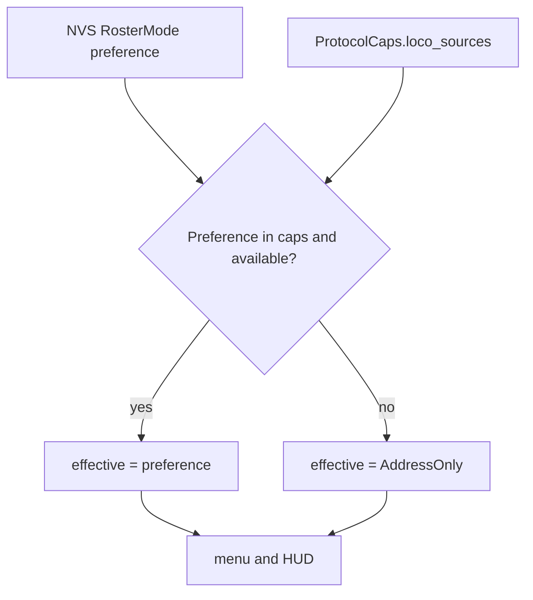
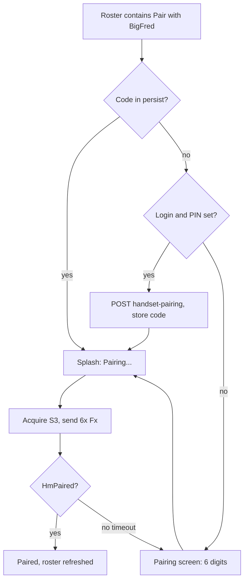

> **Status (2026-08-17):** Stages 1–10 described below are implemented.
> This file is the historical design for locomotive catalogues, protocol
> capabilities, and BigFred pairing. The live architecture reference is
> [ARCHITECTURE.md](../../ARCHITECTURE.md).

# LongFred architecture

This document describes the **target** architecture for locomotive handling,
protocol capabilities, and BigFred pairing. It is the living design for
implementation work; code that still matches the “today” notes is called out
explicitly.

Normative style follows [CODING-GUIDELINES.md](../../CODING-GUIDELINES.md):
heapless `no_std` core, static dispatch, no `if protocol == …` in UI or domain.

Related docs: [README.md](../../README.md), [docs/provisioning.md](../provisioning.md),
[z21_protocol_abstraction_17b86eaa.md](z21_protocol_abstraction_17b86eaa.md)
(the ClientCommand + Adapter enum already in the tree).

---

## 1. Where we are today

`Protocol` is a two-variant enum in
[`crates/proto/src/command.rs`](../../crates/proto/src/command.rs). Dispatch is an
`Adapter` enum with `match self` in
[`crates/proto/src/adapter.rs`](../../crates/proto/src/adapter.rs). There is no
capabilities type and no `ProtocolDriver` trait.

Protocol identity leaks into UI (`server_list`, `server_proto`, `server_entry`,
`diagnostics`) and firmware (`net/session.rs`, `net/mdns.rs`). Domain
[`crates/firmware/src/domain/state.rs`](../../crates/firmware/src/domain/state.rs)
already speaks `ClientCommand` / `ServerEvent` and **MUST** stay protocol-blind.

Locomotive lists have two sources and no contract:

- live WiThrottle roster (up to `MAX_ROSTER` = 70) from `ServerEvent::RosterEntry`;
- `persist.static_roster` (up to `MAX_SAVED_LOCOS` = 12), editable only via Soft-AP.

`RosterMode` (`Auto` / `Static`) is persisted under `TAG_ROSTER` but never read.
[`crates/ui/src/screens/roster.rs`](../../crates/ui/src/screens/roster.rs) guesses:
empty live roster → static roster.

Menu Left / Right on the drive HUD do nothing: `ThrottleScreen` does not
override `on_page`. Extra throttles (`max_throttles`, default 2, cap 6) are a
separate mechanism from the loco list.

`bigfred_login` and `bigfred_pin` are stored and exposed on Soft-AP, then never
sent on the wire. Firmware has no HTTP client and does not parse mDNS TXT
records.

---

## 2. Protocol capabilities

Ask “is this protocol capable of X?”, never “is this WiThrottle?”.

### 2.1 `ProtocolCaps`

New module `crates/proto/src/caps.rs`:

```rust
#[derive(Clone, Copy, Debug, PartialEq, Eq)]
pub struct ProtocolCaps {
    pub loco_sources: LocoSourceMask,
    pub steal: bool,
    pub heartbeat: bool,
    pub function_labels: bool,
    pub pairing: bool,
    pub transport: Transport,
    pub default_port: u16,
    pub mdns_service: &'static str,
}

#[derive(Clone, Copy, Debug, PartialEq, Eq)]
pub enum Transport {
    Tcp,
    Udp,
}

impl Protocol {
    pub const fn caps(self) -> ProtocolCaps { /* … */ }
}

impl ProtocolCaps {
    pub const fn supports_source(self, src: LocoSource) -> bool { /* bit test */ }
    pub const fn supports_pairing(self) -> bool { self.pairing }
    pub const fn supports_steal(self) -> bool { self.steal }
}
```

| Capability | Z21 | WiThrottle | BigFred |
|---|---|---|---|
| `ServerRoster` | no | yes | yes |
| `StaticRoster` | yes | yes | yes |
| `AddressOnly` | yes | yes | yes |
| steal | no | yes | yes |
| heartbeat | no | yes | yes |
| function labels | no | yes | yes |
| pairing | no | no | yes |
| transport | UDP | TCP | TCP |
| default port | 21105 | 12090 | 12090 |
| mDNS | `_z21._udp` | `_withrottle._tcp` | `_withrottle._tcp` |

Invariant, enforced by a host test: **every** protocol’s mask includes
`StaticRoster | AddressOnly`. Those catalogues are shared implementations, not
protocol features.

`Protocol` grows a third variant `BigFred`. Persist `as_u8` / `from_u8` maps
`0 = WiThrottle`, `1 = Z21`, `2 = BigFred`. Unknown values stay `None`.

### 2.2 `ProtocolDriver` and enum dispatch

`WtAdapter`, `Z21Adapter`, and `BigFredAdapter` implement a `ProtocolDriver`
trait whose methods match today’s `Adapter` surface (`on_connect`, `encode`,
`decode`, `on_tick`, `tick_period_s`, `set_heartbeat_period`) plus
`fn caps(&self) -> ProtocolCaps`.

`Adapter` remains an enum. Methods `match self` and forward. No `dyn`, no
`Box`. That is [CODING-GUIDELINES.md](../../CODING-GUIDELINES.md) §8.1 / §8.2: the
set is closed and small; static dispatch is required.

`BigFredAdapter` **composes** `WtAdapter` (owns one, delegates drive/roster
encode/decode) and adds pairing state. It does not inherit.

`crates/proto` **MUST NOT** open sockets. Network lives in firmware.

UI and domain consult `caps`, never `Protocol` identity, except at the two
boundaries that must pick a variant: adapter construction in
`net/session.rs` and protocol detection (section 5).

---

## 3. Locomotive catalogues

### 3.1 `LocoSource`

```rust
#[derive(Clone, Copy, Debug, PartialEq, Eq)]
pub enum LocoSource {
    /// Live roster pushed by the station.
    ServerRoster,
    /// `persist.static_roster` from programming / Soft-AP.
    StaticRoster,
    /// Manual DCC address; no list.
    AddressOnly,
}
```

`LocoSource` is not inferred from an empty vec. Preference is explicit
(section 3.3); effective source is resolved at connect (section 3.4).

### 3.2 `LocoCatalog`

One interface, three implementations:

```rust
pub struct LocoRef<'a> {
    pub name: &'a str,
    pub addr: &'a str, // "S42" / "L1234"
}

pub trait LocoCatalog {
    fn len(&self) -> usize;
    fn entry(&self, i: usize) -> Option<LocoRef<'_>>;
    fn allows_pick(&self) -> bool;
}
```

| Impl | Data | Protocol-specific? |
|---|---|---|
| `ServerCatalog` | domain live roster filled from `ServerEvent` | yes (adapter emits events) |
| `StaticCatalog` | `persist.static_roster` | **no — shared** |
| `AddressCatalog` | empty; `allows_pick() == false` | **no — shared** |

`StaticCatalog` and `AddressCatalog` **MUST** be a single implementation used
by every protocol. Z21 does not grow its own static-list code path.

The roster screen reads `LocoCatalog` only. The branch
`if cx.drive.roster.is_empty()` in `roster.rs` goes away. The screen does not
ask which protocol is connected and does not ask which source is active.

Acquire still ends as today:

- `ServerCatalog` → `Intent::AcquireRoster(i)` → `acquire_roster` → `AddLoco`;
- `StaticCatalog` → copy `addr` into the session → `Intent::AcquireAddr`;
- `AddressCatalog` → dedicated address editor → `Intent::AcquireAddr`.

`ClientCommand::AddLoco` / `SetSpeed` already address one throttle slot. The
wire always drives one locomotive at a time, matching BigFred / WiThrottle
`M{t}+…`.

### 3.3 Preferred source (global, persisted)

Preference is one device-wide setting, not per-server.

Reuse the existing `RosterMode` under `TAG_ROSTER` instead of adding a tag:

| `RosterMode` | u8 | means `LocoSource` |
|---|---|---|
| `Auto` (default) | 0 | `ServerRoster` |
| `Static` | 1 | `StaticRoster` |
| `AddressOnly` (new) | 2 | `AddressOnly` |

Existing NVS records keep their meaning; no migration. `from_u8` currently
rejects `2` — that is the only decoder change.

Soft-AP keeps the JSON key `roster_mode`. Allowed strings: `"auto"`,
`"static"`, `"address"`. Extras gains a row so the user can change preference
without entering Soft-AP.

### 3.4 Effective source at connect

Resolved once per session, after transport is up and the first roster burst
(or a timeout with an empty burst) has arrived:

1. If the preference is in `caps.loco_sources` **and** actually available →
   use it.
2. Otherwise → `AddressOnly`.

Availability:

- `ServerRoster`: live roster is non-empty;
- `StaticRoster`: `persist.static_roster` is non-empty;
- `AddressOnly`: always.

Fallback is **one step, always to `AddressOnly`**. It does not cascade through
`StaticRoster`. That is deliberate: behaviour stays predictable.

NVS preference is **not** overwritten by fallback. Only the session’s
effective source changes. Reconnecting to a station that can honour the
preference restores it.

Diagnostics show both values (preferred vs effective) so a silent fallback
cannot hide.



---

## 4. UI: menu, HUD, slots

### 4.1 Main menu

The menu is built from the **effective** source. It still has five rows so
digit shortcuts do not shift:

| Effective source | Row 2 (today: Locos) |
|---|---|
| `ServerRoster` or `StaticRoster` | Locos → `RosterList` |
| `AddressOnly` | Change DCC address → new `AddrEdit` screen |

The two labels are mutually exclusive. `AddrEdit` reuses `TextKeyboard` and
`Intent::AcquireAddr` (the HUD already has a five-digit keyboard when no loco
is acquired; the menu entry is the same path, reachable when a loco is already
on the slot).

### 4.2 Throttle slots vs list walk

Throttle slots (`max_throttles`, Extras “Throttles +/-”) stay a separate
mechanism. They are how many locos this handset holds at once.

Menu Left / Right on the HUD become list walk **inside the current slot**:

- `ThrottleScreen::on_page` emits `Intent::SelectLoco(PageDir)`.
- Firmware releases the loco on `current` and acquires the neighbour from the
  effective catalogue into **the same slot**.
- Each slot stores `list_idx: Option<usize>` so the walk has a cursor.
- Under `AddressOnly`, Left / Right are no-ops.

Switching slots (Direct “Next throttle”, hardware `LocoSlot`, Extras count)
does not change `list_idx` of other slots.

### 4.3 Diagnostics

A diagnostics page (or extra lines on an existing page) prints:

- protocol name (from caps / endpoint, not a raw enum dump in UI logic);
- preferred `LocoSource`;
- effective `LocoSource`.

---

## 5. Protocol detection

Detection runs **before** the drive session is configured. `crates/proto`
describes the probe; firmware executes it.

```rust
pub enum Probe {
    None,
    HttpGet {
        port: u16,
        path: &'static str,
        /// Substring that MUST appear in the HTTP body.
        expect: &'static str,
    },
}

impl Protocol {
    pub const fn probe(self) -> Probe {
        match self {
            Self::BigFred => Probe::HttpGet {
                port: 8080,
                path: "/api/v1/version",
                expect: "\"product\":\"bigfred\"",
            },
            Self::WiThrottle | Self::Z21 => Probe::None,
        }
    }
}
```

Firmware (`embassy-net`) issues `GET /api/v1/version` on TCP port 8080 of the
chosen IPv4. Order matters: **BigFred is a WiThrottle superset**, so probe
BigFred first. No match (timeout, non-200, missing substring) → stay
WiThrottle (or Z21 if the mDNS service was `_z21._udp`).

Recognition is a **substring search**. Protocol detection does **not** need a
JSON parser. Field extraction exists only for the pairing HTTP response
(section 6).

The substring is unambiguous because BigFred’s version payload grows a
constant `"product":"bigfred"` field (section 7.1). Do not key off
`buildCommit`: any HTTP server could emit that.

Degradation: a new handset against an old BigFred without `product` connects
as plain WiThrottle and loses pairing. It MUST NOT drop the WiThrottle
session.

mDNS stays `_withrottle._tcp` / `_z21._udp`. HTTP `_http._tcp` is optional
discovery of port 8080; the probe also tries 8080 on the WiThrottle host if
no HTTP advertisement is present.

---

## 6. BigFred pairing

Verified against the Go server:

- sentinel roster loco **`Pair with BigFred`**, default DCC address **3**
  (`S3`);
- six-digit code entered as six F0–F9 **ON** presses, **no confirm key**;
- pending code TTL **5 minutes** (Redis);
- success: release sentinel, re-burst real roster, `HmPaired as {userID}`;
- wrong / expired code: **no error line**, buffer cleared, sentinel stays.

`ClientCommand` gains `Pair { code: heapless::String<6> }`. Non-BigFred
adapters encode it as a no-op.

### 6.1 One state machine

Three ways to obtain a code, one `Pair { code }` and one pairing FSM inside
`BigFredAdapter`:



Expired-code path is **not** a second implementation. Sentinel still in the
roster means re-enter the same graph: stored code → splash → fail → HTTP
(if credentials) → manual screen. Do not duplicate the Fx sequence.

Handshake identity remains WiThrottle `N{name}` / `HU{id}` from
`DeviceIdentity`. The pairing code is **not** the user PIN.

Wire sequence after `Pair { code }`:

1. `AddLoco` sentinel `S3` (or configured pairing address if the station
   advertised one; default 3);
2. six `SetFunction { func: digit, on: true }` then off (momentary);
3. wait for `HmPaired` (surface as a `ServerEvent`); timeout → UI retry.

UI: splash “Pairing…” when a code is already known; `Pairing` screen
(digit keyboard, max length 6) when the user must type it. Firmware
interprets `Intent`s; the adapter owns the Fx timing.

---

## 7. Changes in BigFred (Go)

Both changes live in the `bigfred/` tree and exist to serve this handset.

### 7.1 `product` on `GET /api/v1/version`

[`pkgs/bigfred/server/version/version.go`](../../../bigfred/pkgs/bigfred/server/version/version.go)
`Info` gains:

```go
Product string `json:"product"`
```

`Get()` sets `Product: "bigfred"` in the initializer. The HTTP handler in
[`pkgs/bigfred/server/http/version.go`](../../../bigfred/pkgs/bigfred/server/http/version.go)
already encodes the whole struct — no handler change. `String()` used in
logs stays as-is. Existing web clients ignore unknown JSON fields.

### 7.2 Handset pairing endpoint

Today pairing is two authenticated calls:

1. `POST /api/v1/auth/login` → JWT cookie `bigfred_session`;
2. `POST /api/v1/layouts/{id}/command-stations/{csid}/remotes/{protocol}/pairing`.

`layoutId` and `commandStationId` exist only in mDNS TXT. That is too much
for a `no_std` client.

Add a **public** route next to `/auth/login` in
[`pkgs/bigfred/server/http/router.go`](../../../bigfred/pkgs/bigfred/server/http/router.go):

`POST /api/v1/remotes/handset-pairing`

Request:

```json
{ "login": "ops", "pin": "1234", "deviceId": "4242" }
```

Response **201**:

```json
{
  "pairingCode": "122145",
  "expiresAt": 1720000000000,
  "layoutId": 1,
  "commandStationId": 1
}
```

Implementation **MUST** call existing login verification and existing
`StartPairing` with `allowAllVehicles: true`. Do not reimplement code
generation.

Security (because the route skips the session middleware):

- rate-limit by IP and by login;
- audit-log success and failure;
- PIN never echoed;
- same PIN rules as login (digits, length 4–12).

`deviceId` is the WiThrottle `HU` id so the pending Redis session can be
keyed as `withrottle:<deviceId>` consistently with paired clients.

---

## 8. Global configuration

One table so NVS / Soft-AP / OLED stop drifting apart.

| Setting | NVS | Soft-AP JSON | OLED |
|---|---|---|---|
| Wi-Fi credentials | `TAG_CRED` | `wifi` | scan / password screens |
| Static IP | `TAG_NET` | (OLED wizard) | Extras → net config |
| Device name / id | `TAG_DEV` | `device` | Extras → Device |
| Language | `TAG_LANG` | — | Extras / boot wizard |
| Last server | `TAG_SERVER` | — | server list (implicit) |
| BigFred login | `TAG_BIGFRED` | `bigfred.login` | Soft-AP only today; keep |
| BigFred PIN | `TAG_BIGFRED` | `bigfred.pin` / `pin_set` | Soft-AP only today; keep |
| BigFred pairing code (new) | `TAG_BIGFRED` extra field | `bigfred.pairingCode` / `pairingCodeSet` | optional; splash uses it silently |
| Preferred loco source | `TAG_ROSTER` `RosterMode` | `roster_mode` | Extras (new row) |
| Static roster entries | `TAG_ROSTER` | `roster[]` | programming / Soft-AP only |

`bigfred_pairing_code` is an optional `heapless::String<6>` packed into the
existing `TAG_BIGFRED` record. Bump persist `VERSION` 4 → 5. Decoder stays
tolerant: missing trailing field → empty string (same tagged-record style as
today).

Firmware HTTP client (needed for probe + handset-pairing) lives in
`crates/firmware`, not in `longfred-ui` or `longfred-proto`
([CODING-GUIDELINES.md](../../CODING-GUIDELINES.md) §15.3). JSON field extraction
for the pairing response is a tiny dedicated parser (code, `expiresAt`);
the version probe remains a substring match.

---

## 9. Implementation roadmap

Each stage is a separate commit (or small PR). Do not skip the BigFred
`product` field past the probe stage.

1. **`ProtocolCaps` + `loco_sources` mask** — no behaviour change. Host test
   that every protocol includes `StaticRoster | AddressOnly`. Third
   `Protocol::BigFred` variant may land here or with stage 6.
2. **`LocoCatalog` trait** — `ServerCatalog` / `StaticCatalog` /
   `AddressCatalog`. Collapse the empty-roster branch in `roster.rs`.
3. **Preference on `TAG_ROSTER`** — `RosterMode::AddressOnly = 2`, connect-time
   resolution, one-step fallback to `AddressOnly` without writing NVS.
   Extras row + Soft-AP `"address"`. Diagnostics shows preferred vs effective.
4. **Dynamic menu + `AddrEdit`** — Locos vs Change DCC address from effective
   source; five rows, stable digit shortcuts.
5. **HUD Menu Left / Right** — `Intent::SelectLoco`, per-slot `list_idx`,
   release + acquire neighbour; no-op under `AddressOnly`.
6. **`BigFredAdapter` + manual pairing** — compose `WtAdapter`, `Pair`
   command, splash + digit screen, Fx sequence, `HmPaired`.
7. **Persist pairing code** — `TAG_BIGFRED` field, Soft-AP
   `pairingCode` / `pairingCodeSet`, silent splash path.
8. **`product` on BigFred `GET /api/v1/version`** — Go change; must precede
   stage 9.
9. **HTTP probe in firmware** — substring detect, BigFred before WiThrottle,
   graceful fallback to WiThrottle if `product` is absent.
10. **`POST /api/v1/remotes/handset-pairing`** — Go endpoint + firmware client;
    login/PIN path feeds the same `Pair { code }` machine as stages 6–7.

Stage 8 before 9 is mandatory. A handset that probes for `product` against a
server that does not yet send it will always classify as WiThrottle; that is
acceptable degradation, not a brick.

---

## 10. Non-goals (this design)

- Turnout / route commands (listed in the old Z21 plan, still absent from
  `ClientCommand`).
- OLED editor for the static roster (Soft-AP / programming mode stays the
  authoring UI).
- Replacing throttle slots with the loco list (slots remain).
- Parsing mDNS TXT for `layoutId` / `commandStationId` (the handset-pairing
  endpoint returns those).
- JSON parser in `longfred-proto`.
