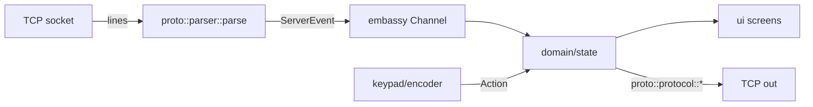

## LongFred — Stage 0 (bootstrap) + Stage 6 (WiThrottle protocol) — plan with diffs

Context: `longfred/` is a separate git repository (empty). `.tmp/WiTcontroller` (+ analysis of `WiThrottleProtocol` from the `master` branch) is the reference. Ecosystem in 2026: `esp-hal 1.1`, `esp-wifi`→`esp-radio 0.18`, `esp-hal-embassy`→`esp-rtos 0.3`, entry via `#[esp_rtos::main]`.

### Key architectural decision: workspace with 2 crates
To make the WiThrottle parser testable on the host (without hardware), we split:
- `crates/proto` — pure `no_std` + `heapless`, ZERO esp dependencies. Tests run with `cargo test` on the host. Stage 6 lands here.
- `crates/firmware` — embedded binary (esp-hal/esp-rtos/embassy). Stage 0 lands here.

esp configuration (riscv target, build-std, espflash runner) goes into `crates/firmware/.cargo/config.toml` (NOT the root), so the root and `proto` build for the host by default. `default-members = ["crates/proto"]` ensures `cargo test` at the root only touches the host-testable crate. Firmware is built/flashed from its directory.

Command flow (target):


---

## STAGE 0 — bootstrap + smoke test (embedded)

New files (full content in diffs section below):
- `longfred/Cargo.toml` — `[workspace]`, profiles, shared `edition=2024`.
- `longfred/rust-toolchain.toml` — stable + `rust-src` + target `riscv32imac-unknown-none-elf`.
- `longfred/.gitignore` — Rust/espflash artifacts (Cargo.lock REMAINS tracked).
- `longfred/crates/proto/Cargo.toml` + `src/lib.rs` — empty skeleton (filled in Stage 6), so the workspace compiles.
- `longfred/crates/firmware/Cargo.toml` — esp-hal 1.1, esp-rtos 0.3 (feature `embassy`), esp-bootloader-esp-idf, esp-println, esp-backtrace, embassy-executor 0.10, embassy-time 0.5, log.
- `longfred/crates/firmware/.cargo/config.toml` — target/build-std/espflash runner.
- `longfred/crates/firmware/src/bin/main.rs` — `#[esp_rtos::main]`, init esp-rtos+embassy, `heartbeat` task (smoke test).

DoD Stage 0: `cd crates/firmware && cargo run` starts on C6 and logs `tick N` every 1 s; `cargo test` at root passes (0 tests in proto for now).

Note on `.tmp/`: workspace root (`dcc-bigfred`) is NOT a git repository, and `.tmp/` lies outside `longfred/`, so it won't end up in any repo — no `.gitignore` entry needed. (If the root ever becomes a repo, add `/.tmp/` there.)

---

## STAGE 6 — WiThrottle protocol parser + builder (host-testable)

We fill in `crates/proto`. Files:
- `src/lib.rs` — `#![cfg_attr(not(test), no_std)]`, module declarations, re-exports.
- `src/model.rs` — value types + wire separator constants.
- `src/events.rs` — `enum ServerEvent` (equivalents of all `MyDelegate` callbacks).
- `src/parser.rs` — `parse(line, emit)` with 1:1 dispatch from `processCommand` (C++).
- `src/protocol.rs` — outgoing command builders → `heapless::String`.
- `tests/parser.rs`, `tests/protocol.rs` — tests on real frames.

### Wire format (confirmed from `WiThrottleProtocol` source @master)
Separators: `PROPERTY_SEPARATOR="<;>"`, `ENTRY_SEPARATOR="]\[".` (`"]\\["` in Rust), `SEGMENT_SEPARATOR="}|{"`.

Incoming dispatch (prefix → event):
- `VN…`→Version, `HT…`→ServerType, `Ht…`→ServerDescription, `HM…`→Alert, `Hm…`→Message, `PW…`→WebPort
- `PFT…`→FastTime (skip/emit Unknown initially), `PPA{0|1}`→TrackPower(Off/On)
- `*…`→HeartbeatConfig, 
- `RL…`→roster list, `PTL…`→turnout list, `PRL…`→route list
- `PTA{…}`→TurnoutAction, `PRA{…}`→RouteAction
- `M{t}A…`→loco action: after splitting on `{addr}<;>{action}`: `V`→Speed, `R{0|1}`→Direction (`R1`=Forward, `R0`=Reverse), `F{s}{n}`→FunctionState, `s`→SpeedSteps
- `M{t}L…`→RosterFunctionLabels (`]` → function entries)
- `M{t}+…`/`M{t}-…`→AddressAdded/Removed, `M{t}S…`→StealNeeded
- `AT+…` and the rest → Unknown

Lists: `RL{n}]\[{name}}|{{addr}}|{{len}]\[…` (3-part segments). Turnout/route analogous (`sysName}|{userName}|{state`).

Outgoing builders (confirmed):
- handshake: `N{deviceName}`, `HU{deviceId}`; quit `Q`; heartbeat `*`, enable `*+`/`*-`
- `M{t}+{addr}<;>{rosterName}` (add), `M{t}-{addr}<;>` (release), `M{t}S{addr}<;>{addr}` (steal)
- `M{t}A*<;>V{speed}` (speed), `M{t}A*<;>s{steps}` (speed steps)
- `M{t}A{addr}<;>R{0|1}` (direction; `addr="*"` = all)
- `M{t}A{addr}<;>{F|f}{1|0}{func}` (function; `f`=force)
- `M{t}A{addr}<;>X` (e-stop)
- `PPA{0|1}` (track power), `PTA{C|T|2}{sys}` (turnout: close/throw/toggle), `PRA2{sys}` (route)

### Parser design (stateless)
`pub fn parse(line: &str, emit: impl FnMut(ServerEvent))` — one line (no `\n`), lists call `emit` multiple times. Stateless: for loco actions we split on address/`<;>`/action; `addr=="*"`→`DirectionLead`, otherwise `DirectionLoco{addr}`. Domain layer (Stage 8) resolves lead/consist.

DoD Stage 6: `cargo test -p longfred-proto` (host) green — parser and builder verified on real frames (VN, PPA, MTA…V/R/F, RL/PTL/PRL, handshake, add/release/steal, speed/dir/func/estop, turnout/route).

---

## DIFFS — Stage 0 (full content of new files)

`longfred/Cargo.toml`:
```toml
[workspace]
resolver = "3"
members = ["crates/firmware", "crates/proto"]
default-members = ["crates/proto"]

[workspace.package]
edition = "2024"
rust-version = "1.95"
license = "Apache-2.0"

[profile.dev]
opt-level = "s"

[profile.release]
codegen-units = 1
debug = 2
lto = "fat"
opt-level = "s"
```

`longfred/rust-toolchain.toml`:
```toml
[toolchain]
channel = "stable"
components = ["rust-src"]
targets = ["riscv32imac-unknown-none-elf"]
```

`longfred/.gitignore`:
```gitignore
# Rust / Cargo
/target
**/target
*.rs.bk

# espflash / build artifacts
.embuild/
*.bin
*.elf

# logs / OS / editors
*.log
.DS_Store
.idea/
```

`longfred/crates/proto/Cargo.toml`:
```toml
[package]
name = "longfred-proto"
version = "0.1.0"
edition.workspace = true
rust-version.workspace = true

[dependencies]
heapless = "0.8"
```

`longfred/crates/proto/src/lib.rs` (skeleton, filled in Stage 6):
```rust
#![no_std]
//! LongFred WiThrottle protocol crate (parser + command builder).
//! Filled in Stage 6.
```

`longfred/crates/firmware/Cargo.toml`:
```toml
[package]
name = "longfred-firmware"
version = "0.1.0"
edition.workspace = true
rust-version.workspace = true

[[bin]]
name = "longfred"
path = "src/bin/main.rs"

[dependencies]
longfred-proto = { path = "../proto" }

esp-hal = { version = "1.1.0", features = ["esp32c6", "unstable", "log-04"] }
esp-rtos = { version = "0.3.0", features = ["embassy", "esp32c6", "log-04"] }
esp-bootloader-esp-idf = { version = "0.5.0", features = ["esp32c6", "log-04"] }
esp-println = { version = "0.17.0", features = ["esp32c6", "log-04"] }
esp-backtrace = { version = "0.19.0", features = ["esp32c6", "panic-handler", "println"] }

embassy-executor = { version = "0.10.0", features = ["log"] }
embassy-time = { version = "0.5.0", features = ["log"] }

log = "0.4"
static_cell = "2.1"
critical-section = "1.2"
```

`longfred/crates/firmware/.cargo/config.toml`:
```toml
[target.riscv32imac-unknown-none-elf]
runner = "espflash flash --monitor --chip esp32c6"

[build]
target = "riscv32imac-unknown-none-elf"
rustflags = ["-C", "force-frame-pointers"]

[unstable]
build-std = ["core"]
```

`longfred/crates/firmware/src/bin/main.rs`:
```rust
#![no_std]
#![no_main]

use embassy_executor::Spawner;
use embassy_time::{Duration, Timer};
use esp_hal::clock::CpuClock;
use esp_hal::timer::timg::TimerGroup;
use esp_backtrace as _;
use esp_println as _;
use log::info;

esp_bootloader_esp_idf::esp_app_desc!();

#[esp_rtos::main]
async fn main(spawner: Spawner) -> ! {
    esp_println::logger::init_logger_from_env();

    let config = esp_hal::Config::default().with_cpu_clock(CpuClock::max());
    let peripherals = esp_hal::init(config);

    let timg0 = TimerGroup::new(peripherals.TIMG0);
    let sw_int = esp_hal::interrupt::software::SoftwareInterruptControl::new(
        peripherals.SW_INTERRUPT,
    );
    esp_rtos::start(timg0.timer0, sw_int.software_interrupt0);

    info!("LongFred boot: esp-rtos + embassy OK");
    spawner.spawn(heartbeat()).ok();

    loop {
        Timer::after(Duration::from_secs(5)).await;
        info!("main alive");
    }
}

#[embassy_executor::task]
async fn heartbeat() {
    let mut n: u32 = 0;
    loop {
        info!("tick {}", n);
        n = n.wrapping_add(1);
        Timer::after(Duration::from_millis(1000)).await;
    }
}
```

---

## DIFFS — Stage 6 (full content / proto file skeletons)

`crates/proto/src/lib.rs` (replaces Stage 0 skeleton):
```rust
#![cfg_attr(not(test), no_std)]
//! LongFred WiThrottle protocol: wire parser + command builder (pure, host-testable).

pub mod model;
pub mod events;
pub mod parser;
pub mod protocol;

pub use events::ServerEvent;
pub use model::{Direction, RouteState, TrackPower, TurnoutState};
```

`crates/proto/src/model.rs`:
```rust
pub const MAX_THROTTLES: usize = 6;
pub const MAX_FUNCTIONS: usize = 32;

pub const PROPERTY_SEPARATOR: &str = "<;>";
pub const ENTRY_SEPARATOR: &str = "]\\[";
pub const SEGMENT_SEPARATOR: &str = "}|{";

pub type LocoAddr = heapless::String<12>;
pub type ShortText = heapless::String<32>;
pub type LongText = heapless::String<64>;

#[derive(Debug, Clone, Copy, PartialEq, Eq)]
pub enum Direction { Reverse, Forward }

impl Direction {
    pub fn from_wire(c: char) -> Self {
        if c == '0' { Direction::Reverse } else { Direction::Forward }
    }
    pub fn to_wire(self) -> char {
        match self { Direction::Reverse => '0', Direction::Forward => '1' }
    }
}

#[derive(Debug, Clone, Copy, PartialEq, Eq)]
pub enum TrackPower { Off, On, Unknown }

impl TrackPower {
    pub fn from_wire(c: char) -> Self {
        match c { '0' => TrackPower::Off, '1' => TrackPower::On, _ => TrackPower::Unknown }
    }
}

#[derive(Debug, Clone, Copy, PartialEq, Eq)]
pub enum TurnoutState { Closed, Thrown, Unknown, Inconsistent }

#[derive(Debug, Clone, Copy, PartialEq, Eq)]
pub enum RouteState { Active, Inactive, Inconsistent, Unknown }
```

`crates/proto/src/events.rs` (events = delegate callbacks):
```rust
use crate::model::*;

#[derive(Debug, Clone, PartialEq, Eq)]
pub enum ServerEvent {
    HeartbeatConfig { seconds: u32 },
    Version(ShortText),
    ServerType(ShortText),
    ServerDescription(LongText),
    Message(LongText),
    Alert(LongText),
    WebPort(u16),
    TrackPower(TrackPower),

    Speed { throttle: char, speed: u8 },
    DirectionLead { throttle: char, dir: Direction },
    DirectionLoco { throttle: char, addr: LocoAddr, dir: Direction },
    FunctionState { throttle: char, func: u8, on: bool },
    // Large variant (32×ShortText) — passed on stack in emit; consider per-label sink.
    RosterFunctionLabels { throttle: char, labels: [ShortText; MAX_FUNCTIONS] },

    RosterEntriesCount(u16),
    RosterEntry { index: u16, name: ShortText, address: i32, length: char },
    TurnoutEntriesCount(u16),
    TurnoutEntry { index: u16, sys_name: ShortText, user_name: ShortText, state: i32 },
    RouteEntriesCount(u16),
    RouteEntry { index: u16, sys_name: ShortText, user_name: ShortText, state: i32 },

    TurnoutAction { sys_name: ShortText, state: TurnoutState },
    RouteAction { sys_name: ShortText, state: RouteState },

    AddressAdded { throttle: char, addr: LocoAddr, entry: LongText },
    AddressRemoved { throttle: char, addr: LocoAddr, entry: LongText },
    StealNeeded { throttle: char, addr: LocoAddr, entry: LongText },

    Unknown(LongText),
}
```

`crates/proto/src/parser.rs` (1:1 dispatch from `processCommand`; core + representative processors below, rest analogous per `.tmp`/`WiThrottleProtocol.cpp`):
```rust
use crate::events::ServerEvent;
use crate::model::*;

/// Parses one line (no CR/LF). Lists call `emit` multiple times.
pub fn parse(line: &str, mut emit: impl FnMut(ServerEvent)) {
    let b = line.as_bytes();
    let len = b.len();
    match () {
        _ if starts(line, "VN")  => emit(ServerEvent::Version(short(&line[2..]))),
        _ if starts(line, "HT")  => emit(ServerEvent::ServerType(short(&line[2..]))),
        _ if starts(line, "Ht")  => emit(ServerEvent::ServerDescription(long(&line[2..]))),
        _ if starts(line, "HM")  => emit(ServerEvent::Alert(long(&line[2..]))),
        _ if starts(line, "Hm")  => emit(ServerEvent::Message(long(&line[2..]))),
        _ if starts(line, "PPA") && len > 3 =>
            emit(ServerEvent::TrackPower(TrackPower::from_wire(b[3] as char))),
        _ if starts(line, "*")   => parse_heartbeat(&line[1..], &mut emit),
        _ if starts(line, "RL")  => parse_roster_list(&line[2..], &mut emit),
        _ if starts(line, "PTL") => parse_turnout_list(&line[3..], &mut emit),
        _ if starts(line, "PRL") => parse_route_list(&line[3..], &mut emit),
        _ if starts(line, "PTA") => parse_turnout_action(&line[3..], &mut emit),
        _ if starts(line, "PRA") => parse_route_action(&line[3..], &mut emit),
        _ if len > 2 && b[0] == b'M' && b[2] == b'A' =>
            parse_loco_action(b[1] as char, &line[3..], &mut emit),
        _ if len > 2 && b[0] == b'M' && b[2] == b'L' =>
            parse_fn_labels(b[1] as char, &line[3..], &mut emit),
        _ if len > 2 && b[0] == b'M' && (b[2] == b'+' || b[2] == b'-') =>
            parse_add_remove(b[1] as char, &line[2..], &mut emit),
        _ if len > 2 && b[0] == b'M' && b[2] == b'S' =>
            parse_steal(b[1] as char, &line[3..], &mut emit),
        _ => emit(ServerEvent::Unknown(long(line))),
    }
}

// MTA:  "{addr}<;>{action...}"  (V/R/F/s)
fn parse_loco_action(throttle: char, s: &str, emit: &mut impl FnMut(ServerEvent)) {
    let Some(sep) = s.find(PROPERTY_SEPARATOR) else { return };
    let addr = &s[..sep];
    let act = &s[sep + PROPERTY_SEPARATOR.len()..];
    let Some(k) = act.chars().next() else { return };
    match k {
        'V' => if let Ok(v) = act[1..].parse::<u8>() {
            emit(ServerEvent::Speed { throttle, speed: v });
        },
        'R' => {
            let dir = Direction::from_wire(act.as_bytes().get(1).copied().unwrap_or(b'1') as char);
            if addr == "*" { emit(ServerEvent::DirectionLead { throttle, dir }); }
            else { emit(ServerEvent::DirectionLoco { throttle, addr: loco(addr), dir }); }
        }
        'F' => {
            let on = act.as_bytes().get(1) == Some(&b'1');
            if let Ok(f) = act[2..].parse::<u8>() {
                emit(ServerEvent::FunctionState { throttle, func: f, on });
            }
        }
        _ => {}
    }
}
// parse_roster_list/parse_turnout_list/parse_route_list: split on ENTRY_SEPARATOR,
//   each entry split on SEGMENT_SEPARATOR (3 segments), emit *EntriesCount + *Entry.
// helpers: starts(), short()/long()/loco() = truncating heapless::String::from.
```

`crates/proto/src/protocol.rs` (builders):
```rust
use crate::model::*;

pub type Cmd = heapless::String<64>;

fn cmd(parts: &[&str]) -> Cmd {
    let mut s = Cmd::new();
    for p in parts { let _ = s.push_str(p); }
    s
}

pub fn handshake_name(name: &str) -> Cmd { cmd(&["N", name]) }
pub fn handshake_id(id: &str) -> Cmd { cmd(&["HU", id]) }
pub fn quit() -> Cmd { cmd(&["Q"]) }
pub fn heartbeat() -> Cmd { cmd(&["*"]) }
pub fn heartbeat_enable(on: bool) -> Cmd { cmd(&["*", if on {"+"} else {"-"}]) }

pub fn add_loco(t: char, addr: &str, roster: &str) -> Cmd {
    let mut s = Cmd::new();
    let _ = s.push('M'); let _ = s.push(t); let _ = s.push('+');
    let _ = s.push_str(addr); let _ = s.push_str(PROPERTY_SEPARATOR); let _ = s.push_str(roster);
    s
}
pub fn set_speed(t: char, speed: u8) -> Cmd {
    let mut n = heapless::String::<3>::new();
    let _ = core::fmt::Write::write_fmt(&mut n, format_args!("{speed}"));
    let mut s = Cmd::new();
    let _ = s.push('M'); let _ = s.push(t);
    let _ = s.push_str("A*"); let _ = s.push_str(PROPERTY_SEPARATOR);
    let _ = s.push('V'); let _ = s.push_str(&n);
    s
}
pub fn set_direction(t: char, addr: &str, dir: Direction) -> Cmd { /* M{t}A{addr}<;>R{0|1} */ todo!() }
pub fn set_function(t: char, addr: &str, func: u8, pressed: bool, force: bool) -> Cmd { /* <;>{F|f}{1|0}{func} */ todo!() }
pub fn estop(t: char, addr: &str) -> Cmd { /* M{t}A{addr}<;>X */ todo!() }
pub fn track_power(on: bool) -> Cmd { cmd(&["PPA", if on {"1"} else {"0"}]) }
pub fn turnout(action: char, sys: &str) -> Cmd { cmd(&["PTA", &action.to_string_hack(), sys]) } // C/T/2
pub fn route(sys: &str) -> Cmd { cmd(&["PRA2", sys]) }
```

`crates/proto/tests/parser.rs` (host; real frames):
```rust
use longfred_proto::{parser::parse, ServerEvent, model::{Direction, TrackPower}};

fn collect(line: &str) -> Vec<ServerEvent> {
    let mut v = Vec::new();
    parse(line, |e| v.push(e));
    v
}

#[test] fn version()  { assert!(matches!(collect("VN2.0")[0], ServerEvent::Version(_))); }
#[test] fn power_on() { assert_eq!(collect("PPA1")[0], ServerEvent::TrackPower(TrackPower::On)); }
#[test] fn speed()    { assert_eq!(collect("MTAL341<;>V63")[0], ServerEvent::Speed{throttle:'T', speed:63}); }
#[test] fn dir_rev()  { assert_eq!(collect("MTA*<;>R0")[0], ServerEvent::DirectionLead{throttle:'T', dir:Direction::Reverse}); }
#[test] fn func_on()  { assert_eq!(collect("MTAL341<;>F18")[0], ServerEvent::FunctionState{throttle:'T', func:8, on:true}); }
// roster: "RL2]\\[Big Boy}|{4014}|{L]\\[Shay}|{12}|{S" → Count(2)+2×RosterEntry
```

`crates/proto/tests/protocol.rs`:
```rust
use longfred_proto::protocol as p;
#[test] fn speed()  { assert_eq!(p::set_speed('T', 63).as_str(), "MTA*<;>V63"); }
#[test] fn power()  { assert_eq!(p::track_power(true).as_str(), "PPA1"); }
#[test] fn add()    { assert_eq!(p::add_loco('T', "L341", "Big Boy").as_str(), "MTA... "); /* MT+L341<;>Big Boy */ }
```

Note: fragments with `todo!()`/`to_string_hack()` are intentional shortcuts in the plan — full implementation during realization, directly per `WiThrottleProtocol.cpp`. Eventually no `format_args!` on hot paths (custom int→str), but in Stage 6 correctness + tests are the priority.

### Verification
- Stage 0: `cd longfred/crates/firmware && cargo run` (flash+monitor), observe `tick N` logs.
- Stage 6: `cd longfred && cargo test -p longfred-proto` (host) — all tests green.
- `cargo build` in `longfred/` (host, default-members=proto) does not build firmware (avoids missing-target errors on host).
