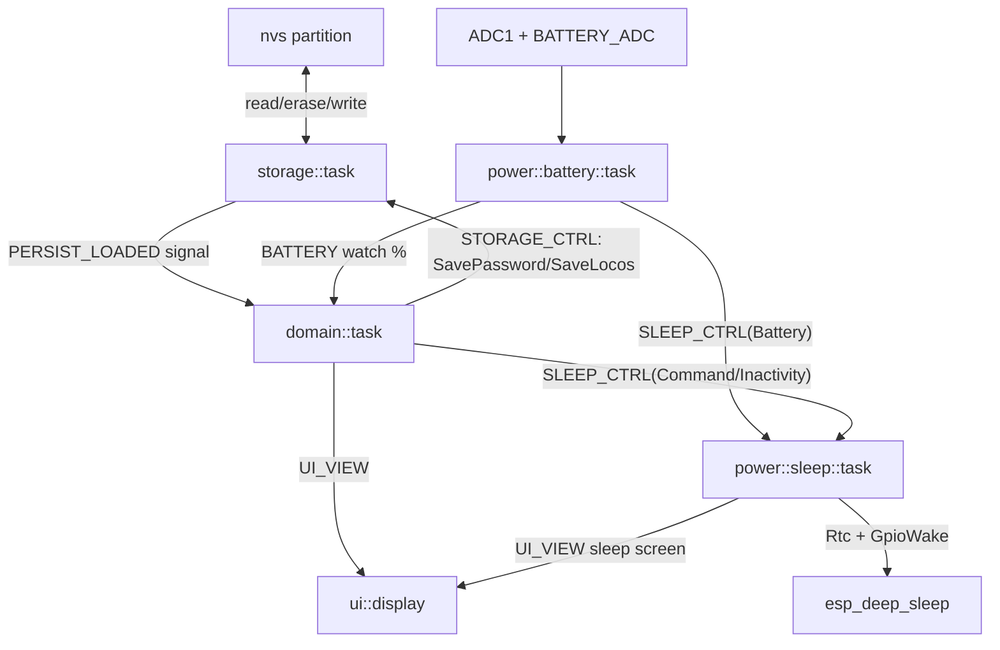

# Stage 10 - Persistence (NVS), battery, and deep sleep

## Goal and DoD
Replicate "Stage 10" features from the original WiTcontroller:
- **NVS**: save WiFi password after manual entry (after `#`), auto-fill password for known SSID (skips Password screen).
- **Save/Restore Locos**: Extras `*9 9#` (Save Locos) saves consists; after server connection locos are auto-reacquired.
- **Battery**: ADC + 3.2-4.2V table -> %, icon + optional `%` in top-right corner of throttle screen, `ShowHideBattery` action cycles mode.
- **Sleep**: deep sleep (`Rtc` + GPIO wake), manual `SLEEP`, auto-off after 4 min inactivity (when not connected to server), sleep on critical battery.

DoD: `cargo build` (riscv32imac) + `cargo test -p longfred-proto` (new host tests `persist` roundtrip). On hardware: password remembered between sessions, locos restored, battery icon, wake by button.

## Decisions (confirmed)
- **Flash backend**: custom fixed-layout record in one sector of `nvs` partition, via `esp-storage` `FlashStorage` + `esp_bootloader_esp_idf::partitions` (no `sequential-storage`).
- **Battery + sleep**: full implementation now. Wake pin must be LP/RTC-capable (`GPIO0..7` on ESP32-C6) - choosing `board::WAKE_PIN = 4` (placeholder for Stage 11; current encoder button `GPIO13` is NOT LP-capable).

## Architecture (data flow)


## Diff 1 - `crates/proto/src/persist.rs` (new, host-testable)
Clean record serialization (magic + version + TLV + crc32). Firmware only reads/writes bytes.
```rust
pub const MAGIC: u32 = 0x4C46_5031; // "LFP1"
pub const MAX_CREDENTIALS: usize = 8;
pub const MAX_SAVED_LOCOS: usize = 12;

#[derive(Clone, PartialEq, Eq)]
pub struct Credential { pub ssid: heapless::String<32>, pub password: heapless::String<64> }

#[derive(Clone, PartialEq, Eq)]
pub struct SavedLoco { pub throttle: u8, pub slot: u8, pub addr: heapless::String<8> } // e.g. "S1234"

#[derive(Clone, PartialEq, Eq, Default)]
pub struct PersistRecord {
    pub credentials: heapless::Vec<Credential, MAX_CREDENTIALS>,
    pub locos: heapless::Vec<SavedLoco, MAX_SAVED_LOCOS>,
}

impl PersistRecord {
    pub fn find_password(&self, ssid: &str) -> Option<&str>;
    pub fn set_password(&mut self, ssid: &str, pw: &str); // replace or push with eviction of oldest
    pub fn encode(&self, buf: &mut [u8]) -> Option<usize>; // magic,u16,u16 counts, TLV, crc32 at end
    pub fn decode(buf: &[u8]) -> Option<Self>;             // verifies magic + crc, otherwise None
}

pub fn crc32(data: &[u8]) -> u32; // minimal implementation (tab-less)
```
Host tests (`#[cfg(test)]`): roundtrip `encode`->`decode`, `set_password` replace/eviction, `decode` on garbage/truncated buffer -> `None`. Export in [crates/proto/src/lib.rs](crates/proto/src/lib.rs) alongside `menu`.

## Diff 2 - `crates/firmware/src/storage/mod.rs` (rewrite from stub)
Task with its own `FlashStorage`; locates `nvs` partition, holds record in RAM, writes one sector.
```rust
use esp_storage::FlashStorage;
use esp_bootloader_esp_idf::partitions::{read_partition_table, PartitionType, DataPartitionSubType};
use longfred_proto::persist::{PersistRecord, SavedLoco};

pub static PERSIST_LOADED: Signal<CriticalSectionRawMutex, PersistRecord> = Signal::new();

pub enum StorageCmd {
    SavePassword { ssid: String<32>, password: String<64> },
    SaveLocos(heapless::Vec<SavedLoco, { persist::MAX_SAVED_LOCOS }>),
    Clear,
}
pub static STORAGE_CTRL: Channel<CriticalSectionRawMutex, StorageCmd, 4> = Channel::new();

const SECTOR: usize = 4096;

#[embassy_executor::task]
pub async fn task() {
    let mut flash = FlashStorage::new();
    let mut rec = load(&mut flash).unwrap_or_default();
    PERSIST_LOADED.signal(rec.clone());
    let rx = STORAGE_CTRL.receiver();
    loop {
        match rx.receive().await {
            StorageCmd::SavePassword { ssid, password } => { rec.set_password(&ssid, &password); persist(&mut flash, &rec); }
            StorageCmd::SaveLocos(locos) => { rec.locos = locos; persist(&mut flash, &rec); }
            StorageCmd::Clear => { rec = PersistRecord::default(); persist(&mut flash, &rec); }
        }
    }
}
// load/persist: read_partition_table -> find_partition(Data(Nvs)) -> as_embedded_storage(&mut flash)
//   -> region.read(0, sector), decode; on write: encode, region.erase(0, SECTOR), region.write(0, buf)
```
Note/trade-off: flash operations are blocking (~10-40 ms per sector) in dedicated task - acceptable, but block executor during write (rare events).

## Diff 3 - WiFi passwords (precedence + save)
- [crates/firmware/src/domain/state.rs](crates/firmware/src/domain/state.rs): add `pub credentials: PersistRecord` to `DomainState` (set from `PERSIST_LOADED`).
- [crates/firmware/src/ui/menu.rs](crates/firmware/src/ui/menu.rs) `ssid_scan_press`: accept `domain: &DomainState`; if `domain.credentials.find_password(scanned_ssid).is_some()` (or SSID in `config::network::NETWORKS`) -> `Screen::Connecting` + `Intent::WifiConnect`; else `Screen::Password`.
- `ssid_for_connect`: add fallback to `domain.credentials.find_password(ssid)` for scan entries.
- Save: FSM stores `pending_save: Option<(ssid, pw)>` on `#` in `Password`; [crates/firmware/src/domain/task.rs](crates/firmware/src/domain/task.rs) after `NetStatus::Ready` sends `StorageCmd::SavePassword` and clears `pending_save`.

## Diff 4 - Save / Restore Locos
- [crates/firmware/src/domain/state.rs](crates/firmware/src/domain/state.rs): `saved_locos(&self) -> Vec<SavedLoco, N>` (from `throttles[i].consist`), `restore_locos(&mut self, rec: &PersistRecord, out)` (per throttle `protocol::add_loco`).
- [crates/firmware/src/ui/menu.rs](crates/firmware/src/ui/menu.rs) `extras_press`: `b'9' => Intent::SaveLocos` (and label "9 Save Locos" in `build_grid` Extras).
- New `Intent::SaveLocos` variant + handling in `interpret`: `state.saved_locos()` -> `STORAGE_CTRL.send(SaveLocos(...))`.
- Restore: in `domain::task` on `WitConnState::Connected`, when `config::network::RESTORE_ACQUIRED_LOCOS` and `!restored_this_session` -> `state.restore_locos(&state.credentials, &mut out)` + flush; reset flag on disconnect.

## Diff 5 - Battery (ADC + UI)
- [crates/firmware/src/config/power.rs](crates/firmware/src/config/power.rs) (new): `USE_BATTERY_TEST: bool`, `BATTERY_CONVERSION_FACTOR: f32`, `USE_BATTERY_PERCENT_WITH_ICON: bool`, `USE_BATTERY_SLEEP_AT_PERCENT: u8` (0=off), `BATTERY_POLL_S: u64 = 10`, `ADC_READS: usize = 20`.
- [crates/firmware/src/power/battery.rs](crates/firmware/src/power/battery.rs) (new): `task(adc: ADC1, pin)` - every `BATTERY_POLL_S` averages `read_oneshot`, `volts = raw * factor / 1000`, `percent = lookup(volts)` (3.2-4.2V table, like Pangodream). Publishes `pub static BATTERY: Watch<_, Option<u8>, 2>`. If `percent < USE_BATTERY_SLEEP_AT_PERCENT` -> `SLEEP_CTRL.signal(SleepReason::Battery)`.
- [crates/firmware/src/ui/view.rs](crates/firmware/src/ui/view.rs): `ThrottleView` + `battery: Option<u8>`, `battery_show_percent: bool`; `ViewCtx` + `battery: Option<u8>`.
- [crates/firmware/src/ui/menu.rs](crates/firmware/src/ui/menu.rs): `battery_mode: BatteryMode {None,Icon,IconPercent}` in `MenuFsm`; `cycle_battery_mode()`; `build_throttle` fills fields from `ctx.battery` per mode.
- `Action::ShowHideBattery`: intercept in `interpret` (`domain::task`) -> `fsm.cycle_battery_mode()` (instead of `state.apply_action`, which returns false).
- [crates/firmware/src/ui/display.rs](crates/firmware/src/ui/display.rs) `draw_throttle`: battery icon (frame + bars >10/25/50/75/90%) in corner `x~112,y=2`, optional `NN%`.

## Diff 6 - Deep sleep + auto-off
- [crates/firmware/src/config/power.rs](crates/firmware/src/config/power.rs): `AUTO_SLEEP_INACTIVITY_MS: u64 = 240_000`, `SLEEP_SCREEN_DELAY_MS: u64 = 2_000`.
- [crates/firmware/src/config/board.rs](crates/firmware/src/config/board.rs): `WAKE_PIN: Gpio = 4` (LP-capable; comment about Stage 11), adjust `BATTERY_ADC` to ADC1 pin.
- [crates/firmware/src/power/sleep.rs](crates/firmware/src/power/sleep.rs) (new): `enum SleepReason { Command, Inactivity, Battery }`, `pub static SLEEP_CTRL: Signal<_, SleepReason>`. `task(rtc_periph, wake_pin)`: on signal builds sleep screen (sends `GridView` to `UI_VIEW` with `MSG_START_SLEEP`/reason), `Timer::after(delay)`, then `Rtc::new(LPWR)` + `Ext1WakeupSource`/`GpioWakeupSource` (esp32c6) on `WAKE_PIN` (Low level) and `rtc.sleep_deep(&[&wake])`.
- [crates/firmware/src/domain/task.rs](crates/firmware/src/domain/task.rs): `last_activity: Instant` (reset on each `InputEvent` and on `WitConnState::Connected`); in timeout branch, when `wit_conn != Connected` and `elapsed > AUTO_SLEEP_INACTIVITY_MS` -> `SLEEP_CTRL.signal(Inactivity)`. `Intent::Sleep` -> `SLEEP_CTRL.signal(Command)` (instead of current `show_message`).
- Texts in [crates/firmware/src/ui/i18n.rs](crates/firmware/src/ui/i18n.rs): `MSG_START_SLEEP`, `MSG_AUTO_SLEEP`, `MSG_BATTERY_SLEEP`.

## Diff 7 - main.rs + config + dependencies
- [crates/firmware/Cargo.toml](crates/firmware/Cargo.toml): add `esp-storage` (feature `esp32c6`) compatible with esp-hal 1.1; `esp-hal` ADC feature already via `unstable`.
- [crates/firmware/src/bin/main.rs](crates/firmware/src/bin/main.rs): spawn `storage::task()`, `power::battery::task(peripherals.ADC1, peripherals.GPIOx)`, `power::sleep::task(peripherals.LPWR, peripherals.GPIO4)`. `ADC1`/`LPWR`/`GPIO1`/`GPIO4` are free (typed peripherals passed from main, not via `AnyPin::steal`).
- [crates/firmware/src/config/mod.rs](crates/firmware/src/config/mod.rs): `pub mod power;`
- [crates/firmware/src/config/network.rs](crates/firmware/src/config/network.rs): `RESTORE_ACQUIRED_LOCOS: bool = true`.
- [crates/firmware/src/power/mod.rs](crates/firmware/src/power/mod.rs): `pub mod battery; pub mod sleep;`

## Notes / trade-offs
- **Wake pin**: `GPIO4` (LP) - in Stage 11 must reconcile with physical button (or move encoder button to LP GPIO).
- **Flash blocking**: writes rare; dedicated task minimizes impact.
- **ADC pin/factor**: placeholders for hardware calibration (Stage 11).
- **No `sequential-storage`**: no wear-leveling, but record is small and written rarely (1 sector).
- **Restore vs roster**: restore on `Connected` (don't wait for full roster, like "rosterSize==0" variant in original).

## Verification
- `cargo build` in `crates/firmware` (riscv32imac).
- `cargo test -p longfred-proto` (new `persist` tests: roundtrip, eviction, decode-None).
- Hardware: password remembered after restart; `*9 9#` save loco -> after reconnect auto-acquire; battery icon + `ShowHideBattery`; `*9 7#`/SLEEP -> screen + deep sleep; wake on `WAKE_PIN` Low.
