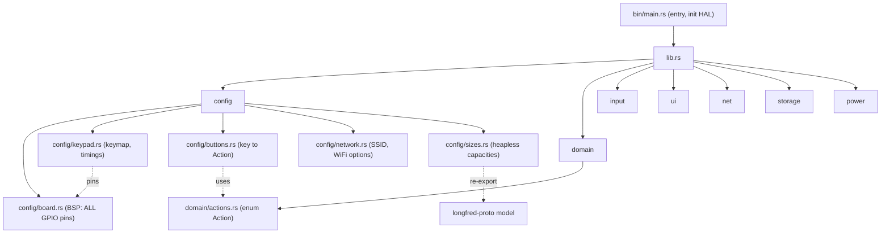
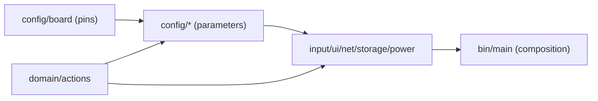

# LongFred — Stage 1: application skeleton and configuration

Context: Stage 0 (bootstrap) and Stage 6 (`longfred-proto`) are done. Now we build the application skeleton in [crates/firmware](crates/firmware) per section 3 of the main plan [longfred/docs/2026-07-14-plan-przepisania-rust.md](longfred/docs/2026-07-14-plan-przepisania-rust.md). Stage 1 is ONLY structure + compile-time configuration + `Action` — no hardware logic (that's Stages 2+).

## Architectural concept

### 1. Lib + bin layout (key decision)
Currently firmware has only [src/bin/main.rs](crates/firmware/src/bin/main.rs). Modules placed next to `main.rs` in `src/bin/` would be awkward. Instead we create `src/lib.rs` (library crate `longfred_firmware`) with the full module structure, and `main.rs` becomes a thin entry-point that uses it. Benefits:
- modules in standard `src/`, clean hierarchy,
- ability to `cargo test`/`cargo check` the library independently of the binary,
- `esp_app_desc!`, panic handler and HAL init stay only in `main.rs`.

No changes needed in [Cargo.toml](crates/firmware/Cargo.toml) — `src/lib.rs` is auto-detected, lib name is `longfred_firmware`, `[[bin]]` already points to `src/bin/main.rs`.

### 2. Configuration as compile-time data
Equivalents of `config_*.h` (`#define`) → `config/` module with `const`/`static`. No macros, no runtime parsing. Pins as `u8` (raw GPIO numbers) — NOT yet bound to `esp-hal` peripherals (that's Stage 2 and C6 tuning in Stage 11).

### 3. Single source of truth for sizes
`MAX_THROTTLES` and `MAX_FUNCTIONS` already exist in [crates/proto/src/model.rs](crates/proto/src/model.rs). `config/sizes.rs` re-exports them from proto, adding only firmware-specific sizes (roster, turnouts, routes, SSID) — no duplication of protocol constants.

### 4. Event-driven (channel preparation)
We introduce `input::InputEvent` as a data type (skeleton), because it is the foundation of the architecture from the plan diagram (`input → domain`). Drivers and tasks are Stage 2, but we define the event type now to establish the contract.

### 5. Network secrets
In the original, `config_network.h` (with passwords) is gitignored, and `config_network_example.h` is tracked. Mapping: `config/network.rs` with placeholder values (tracked), with a TODO comment about real data. No committing real passwords.

### 6. Central pinout / BSP (single place for pin numbers)
All physical GPIO pin numbers of the board go into ONE module [config/board.rs](crates/firmware/src/config/board.rs) (Board Support Package). This is the only place you change when switching boards or tuning for ESP32-C6 (Stage 11). The rest of the code (keypad, encoder, drivers) refers exclusively to `board::*` — never contains raw pin numbers. This gives:
- separation of "board wiring" (board.rs) from "peripheral behavior" (keypad.rs, encoder.rs),
- one file change = rewiring the entire project to different pins,
- no "magic numbers" scattered across the code.

Pins get semantic names (e.g. `KEYPAD_ROW_PINS`, `ENCODER_A`, `OLED_SDA`, `OLED_SCL`, `BATTERY_ADC`) instead of bare numbers at the point of use.

## Target module structure



Dependency rule: `board.rs` depends on nothing (pure hardware data); `keypad.rs` takes pins from `board.rs`; `buttons.rs` depends on `domain::actions`; drivers (Stage 2+) depend on `config`, never the reverse.

## New files (diffs)

### `crates/firmware/src/lib.rs`
```rust
#![no_std]
//! LongFred firmware: application library (configuration, domain, input, UI, network).
//! Entry-point and HAL initialization are in `src/bin/main.rs`.

pub mod config;
pub mod domain;
pub mod input;
pub mod net;
pub mod power;
pub mod storage;
pub mod ui;
```

### `crates/firmware/src/config/mod.rs`
```rust
//! Compile-time configuration (equivalent of `config_*.h` from WiTcontroller).

pub mod board;
pub mod buttons;
pub mod keypad;
pub mod network;
pub mod sizes;

/// Device name reported to the WiThrottle server (handshake `N{name}`).
pub const DEVICE_NAME: &str = "LongFred";
```

### `crates/firmware/src/config/board.rs` (BSP — central pinout)
The ONLY place with physical GPIO numbers. Numbers are placeholders from classic ESP32; tuning for ESP32-C6 (Stage 11) reduces to editing ONLY this file.
```rust
//! Board Support Package: central, sole board pinout.
//!
//! ALL physical GPIO numbers are here. Board change / tuning for
//! ESP32-C6 (Stage 11) = edit only this file. Nowhere else in the code do we
//! enter raw pin numbers — code refers to `board::*`.
//!
//! NOTE: current values are placeholders (classic ESP32).

/// GPIO pin number (raw index on the package).
pub type Gpio = u8;

// --- 4x3 matrix keypad ---
// TODO(stage-11): tune for ESP32-C6.
pub const KEYPAD_ROW_PINS: [Gpio; 4] = [19, 18, 17, 16];
pub const KEYPAD_COL_PINS: [Gpio; 3] = [4, 0, 2];

// --- Rotary encoder (KY-040 / EC11) ---
pub const ENCODER_A: Gpio = 12;
pub const ENCODER_B: Gpio = 14;
pub const ENCODER_BUTTON: Gpio = 13;

// --- OLED display (I2C) ---
pub const OLED_SDA: Gpio = 23;
pub const OLED_SCL: Gpio = 22;

// --- Battery measurement (ADC) ---
pub const BATTERY_ADC: Gpio = 34;
```

### `crates/firmware/src/config/keypad.rs`
Equivalent of [config_keypad_etc.h](.tmp/WiTcontroller/config_keypad_etc.h) — but without raw pins: those come from `board`. Here remain key layout and behavior parameters.
```rust
//! Keypad/encoder layout and parameters (timings, sensitivity).
//! Pins come from `config::board` (BSP) — we do NOT define them here.

use crate::config::board;

pub const ROWS: usize = board::KEYPAD_ROW_PINS.len();
pub const COLS: usize = board::KEYPAD_COL_PINS.len();

/// 4x3 matrix key layout (like KEYPAD_KEYS in the original).
pub const KEYMAP: [[char; COLS]; ROWS] = [
    ['1', '2', '3'],
    ['4', '5', '6'],
    ['7', '8', '9'],
    ['*', '0', '#'],
];

pub const KEYPAD_DEBOUNCE_MS: u64 = 10;
pub const KEYPAD_HOLD_MS: u64 = 200;
pub const ROTARY_ENCODER_STEPS: u8 = 2;
pub const ENCODER_SENSITIVITY: u8 = 85;
pub const EC11_PULLUPS_REQUIRED: bool = false;
```

### `crates/firmware/src/config/buttons.rs`
Equivalent of `CHOSEN_KEYPAD_*_FUNCTION` mappings from [config_buttons_example.h](.tmp/WiTcontroller/config_buttons_example.h) (lines 66-79).
```rust
//! Mapping of keys 0-9 (and encoder button) to actions. Equivalent of
//! CHOSEN_KEYPAD_*_FUNCTION / ENCODER_BUTTON_ACTION from config_buttons.h.

use crate::domain::actions::Action;

/// Default action for numeric key outside menu (`*` and `#` are menu controls).
pub const fn default_action(key: char) -> Action {
    match key {
        '0' => Action::Function(0),        // lights
        '1' => Action::Function(1),        // bell
        '2' => Action::Function(2),        // horn
        '3' => Action::Function(3),
        '4' => Action::Function(4),
        '5' => Action::NextThrottle,
        '6' => Action::SpeedMultiplier,
        '7' => Action::DirectionReverse,
        '8' => Action::EStop,
        '9' => Action::DirectionForward,
        _ => Action::None,
    }
}

pub const ENCODER_BUTTON_ACTION: Action = Action::SpeedStopThenToggleDirection;
pub const TOGGLE_DIRECTION_WHEN_STATIONARY: bool = true;
pub const ENCODER_CLOCKWISE_INCREASES_SPEED: bool = false;
pub const ENCODER_INVERT_WHEN_REVERSED: bool = false;

pub const HASH_SHOWS_FUNCTIONS_INSTEAD_OF_KEY_DEFS: bool = false;

/// Default number of active throttles (max = sizes::MAX_THROTTLES).
pub const DEFAULT_THROTTLES: usize = 2;

pub const SPEED_STEP: u8 = 4;
pub const SPEED_STEP_MULTIPLIER: u8 = 3;
pub const SPEED_STEP_ADDITIONAL_MULTIPLIER: u8 = 2;

pub const DROP_BEFORE_ACQUIRE: bool = false;
pub const HEARTBEAT_ENABLED: bool = true;
pub const DEFAULT_HEARTBEAT_PERIOD_S: u32 = 10;
```

### `crates/firmware/src/config/network.rs`
Equivalent of [config_network_example.h](.tmp/WiTcontroller/config_network_example.h). Values are placeholders.
```rust
//! Network configuration (equivalent of config_network.h).
//! NOTE: this is an example file with placeholders. Real SSID/passwords should NOT
//! go into the repository (see TODO below).

/// Predefined WiFi network with turnout/route prefixes for a given server.
pub struct WifiNetwork {
    pub ssid: &'static str,
    pub password: &'static str,
    pub turnout_prefix: &'static str,
    pub route_prefix: &'static str,
}

// TODO: replace with real data; eventually via file/override outside VCS.
pub const NETWORKS: &[WifiNetwork] = &[
    WifiNetwork {
        ssid: "Network1",
        password: "password1",
        turnout_prefix: "NT",
        route_prefix: "IO:AUTO:",
    },
];

pub const USE_WIFI_COUNTRY_CODE: bool = false;
pub const COUNTRY_CODE: &str = "01";

pub const SSID_CONNECTION_TIMEOUT_MS: u64 = 10_000;
pub const AUTO_CONNECT_TO_FIRST_DEFINED_SERVER: bool = false;
pub const AUTO_CONNECT_TO_FIRST_WITHROTTLE_SERVER: bool = true;
pub const OUTBOUND_COMMANDS_MIN_DELAY_MS: u64 = 50;
pub const SEND_LEADING_CR_LF: bool = true;
pub const MDNS_WAIT_MS: u64 = 10_000;
pub const SORT_WIFI_NETWORKS: bool = false;
pub const USE_FAST_WIFI_SCAN: bool = false;
pub const BYPASS_WIFI_SCAN_ON_STARTUP: bool = false;

/// Default WiThrottle server (DCC-EX AP), when mDNS finds nothing.
pub const DEFAULT_WIT_IP: [u8; 4] = [192, 168, 4, 1];
pub const DEFAULT_WIT_PORT: u16 = 2560;
```

### `crates/firmware/src/config/sizes.rs`
Equivalent of `maxRoster` etc. constants from [WiTcontroller.h](.tmp/WiTcontroller/WiTcontroller.h) (lines 5-9). Re-exports `MAX_THROTTLES`/`MAX_FUNCTIONS` from proto.
```rust
//! Collection capacities (heapless) — single source of truth for sizes.

pub use longfred_proto::model::{MAX_FUNCTIONS, MAX_THROTTLES};

pub const MAX_FOUND_SSIDS: usize = 60;
pub const MAX_FOUND_WIT_SERVERS: usize = 5;
pub const MAX_ROSTER: usize = 70;
pub const MAX_TURNOUT_LIST: usize = 60;
pub const MAX_ROUTE_LIST: usize = 60;

pub const MAX_SSID_LEN: usize = 32;
pub const MAX_PASSWORD_LEN: usize = 64;
```

### `crates/firmware/src/domain/mod.rs`
```rust
//! Domain layer: actions (Stage 1) and control model/state (Stage 8).

pub mod actions;
```

### `crates/firmware/src/domain/actions.rs`
Migration of [actions.h](.tmp/WiTcontroller/actions.h) to an idiomatic enum: families (`Function`/`Throttle`/`Custom`) as variants with parameters instead of 32+ separate constants.
```rust
//! Actions assigned to keys/buttons. Equivalent of actions.h,
//! but with parameterized variants instead of separate constants.

#[derive(Debug, Clone, Copy, PartialEq, Eq)]
pub enum Action {
    /// Do nothing (FUNCTION_NULL).
    None,

    /// DCC function 0-31 (FUNCTION_0..FUNCTION_31).
    Function(u8),

    SpeedStop,
    SpeedUp,
    SpeedDown,
    SpeedUpFast,
    SpeedDownFast,
    SpeedMultiplier,
    /// Stop if moving, otherwise change direction.
    SpeedStopThenToggleDirection,

    EStop,
    EStopCurrentLoco,

    DirectionToggle,
    DirectionForward,
    DirectionReverse,

    MaxThrottleIncrease,
    MaxThrottleDecrease,

    PowerToggle,
    PowerOn,
    PowerOff,

    ShowHideBattery,
    Sleep,

    NextThrottle,
    /// Switch to specific throttle 1-6 (THROTTLE_1..THROTTLE_6).
    Throttle(u8),

    /// User command 1-7 (CUSTOM_1..CUSTOM_7).
    Custom(u8),
}

impl Action {
    /// Whether the action concerns a loco (equivalent of "value < 500" in actions.h).
    pub const fn is_loco_action(self) -> bool {
        !matches!(
            self,
            Action::None
                | Action::PowerToggle
                | Action::PowerOn
                | Action::PowerOff
                | Action::ShowHideBattery
                | Action::Sleep
                | Action::NextThrottle
                | Action::Throttle(_)
                | Action::Custom(_)
        )
    }
}
```

### `crates/firmware/src/input/mod.rs`
Stub + event contract (drivers in Stage 2).
```rust
//! Input: 4x3 keypad, encoder, additional buttons (Stage 2).
//! Here we define only the event type (input -> domain channel contract).

/// Input event emitted to the domain layer (embassy Channel in Stage 2).
#[derive(Debug, Clone, Copy, PartialEq, Eq)]
pub enum InputEvent {
    KeyPress(char),
    KeyRelease(char),
    EncoderClockwise,
    EncoderCounterClockwise,
    EncoderButton,
}
```

### `crates/firmware/src/ui/mod.rs`
```rust
//! User interface: OLED driver (Stage 3) and screens/menu (Stage 9).
```

### `crates/firmware/src/net/mod.rs`
```rust
//! Network: WiFi STA (Stage 4), mDNS discovery (Stage 5), TCP client + WiThrottle
//! protocol loop (Stage 7). Parser/builder are in the `longfred-proto` crate.
```

### `crates/firmware/src/storage/mod.rs`
```rust
//! Persistence (NVS): SSID, passwords, saved locos for auto-reacquire (Stage 10).
```

### `crates/firmware/src/power/mod.rs`
```rust
//! Power: battery measurement and deep sleep / auto-shutdown (Stage 10).
```

## Change to existing file

### `crates/firmware/src/bin/main.rs`
Thin entry-point using the library; smoke test logs selected config values to confirm module wiring.
```rust
#![no_std]
#![no_main]

use embassy_executor::Spawner;
use embassy_time::{Duration, Timer};
use esp_backtrace as _;
use esp_hal::clock::CpuClock;
use esp_hal::timer::timg::TimerGroup;
use esp_println as _;
use log::info;

use longfred_firmware::config;

esp_bootloader_esp_idf::esp_app_desc!();

#[esp_rtos::main]
async fn main(spawner: Spawner) -> ! {
    esp_println::logger::init_logger_from_env();

    let hal_cfg = esp_hal::Config::default().with_cpu_clock(CpuClock::max());
    let peripherals = esp_hal::init(hal_cfg);

    let timg0 = TimerGroup::new(peripherals.TIMG0);
    let sw_int =
        esp_hal::interrupt::software::SoftwareInterruptControl::new(peripherals.SW_INTERRUPT);
    esp_rtos::start(timg0.timer0, sw_int.software_interrupt0);

    info!(
        "LongFred boot: {} | throttles={} | networks={}",
        config::DEVICE_NAME,
        config::buttons::DEFAULT_THROTTLES,
        config::network::NETWORKS.len()
    );

    if let Ok(token) = heartbeat() {
        spawner.spawn(token);
    }

    loop {
        Timer::after(Duration::from_secs(5)).await;
        info!("main alive");
    }
}

#[embassy_executor::task]
async fn heartbeat() {
    let mut n: u32 = 0;
    loop {
        info!("tick {}", n);
        n = n.wrapping_add(1);
        Timer::after(Duration::from_millis(1000)).await;
    }
}
```

## Separation of concerns

Each module has one clear responsibility and an explicit dependency direction:

- `config/board.rs` — ONLY board wiring (pins). Zero dependencies.
- `config/keypad.rs`, `config/buttons.rs`, `config/network.rs`, `config/sizes.rs` — parameters/mappings; read from `board` and `domain::actions`, know no hardware.
- `domain/` — domain logic and types (actions now, model/state in Stage 8). Knows no pins, network, or UI.
- `input/`, `ui/`, `net/`, `storage/`, `power/` — hardware drivers/adapters and I/O (Stages 2+). Depend on `config` and `domain`, never the reverse.
- `bin/main.rs` — composition only: HAL init + task spawning. No domain logic.



Rule: dependencies point "down" (drivers depend on config/domain). Lower layers (config, domain) do not import higher ones (drivers, main).

## Rust best practices

- Single source of truth: pins → `board.rs`, sizes → `sizes.rs` (with re-export from proto). Zero duplicate constants and zero "magic numbers" at point of use.
- Semantic constant names (`ENCODER_A`, `OLED_SDA`) instead of bare numbers; units in name suffix (`_MS`, `_S`, `_PIN`).
- `const` / `const fn` where possible (`default_action`, `is_loco_action`) — configuration resolved at compile time, zero runtime overhead.
- Types instead of primitives where they add meaning: `type Gpio = u8`, `struct WifiNetwork`, `enum Action`/`enum InputEvent` (parameterized variants instead of 32+ constants).
- Collection sizes derived from data (`ROWS = board::KEYPAD_ROW_PINS.len()`), so they won't drift when pins change.
- `pub mod` modules in lib don't generate dead_code warnings for public items — unused stubs are OK.
- Doc-comments (`//!` / `///`) on every module and public type — documentation at the code.
- Zero new dependencies in [Cargo.toml](crates/firmware/Cargo.toml) — `heapless` comes in Stage 8; for now just `const`.
- Secrets: `network.rs` with placeholders; real data outside VCS (to be resolved in Stage 4).

## Verification (DoD)

- `cd longfred/crates/firmware && cargo build` — compiles with full module tree.
- `cd longfred && cargo test` — proto tests still green (no regression).
- (Optional, when hardware available) `cargo run` — startup log shows `DEVICE_NAME`, throttle count and network count plus `tick N`.
