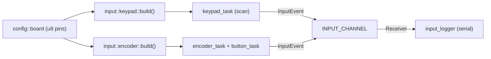

## Stage 2 — Input drivers (keypad + encoder)

### Goal and DoD
Three async tasks (matrix scan, encoder quadrature decoder, encoder button) produce `InputEvent` to one central `embassy_sync::channel::Channel`. Consumer task in `main` logs events to serial. DoD: encoder rotation, encoder click and key presses visible in the monitor.

### Key architectural decisions
- **Bridge `board::Gpio (u8)` -> typed esp-hal pins** via `AnyPin::steal(n)` (`esp-hal-1.1.1/src/gpio/mod.rs:2126`). This keeps `config::board` as the sole source of pin numbers; `main` and drivers contain no raw numbers. `steal` is `unsafe` — all pin initialization is enclosed in driver `build()` functions with documented contract "called once from `main`".
- **One input channel** (`CriticalSectionRawMutex`, depth 16) as `static` in `input/mod.rs`. Tasks get `Sender`, domain/logger gets `Receiver`. Contract (`InputEvent`) already exists in `input/mod.rs`.
- **Keypad = polling scan** (not edge-IRQ): rows `Output` (driven LOW in turn), columns `Input` with `Pull::Up`; key pressed when given row is LOW and column reads LOW. Debounce via scan period + simple state change detection. Matches polling `keypad.getKey()` from original (`WiTcontroller.ino:1633`).
- **Encoder = async edge** on pin A (`wait_for_falling_edge`), direction from pin B read — one `InputEvent` per detent (equivalent of `rotary_loop()` `WiTcontroller.ino:1429`). Encoder button separate task with `wait_for_falling_edge` + debounce (equivalent of `rotary_onButtonClick()` `WiTcontroller.ino:1389`).
- Separation of concerns preserved: `config::board` (pins), `config::keypad` (KEYMAP, timings), `input::{keypad,encoder}` (drivers), `main` (composition/spawn).

### Data flow



### File changes

**1. `crates/firmware/Cargo.toml`** — add dependency (version aligned with `esp-rtos` 0.3, which pulls `embassy-sync = 0.8`, `esp-rtos-0.3.0/Cargo.toml:192`):

```toml
embassy-sync = { version = "0.8", features = ["log"] }
```

**2. `crates/firmware/src/input/mod.rs`** — add modules + central channel (alongside existing `InputEvent`):

```rust
pub mod encoder;
pub mod keypad;

use embassy_sync::blocking_mutex::raw::CriticalSectionRawMutex;
use embassy_sync::channel::{Channel, Receiver, Sender};

pub const INPUT_CHANNEL_DEPTH: usize = 16;

pub type InputChannel = Channel<CriticalSectionRawMutex, InputEvent, INPUT_CHANNEL_DEPTH>;
pub type InputSender = Sender<'static, CriticalSectionRawMutex, InputEvent, INPUT_CHANNEL_DEPTH>;
pub type InputReceiver = Receiver<'static, CriticalSectionRawMutex, InputEvent, INPUT_CHANNEL_DEPTH>;

/// Sole input channel: drivers -> domain (Stage 8) / logger (Stage 2).
pub static INPUT_CHANNEL: InputChannel = Channel::new();
```

**3. `crates/firmware/src/input/keypad.rs` (new)** — matrix scan:

```rust
//! 4x3 matrix keypad driver (polling scan, async).
//! Pins from `config::board`, layout/timings from `config::keypad`.

use embassy_time::{Duration, Timer};
use esp_hal::gpio::{AnyPin, Input, InputConfig, Level, Output, OutputConfig, Pull};

use crate::config::{board, keypad};
use super::{InputEvent, InputSender};

const SETTLE_US: u64 = 50;

/// Builds pins (rows=Output, columns=Input pull-up) from BSP.
/// # Safety: call once, from `main`, without concurrent use of these GPIO.
pub fn build() -> ([Output<'static>; keypad::ROWS], [Input<'static>; keypad::COLS]) {
    let out_cfg = OutputConfig::default();
    let in_cfg = InputConfig::default().with_pull(Pull::Up);
    let rows = core::array::from_fn(|i| {
        let pin = unsafe { AnyPin::steal(board::KEYPAD_ROW_PINS[i]) };
        Output::new(pin, Level::High, out_cfg)
    });
    let cols = core::array::from_fn(|i| {
        let pin = unsafe { AnyPin::steal(board::KEYPAD_COL_PINS[i]) };
        Input::new(pin, in_cfg)
    });
    (rows, cols)
}

#[embassy_executor::task]
pub async fn task(
    mut rows: [Output<'static>; keypad::ROWS],
    mut cols: [Input<'static>; keypad::COLS],
    sender: InputSender,
) {
    let mut state = [[false; keypad::COLS]; keypad::ROWS];
    loop {
        for r in 0..keypad::ROWS {
            rows[r].set_low();
            Timer::after(Duration::from_micros(SETTLE_US)).await;
            for c in 0..keypad::COLS {
                let now = cols[c].is_low();
                if now != state[r][c] {
                    state[r][c] = now;
                    let key = keypad::KEYMAP[r][c];
                    let ev = if now { InputEvent::KeyPress(key) } else { InputEvent::KeyRelease(key) };
                    let _ = sender.try_send(ev);
                }
            }
            rows[r].set_high();
        }
        Timer::after(Duration::from_millis(keypad::KEYPAD_DEBOUNCE_MS)).await;
    }
}
```

**4. `crates/firmware/src/input/encoder.rs` (new)** — decoder + button:

```rust
//! Rotary encoder (quadrature on pin A edge) + encoder button.

use embassy_time::{Duration, Timer};
use esp_hal::gpio::{AnyPin, Input, InputConfig, Pull};

use crate::config::board;
use super::{InputEvent, InputSender};

const BTN_DEBOUNCE_MS: u64 = 50;

pub struct Pins {
    pub a: Input<'static>,
    pub b: Input<'static>,
    pub button: Input<'static>,
}

/// # Safety: call once, from `main`.
pub fn build() -> Pins {
    let cfg = InputConfig::default().with_pull(Pull::Up);
    Pins {
        a: Input::new(unsafe { AnyPin::steal(board::ENCODER_A) }, cfg),
        b: Input::new(unsafe { AnyPin::steal(board::ENCODER_B) }, cfg),
        button: Input::new(unsafe { AnyPin::steal(board::ENCODER_BUTTON) }, cfg),
    }
}

#[embassy_executor::task]
pub async fn task(mut a: Input<'static>, b: Input<'static>, sender: InputSender) {
    loop {
        a.wait_for_falling_edge().await;
        // Direction from B read at A edge (KY-040/EC11 detent).
        let cw = b.is_high();
        let ev = if cw { InputEvent::EncoderClockwise } else { InputEvent::EncoderCounterClockwise };
        let _ = sender.try_send(ev);
        Timer::after(Duration::from_millis(2)).await; // simple bounce suppression
    }
}

#[embassy_executor::task]
pub async fn button_task(mut button: Input<'static>, sender: InputSender) {
    loop {
        button.wait_for_falling_edge().await;
        Timer::after(Duration::from_millis(BTN_DEBOUNCE_MS)).await;
        if button.is_low() {
            let _ = sender.try_send(InputEvent::EncoderButton);
            button.wait_for_high().await; // wait for release
        }
    }
}
```

**5. `crates/firmware/src/bin/main.rs`** — spawn drivers + logger; remove `heartbeat` (replaced by real input). New imports: `longfred_firmware::input`, `esp_hal::gpio` not needed here (drivers build pins). Fragment after `esp_rtos::start(...)`:

```rust
    let sender = input::INPUT_CHANNEL.sender();
    let receiver = input::INPUT_CHANNEL.receiver();

    let (rows, cols) = input::keypad::build();
    let enc = input::encoder::build();

    spawner.spawn(input::keypad::task(rows, cols, sender)).ok();
    spawner.spawn(input::encoder::task(enc.a, enc.b, sender)).ok();
    spawner.spawn(input::encoder::button_task(enc.button, sender)).ok();
    spawner.spawn(input_logger(receiver)).ok();

    loop {
        Timer::after(Duration::from_secs(5)).await;
        info!("main alive");
    }
}

#[embassy_executor::task]
async fn input_logger(receiver: input::InputReceiver) {
    loop {
        let ev = receiver.receive().await;
        info!("input: {:?}", ev);
    }
}
```

### Notes / trade-offs (to tune in later stages)
- `AnyPin::steal` bypasses esp-hal ownership system — correct as long as these GPIO are not used via `peripherals.GPIOx` elsewhere. Alternative (no `unsafe`, but with verbose `peripherals` threading) possible later.
- Encoder decoding simplified to 1 event/detent; `ROTARY_ENCODER_STEPS`/`ENCODER_SENSITIVITY` from `config::keypad` will be used when tuning (speed stage).
- CW/CCW direction and `ENCODER_CLOCKWISE_INCREASES_SPEED` (already in `config::buttons`) will be mapped to speed actions in domain layer (Stage 8); here only raw events.
- Keypad debounce based on scan period (`KEYPAD_DEBOUNCE_MS`); if bounce occurs we'll add stability counter.

### Verification
- `cargo build` in `crates/firmware` (target `riscv32imac-unknown-none-elf`).
- `cargo test` in `crates/proto` unchanged (Stage 2 does not touch `proto`).
- Manually (if hardware): `espflash flash --monitor` and observe `input: ...` logs.
