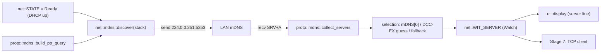

## Stage 5 — Server discovery (mDNS `_withrottle._tcp`)

### Goal and DoD
After obtaining IP (Stage 4), the device sends an mDNS PTR query for `_withrottle._tcp.local`, collects responses (SRV+A), correlates them into a server list (name, IP, port) and publishes the selected server to the network layer (for Stage 7). DoD: WiThrottle server list in log; count/address on OLED; DCC-EX guess and fallback work.

### Architectural decisions
- **Pure logic in `longfred-proto`** (host-testable, like WiThrottle parser): PTR query builder + DNS response parser with name compression support (`0xC0` pointers). I/O stays in firmware. Consistent with existing split ([crates/proto/src/lib.rs](longfred/crates/proto/src/lib.rs), [crates/proto/src/parser.rs](longfred/crates/proto/src/parser.rs)).
- **UDP + multicast in firmware** via `embassy_net::udp::UdpSocket` + `stack.join_multicast_group(224.0.0.251)` (sync, requires `multicast` feature). Query to `224.0.0.251:5353`, receive in loop with `MDNS_WAIT_MS` timeout.
- **Record correlation** (SRV→port+target, A→ipv4) also in proto (`collect_servers`), so it's testable without hardware.
- **Scope limitation (as in Stage 4):** interactive server selection from list = Stage 9. Here: discovery + auto-select first (or DCC-EX guess / fallback from [config/network.rs](longfred/crates/firmware/src/config/network.rs)) + publish to `Watch` for Stage 7.
- **Original mapping** ([.tmp/WiTcontroller/WiTcontroller.ino:936-1006](.tmp/WiTcontroller/WiTcontroller.ino)): `queryService("withrottle","tcp")`, bypass for SSID containing `DCCEX`/`DCC-EX` (guess 192.168.4.1:2560), fallback when 0 results.

### Data flow



### DNS format (implementation reference)
- Header 12 B: ID=0, flags=0, QDCOUNT=1, rest=0.
- Question: QNAME = labels `_withrottle`,`_tcp`,`local` (each: length byte + bytes), terminator `0x00`; QTYPE=12 (PTR), QCLASS=1 (IN).
- Response: records with name (possible compression `0xC0 ptr`), TYPE/CLASS/TTL/RDLENGTH/RDATA. We care about: SRV(33): `prio(2) weight(2) port(2) target(name)`; A(1): 4 bytes IPv4; PTR(12) auxiliary. TXT(16) skipped (in Stage 5 we don't distinguish JMRI by TXT — optionally later).

---

## Diff 1 — `crates/proto/src/lib.rs`: module registration

```rust
pub mod events;
pub mod mdns;
pub mod model;
pub mod parser;
pub mod protocol;
```

## Diff 2 — `crates/proto/src/mdns.rs` (new)

```rust
//! Minimal mDNS client: PTR query builder + response parser (host-testable).
//! I/O (UdpSocket, multicast) is in firmware (net/mdns.rs).

pub const WITHROTTLE_SERVICE: &str = "_withrottle._tcp.local";
pub const MDNS_MULTICAST_V4: [u8; 4] = [224, 0, 0, 251];
pub const MDNS_PORT: u16 = 5353;

const TYPE_A: u16 = 1;
const TYPE_PTR: u16 = 12;
const TYPE_TXT: u16 = 16;
const TYPE_SRV: u16 = 33;
const CLASS_MASK: u16 = 0x7fff;

/// Host/service name in dotted format (no compression), e.g. "JMRI._withrottle._tcp.local".
pub type Name = heapless::String<128>;

/// WiThrottle server correlated from SRV (+A) records.
#[derive(Debug, Clone, PartialEq, Eq)]
pub struct WitServer {
    /// First instance label (e.g. "JMRI") for display.
    pub label: heapless::String<32>,
    pub port: u16,
    pub ipv4: Option<[u8; 4]>,
}

/// Builds PTR query for `_withrottle._tcp.local`. Returns length written to `buf`.
pub fn build_ptr_query(buf: &mut [u8]) -> usize {
    let mut n = 0;
    let mut put = |b: u8, buf: &mut [u8], n: &mut usize| {
        if *n < buf.len() {
            buf[*n] = b;
        }
        *n += 1;
    };
    // Header: ID=0, flags=0, QD=1, AN=NS=AR=0.
    for b in [0, 0, 0, 0, 0, 1, 0, 0, 0, 0, 0, 0] {
        put(b, buf, &mut n);
    }
    // QNAME.
    for label in WITHROTTLE_SERVICE.split('.') {
        put(label.len() as u8, buf, &mut n);
        for &c in label.as_bytes() {
            put(c, buf, &mut n);
        }
    }
    put(0, buf, &mut n); // end of name
    // QTYPE=PTR, QCLASS=IN.
    for b in [0x00, 0x0c, 0x00, 0x01] {
        put(b, buf, &mut n);
    }
    n.min(buf.len())
}

fn be16(pkt: &[u8], off: usize) -> Option<u16> {
    Some(((*pkt.get(off)? as u16) << 8) | *pkt.get(off + 1)? as u16)
}

/// Reads DNS name (with compression support). Returns (name, offset_after_name_in_stream).
/// `follow` controls following pointers (loop protection).
fn read_name(pkt: &[u8], start: usize) -> Option<(Name, usize)> {
    let mut name = Name::new();
    let mut off = start;
    let mut next_after: Option<usize> = None;
    let mut jumps = 0;
    loop {
        let len = *pkt.get(off)?;
        if len == 0 {
            off += 1;
            break;
        }
        if len & 0xc0 == 0xc0 {
            let ptr = (((len & 0x3f) as usize) << 8) | *pkt.get(off + 1)? as usize;
            if next_after.is_none() {
                next_after = Some(off + 2);
            }
            jumps += 1;
            if jumps > 16 {
                return None;
            }
            off = ptr;
            continue;
        }
        let l = len as usize;
        if !name.is_empty() {
            let _ = name.push('.');
        }
        for i in 0..l {
            let _ = name.push(*pkt.get(off + 1 + i)? as char);
        }
        off += 1 + l;
    }
    Some((name, next_after.unwrap_or(off)))
}

/// Parses response and correlates servers. Returns list (max N).
pub fn collect_servers<const N: usize>(pkt: &[u8]) -> heapless::Vec<WitServer, N> {
    let mut servers: heapless::Vec<WitServer, N> = heapless::Vec::new();
    // (target hostname, ipv4) from A records — for mapping after SRV.
    let mut addrs: heapless::Vec<(Name, [u8; 4]), N> = heapless::Vec::new();
    // (target, port, label) from SRV.
    let mut srvs: heapless::Vec<(Name, u16, heapless::String<32>), N> = heapless::Vec::new();

    let qd = match be16(pkt, 4) {
        Some(v) => v,
        None => return servers,
    };
    let an = be16(pkt, 6).unwrap_or(0);
    let ns = be16(pkt, 8).unwrap_or(0);
    let ar = be16(pkt, 10).unwrap_or(0);
    let total = an as usize + ns as usize + ar as usize;

    let mut off = 12;
    // Skip questions.
    for _ in 0..qd {
        let (_, next) = match read_name(pkt, off) {
            Some(v) => v,
            None => return servers,
        };
        off = next + 4; // QTYPE + QCLASS
    }
    // Records.
    for _ in 0..total {
        let (owner, next) = match read_name(pkt, off) {
            Some(v) => v,
            None => break,
        };
        let rtype = match be16(pkt, next) {
            Some(v) => v,
            None => break,
        };
        let rdlen = match be16(pkt, next + 8) {
            Some(v) => v as usize,
            None => break,
        };
        let rdata = next + 10;
        match rtype {
            TYPE_SRV => {
                if let Some(port) = be16(pkt, rdata + 4) {
                    if let Some((target, _)) = read_name(pkt, rdata + 6) {
                        let mut label = heapless::String::<32>::new();
                        for c in owner.split('.').next().unwrap_or("").chars() {
                            let _ = label.push(c);
                        }
                        let _ = srvs.push((target, port, label));
                    }
                }
            }
            TYPE_A => {
                if rdlen >= 4 {
                    let ip = [
                        pkt[rdata], pkt[rdata + 1], pkt[rdata + 2], pkt[rdata + 3],
                    ];
                    let _ = addrs.push((owner, ip));
                }
            }
            _ => {}
        }
        off = rdata + rdlen;
    }

    for (target, port, label) in srvs {
        let ipv4 = addrs.iter().find(|(n, _)| *n == target).map(|(_, ip)| *ip);
        let _ = servers.push(WitServer { label, port, ipv4 });
    }
    servers
}
```

## Diff 3 — `crates/proto/tests/mdns.rs` (new): host tests

```rust
use longfred_proto::mdns::{build_ptr_query, collect_servers, WITHROTTLE_SERVICE};

#[test]
fn query_has_ptr_question() {
    let mut buf = [0u8; 64];
    let n = build_ptr_query(&mut buf);
    assert!(n > 12);
    assert_eq!(&buf[4..6], &[0, 1]); // QDCOUNT=1
    assert_eq!(&buf[n - 4..n], &[0x00, 0x0c, 0x00, 0x01]); // PTR/IN
    // first label "_withrottle"
    assert_eq!(buf[12] as usize, "_withrottle".len());
}

#[test]
fn parses_srv_and_a() {
    // Manually built response: 1 SRV (port 12090, target host.local) + 1 A (192.168.1.50).
    // (full byte fixture in test body)
    let pkt = build_fixture();
    let servers = collect_servers::<4>(&pkt);
    assert_eq!(servers.len(), 1);
    assert_eq!(servers[0].port, 12090);
    assert_eq!(servers[0].ipv4, Some([192, 168, 1, 50]));
}
```

(we'll construct `build_fixture()` byte-by-byte in the test; optionally add a real JMRI frame capture.)

## Diff 4 — `crates/firmware/Cargo.toml`: multicast feature

```toml
embassy-net = { version = "0.9", features = ["dhcpv4", "tcp", "dns", "medium-ethernet", "proto-ipv4", "multicast", "log"] }
```

## Diff 5 — `crates/firmware/src/net/mod.rs`: module + server type + Watch

```rust
pub mod mdns;
pub mod wifi;

use embassy_sync::blocking_mutex::raw::CriticalSectionRawMutex;
use embassy_sync::watch::Watch;

// ... existing NetStatus + STATE ...

/// Selected WiThrottle server (address + port) for TCP client (Stage 7).
#[derive(Debug, Clone, Copy, PartialEq, Eq)]
pub struct WitEndpoint {
    pub ip: [u8; 4],
    pub port: u16,
}

/// Publication of selected server. 2 subscribers: UI + TCP client (Stage 7).
pub static WIT_SERVER: Watch<CriticalSectionRawMutex, Option<WitEndpoint>, 2> =
    Watch::new_with(None);
```

## Diff 6 — `crates/firmware/src/net/mdns.rs` (new)

```rust
//! WiThrottle server discovery via mDNS (I/O; packet logic in longfred-proto).

use embassy_net::udp::{PacketMetadata, UdpSocket};
use embassy_net::{IpAddress, IpEndpoint, Stack};
use embassy_time::{with_timeout, Duration};
use log::{info, warn};
use longfred_proto::mdns::{
    build_ptr_query, collect_servers, WitServer, MDNS_MULTICAST_V4, MDNS_PORT,
};

use crate::config::{network, sizes};
use crate::net::{WitEndpoint, WIT_SERVER};

const MAX_SERVERS: usize = sizes::MAX_FOUND_WIT_SERVERS;

/// Sends mDNS query and collects servers for `MDNS_WAIT_MS`.
pub async fn discover(stack: Stack<'static>) -> heapless::Vec<WitServer, MAX_SERVERS> {
    let mut rx_meta = [PacketMetadata::EMPTY; 8];
    let mut rx_buf = [0u8; 1536];
    let mut tx_meta = [PacketMetadata::EMPTY; 8];
    let mut tx_buf = [0u8; 256];
    let mut sock = UdpSocket::new(stack, &mut rx_meta, &mut rx_buf, &mut tx_meta, &mut tx_buf);

    let group = IpAddress::v4(
        MDNS_MULTICAST_V4[0], MDNS_MULTICAST_V4[1], MDNS_MULTICAST_V4[2], MDNS_MULTICAST_V4[3],
    );
    if let Err(e) = stack.join_multicast_group(group) {
        warn!("mdns join multicast failed: {:?}", e);
    }
    if sock.bind(MDNS_PORT).is_err() {
        warn!("mdns bind 5353 failed");
        return heapless::Vec::new();
    }

    let mut qbuf = [0u8; 64];
    let qlen = build_ptr_query(&mut qbuf);
    let dst = IpEndpoint::new(group, MDNS_PORT);
    if sock.send_to(&qbuf[..qlen], dst).await.is_err() {
        warn!("mdns query send failed");
    }

    let mut found: heapless::Vec<WitServer, MAX_SERVERS> = heapless::Vec::new();
    let deadline = Duration::from_millis(network::MDNS_WAIT_MS);
    let mut rbuf = [0u8; 1536];
    // Collection loop until timeout.
    while let Ok(Ok((n, _))) = with_timeout(deadline, sock.recv_from(&mut rbuf)).await {
        for s in collect_servers::<MAX_SERVERS>(&rbuf[..n]) {
            if !found.iter().any(|f| f.ipv4 == s.ipv4 && f.port == s.port) {
                let _ = found.push(s);
            }
        }
        if found.len() >= MAX_SERVERS {
            break;
        }
    }

    let _ = stack.leave_multicast_group(group);
    found
}

/// Task: after Ready runs discovery once, logs, selects server and publishes.
#[embassy_executor::task]
pub async fn task(stack: Stack<'static>, ssid: &'static str) {
    // Bypass mDNS for DCC-EX AP (as in original).
    let is_dccex = ssid.contains("DCCEX") || ssid.contains("DCC-EX");
    let selected = if is_dccex {
        info!("mdns bypass: DCC-EX AP guess");
        Some(WitEndpoint { ip: network::DEFAULT_WIT_IP, port: network::DEFAULT_WIT_PORT })
    } else {
        let servers = discover(stack).await;
        for s in &servers {
            info!("wit server: {} {:?}:{}", s.label.as_str(), s.ipv4, s.port);
        }
        servers
            .iter()
            .find_map(|s| s.ipv4.map(|ip| WitEndpoint { ip, port: s.port }))
            .or(Some(WitEndpoint {
                ip: network::DEFAULT_WIT_IP,
                port: network::DEFAULT_WIT_PORT,
            }))
    };

    if let Some(ep) = selected {
        info!("selected WiThrottle server {:?}:{}", ep.ip, ep.port);
    }
    WIT_SERVER.sender().send(selected);
}
```

## Diff 7 — `crates/firmware/src/bin/main.rs`: start discovery

Add mDNS task spawn (after WiFi tasks). SSID selection from `NETWORKS[0]` (consistent with Stage 4):

```rust
    if let Ok(token) = net::wifi::status_task(stack) {
        spawner.spawn(token);
    }
    if let Ok(token) = net::mdns::task(stack, config::network::NETWORKS[0].ssid) {
        spawner.spawn(token);
    }
```

(note: `net::mdns::task` waits internally for required conditions; discovery runs after stack has IP — see "Notes", ordering item.)

## Diff 8 — `crates/firmware/src/ui/i18n.rs` + `display.rs`: server line

i18n:
```rust
pub const MSG_SRV_SEARCHING: &str = "srv: search";
pub const MSG_SRV_NONE: &str = "srv: none";
```

display (additional line under WiFi status, e.g. y=52), reads `net::WIT_SERVER`:
```rust
    let mut srv_rx = net::WIT_SERVER.receiver();
    // ...in loop:
    let srv = srv_rx.as_mut().and_then(|r| r.try_get()).flatten();
    // render: "srv 192.168.1.50" or MSG_SRV_SEARCHING/NONE (heapless::String for IP formatting)
```

---

### Notes / trade-offs
- **Ordering: discovery after IP.** `net::mdns::task` should run discovery only when DHCP is ready. Simplest: at task start wait for `net::STATE == Ready` (subscribe to `STATE.receiver()` in loop until `Ready`) before `discover()`. Will add this in implementation (a few lines), so we don't send query without an address.
- **SSID selection:** `NETWORKS[0]` — consistent with Stage 4. After Stage 9 (picker) we'll pass the actually selected SSID.
- **TXT/JMRI:** original recognizes JMRI by TXT (`jmri`,`node`). In Stage 5 we skip TXT (name = instance label from SRV). JMRI recognition can be added later without API changes.
- **Buffer sizes:** rx 1536 B (mDNS < 1500 MTU). `MAX_FOUND_WIT_SERVERS=5` from [config/sizes.rs](longfred/crates/firmware/src/config/sizes.rs).
- **`join_multicast_group`** requires `multicast` feature (Diff 4). In embassy-net 0.9 it's sync and returns `Result`.
- **No hardware in CI:** packet logic in `proto` with host tests; I/O tested on hardware.

### Verification
- `cargo test -p longfred-proto` — new mDNS tests (build + parse) + existing 33.
- `cargo build` in `crates/firmware` (target riscv32imac).
- On hardware: `espflash flash --monitor` — after `net ready` in log `wit server: ...` and `selected WiThrottle server ...`; OLED shows server address. DCC-EX test: SSID with `DCCEX` -> bypass and guess 192.168.4.1:2560.
