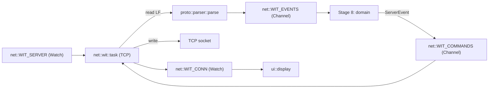

## Stage 7 — TCP client + WiThrottle protocol loop

### Goal and DoD
After server selection (`net::WIT_SERVER`, Stage 5) TCP client connects, performs handshake (`N{name}`, `HU{id}`), enables heartbeat (`*+`), periodically sends `*`, reads LF-terminated lines, parses them with `longfred_proto::parser::parse` and publishes `ServerEvent` to `WIT_EVENTS` channel (for domain — Stage 8). Outgoing commands fetched from `WIT_COMMANDS`. Response watchdog + reconnect. DoD: `wit connected` in log, reception of `Version`/`RosterEntriesCount`, periodic heartbeat.

### Architectural decisions
- **One `wit::task`** in `net/wit.rs` (I/O + loop). Packet logic stays in `longfred-proto` (already ready: `parser::parse`, `protocol::*`).
- **Two channels** in `net/mod.rs` (consistent with `STATE`/`WIT_SERVER`): `WIT_EVENTS: Channel<ServerEvent>` (client→domain, Stage 8) and `WIT_COMMANDS: Channel<Cmd>` (domain→client). Plus `WIT_CONN: Watch<WitConnState>` for UI.
- **Active heartbeat**: server with `requireHeartbeat` requires `*` from client. Period from `ServerEvent::HeartbeatConfig{seconds}` (server event) or default `config::buttons::DEFAULT_HEARTBEAT_PERIOD_S`.
- **Watchdog**: `last_rx` = `Instant`; if `> 2×heartbeat` without data → close + reconnect. Equivalent of `setLastServerResponseTime` from original ([.tmp/WiTcontroller/WiTcontroller.ino:1106](.tmp/WiTcontroller/WiTcontroller.ino)).
- **TCP buffers as `static`** (StaticCell) — `TcpSocket` requires `&'static mut [u8]`.
- **Scope limitation (like Stages 4–5):** control commands (speed/dir/fn) come from domain (Stage 8). Here only handshake + heartbeat + echo received events in log + I/O loop.

### Data flow



### Diff 1 — `crates/firmware/src/net/mod.rs`: channels + status

```rust
pub mod mdns;
pub mod wifi;
pub mod wit;

use embassy_sync::channel::Channel;
use embassy_sync::blocking_mutex::raw::CriticalSectionRawMutex;
use embassy_sync::watch::Watch;
use longfred_proto::events::ServerEvent;
use longfred_proto::protocol::Cmd;

// ... existing NetStatus, STATE, WitEndpoint, WIT_SERVER ...

/// WiThrottle server connection status.
#[derive(Debug, Clone, Copy, PartialEq, Eq)]
pub enum WitConnState {
    Disconnected,
    Connecting,
    Connected,
}

pub static WIT_CONN: Watch<CriticalSectionRawMutex, WitConnState, 2> =
    Watch::new_with(WitConnState::Disconnected);

pub const WIT_EVENTS_DEPTH: usize = 16;
pub const WIT_COMMANDS_DEPTH: usize = 16;

pub static WIT_EVENTS: Channel<CriticalSectionRawMutex, ServerEvent, WIT_EVENTS_DEPTH> =
    Channel::new();
pub static WIT_COMMANDS: Channel<CriticalSectionRawMutex, Cmd, WIT_COMMANDS_DEPTH> =
    Channel::new();
```

### Diff 2 — `crates/firmware/src/net/wit.rs` (new)

```rust
//! WiThrottle TCP client: connection, handshake, heartbeat, I/O loop.

use embassy_futures::select::{select, Either};
use embassy_net::tcp::TcpSocket;
use embassy_net::{IpAddress, IpEndpoint, Stack};
use embassy_time::{Duration, Instant, Timer};
use log::{info, warn};
use longfred_proto::parser;
use longfred_proto::protocol;

use crate::config;
use crate::net::{self, WitConnState, WitEndpoint, WIT_COMMANDS, WIT_CONN, WIT_EVENTS, WIT_SERVER};

const TCP_RX_SIZE: usize = 1024;
const TCP_TX_SIZE: usize = 1024;
const LINE_BUF_SIZE: usize = 256;
const RECONNECT_DELAY: Duration = Duration::from_secs(2);

async fn wait_for_server() -> WitEndpoint {
    loop {
        if let Some(mut rx) = net::WIT_SERVER.receiver() {
            loop {
                if let Some(ep) = rx.try_get() {
                    if let Some(ep) = ep {
                        return ep;
                    }
                }
                rx.changed().await;
            }
        }
        Timer::after(Duration::from_millis(200)).await;
    }
}

async fn run_session(stack: Stack<'static>, ep: WitEndpoint, heartbeat_period: &mut u32) -> bool {
    static RX: static_cell::StaticCell<[u8; TCP_RX_SIZE]> = static_cell::StaticCell::new();
    static TX: static_cell::StaticCell<[u8; TCP_TX_SIZE]> = static_cell::StaticCell::new();
    let rx = RX.init([0; TCP_RX_SIZE]);
    let tx = TX.init([0; TCP_TX_SIZE]);

    let mut sock = TcpSocket::new(stack, rx, tx);
    let remote = IpEndpoint::new(
        IpAddress::v4(ep.ip[0], ep.ip[1], ep.ip[2], ep.ip[3]),
        ep.port,
    );
    if sock.connect(remote).await.is_err() {
        warn!("wit tcp connect failed");
        return false;
    }
    info!("wit connected to {:?}:{}", ep.ip, ep.port);
    WIT_CONN.sender().send(WitConnState::Connected);

    // Handshake.
    send(&mut sock, &protocol::handshake_name(config::DEVICE_NAME)).await;
    send(&mut sock, &protocol::heartbeat_enable(config::buttons::HEARTBEAT_ENABLED)).await;

    let mut line = heapless::String::<LINE_BUF_SIZE>::new();
    let mut last_rx = Instant::now();
    let mut hb_last = Instant::now();

    loop {
        let hb_due = hb_last.elapsed() >= Duration::from_secs(*heartbeat_period as u64);
        let cmd = if hb_due {
            Either::First(embassy_futures::yield_now())
        } else {
            Either::Second(WIT_COMMANDS.recv().await)
        };
        match cmd {
            Either::First(_) => {
                send(&mut sock, &protocol::heartbeat()).await;
                hb_last = Instant::now();
            }
            Either::Second(c) => {
                send(&mut sock, &c).await;
            }
        }

        // Watchdog: no data > 2×heartbeat → reconnect.
        if last_rx.elapsed() > Duration::from_secs(*heartbeat_period as u64 * 2) {
            warn!("wit watchdog: no data, reconnect");
            sock.close();
            return false;
        }

        // Non-blocking read: try read_with each loop iteration.
        let res = sock.read_with(|buf| {
            let n = buf.len();
            let mut consumed = 0;
            for &b in &buf[..n] {
                consumed += 1;
                if b == b'\n' {
                    let _ = line.push_str("\n");
                    let snapshot: heapless::String<LINE_BUF_SIZE> = line.clone();
                    line.clear();
                    parser::parse(snapshot.trim_end_matches(['\r', '\n']), |ev| {
                        if let parser::ServerEvent::HeartbeatConfig { seconds } = ev {
                            *heartbeat_period = seconds.max(1);
                        }
                        let _ = WIT_EVENTS.try_send(ev);
                    });
                } else if line.push(b as char).is_err() {
                    line.clear();
                }
            }
            (consumed, ())
        }).await;
        match res {
            Ok(()) => { last_rx = Instant::now(); }
            Err(_) => { warn!("wit read error"); sock.close(); return false; }
        }
        Timer::after(Duration::from_millis(10)).await;
    }
}

async fn send(sock: &mut TcpSocket<'static>, cmd: &protocol::Cmd) {
    let bytes = cmd.as_bytes();
    if sock.write_all(bytes).await.is_err() {
        warn!("wit write failed");
    }
    if sock.write_all(b"\r\n").await.is_err() {
        warn!("wit write crlf failed");
    }
}

#[embassy_executor::task]
pub async fn task(stack: Stack<'static>) {
    let mut heartbeat_period = config::buttons::DEFAULT_HEARTBEAT_PERIOD_S;
    loop {
        WIT_CONN.sender().send(WitConnState::Connecting);
        let ep = wait_for_server().await;
        let ok = run_session(stack, ep, &mut heartbeat_period).await;
        WIT_CONN.sender().send(WitConnState::Disconnected);
        if !ok {
            Timer::after(RECONNECT_DELAY).await;
        }
    }
}
```

API note: `TcpSocket::write_all`/`read_with` come from `embedded-io-async` (impl on `TcpSocket`). `write_all` requires `embassy-net` feature (already in `tcp`). If `write_all` unavailable directly, use `sock.write(buf).await` in loop until fully written.

### Diff 3 — `crates/firmware/Cargo.toml`: embassy-futures

```toml
embassy-futures = "0.1"
```

### Diff 4 — `crates/firmware/src/bin/main.rs`: spawn

```rust
    if let Ok(token) = net::mdns::task(stack, config::network::NETWORKS[0].ssid) {
        spawner.spawn(token);
    }
    if let Ok(token) = net::wit::task(stack) {
        spawner.spawn(token);
    }
```

### Diff 5 — `ui/i18n.rs` + `display.rs`: WiThrottle connection status

i18n:
```rust
pub const MSG_WIT_CONNECTING: &str = "wit: ...";
pub const MSG_WIT_CONNECTED: &str = "wit: ok";
pub const MSG_WIT_DISCONNECTED: &str = "wit: off";
```

display: additional receiver `net::WIT_CONN` and line (e.g. y=40 replaces WiFi status with two short lines, or new line y=52 shifts server). Simplest: replace static status with three fields (wifi / wit / srv) in rows 40/46/52 — requires smaller font or shorter texts. Alternative: `wit` line appears only when `WIT_CONN != Disconnected`, overwriting `srv`. To be decided during implementation (UI detail).

---

### Notes / trade-offs
- **`static_cell` for TCP buffers**: `TcpSocket` requires `&'static mut`. Alternative: `mk_static!`. StaticCell already used in `main.rs`.
- **Heartbeat vs commands — select**: simplified schedule — heartbeat priority when due, otherwise wait for command. `embassy_futures::yield_now` allows switching to read. Refactor to separate reader/writer tasks if needed (Stage 8).
- **Watchdog 2×heartbeat**: if server doesn't send `HeartbeatConfig`, use default from config. No data = link problem → reconnect.
- **`write_all`**: if unavailable, `write` loop to completion. Check at compile time (as with ssd1306).
- **No domain (Stage 8)**: `WIT_COMMANDS` empty for now — client only handshake+heartbeat. Event log confirms operation. Stage 8 connects command sender.
- **CR/LF**: original `commandsNeedLeadingCrLf`. In Stage 7 send `\r\n` after each command (WiThrottle compliant). Leading CR/LF (empty start) added if server requires — flag `SEND_LEADING_CR_LF` in config.

### Verification
- `cargo build` in `crates/firmware` (target riscv32imac).
- `cargo test -p longfred-proto` — unchanged (Stage 7 does not touch proto).
- On hardware: `espflash flash --monitor` — after `selected WiThrottle server` in log `wit connected`, reception of `Version`/roster, periodic `*`. Reconnect test: stop server → `wit watchdog` → reconnect after 2 s.
