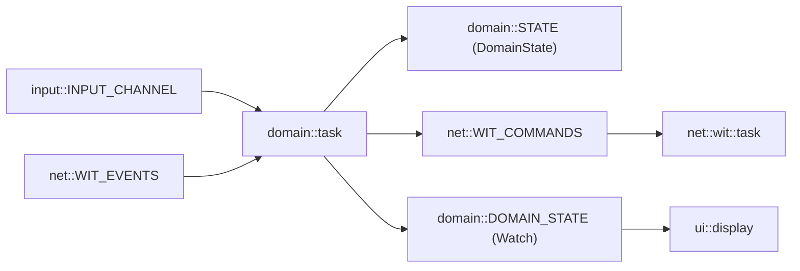

# Stage 8 — Domain model + control logic

## Goal and DoD
The domain task is the sole consumer of `input::INPUT_CHANNEL` (replacing `input_logger`) and `net::WIT_EVENTS`; it produces commands to `net::WIT_COMMANDS` and publishes state snapshots to `domain::DOMAIN_STATE` (Watch) for the UI. Mapping InputEvent -> Action -> Cmd, reducing ServerEvent to state. Numeric acquisition (digits + `#`), consist-aware direction (like original WiTcontroller.ino:2902-2938). DoD: `cargo build` + `cargo test -p longfred-proto`; on hardware: digits+# acquire loco, encoder changes speed, server echo updates state.

## Decisions (confirmed with user)
- Acquisition: numeric. Mode depends on throttle state: empty consist -> acquire mode (digits build address, `#`=add_loco, `*`=clear); non-empty -> operate mode (digits = `default_action`, `#`=release all, `*`=re-enter acquire without release).
- Consist: full consist-aware direction (per-loco facing, iteration on direction change).

## Flow



## Diff 1 — `crates/firmware/src/domain/model.rs` (new)
Value types. `MAX_LOCOS=10`, `MAX_SPEED=126`. `RosterEntry{name,address,length}`. `FunctionFollow::{Lead,All}`. `ThrottleSlot{speed,direction,facing,functions[32],labels[32],follow[32],consist: Vec<LocoAddr,MAX_LOCOS>,speed_step}`. `DomainSnapshot` with primitive fields (current,speed,forward,consist_len,power_on,has_loco,acquiring,addr: heapless::String<5>) + `Default`.

## Diff 2 — `crates/firmware/src/domain/state.rs` (new)
`DomainState{throttles:[ThrottleSlot;MAX_THROTTLES], current, max_throttles, track_power, speed_multiplier, roster: Vec<RosterEntry,MAX_ROSTER>, roster_count, addr: heapless::String<4>}`. Methods:
- `new()` (init from config: max_throttles=DEFAULT_THROTTLES, speed_multiplier=1, speed_step=SPEED_STEP).
- `snapshot()` -> DomainSnapshot.
- `apply_input(ev, out:&mut Vec<Cmd,N>)` -> bool (state changed):
  - Acquire mode (`consist.is_empty()`): `KeyPress('0'..='9')` push to `addr`; `KeyPress('#')` -> `acquire(out)`; `KeyPress('*')` -> clear addr. Encoder/button ignored in acquire mode.
  - Operate mode: `KeyPress(c)` -> `default_action(c)`; `KeyRelease(c)` -> if `Function(f)` send release; `KeyPress('#')` -> release all (`release_loco(t,"*")` + clear consist+facing); `KeyPress('*')` -> `addr.clear()` (re-enter acquire, without release). Encoder -> speed up/down. EncoderButton -> ENCODER_BUTTON_ACTION.
- `apply_action(action, pressed, out)` -> match Action -> commands + state mutation (speed/dir/fn/power/estop/throttle/custom).
- `apply_event(ServerEvent, out)` -> reduction: AddressAdded (push consist + facing=Forward), AddressRemoved (remove + facing), Speed (bounce filter 500ms), DirectionLead (slot.dir + facing[0]), DirectionLoco (facing per addr), FunctionState, RosterFunctionLabels, TrackPower, RosterEntry/Count, StealNeeded -> steal_loco.
- `acquire(out)`: build loco `S`/`L` (addr>127 or leading 0 -> `L`), if DROP_BEFORE_ACQUIRE -> release_loco(t,"*"), `add_loco(t,loco,loco)`, clear addr.
- `change_direction(slot, dir, out)`: consist-aware (len==1 -> set_direction(t,"*",dir); len>1 -> iterate over trailing with facing vs lead_facing -> dir or opposite, then lead; update slot.dir + facing).
- `speed_up/down(fast, out)`: clamp 0..=126, `set_speed(t,speed)`.
- `estop_all(out)`, `estop_current(out)`.
- `next_throttle()`, `set_throttle(i)`, `cycle_speed_multiplier()`.
- Encoder: `ENCODER_CLOCKWISE_INCREASES_SPEED` + `ENCODER_INVERT_WHEN_REVERSED` (flip when Reverse).
- `SpeedStopThenToggleDirection`: speed!=0 -> 0; else if TOGGLE_DIRECTION_WHEN_STATIONARY -> toggle.
- `out` is `heapless::Vec<Cmd, 4>`; sender packs into WIT_COMMANDS with min-delay (OUTBOUND_COMMANDS_MIN_DELAY_MS) in task.

## Diff 3 — `crates/firmware/src/domain/mod.rs`
`pub mod actions; model; state; task;` + `pub static DOMAIN_STATE: Watch<CriticalSectionRawMutex, DomainSnapshot, 2> = Watch::new_with(DomainSnapshot::default());`

## Diff 4 — `crates/firmware/src/domain/task.rs` (new)
```rust
#[embassy_executor::task]
pub async fn task() {
    let mut state = DomainState::new();
    let mut input_rx = input::INPUT_CHANNEL.receiver();
    let mut events_rx = net::WIT_EVENTS.receiver();
    let cmd_tx = net::WIT_COMMANDS.sender();
    let snap_tx = domain::DOMAIN_STATE.sender();
    let mut out: heapless::Vec<Cmd, 4> = heapless::Vec::new();
    let mut last_cmd = Instant::now() - Duration::from_secs(1);
    loop {
        match select(input_rx.receive(), events_rx.receive()).await {
            Either::First(ev) => {
                let changed = state.apply_input(ev, &mut out);
                flush(&cmd_tx, &mut out, &mut last_cmd).await;
                if changed { snap_tx.send(state.snapshot()); }
            }
            Either::Second(sev) => {
                let changed = state.apply_event(sev, &mut out);
                flush(&cmd_tx, &mut out, &mut last_cmd).await;
                if changed { snap_tx.send(state.snapshot()); }
            }
        }
    }
}
```
`flush`: for each Cmd in `out` wait until `last_cmd.elapsed() >= OUTBOUND_COMMANDS_MIN_DELAY_MS`, `cmd_tx.send(cmd).await`, update last_cmd. `select` from `embassy_futures::select::{select, Either}`.

## Diff 5 — `crates/firmware/src/bin/main.rs`
Remove `input_logger` and its spawn; instead: `if let Ok(t) = domain::task() { spawner.spawn(t); }`. Add `use longfred_firmware::domain;` (or via `longfred_firmware::{config,domain,input,net,ui}`). `stack` not needed by domain.

## Diff 6 — `crates/firmware/src/ui/i18n.rs` + `display.rs`
i18n: `MSG_ACQUIRE_HINT: &str = "addr+#"`. display: additional receiver `domain::DOMAIN_STATE`; line y=14 (TEXT font) shows snapshot when `has_loco`: `T{current+1} v{speed:03} {F|R} n{consist_len}` or when acquiring: `addr: {addr_entry}` or `MSG_ACQUIRE_HINT`. Other lines (wifi/wit/srv) preserved. Stage 9 will do full UI.

## Notes / trade-offs
- `INPUT_CHANNEL` has one consumer -> domain replaces input_logger. Input log remains inside `apply_input` (debug).
- `WIT_EVENTS`/`WIT_COMMANDS` are `Channel` (multi-producer/single-consumer): domain is consumer of events and producer of commands; `wit::task` the opposite. No conflict.
- 50ms pacing in `flush` (equivalent of OUTBOUND_COMMANDS_MINIMUM_DELAY from original, which was in WiThrottleProtocol library).
- Consist-aware direction requires tracking facing per-loco; `DirectionLoco` event updates facing. Lead = consist[0].
- `MAX_LOCOS=10`, `MAX_ROSTER=70` (already in config::sizes).
- No menu (Stage 9), no NVS (Stage 10). Acquire/release via digits+#/#.
- `Cmd` = `heapless::String<64>` (Copy), so `Vec<Cmd,4>` is cheap.

## Verification
- `cargo build` in `crates/firmware` (target riscv32imac).
- `cargo test -p longfred-proto` (no changes in proto).
- On hardware: after `wit connected` enter address + `#` -> `M0+...` in log, echo `AddressAdded` -> consist; encoder -> `M0A*<;>V...`; `#` in operate -> release.
