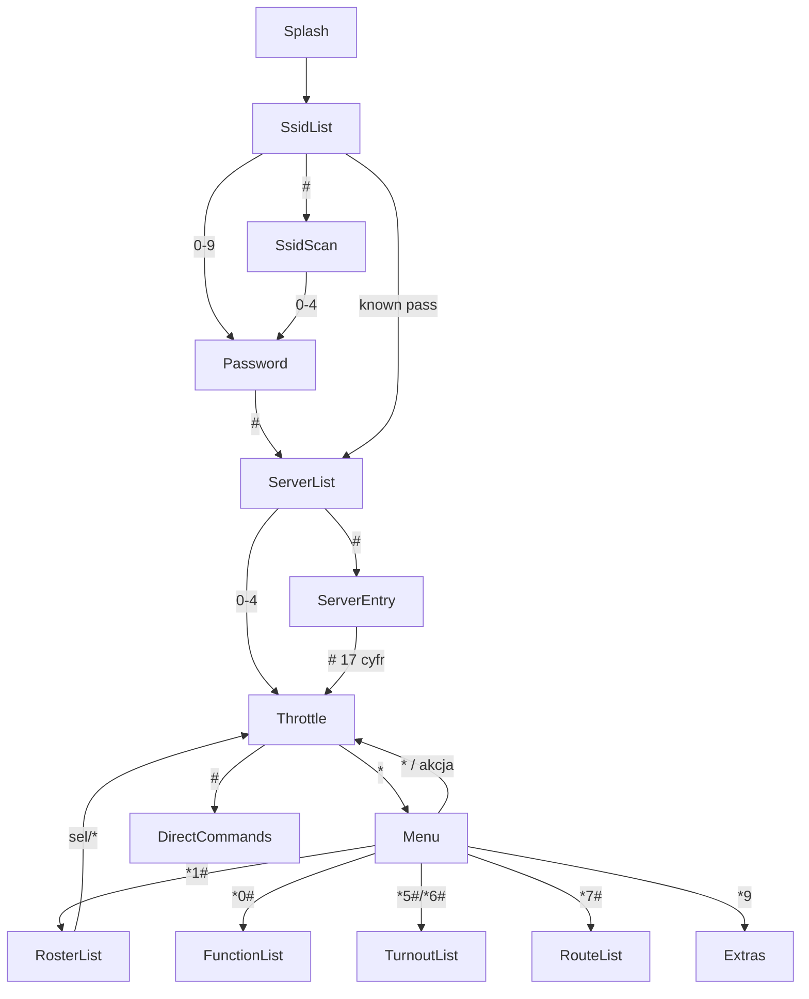

## Stage 9 — Menu, screens and full UI

### Goal and DoD
Replicate the full UI cycle of the original: WiFi/server setup (SSID list, scan, password entry via encoder, mDNS server selection, manual IP:port), throttle screen, menu `*...#` + extras `*9x#`, roster/function/turnout/route lists with pagination and key selection, broadcast/alert as a timed line. DoD: `cargo build` (riscv32imac) + `cargo test` (new FSM host tests in proto or firmware host-cfg) + `cargo test -p longfred-proto`. On hardware: navigation like the original (see README WiTcontroller).

### Architecture principle (confirmed: ui_menu_driven)
- **One controller task** = current `domain::task::task` (sole consumer of `INPUT_CHANNEL` + `WIT_EVENTS`). Extended with `select` on net signals (scan/servers/status). Owner of `ui::menu::MenuFsm` and `DomainState`.
- **`ui/menu.rs`** = pure navigation logic (no I/O, host-testable). Input: `InputEvent` + net events; output: `Intent` (enum). Holds interaction state (screen, menu_command, page, addr entry, password char picker, IP entry).
- **`ui/view.rs`** = rendering model `UiView` (published via Watch). FSM builds `UiView` from `ViewCtx` (read-only view of domain + net).
- **`ui/display.rs`** = pure `UiView` renderer (no logic).
- Task interprets `Intent`: mutates `DomainState`, pushes `Cmd` to `WIT_COMMANDS`, sends control to net (wifi/mdns).

### Screen flow


### Diff 1 — `crates/firmware/src/ui/view.rs` (new)
Render model. Mirror `oledText[12]` from the original for text screens + dedicated throttle view.
```rust
pub const GRID_LINES: usize = 12;      // 2 columns x 6 (like original)
pub const LINE_LEN: usize = 21;        // FONT_6X10 -> ~21 chars/128px
pub type Line = heapless::String<LINE_LEN>;

#[derive(Clone, PartialEq, Eq)]
pub struct GridView {
    pub lines: heapless::Vec<Line, GRID_LINES>,
    pub invert: heapless::Vec<bool, GRID_LINES>,
    pub top_line: bool,   // horizontal line y=11
    pub foot_line: bool,  // horizontal line y=51
}

#[derive(Clone, PartialEq, Eq)]
pub struct ThrottleView {
    pub current: u8,
    pub speed: u8,
    pub forward: bool,
    pub consist_len: u8,
    pub power_on: bool,
    pub heartbeat_on: bool,
    pub functions: u32,     // F0..F31 bitmap (active)
    pub loco: Line,         // consist addresses/names
    pub footer: Line,       // menu hint or broadcast
    pub next_hint: Line,    // next throttle preview
}

#[derive(Clone, PartialEq, Eq)]
pub enum UiView { Throttle(ThrottleView), Grid(GridView) }
```
Publication: `pub static UI_VIEW: Watch<CriticalSectionRawMutex, UiView, 2>` (in `ui/mod.rs`). Replaces `domain::DOMAIN_STATE` in display; `DOMAIN_STATE` can be removed or left as an alias (removing it in this stage).

### Diff 2 — `crates/firmware/src/ui/menu.rs` (new) — FSM core
```rust
#[derive(Clone, Copy, PartialEq, Eq)]
pub enum Screen {
    Splash, SsidList, SsidScan, Password, ServerList, ServerEntry, Connecting,
    Throttle, Menu, Extras, RosterList, FunctionList, TurnoutList, RouteList, DirectCommands,
}

pub enum Intent {
    None,
    Action(crate::domain::actions::Action),
    AcquireAddr,                 // use addr from FSM
    AcquireRoster(usize),
    ReleaseAll,
    Function(u8, bool),          // from FunctionList (press/release)
    Turnout(longfred_proto::model::TurnoutAction, ListRef), // ListRef=Addr|Index
    Route(ListRef),
    WifiScan,
    WifiSelect(usize, /*from_scan*/ bool),
    WifiConnect,                 // use ssid+pw from FSM
    ServerSelect(usize),
    ServerManual,                // use ip_digits
    HeartbeatToggle, DropBeforeAcquireToggle, HashFunctionsToggle,
    Sleep,                       // Stage 10 no-op
}

pub struct MenuFsm {
    pub screen: Screen,
    menu_cmd: heapless::String<8>,
    menu_started: bool,
    page: usize,
    fn_page: usize,
    pub addr: heapless::String<5>,     // loco address entry
    pw: heapless::String<64>,          // entered password
    pw_char: u8,                       // current picker char (0=none)
    ip_digits: heapless::String<17>,   // manual IP:port
    hash_functions: bool,              // runtime HASH_SHOWS_FUNCTIONS
}

impl MenuFsm {
    pub fn new() -> Self { /* screen=Splash */ }
    // Returns Intent to be executed by task.
    pub fn handle(&mut self, ev: InputEvent) -> Intent { /* dispatch per self.screen */ }
    // Screen change from net signals.
    pub fn on_net(&mut self, ev: NetUiEvent) { /* WifiReady->ServerList, Scan done->SsidScan, ... */ }
    pub fn view(&self, ctx: &ViewCtx) -> UiView { /* builds UiView per self.screen */ }
}
```
Key routing tables (implementation in `handle`):
- **Throttle**: `*` -> Menu (`menu_started=true`); `#` -> DirectCommands (or FunctionList when `hash_functions`); `0-9` -> `Action` from `config::buttons::default_action`; function `KeyRelease` -> `Function(f,false)`; encoder -> `Action::SpeedUp/Down`; enc button -> `Action` from `ENCODER_BUTTON_ACTION`. When consist empty: `0-9` build `addr`, `#`->AcquireAddr, `*`->clear.
- **Menu** (after `*`): first char by type (like original `static.h:445-466`): `3`/`4`/`8` = direct (Toggle Dir / X SpeedStep / Trk Power) immediately; `1`/`2`/`5`/`6`/`7`/`0` = collect digits until `#`; `9`=Extras. `*1#`->RosterList, `*1<addr>#`->AcquireAddr, `*2#`->ReleaseAll, `*5<a>#`->Turnout(Throw,Addr), `*6<a>#`->Turnout(Close,Addr), `*5#/*6#`->TurnoutList, `*7<a>#`->Route(Addr), `*7#`->RouteList, `*0<f>#`->Function(f,true), `*0#`->FunctionList.
- **Extras** (`*9` then `0-9` + `#`): map `0..9`->`A..J` (like original): `3`->HeartbeatToggle, `4`->Action::MaxThrottleIncrease, `5`->Action::MaxThrottleDecrease, `6`->(disconnect: Intent to net, optional), `7`->Sleep, `8`->DropBeforeAcquireToggle, `0`->HashFunctionsToggle. `1`(Edt Consist), `9`(Save Locos) -> Stage 10 (no-op + info).
- **RosterList**: 5/page, `0-9`->AcquireRoster(key+page*5), `#`->next page, `*`->Throttle.
- **FunctionList**: 10/page (fn_page), `0-9` press->Function(n,true), release->Function(n,false), `#`->next page/Throttle, `*`->Throttle.
- **TurnoutList/RouteList**: 10/page, `0-9`->Turnout(Throw,Index)/Route(Index), `#`->page, `*`->Throttle.
- **SsidList**: `0-9`->WifiSelect(i,false), `#`->WifiScan(+SsidScan). **SsidScan**: `0-4`->WifiSelect(i+page*5,true), `#`->page, `9`->SsidList. After selection: when known password (config) -> WifiConnect; otherwise -> Password.
- **Password**: encoder = char picker 32..126 (start 'B'/'@' like original), enc button = commit char, `0-9` appends digit, `*` backspace, `#` -> WifiConnect. Password shown in plain text.
- **ServerList**: `0-4`->ServerSelect, `#`->ServerEntry. **ServerEntry**: `0-9` digit (max 17), `*` backspace, `#` (when 17) -> ServerManual (mask `###.###.###.###:#####`).

### Diff 3 — `crates/firmware/src/ui/display.rs` (render rewrite)
- Receiver `ui::UI_VIEW` instead of `domain::DOMAIN_STATE`.
- `match view { UiView::Grid(g) => draw_grid(g), UiView::Throttle(t) => draw_throttle(t) }`.
- `draw_grid`: left col lines 0-5 x=0 y=10,20,30,40,50,60; right col 6-11 x=64; invert -> `fill` rect + inverted text; optional horizontal lines.
- `draw_throttle`: throttle number (box top left), large speed (TITLE font as FONT_SPEED substitute), `Fwd/Rev`, row of active functions (small boxes with number from bitmap), power icon (filled when on), crossed-out heartbeat when off, footer. Battery -> Stage 10.
- Keep frame + blink pixel (refresh proof).

### Diff 4 — `crates/firmware/src/domain/*` (extensions)
- `state.rs`: add `turnouts: Vec<NamedEntry, MAX_TURNOUT_LIST>`, `routes: Vec<NamedEntry, MAX_ROUTE_LIST>`, `message: Option<(LongText, Instant)>`, `heartbeat_on: bool`, `drop_before_acquire: bool`. Handle in `apply_event`: `TurnoutEntry/Count`, `RouteEntry/Count`, `Message/Alert` (filters: "Connected"/"Connecting.."/steal alert; 10 s timeout when read for view).
- New public methods called by task per `Intent`: `acquire_addr(&str)`, `acquire_roster(idx)`, `turnout_addr/idx`, `route_addr/idx`, `toggle_heartbeat`, `toggle_drop_before_acquire`. `acquire_addr` moves logic from current `addr` (remove `addr` field from DomainState — now in FSM).
- `model.rs`: `NamedEntry { sys_name: ShortText, user_name: ShortText }`.
- Turnout/route by-address: prefix from `config::network::NETWORKS[i].turnout_prefix/route_prefix` (for now `[0]`).
- `ViewCtx` (new type, e.g. in `ui/view.rs`): references `&DomainState` + net snapshots (NetStatus, WitConnState, scan list, server list) — FSM `view()` reads from here.

### Diff 5 — `crates/firmware/src/net/wifi.rs` (interactive refactor)
- Add channels (in `net/mod.rs`): `WIFI_CTRL: Channel<WifiCmd,4>` where `WifiCmd = Scan | Connect{ssid: String<32>, password: String<64>}`; `WIFI_SCAN: Signal<heapless::Vec<SsidInfo, MAX_FOUND_SSIDS>>`, `SsidInfo{ ssid: String<32>, rssi: i8, open: bool }`.
- `connection` task: `select` loop (WIFI_CTRL): `Scan` -> `scan()` -> `WIFI_SCAN.signal(...)`; `Connect` -> `set_config` + `connect_async` -> STATE.
- Auto fallback: if `config::network::AUTO_CONNECT_TO_FIRST_DEFINED_SERVER` and `NETWORKS[0]` exists, app sends `Connect{NETWORKS[0]}` on startup and skips SSID screens (Splash->Connecting->ServerList/Throttle).

### Diff 6 — `crates/firmware/src/net/mdns.rs` (list + select)
- Add `WIT_SERVERS: Signal<heapless::Vec<WitServer, MAX_FOUND_WIT_SERVERS>>`.
- `task`: after `NetStatus::Ready` (or on request) `discover()` -> `WIT_SERVERS.signal(...)`; does NOT auto-send `WIT_SERVER` when interactive. User selection (Intent `ServerSelect/ServerManual`) -> app sends to existing `WIT_SERVER` (Watch), consumed by `wit::task`. DCC-EX bypass + `AUTO_CONNECT_TO_FIRST_WITHROTTLE_SERVER` preserved as auto-Intent.

### Diff 7 — `crates/firmware/src/domain/task.rs` (integration)
- Owner of `MenuFsm` + `DomainState`. `select` loop (input, WIT_EVENTS, WIFI_SCAN, WIT_SERVERS, STATE.changed, WIT_CONN.changed).
- input -> `fsm.handle(ev)` -> `interpret(intent)`; net signals -> `fsm.on_net(...)`.
- `interpret`: maps `Intent` to `DomainState`/`WIT_COMMANDS`/`WIFI_CTRL`/`WIT_SERVER`. After each iteration: `UI_VIEW.send(fsm.view(&ctx))`; flush `WIT_COMMANDS` with pacing (like Stage 8).
- Heartbeat toggle: add `WIT_HEARTBEAT: Signal<bool>` consumed in `wit::task` (sends `*+`/`*-`).

### Diff 8 — i18n / config
- `ui/i18n.rs`: menu/screen texts (EN) from original `static.h` (MSG_ENTER_PASSWORD, MSG_SELECT_*, menu hints `0-9 # ...`, MSG_RECEIVING_SERVER_DETAILS, etc.) — as `&str`.
- Password char set: ASCII 32..126 (no table). Constants: broadcast 10 s, receiving 2 s.
- `config::buttons::default_action` already exists (0-9 mapping). `menu_charsRequired` -> table in `ui/menu.rs`.

### Notes / trade-offs
- **NVS (Stage 10)**: entered password works in session (Connect), but is NOT persisted; "Save Locos"/persist -> Stage 10. Battery/Sleep -> Stage 10 (Sleep as no-op + message).
- **Encoder on lists**: like original — selection via keys 0-9, not encoder (encoder = speed/password).
- **UiView size**: GridView ~ 12*22 B; acceptable. Watch<_,2>.
- **Risk**: net refactor (wifi/mdns) is the hardest; we keep auto paths so as not to break the working flow from Stages 4-7.
- **FSM host tests**: `ui::menu` without HAL deps -> key sequence tests (`*1222#`->AcquireAddr, pagination, password picker). Place under `#[cfg(test)]` or in proto crate if FSM extracted; initially `#[cfg(test)]` in firmware with `--target host` won't work (no_std) — alternative: move pure menu logic to `longfred-proto` (feature `menu`) and test there. To be decided during implementation (preference: FSM module in proto, without embedded deps).

### Verification
- `cargo build` in `crates/firmware` (riscv32imac).
- `cargo test -p longfred-proto` (+ new FSM tests if in proto).
- Hardware: Splash->(auto or SSID/password)->ServerList->Throttle; `*1<addr>#` acquire, `*1#` roster, encoder speed, `#` functions/direct, `*5#` turnouts, broadcast on bottom line.
