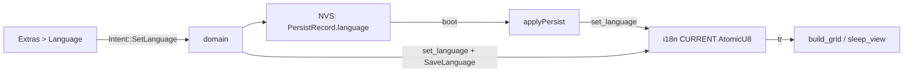

## Architecture (as simple as possible)

One `Strings` struct with `&'static str` fields, three constant instances (`EN`, `PL`, `DE`), and a `tr()` function returning the current one via a global `AtomicU8`. Zero allocation, everything compile-time; adding a new string = one field + 3 values.

ASCII choice without diacritics: PL without tails (`Predkosc`, `Zapisz`), DE transliteration (`ae/oe/ue/ss`). No changes to [display.rs](longfred/crates/firmware/src/ui/display.rs) and [fonts.rs](longfred/crates/firmware/src/ui/fonts.rs).

## File changes

### 1. [proto/src/persist.rs](longfred/crates/proto/src/persist.rs)
- `pub enum Language { En, Pl, De }` + `Default = En`, `as_u8`/`from_u8`.
- Field `pub language: Language` in `PersistRecord` (default `En`).
- `const TAG_LANG: u8 = 6;` — `encode` appends tag+byte; `decode` handles `TAG_LANG` in the tag loop (`version >= 2`). Records without the tag → `En` (backward compatible, like `TAG_DEV`).
- Tests: `roundtrip_language`, `decode_without_lang_defaults_en`.

### 2. [firmware/src/ui/i18n.rs](longfred/crates/firmware/src/ui/i18n.rs) (main change)
- `static CURRENT: AtomicU8` + `pub fn set_language(Language)` / `fn current() -> Language` (riscv32imac has atomics).
- `pub struct Strings { ... }` with ~65 fields: all used `MSG_*`/`HINT_*`/`MENU_*` + literals currently hardcoded (Extras, ServerProto, Device, DirectCommands) + `show_message` messages + new Language screen.
- `pub const EN/PL/DE: Strings` and `pub fn tr() -> &'static Strings`.
- Unchanged: `FW_VERSION`, `APP_NAME`, `PW_BLANK_CHAR`, `BROADCAST_TIMEOUT_MS`, `RECEIVING_REFRESH_MS`. Remove unused constants (MSG_WIFI_*, MSG_SRV_*, etc.).

### 3. [firmware/src/ui/menu.rs](longfred/crates/firmware/src/ui/menu.rs)
- Replace ~50 uses of `i18n::MSG_X` → `i18n::tr().field` and literals in `build_grid` (lines 1293-1294, 1330-1339, 1382-1383, 1447-1452).
- `Screen::Language`; `Intent::SetLanguage(Language)`.
- `extras_press`: key `6` → `Screen::Language`; Extras render: new row `6 Language`.
- `language_press`: `0`=En, `1`=Pl, `2`=De → `Intent::SetLanguage`; `*` → Extras. Screen render (title + `0 EN / 1 PL / 2 DE` + hint).

### 4. [firmware/src/domain/task.rs](longfred/crates/firmware/src/domain/task.rs)
- `apply_persist`: `i18n::set_language(rec.language)`.
- `Intent::SetLanguage(l)`: `i18n::set_language(l)`, `StorageCmd::SaveLanguage(l)`, `state.persist.language = l`, message.
- `show_message("...")` (lines 188/199/205/209) → `i18n::tr().saved_*`.

### 5. [firmware/src/storage/mod.rs](longfred/crates/firmware/src/storage/mod.rs)
- `StorageCmd::SaveLanguage(Language)` + handling (save `rec.language`, `PERSIST_LOADED`).

### 6. [firmware/src/power/sleep.rs](longfred/crates/firmware/src/power/sleep.rs)
- `i18n::MSG_AUTO_SLEEP/MSG_BATTERY_SLEEP/MSG_START_SLEEP` → `i18n::tr().*` (`APP_NAME` unchanged).

## Out of scope
- `Fwd`/`Rev` indicators in [display.rs](longfred/crates/firmware/src/ui/display.rs) (remain as-is; can be added later).
- No diacritics (deliberate choice — no font change).

## Verification
- `cargo test -p longfred-proto --target x86_64-unknown-linux-gnu`
- `cargo build -p longfred-firmware`
