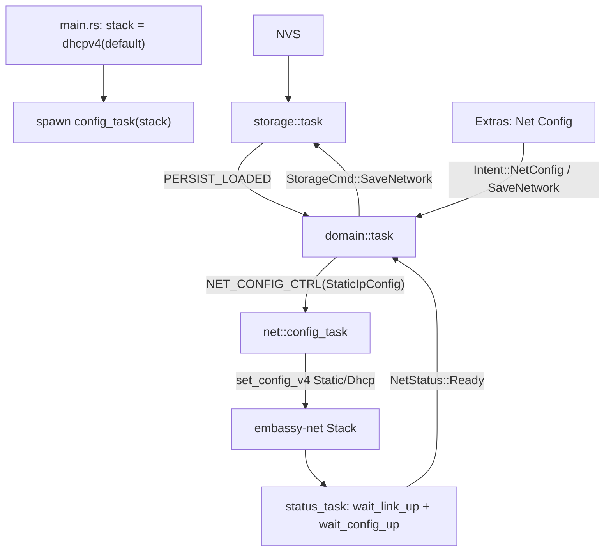

# Static WiFi client IP (DHCP alternative, configurable from UI, persisted)

## Decisions (confirmed with user)
- **Live application** via `stack.set_config_v4(...)` (no restart).
- **Fields**: IP (required) + mask (prefix) + gateway + DNS; mask/gateway auto-filled from IP (rest optional); DNS optional (no internet, mDNS only).
- Boot with DHCP default, after loading persist we apply static config via the same path as UI change (unified flow).

## Architecture (flow)



Key: static config set live causes `wait_config_up()` to return immediately — therefore `status_task` must first wait for `wait_link_up()` (WiFi association) before announcing `Ready`. This fixes the race where mDNS/WiT start before link-up.

## Diff 1 - `crates/proto/src/persist.rs` (new type + v2 + versioned decode)

New type and field:
```rust
const TAG_NET: u8 = 3;
pub const VERSION: u16 = 2; // was 1

#[derive(Clone, PartialEq, Eq, Debug, Default)]
pub struct StaticIpConfig {
    pub dhcp: bool,
    pub ip: [u8; 4],
    pub prefix_len: u8,        // 0..32 (mask); default 24
    pub gateway: Option<[u8; 4]>,
    pub dns: Option<[u8; 4]>,
}

pub struct PersistRecord {
    pub credentials: heapless::Vec<Credential, MAX_CREDENTIALS>,
    pub locos: heapless::Vec<SavedLoco, MAX_SAVED_LOCOS>,
    pub network: Option<StaticIpConfig>,   // None = DHCP/default
}
```
Encode: after locos loop, before CRC:
```rust
if let Some(n) = &self.network {
    off = write_u8(buf, off, TAG_NET)?;
    off = write_u8(buf, off, n.dhcp as u8)?;
    off = write_bytes(buf, off, &n.ip)?;
    off = write_u8(buf, off, n.prefix_len)?;
    let gw = n.gateway.unwrap_or([0;4]);
    off = write_u8(buf, off, n.gateway.is_some() as u8)?;
    off = write_bytes(buf, off, &gw)?;
    let dns = n.dns.unwrap_or([0;4]);
    off = write_u8(buf, off, n.dns.is_some() as u8)?;
    off = write_bytes(buf, off, &dns)?;
}
```
Decode: branch by version:
```rust
let version = read_u16(buf, &mut off)?;
match version {
    1 => { /* read creds+locos, network=None */ }
    2 => {
        // read creds+locos as before
        // optional TAG_NET before CRC
        if off + 4 < buf.len() {  // bytes remaining before CRC
            let tag = read_u8(buf, &mut off)?;
            if tag == TAG_NET {
                let dhcp = read_u8(buf, &mut off)? != 0;
                let mut ip = [0u8;4]; /* read_bytes */
                let prefix_len = read_u8(buf, &mut off)?;
                let has_gw = read_u8(buf, &mut off)? != 0;
                let gw = read_bytes(...); let gateway = has_gw.then_some(gw);
                let has_dns = read_u8(buf, &mut off)? != 0;
                let dns = read_bytes(...); let dns = has_dns.then_some(dns);
                rec.network = Some(StaticIpConfig { dhcp, ip, prefix_len, gateway, dns });
            } else { return None; }
        }
    }
    _ => return None,
}
// CRC verify (common for v1/v2)
```
Note: `Default` for `StaticIpConfig` = `dhcp:true`. `PersistRecord::default()` has `network: None` (i.e. DHCP).
Host tests: roundtrip with network (static+dhcp), v1 decode -> network=None, auto-fill defaults, decode-None on truncations.

## Diff 2 - `crates/firmware/src/storage/mod.rs`
```rust
pub enum StorageCmd {
    SavePassword { ssid: String<32>, password: String<64> },
    SaveLocos(heapless::Vec<SavedLoco, { persist::MAX_SAVED_LOCOS }>),
    SaveNetwork(longfred_proto::persist::StaticIpConfig),  // new
    Clear,
}
```
In task: `SaveNetwork(cfg) => { rec.network = Some(cfg); persist(&mut flash, &rec); PERSIST_LOADED.signal(rec.clone()); }`. `Clear` leaves `network: None` (DHCP).

## Diff 3 - `crates/firmware/src/net/mod.rs` + new `config_task`
New signal + task:
```rust
pub static NET_CONFIG_CTRL: Signal<CriticalSectionRawMutex, StaticIpConfig> = Signal::new();
```
New file or in `wifi.rs`:
```rust
#[embassy_executor::task]
pub async fn config_task(stack: Stack<'static>) {
    let rx = NET_CONFIG_CTRL.receiver();
    loop {
        let cfg = rx.receive().await;
        let v4 = if cfg.dhcp {
            embassy_net::ConfigV4::Dhcp(Default::default())
        } else {
            embassy_net::ConfigV4::Static(embassy_net::StaticConfigV4 {
                address: embassy_net::Ipv4Cidr::new(
                    embassy_net::Ipv4Address::new(cfg.ip[0],cfg.ip[1],cfg.ip[2],cfg.ip[3]),
                    cfg.prefix_len),
                gateway: cfg.gateway.map(|g| embassy_net::Ipv4Address::new(g[0],g[1],g[2],g[3])),
                dns_servers: cfg.dns.map(|d| {
                    let mut v = heapless::Vec::new();
                    let _ = v.push(embassy_net::Ipv4Address::new(d[0],d[1],d[2],d[3]));
                    v
                }).unwrap_or_default(),
            })
        };
        stack.set_config_v4(v4);
        info!("net config applied: dhcp={}", cfg.dhcp);
    }
}
```
`status_task` - race fix (link-up gating):
```rust
loop {
    stack.wait_link_up().await;       // wait for WiFi association
    stack.wait_config_up().await;     // wait for config (DHCP lease or static)
    if let Some(cfg) = stack.config_v4() {
        info!("net ready: ip={}", cfg.address);
        sender.send(NetStatus::Ready);
    }
    stack.wait_link_down().await;     // was wait_config_down
    warn!("net link down");
}
```
`main.rs`: add `spawner.spawn(net::wifi::config_task(stack))` (stack already exists).

## Diff 4 - `crates/firmware/src/domain/task.rs`
Accepting persist and applying config:
```rust
if let Some(rec) = PERSIST_LOADED.try_take() {
    let net = rec.network.clone();
    state.load_persist(rec);
    if let Some(cfg) = net {
        let _ = NET_CONFIG_CTRL.try_send(cfg);  // apply live
    }
}
```
New `Intent::NetConfig` (opens config screen) and `Intent::SaveNetwork(StaticIpConfig)`:
```rust
Intent::NetConfig => { fsm.screen = Screen::IpConfig; Intent::None }
Intent::SaveNetwork(cfg) => {
    let _ = storage_tx.try_send(StorageCmd::SaveNetwork(cfg.clone()));
    let _ = NET_CONFIG_CTRL.try_send(cfg);
    state.show_message("Net saved");
}
```

## Diff 5 - `crates/firmware/src/ui/menu.rs` (new screens + intents)
Screen:
```rust
pub enum Screen { /* ... */ IpConfig, IpEdit }
pub enum Intent { /* ... */ NetConfig, SaveNetwork(longfred_proto::persist::StaticIpConfig) }
```
MenuFsm - new fields:
```rust
net_cfg: longfred_proto::persist::StaticIpConfig,  // edited buffer
ip_field: u8,        // 0=mode 1=ip 2=mask 3=gw 4=dns
ip_digits: heapless::String<12>,  // digit buffer for current field
```
Extras: add `"1 Net Config"` in build_grid Extras and `b'1' => Intent::NetConfig` in `extras_press` (1,2,6 are free).

`Screen::IpConfig` (overview):
- Line0 "Net Config", Line1 "DHCP" or "Static <ip>", hint "# Edit * Back".
- `#` -> enter IpEdit (load net_cfg from domain.persist, auto-fill), `*` -> Extras.

`Screen::IpEdit` (per-field, keypad digits like ServerEntry):
- Fields: 0=Mode (DHCP/Static toggle: `0`=DHCP `1`=Static), 1=IP(12 digits), 2=Mask(2 digit prefix 00-32), 3=Gateway(12 digits, optional), 4=DNS(12 digits, optional).
- `0-9` -> push digit to ip_digits; `*` -> backspace / in field 0 nothing; `#` -> next field (auto-fill mask/gateway after IP).
- Auto-fill on transition from IP field (field 1 -> 2): if mask empty -> `24`; gateway -> `ip[..3] + [1]`; DNS -> None.
- After field 4 (or `#` on DNS when empty) -> Intent::SaveNetwork(net_cfg), screen=Throttle.
- `format_net_display()` for displaying current field (e.g. "IP 192.168.000.001").

## Diff 6 - `crates/firmware/src/ui/view.rs` + `i18n.rs` + `display.rs`
- `ViewCtx`: add `net_cfg: Option<&StaticIpConfig>` (or pass via fsm in build_grid - simpler to leave in fsm, without ViewCtx). Decision: read from fsm in build_grid (like Extras), no ViewCtx change.
- `i18n.rs`: `MSG_NET_CONFIG`, `MSG_NET_DHCP`, `MSG_NET_STATIC`, `HINT_NET_CONFIG`, `HINT_NET_EDIT`.
- `display.rs`: no changes (grid text sufficient).

## Diff 7 - `crates/firmware/src/config/network.rs`
```rust
pub const DEFAULT_PREFIX_LEN: u8 = 24;
```

## Notes / trade-offs
- Boot with DHCP + live apply = unified path, but brief window (until persist loads) runs DHCP; after PERSIST_LOADED immediately switched to static. Acceptable.
- `status_task` change `wait_config_down` -> `wait_link_down` changes semantics with DHCP (link down follows deauth). Acceptable - Ready disappears on link loss.
- Mask as prefix_len (2 digits) instead of 12 digits = faster entry; auto-fill 24.
- DNS optional (None); mDNS works without DNS.
- v2 persist: old v1 records decode (network=None->DHCP); new v2 on old firmware rejected (expected).

## Verification
- `cargo test -p longfred-proto` (new persist tests: network roundtrip, v1 compat, auto-fill).
- `cargo build` in crates/firmware.
- Hardware: Extras -> Net Config -> Static -> enter IP -> Ready with static IP (log `net ready: ip=...`); restart -> config remembered; switch to DHCP -> Ready after DHCP.
