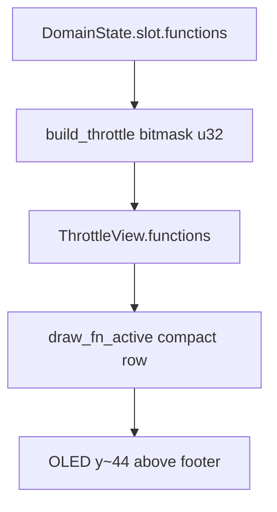

# Small numbers of enabled functions on Throttle

## Current state

Partially implemented already:
- [`menu.rs`](longfred/crates/firmware/src/ui/menu.rs) `build_throttle` builds a `functions: u32` bitmask from `slot.functions` (up to `MAX_FUNCTIONS`=32).
- [`display.rs`](longfred/crates/firmware/src/ui/display.rs) `draw_fn_boxes` drew **only F0–F7** as 10×10 boxes with a digit at `y=44`, above the footer at `y=54`.

This did not meet the “tiny numbers” requirement or higher functions (F8+, F10).

## UX goal

On the **Throttle** screen (main driving screen with a loco), **above the hint/broadcast line**, show a row of enabled function numbers only:

- No boxes — small digits only (`FONT_6X10`).
- Only ON functions (ascending order: 0, 1, 2, …).
- Range: **F0–F28** (all bits in `u32`; F29–F31 rarely used in WiThrottle, but bits 0..28 cover typical F0–F28).
- Format: `"0 1 7 10"` (space between numbers; F≥10 = two digits).
- When none are ON: draw nothing.
- Width overflow at 128 px: draw from the left as many as fit; if some remain hidden, append `+` at the end. Footer / broadcast unchanged.



## File changes

### 1. [`display.rs`](longfred/crates/firmware/src/ui/display.rs) — main work

Replace `draw_fn_boxes` with `draw_fn_active(display, functions: u32)`:

- Layout constants: `Y = 44`, `X0 = 4`, `MAX_X = 124` (leaves room for screen border).
- Iterate `f in 0..29` (or `0..32` with bit guard); if bit set, append label to draw buffer.
- Character width: 6 px (`FONT_6X10`); space = 6 px between numbers.
- For `f < 10`: one char `'0'+f`; for `f >= 10`: two digits (tens/ones).
- Before drawing the next number, check `x + needed_width <= MAX_X`; if not — draw `+` (if space remains) and stop.
- Remove `Rectangle` drawing (boxes).

Call site in `draw_throttle` stays in the same place (after loco name, before footer):

```rust
draw_fn_active(display, t.functions);
```

### 2. Model / domain — no contract change

[`ThrottleView.functions: u32`](longfred/crates/firmware/src/ui/view.rs) and bitmask assembly in `build_throttle` stay as-is. No new field or i18n needed.

Optional small fix in `build_throttle` (if loop ever truncated early): ensure `i < 32` and `i < slot.functions.len()` — current code already does this.

### 3. Out of scope

- FunctionList unchanged (still server labels).
- F-key → DCC mapping unchanged.
- Z21: shows the same as long as domain has ON in `slot.functions` (from local / echoed state).

## Verification

- `cargo build -p longfred-firmware`
- Manual (on hardware): F0/F1 ON → see `0 1`; F10 ON → see `10`; many ON → row + optional `+` on overflow; all OFF → empty band between loco and footer.
