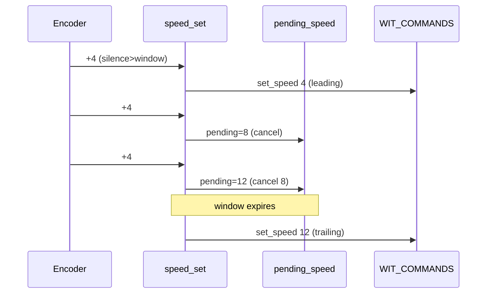

# WiFi 6 optimization: latency, reliability, speed coalescing

## Infrastructure context (bigfred WiFi 6)
The controller connects mainly to the `bigfred` project on a well-prepared WiFi 6 network (plan [bigfred WiFi Topology](bigfred_wifi_topology_d4da171b)): 3x EAP613 AX1800 on clean 2.4 GHz channels (1/6/11), ~40 ESP32-C6 controllers, target latency < 25 ms. WiFred (ESP32-C6) is WiFi 6 on 2.4 GHz (1x1, 20 MHz, OFDMA/MU-MIMO/TWT). DCC traffic = small, frequent packets; latency dominated by medium contention and retransmissions. Firmware conclusions:
- 802.11ax (OFDMA) is CRITICAL with many controllers - not a speculative option, but a requirement for OFDMA/MU-MIMO AP scheduling participation.
- Power-save (TWT/modem-sleep) MUST be disabled (latency > energy savings).
- Nagle + small packets = latency killer; disable it.

## Current state analysis (from code)

### Latency
1. [net/wit.rs](longfred/crates/firmware/src/net/wit.rs) `run_session` loop 135-196: `WIT_COMMANDS` drained ONLY after `with_timeout(READ_POLL_MS=50ms, sock.read())`. Command right after drain waits up to 50 ms. Main latency source.
2. [domain/task.rs](longfred/crates/firmware/src/domain/task.rs) `flush_cmds` 24-39: `OUTBOUND_COMMANDS_MIN_DELAY_MS=50ms` between EVERY command.
3. Nagle enabled in smoltcp by default.

### Reliability
- [net/wit.rs](longfred/crates/firmware/src/net/wit.rs) 111-128: `send_cmd` handshake results ignored (`.await;`).
- No `set_timeout` / `set_keep_alive` on `TcpSocket`.
- Fixed `RECONNECT_DELAY=2s`, no backoff.

### Speed spam
- [domain/state.rs](longfred/crates/firmware/src/domain/state.rs) `speed_set` 630-642: every encoder detent -> separate `set_speed` to `out` -> queue stretched by 50 ms ("catch-up").

### WiFi
- `esp-radio` sets `PowerSaveMode::None` in `WifiController::new`, but `set_config` in [net/wifi.rs](longfred/crates/firmware/src/net/wifi.rs) applies `StationConfig.protocols` = default `B|G|N` (no AX). WiFi 6 inactive.

## Speed coalescing model (per requirement: last value from window, cancel intermediate)

Single `pending_speed` slot (NOT a queue). New value overwrites previous pending -> intermediate values cancelled. Leading + trailing pattern:
- First change after silence > window: sent immediately (leading) - responsiveness.
- Subsequent within window: only local update (UI) + `pending_speed` overwrite; nothing goes to network.
- After window expires: ONE `set_speed` sent with last value (trailing).
- `speed == 0` (Stop) and `EStop`: always immediate, clear pending (safety).



## Detailed diffs (proposals)

### 1. [config/network.rs](longfred/crates/firmware/src/config/network.rs)
```rust
// --- Latency / command rate-limiting ---
// Minimum interval between any commands (coalescing removes main pressure).
pub const OUTBOUND_COMMANDS_MIN_DELAY_MS: u64 = 20; // was 50
/// Speed command coalescing window: only last value counts within window.
pub const SPEED_COALESCE_WINDOW_MS: u64 = 200;
/// Domain loop tick (trailing speed flush). Must be < SPEED_COALESCE_WINDOW_MS.
pub const DOMAIN_TICK_MS: u64 = 50;

// --- TCP (latency + dead connection detection) ---
pub const TCP_NODELAY: bool = true;       // disable Nagle
pub const TCP_KEEPALIVE_S: u64 = 5;
pub const TCP_TIMEOUT_S: u64 = 8;

// --- Reconnect backoff ---
pub const RECONNECT_MIN_MS: u64 = 500;
pub const RECONNECT_MAX_MS: u64 = 5_000;

// --- WiFi 6 ---
/// Enable 802.11ax (OFDMA) on 2.4 GHz - required for bigfred infrastructure.
pub const WIFI_ENABLE_11AX: bool = true;
/// Force no power-save (latency > energy savings).
pub const WIFI_FORCE_POWER_SAVE_NONE: bool = true;
```

### 2. [domain/state.rs](longfred/crates/firmware/src/domain/state.rs)
Import + field:
```rust
-use embassy_time::Instant;
+use embassy_time::{Duration, Instant};
```
```rust
     last_speed_sent: u8,
     last_speed_throttle: usize,
     last_speed_sent_at: Option<Instant>,
+    /// Last unsent speed (coalescing) + throttle it belongs to.
+    pending_speed: Option<(usize, u8)>,
 }
```
```rust
     last_speed_sent: 0,
     last_speed_throttle: 0,
     last_speed_sent_at: None,
+    pending_speed: None,
```
Rewritten `speed_set` + new `emit_speed` / `flush_pending_speed`:
```rust
    fn speed_set(&mut self, speed: u8, out: &mut heapless::Vec<Cmd, CMD_BUF>) -> bool {
        if !self.current_slot().has_loco() {
            return false;
        }
        let speed = speed.min(MAX_SPEED);
        // Local state always updated immediately (responsive UI).
        self.current_slot_mut().speed = speed;

        let now = Instant::now();
        let window = Duration::from_millis(network::SPEED_COALESCE_WINDOW_MS);
        let due = self
            .last_speed_sent_at
            .map_or(true, |at| now.duration_since(at) >= window);

        // Stop (0) is critical -> always immediate, clears pending.
        if speed == 0 || due {
            let idx = self.current;
            self.emit_speed(idx, speed, out, now);
        } else {
            // Coalescing: overwrite pending (cancels earlier intermediate values).
            self.pending_speed = Some((self.current, speed));
        }
        true
    }

    fn emit_speed(
        &mut self,
        throttle: usize,
        speed: u8,
        out: &mut heapless::Vec<Cmd, CMD_BUF>,
        now: Instant,
    ) {
        let t = throttle_char(throttle);
        push_cmd(out, protocol::set_speed(t, speed));
        self.last_speed_sent = speed;
        self.last_speed_throttle = throttle;
        self.last_speed_sent_at = Some(now);
        self.pending_speed = None;
    }

    /// Trailing flush: after window expires send last (pending) speed.
    /// Called periodically from domain loop.
    pub fn flush_pending_speed(&mut self, out: &mut heapless::Vec<Cmd, CMD_BUF>) {
        let Some((idx, speed)) = self.pending_speed else {
            return;
        };
        let now = Instant::now();
        let window = Duration::from_millis(network::SPEED_COALESCE_WINDOW_MS);
        let due = self
            .last_speed_sent_at
            .map_or(true, |at| now.duration_since(at) >= window);
        if due {
            self.emit_speed(idx, speed, out, now);
        }
    }
```
Note: `EStop` goes via separate path (`Action::EStop` -> own command), so doesn't touch coalescing; additionally worth clearing `self.pending_speed = None` in EStop handling so pending trailing doesn't override stop.

### 3. [domain/task.rs](longfred/crates/firmware/src/domain/task.rs)
Tick from config + trailing flush before `flush_cmds`:
```rust
             input_rx.receive(),
             events_rx.receive(),
-            Timer::after(Duration::from_millis(80)),
+            Timer::after(Duration::from_millis(config::network::DOMAIN_TICK_MS)),
```
At end of loop, just before publish/send:
```rust
+        // Trailing: send last speed after coalescing window expires.
+        state.flush_pending_speed(&mut out);
+
         pw_buf = fsm.password_preview();
         ip_buf = fsm.format_ip_display();
         // publish_view(...);
         flush_cmds(&cmd_tx, &mut out, &mut last_cmd).await;
```
(Inactivity/auto-sleep still works on `last_activity`, independent of tick.)

### 4. [net/wit.rs](longfred/crates/firmware/src/net/wit.rs)
Import + remove `READ_POLL_MS`:
```rust
-use embassy_time::{with_timeout, Duration, Instant, Timer};
+use embassy_futures::select::{select3, Either3};
+use embassy_time::{Duration, Instant, Timer};
```
```rust
-const READ_POLL_MS: u64 = 50;
-const RECONNECT_DELAY: Duration = Duration::from_secs(2);
```
TCP options after socket creation + handshake with error checking:
```rust
     let mut sock = TcpSocket::new(stack, rx, tx);
+    sock.set_nagle_enabled(!config::network::TCP_NODELAY);
+    sock.set_timeout(Some(Duration::from_secs(config::network::TCP_TIMEOUT_S)));
+    sock.set_keep_alive(Some(Duration::from_secs(config::network::TCP_KEEPALIVE_S)));
     let remote = IpEndpoint::new(/* ... */);
     if sock.connect(remote).await.is_err() {
         warn!("wit tcp connect failed");
         return false; // NO connection -> backoff increases
     }
     WIT_CONN.sender().send(WitConnState::Connected);

     let mut leading_crlf = false;
-    send_cmd(&mut sock, &mut leading_crlf, &protocol::handshake_name(config::DEVICE_NAME)).await;
-    send_cmd(&mut sock, &mut leading_crlf, &protocol::handshake_id(config::DEVICE_ID)).await;
-    send_cmd(&mut sock, &mut leading_crlf, &protocol::heartbeat_enable(config::buttons::HEARTBEAT_ENABLED)).await;
+    if !send_cmd(&mut sock, &mut leading_crlf, &protocol::handshake_name(config::DEVICE_NAME)).await
+        || !send_cmd(&mut sock, &mut leading_crlf, &protocol::handshake_id(config::DEVICE_ID)).await
+        || !send_cmd(&mut sock, &mut leading_crlf,
+                &protocol::heartbeat_enable(config::buttons::HEARTBEAT_ENABLED)).await
+    {
+        warn!("wit handshake failed");
+        sock.close();
+        return true; // connection was established -> fast reconnect
+    }
```
Event-driven loop (instead of 50 ms polling):
```rust
    let cmd_rx = WIT_COMMANDS.receiver();
    let mut line = heapless::String::<LINE_BUF_SIZE>::new();
    let mut read_buf = [0u8; 128];
    let mut last_rx = Instant::now();
    let mut hb_last = Instant::now();
    const TICK: Duration = Duration::from_millis(250);

    loop {
        let hb_period = Duration::from_secs(*heartbeat_period as u64);
        match select3(
            sock.read(&mut read_buf),
            cmd_rx.receive(),
            Timer::after(TICK),
        )
        .await
        {
            // Data from server
            Either3::First(Ok(0)) => { warn!("wit read eof"); sock.close(); return true; }
            Either3::First(Ok(n)) => {
                last_rx = Instant::now();
                feed_line_buf(&mut line, &read_buf[..n], heartbeat_period);
            }
            Either3::First(Err(_)) => { warn!("wit read error"); sock.close(); return true; }
            // Command to server - sent IMMEDIATELY (zero poll latency)
            Either3::Second(cmd) => {
                if !send_cmd(&mut sock, &mut leading_crlf, &cmd).await {
                    warn!("wit command write failed"); sock.close(); return true;
                }
            }
            // Periodic: heartbeat, toggle, watchdog
            Either3::Third(_) => {
                if hb_last.elapsed() >= hb_period {
                    if !send_cmd(&mut sock, &mut leading_crlf, &protocol::heartbeat()).await {
                        warn!("wit heartbeat write failed"); sock.close(); return true;
                    }
                    hb_last = Instant::now();
                }
                if let Some(on) = net::WIT_HEARTBEAT.try_take() {
                    if !send_cmd(&mut sock, &mut leading_crlf, &protocol::heartbeat_enable(on)).await {
                        warn!("wit hb toggle write failed"); sock.close(); return true;
                    }
                }
                if last_rx.elapsed() > hb_period * 2 {
                    warn!("wit watchdog: no data, reconnect"); sock.close(); return true;
                }
            }
        }
    }
```
Borrow-checker note: `sock.read(&mut read_buf)` holds `&mut sock` only until `select3(...).await` completes; in `Second` branch `&mut sock` can be used again (futures are cancel-safe, drop doesn't lose data).

`task()` with backoff (`run_session` return semantics: `true` = connection was established, `false` = connect failed):
```rust
#[embassy_executor::task]
pub async fn task(stack: Stack<'static>) {
    let mut heartbeat_period = config::buttons::DEFAULT_HEARTBEAT_PERIOD_S;
    let mut fails: u32 = 0;
    loop {
        WIT_CONN.sender().send(WitConnState::Connecting);
        let ep = wait_for_server().await;
        let established = run_session(stack, ep, &mut heartbeat_period).await;
        WIT_CONN.sender().send(WitConnState::Disconnected);
        if established {
            fails = 0; // short pause, session was active
            Timer::after(Duration::from_millis(config::network::RECONNECT_MIN_MS)).await;
        } else {
            let backoff = (config::network::RECONNECT_MIN_MS << fails.min(4))
                .min(config::network::RECONNECT_MAX_MS);
            fails = fails.saturating_add(1);
            Timer::after(Duration::from_millis(backoff)).await;
        }
    }
}
```

### 5. [net/wifi.rs](longfred/crates/firmware/src/net/wifi.rs)
Import:
```rust
 use esp_radio::wifi::{
     ap::AccessPointInfo, scan::ScanConfig, sta::StationConfig, AuthenticationMethod,
-    Config as WifiConfig, Interface, WifiController, WifiError,
+    Config as WifiConfig, Interface, PowerSaveMode, Protocol, Protocols, WifiController, WifiError,
 };
```
In `WifiCmd::Connect` branch, after successful `set_config`, BEFORE `connect_async` (`set_config` applies default `B|G|N`, so we override after it):
```rust
                    if let Err(e) = controller.set_config(&cfg) {
                        warn!("wifi set_config error: {:?}", e);
                        Timer::after(RETRY_DELAY).await;
                        continue;
                    }
+                    if config::network::WIFI_FORCE_POWER_SAVE_NONE {
+                        if let Err(e) = controller.set_power_saving(PowerSaveMode::None) {
+                            warn!("wifi set_power_saving error: {:?}", e);
+                        }
+                    }
+                    if config::network::WIFI_ENABLE_11AX {
+                        // 2.4 GHz: add AX (OFDMA) to B|G|N. Negotiated down when AP doesn't support.
+                        let protocols = Protocols::default()
+                            .with_2_4(Protocol::B | Protocol::G | Protocol::N | Protocol::AX);
+                        if let Err(e) = controller.set_protocols(protocols) {
+                            warn!("wifi set_protocols error: {:?}", e);
+                        }
+                    }
                     info!("wifi connecting to SSID={}", ssid.as_str());
```
Requires `use crate::config;` in [net/wifi.rs](longfred/crates/firmware/src/net/wifi.rs) (currently only `use crate::config::sizes;`). Builder method `with_2_4` comes from `#[derive(BuilderLite)]` on `Protocols` (`_2_4` field); confirmed in MIGRATING-0.17.0 esp-radio.

## Notes / trade-offs
- Coalescing adds max ~1 tick (`DOMAIN_TICK_MS`=50 ms) trailing latency on final value after stopping rotation - in exchange for zero "catch-up" queue.
- Stop/EStop intentionally bypass coalescing.
- `set_protocols` after `set_config` and before `connect_async` - protocols must be set before association for AX to apply.
- Backoff increases only when connect fails entirely (TCP connect fail); broken active session -> fast reconnect (`RECONNECT_MIN_MS`).

## Verification
- `cargo build` in [crates/firmware](longfred/crates/firmware) (riscv32imac).
- `cargo test -p longfred-proto` (coalescing logic is in firmware; proto tests without regression).
- Manually: `wit` logs - commands immediate; fast encoder rotation -> <= 1 `set_speed` / window + final value; reconnect after break within backoff bounds; AX/PS confirmation log.
