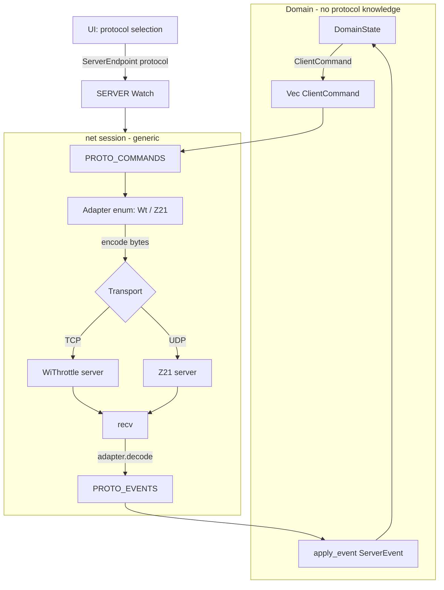

# Z21 + universal protocol interface (WiThrottle / Z21)

## Key finding (from research)
Currently `Cmd = heapless::String<64>` is a **ready-made WiThrottle string**, and `DomainState` calls `protocol::*` directly. That is the coupling point. We introduce **semantic `ClientCommand`** (protocol-agnostic) + two encode/decode adapters. The domain says "throttle + intent", adapters translate to bytes.

User decisions: Z21 = driving (no turnouts/roster); per-loco speed steps (learned from `LAN_X_LOCO_INFO` DB2 KKK, default 128).

## Architecture



Seam: **DomainState produces/consumes semantic types** (`ClientCommand`, `ServerEvent`). WiThrottle adapter is nearly stateless (wraps existing `protocol.rs`+`parser.rs`). Z21 adapter is **stateful** (throttle→loco map + per-loco speed/dir/steps/funcs), because Z21 addresses per-loco and combines speed+direction in one packet.

---

## Diff 1 - `crates/proto/src/command.rs` (new) - semantic layer
```rust
use crate::model::{Direction, ShortText, TurnoutAction};

#[derive(Clone, Copy, PartialEq, Eq, Debug)]
pub enum Protocol { WiThrottle, Z21 }

/// Numeric DCC loco identity (protocol-neutral).
#[derive(Clone, Copy, PartialEq, Eq, Debug)]
pub struct LocoId { pub addr: u16, pub long: bool }

impl LocoId {
    /// Parse "S123" / "L341" / "123" (WiThrottle-style or bare).
    pub fn parse(s: &str) -> Option<Self> {
        let (long, digits) = match s.as_bytes().first() {
            Some(b'S') => (false, &s[1..]),
            Some(b'L') => (true, &s[1..]),
            _ => (s.parse::<u16>().map(|a| a >= 128).ok()?, s),
        };
        let addr = digits.parse::<u16>().ok()?;
        Some(Self { addr, long })
    }
}

/// Protocol-agnostic command produced by the domain.
#[derive(Clone, PartialEq, Eq, Debug)]
pub enum ClientCommand {
    AddLoco { throttle: u8, loco: LocoId, name: ShortText },
    ReleaseThrottle { throttle: u8 },
    SetSpeed { throttle: u8, speed: u8 },       // 0..=126 (128-step scale)
    SetDirection { throttle: u8, dir: Direction },
    EStop { throttle: u8 },
    SetFunction { throttle: u8, func: u8, on: bool, all: bool },
    TrackPower(bool),
    SetHeartbeat(bool),                          // WiThrottle only; Z21 no-op
    Turnout { action: TurnoutAction, sys_name: ShortText }, // WiThrottle only
    Route { sys_name: ShortText },                          // WiThrottle only
    Steal { throttle: u8, loco: LocoId },                   // WiThrottle only
}
```

## Diff 2 - `crates/proto/src/adapter.rs` (new) - shared interface
Enum-dispatch (no allocation/vtable). `WireBuf` is the output buffer for one transmission (for Z21 several datasets may be concatenated in one datagram — see spec 1.3).
```rust
use crate::command::ClientCommand;
use crate::events::ServerEvent;

pub type WireBuf = heapless::Vec<u8, 256>;

pub enum Adapter {
    Wt(crate::wt::WtAdapter),
    Z21(crate::z21::Z21Adapter),
}

impl Adapter {
    /// Bytes to send immediately after transport connect (handshake / broadcast flags).
    pub fn on_connect(&mut self, out: &mut WireBuf, emit: &mut dyn FnMut(ServerEvent)) {
        match self { Adapter::Wt(a) => a.on_connect(out, emit), Adapter::Z21(a) => a.on_connect(out, emit) }
    }
    /// Encode one semantic command; may also emit local echo events (e.g. Z21 AddressAdded).
    pub fn encode(&mut self, cmd: &ClientCommand, out: &mut WireBuf, emit: &mut dyn FnMut(ServerEvent)) {
        match self { Adapter::Wt(a) => a.encode(cmd, out, emit), Adapter::Z21(a) => a.encode(cmd, out, emit) }
    }
    /// Feed received bytes; emit decoded ServerEvents.
    pub fn decode(&mut self, data: &[u8], emit: &mut dyn FnMut(ServerEvent)) {
        match self { Adapter::Wt(a) => a.decode(data, emit), Adapter::Z21(a) => a.decode(data, emit) }
    }
    /// Periodic keepalive/heartbeat; returns true if `out` filled.
    pub fn on_tick(&mut self, out: &mut WireBuf) -> bool {
        match self { Adapter::Wt(a) => a.on_tick(out), Adapter::Z21(a) => a.on_tick(out) }
    }
    pub fn tick_period_s(&self) -> u32 {
        match self { Adapter::Wt(a) => a.heartbeat_period, Adapter::Z21(_) => 30 }
    }
}
```

## Diff 3 - `crates/proto/src/wt.rs` (new) - WiThrottle adapter
Wraps existing [protocol.rs](longfred/crates/proto/src/protocol.rs) (builder) + [parser.rs](longfred/crates/proto/src/parser.rs) (decode). Moves `feed_line_buf`/handshake from firmware.
```rust
use crate::command::{ClientCommand, LocoId};
use crate::{parser, protocol};
use crate::events::ServerEvent;
use crate::model::throttle_char_u8; // helper: 0->'0' etc (see Diff 8)

pub struct WtAdapter {
    name: heapless::String<32>,
    id: heapless::String<32>,
    line: heapless::String<256>,
    pub heartbeat_period: u32,
    leading_crlf: bool,
}

impl WtAdapter {
    pub fn new(name: &str, id: &str, hb: u32) -> Self { /* fill strings */ }

    pub fn on_connect(&mut self, out: &mut super::adapter::WireBuf, _emit: &mut dyn FnMut(ServerEvent)) {
        self.push_line(out, &protocol::handshake_name(&self.name));
        self.push_line(out, &protocol::handshake_id(&self.id));
        self.push_line(out, &protocol::heartbeat_enable(true));
    }

    pub fn encode(&mut self, cmd: &ClientCommand, out: &mut super::adapter::WireBuf, _emit: &mut dyn FnMut(ServerEvent)) {
        let t = throttle_char_u8(match cmd { /* extract throttle */ });
        match cmd {
            ClientCommand::AddLoco { throttle, loco, name } => {
                let a = loco_str(*loco); // "S123"/"L341"
                self.push_line(out, &protocol::add_loco(throttle_char_u8(*throttle), a.as_str(), name));
            }
            ClientCommand::ReleaseThrottle { throttle } =>
                self.push_line(out, &protocol::release_loco(throttle_char_u8(*throttle), "*")),
            ClientCommand::SetSpeed { throttle, speed } =>
                self.push_line(out, &protocol::set_speed(throttle_char_u8(*throttle), *speed)),
            ClientCommand::SetDirection { throttle, dir } =>
                self.push_line(out, &protocol::set_direction(throttle_char_u8(*throttle), "*", *dir)),
            ClientCommand::EStop { throttle } =>
                self.push_line(out, &protocol::estop(throttle_char_u8(*throttle), "*")),
            ClientCommand::SetFunction { throttle, func, on, all } => {
                let sel = if *all { "*" } else { "" };
                self.push_line(out, &protocol::set_function(throttle_char_u8(*throttle), sel, *func, *on, false));
            }
            ClientCommand::TrackPower(on) => self.push_line(out, &protocol::track_power(*on)),
            ClientCommand::SetHeartbeat(on) => self.push_line(out, &protocol::heartbeat_enable(*on)),
            ClientCommand::Turnout { action, sys_name } => self.push_line(out, &protocol::turnout(*action, sys_name)),
            ClientCommand::Route { sys_name } => self.push_line(out, &protocol::route(sys_name)),
            ClientCommand::Steal { throttle, loco } =>
                self.push_line(out, &protocol::steal_loco(throttle_char_u8(*throttle), loco_str(*loco).as_str())),
        }
    }

    pub fn decode(&mut self, data: &[u8], emit: &mut dyn FnMut(ServerEvent)) {
        for &b in data {
            if b == b'\n' {
                let s = self.line.as_str().trim_end_matches(['\r','\n']);
                parser::parse(s, |ev| {
                    if let ServerEvent::HeartbeatConfig { seconds } = &ev { self.heartbeat_period = (*seconds).max(1); }
                    emit(ev);
                });
                self.line.clear();
            } else if b != b'\r' { let _ = self.line.push(b as char); }
        }
    }

    pub fn on_tick(&mut self, out: &mut super::adapter::WireBuf) -> bool {
        self.push_line(out, &protocol::heartbeat()); true
    }

    fn push_line(&mut self, out: &mut super::adapter::WireBuf, cmd: &protocol::Cmd) {
        if !self.leading_crlf { let _ = out.extend_from_slice(b"\r\n"); self.leading_crlf = true; }
        let _ = out.extend_from_slice(cmd.as_bytes());
        let _ = out.extend_from_slice(b"\r\n");
    }
}
```
Note: watchdog/heartbeat-period logic stays in session; adapter only tracks period.

## Diff 4 - `crates/proto/src/z21.rs` (new) - Z21 adapter (host-testable)
Stateful: loco map (throttle, addr, long, steps, speed, dir, funcs). X-BUS builder + XOR + address + LOCO_INFO parser. All pure -> host tests.
```rust
use crate::command::{ClientCommand, LocoId};
use crate::events::ServerEvent;
use crate::model::{Direction, throttle_char};

const HDR_XBUS: u16 = 0x0040;
const MAX_LOCOS: usize = 16;

#[derive(Clone, Copy)]
struct Slot { throttle: u8, addr: u16, long: bool, steps: u8, speed: u8, dir: Direction, funcs: u32 }

#[derive(Default)]
pub struct Z21Adapter { locos: heapless::Vec<Slot, MAX_LOCOS> }

fn xor(x: &[u8]) -> u8 { x.iter().fold(0, |a, b| a ^ b) }

fn put_frame(out: &mut super::adapter::WireBuf, header: u16, data: &[u8]) {
    let len = (4 + data.len()) as u16;
    let _ = out.extend_from_slice(&len.to_le_bytes());
    let _ = out.extend_from_slice(&header.to_le_bytes());
    let _ = out.extend_from_slice(data);
}
fn put_xbus(out: &mut super::adapter::WireBuf, xbus: &[u8]) {
    // xbus already includes X-header..last data; append XOR
    let len = (4 + xbus.len() + 1) as u16;
    let _ = out.extend_from_slice(&len.to_le_bytes());
    let _ = out.extend_from_slice(&HDR_XBUS.to_le_bytes());
    let _ = out.extend_from_slice(xbus);
    let _ = out.push(xor(xbus));
}
fn addr_bytes(addr: u16, long: bool) -> [u8; 2] {
    let mut msb = ((addr >> 8) & 0x3F) as u8;
    if long || addr >= 128 { msb |= 0xC0; }
    [msb, (addr & 0xFF) as u8]
}

/// Domain speed 0..=126 (128-step scale) -> DB3 RVVVVVVV for given steps.
fn encode_db3(speed: u8, dir: Direction, steps: u8) -> u8 {
    let r = if dir == Direction::Forward { 0x80 } else { 0x00 };
    match steps {
        14 => { let v = if speed == 0 {0} else {((speed as u16 * 14 / 126) as u8 + 1).min(15)}; r | v }
        28 => { /* rescale to 1..28 then interleave V5 like bigfred encodeLocoDriveDB3 */ r | encode28(speed) }
        _  => { let v = if speed == 0 {0} else {(speed as u16 + 1).min(127) as u8}; r | v } // 128
    }
}
fn steps_db0(steps: u8) -> u8 { match steps { 14 => 0x10, 28 => 0x12, _ => 0x13 } } // 0x10|S

impl Z21Adapter {
    pub fn on_connect(&mut self, out: &mut super::adapter::WireBuf, _emit: &mut dyn FnMut(ServerEvent)) {
        put_frame(out, 0x0050, &0x0000_0001u32.to_le_bytes()); // LAN_SET_BROADCASTFLAGS
        put_xbus(out, &[0x21, 0x24]);                          // LAN_X_GET_STATUS
        // re-subscribe known locos
        for s in self.locos.clone() { let a = addr_bytes(s.addr, s.long); put_xbus(out, &[0xE3, 0xF0, a[0], a[1]]); }
    }

    pub fn encode(&mut self, cmd: &ClientCommand, out: &mut super::adapter::WireBuf, emit: &mut dyn FnMut(ServerEvent)) {
        match cmd {
            ClientCommand::AddLoco { throttle, loco, .. } => {
                let _ = self.locos.push(Slot{ throttle:*throttle, addr:loco.addr, long:loco.long, steps:128, speed:0, dir:Direction::Forward, funcs:0 });
                let a = addr_bytes(loco.addr, loco.long);
                put_xbus(out, &[0xE3, 0xF0, a[0], a[1]]);          // GET_LOCO_INFO (subscribe)
                // local echo so domain updates consist like WiThrottle AddressAdded
                emit(ServerEvent::AddressAdded { throttle: throttle_char(*throttle as usize), addr: loco_addr_str(*loco), entry: Default::default() });
            }
            ClientCommand::ReleaseThrottle { throttle } => {
                for s in self.locos.iter().filter(|s| s.throttle == *throttle) {
                    let a = addr_bytes(s.addr, s.long);
                    put_xbus(out, &[0xE3, 0x44, a[0], a[1]]);      // PURGE_LOCO (optional)
                    emit(ServerEvent::AddressRemoved { throttle: throttle_char(*throttle as usize), addr: loco_addr_num(s.addr), entry: Default::default() });
                }
                self.locos.retain(|s| s.throttle != *throttle);
            }
            ClientCommand::SetSpeed { throttle, speed } => self.drive(*throttle, Some(*speed), None, out),
            ClientCommand::SetDirection { throttle, dir } => self.drive(*throttle, None, Some(*dir), out),
            ClientCommand::EStop { throttle } => {
                for s in self.locos.iter().filter(|s| s.throttle == *throttle) {
                    let a = addr_bytes(s.addr, s.long);
                    put_xbus(out, &[0x92, a[0], a[1]]);            // LAN_X_SET_LOCO_E_STOP
                }
            }
            ClientCommand::SetFunction { throttle, func, on, .. } => {
                for s in self.locos.iter_mut().filter(|s| s.throttle == *throttle) {
                    let a = addr_bytes(s.addr, s.long);
                    let tt = if *on { 0x40 } else { 0x00 };
                    put_xbus(out, &[0xE4, 0xF8, a[0], a[1], tt | (func & 0x3F)]);
                    if *on { s.funcs |= 1 << func; } else { s.funcs &= !(1 << func); }
                }
            }
            ClientCommand::TrackPower(on) => put_xbus(out, &[0x21, if *on {0x81} else {0x80}]),
            // Z21 no-ops:
            ClientCommand::SetHeartbeat(_) | ClientCommand::Turnout{..}
              | ClientCommand::Route{..} | ClientCommand::Steal{..} => {}
        }
    }

    fn drive(&mut self, throttle: u8, speed: Option<u8>, dir: Option<Direction>, out: &mut super::adapter::WireBuf) {
        for s in self.locos.iter_mut().filter(|s| s.throttle == throttle) {
            if let Some(v) = speed { s.speed = v; }
            if let Some(d) = dir { s.dir = d; }
            let a = addr_bytes(s.addr, s.long);
            put_xbus(out, &[0xE4, steps_db0(s.steps), a[0], a[1], encode_db3(s.speed, s.dir, s.steps)]);
        }
    }

    pub fn decode(&mut self, data: &[u8], emit: &mut dyn FnMut(ServerEvent)) {
        let mut b = data;
        while b.len() >= 4 {
            let len = u16::from_le_bytes([b[0], b[1]]) as usize;
            if len < 4 || len > b.len() { break; }
            let (frame, rest) = b.split_at(len); b = rest;
            let header = u16::from_le_bytes([frame[2], frame[3]]);
            if header != HDR_XBUS || frame.len() < 5 { continue; }
            match frame[4] {
                0xEF => self.on_loco_info(&frame[4..], emit),  // LAN_X_LOCO_INFO
                0x61 if frame.len() >= 6 => match frame[5] {
                    0x00 => emit(ServerEvent::TrackPower(crate::model::TrackPower::Off)),
                    0x01 => emit(ServerEvent::TrackPower(crate::model::TrackPower::On)),
                    _ => {}
                },
                0x81 => { /* BC_STOPPED: emit Message("E-STOP") */ }
                _ => {}
            }
        }
    }

    fn on_loco_info(&mut self, x: &[u8], emit: &mut dyn FnMut(ServerEvent)) {
        // x[0]=0xEF, x[1]=MSB, x[2]=LSB, x[3]=DB2(KKK), x[4]=DB3(RVVVVVVV), x[5..]=funcs
        if x.len() < 6 { return; }
        let addr = ((x[1] as u16 & 0x3F) << 8) | x[2] as u16;
        let steps = match x[3] & 0x07 { 0 => 14, 2 => 28, _ => 128 };
        let (speed, dir) = decode_db3(x[3], x[4]);
        for s in self.locos.iter_mut().filter(|s| s.addr == addr) {
            s.steps = steps; s.speed = speed; s.dir = dir;
            let t = throttle_char(s.throttle as usize);
            emit(ServerEvent::Speed { throttle: t, speed });
            emit(ServerEvent::DirectionLead { throttle: t, dir });
            // function bytes DB4.. -> emit changed FunctionState (compare with s.funcs)
        }
    }

    pub fn on_tick(&mut self, out: &mut super::adapter::WireBuf) -> bool {
        put_frame(out, 0x0085, &[]); true // LAN_SYSTEMSTATE_GETDATA keepalive (< 60s idle)
    }
}
```
Host tests (`#[cfg(test)]`): drive 128/14/28 roundtrip (encode_db3/decode_db3), addr_bytes for 3/31/128/9999, `LAN_X_SET_LOCO_FUNCTION` TT bits, datagram split, parse LOCO_INFO -> Speed/DirectionLead. Golden hex from bigfred/spec, e.g. drive addr31 128 stop rev = `0A 00 40 00 E4 13 00 1F 00 E8`.

## Diff 5 - `crates/proto/src/lib.rs`
```rust
pub mod adapter;
pub mod command;
pub mod wt;
pub mod z21;
pub use command::{ClientCommand, LocoId, Protocol};
```

## Diff 6 - `crates/firmware/src/net/mod.rs` - protocol-agnostic channels
```rust
use longfred_proto::command::{ClientCommand, Protocol};

pub struct ServerEndpoint { pub ip: [u8;4], pub port: u16, pub protocol: Protocol }
pub static SERVER: Watch<CriticalSectionRawMutex, Option<ServerEndpoint>, 2> = Watch::new_with(None);

pub static PROTO_COMMANDS: Channel<CriticalSectionRawMutex, ClientCommand, WIT_COMMANDS_DEPTH> = Channel::new();
pub static PROTO_EVENTS:   Channel<CriticalSectionRawMutex, ServerEvent, WIT_EVENTS_DEPTH> = Channel::new();
// CONN (rename WIT_CONN), ConnState (rename WitConnState) - logic unchanged
```
Remove `WIT_HEARTBEAT` (heartbeat toggle goes as `ClientCommand::SetHeartbeat`). `WitEndpoint`->`ServerEndpoint` with `protocol` field.

## Diff 7 - `crates/firmware/src/net/session.rs` (new) - generic transport
Transport trait (async) + one session loop used by TCP and UDP; adapters from proto.
```rust
pub trait Transport {
    async fn send(&mut self, data: &[u8]) -> bool;
    async fn recv(&mut self, buf: &mut [u8]) -> Option<usize>;
}
// TcpTransport { sock } - WiThrottle; UdpTransport { sock, remote } - Z21

async fn run_session<T: Transport>(mut tr: T, mut adapter: Adapter) -> bool {
    let mut out = WireBuf::new();
    adapter.on_connect(&mut out, &mut |ev| { let _ = PROTO_EVENTS.try_send(ev); });
    if !out.is_empty() && !tr.send(&out).await { return true; }
    let cmd_rx = PROTO_COMMANDS.receiver();
    let mut rx = [0u8; 512];
    let tick = Duration::from_secs(adapter.tick_period_s() as u64);
    loop {
        match select3(tr.recv(&mut rx), cmd_rx.receive(), Timer::after(tick)).await {
            Either3::First(Some(n)) => adapter.decode(&rx[..n], &mut |ev| { let _ = PROTO_EVENTS.try_send(ev); }),
            Either3::First(None) => return true,
            Either3::Second(cmd) => {
                let mut out = WireBuf::new();
                adapter.encode(&cmd, &mut out, &mut |ev| { let _ = PROTO_EVENTS.try_send(ev); });
                if !out.is_empty() && !tr.send(&out).await { return true; }
            }
            Either3::Third(_) => {
                let mut out = WireBuf::new();
                if adapter.on_tick(&mut out) && !tr.send(&out).await { return true; }
            }
        }
    }
}

#[embassy_executor::task]
pub async fn task(stack: Stack<'static>) {
    // wait_for_server (SERVER Watch), dispatch by protocol:
    //   WiThrottle -> TcpSocket::connect(ip:port) -> run_session(TcpTransport, Adapter::Wt(WtAdapter::new(DEVICE_NAME, DEVICE_ID, HB)))
    //   Z21        -> UdpSocket::bind + set remote -> run_session(UdpTransport, Adapter::Z21(Z21Adapter::default()))
    // + backoff like current wit::task
}
```
`wit.rs` is replaced by `session.rs` (TcpTransport = current `send_cmd`/`feed` logic moved to WtAdapter). UDP follows [net/mdns.rs](longfred/crates/firmware/src/net/mdns.rs) (`embassy_net::udp::UdpSocket`).

## Diff 8 - `crates/firmware/src/domain/state.rs` - domain produces ClientCommand
- `CMD_BUF` now `heapless::Vec<ClientCommand, CMD_BUF>`; `push_cmd(out, ClientCommand)`.
- Replace all `protocol::*` (15 places, see research) with `ClientCommand` variants. Examples:
```rust
// emit_speed
push_cmd(out, ClientCommand::SetSpeed { throttle: throttle as u8, speed });
// change_direction (lead)
push_cmd(out, ClientCommand::SetDirection { throttle: index as u8, dir });
// acquire_addr
let loco = LocoId::parse(loco_str.as_str())?;
if self.drop_before_acquire { push_cmd(out, ClientCommand::ReleaseThrottle { throttle: self.current as u8 }); }
push_cmd(out, ClientCommand::AddLoco { throttle: self.current as u8, loco, name });
// apply_function_inner
push_cmd(out, ClientCommand::SetFunction { throttle: self.current as u8, func, on: pressed, all: /*selector=="*"*/ });
// estop_*/set_track_power/turnout/route/steal/heartbeat -> corresponding variants
```
- `apply_event(ServerEvent)` unchanged (ServerEvent still shared).
- New helper in [model.rs](longfred/crates/proto/src/model.rs): `throttle_char_u8(u8)->char` (alongside existing `throttle_char(usize)`).

## Diff 9 - `crates/firmware/src/domain/task.rs`
- `flush_cmds` and channels: `Cmd` -> `ClientCommand`, `WIT_COMMANDS` -> `PROTO_COMMANDS`, `WIT_EVENTS` -> `PROTO_EVENTS`.
- heartbeat toggle: instead of `WIT_HEARTBEAT.signal(..)` -> `push_cmd(out, ClientCommand::SetHeartbeat(on))`.

## Diff 10 - UI protocol selection - `crates/firmware/src/ui/menu.rs`
- New `Screen::ServerProto` before `ServerEntry` for manual entry: `0`=WiThrottle, `1`=Z21 -> remember `manual_protocol` -> `ServerEntry`.
- `ServerList`: mDNS entries carry protocol (Diff 11); `Intent::ServerSelect(i)` sets `ServerEndpoint{ protocol }`.
- `Intent::ServerManual` -> `ServerEndpoint{ ip, port, protocol: self.manual_protocol }`; default port depends on protocol (2560 / 21105).
- i18n: `MSG_SELECT_PROTO`, `HINT_PROTO` ("0 WiThrottle  1 Z21").

## Diff 11 - dual mDNS services - `crates/firmware/src/net/mdns.rs` + proto mdns
- Extend [crates/proto/src/mdns.rs](longfred/crates/proto/src/mdns.rs) `WitServer` with `protocol: Protocol`.
- PTR queries for `_withrottle._tcp.local` and `_z21._udp.local`; mark results with protocol per service.
- (Trade-off) if we want smaller scope: mDNS only WiThrottle, Z21 via manual entry + default port 21105; mDNS extension as separate step.

## Diff 12 - config + main - `config/network.rs`, `bin/main.rs`
- `config/network.rs`: `DEFAULT_Z21_IP: [u8;4]`, `DEFAULT_Z21_PORT: u16 = 21105`, `Z21_BROADCAST_FLAGS: u32 = 0x0000_0001`.
- `bin/main.rs`: spawn `net::session::task(stack)` instead of `net::wit::task(stack)` (UDP uses same `stack`; ensure `NET_SOCKETS`/`StackResources` has reserve for UDP socket — increase `sizes::NET_SOCKETS` if needed).

## Notes / trade-offs
- **SoC**: domain knows only `ClientCommand`/`ServerEvent`; adapters and transport in proto/net layer. Adding a 3rd protocol = new `Adapter` variant + transport.
- **Z21 stateful**: adapter holds throttle->loco map (for per-loco commands and LOCO_INFO->throttle mapping). Limit 16 locos (consistent with Z21 subscription limit).
- **Per-loco speed steps**: default 128; correction after `LAN_X_LOCO_INFO` (KKK). Rescaling 14/28 per spec/bigfred tables.
- **Not in Z21 (out of scope)**: roster/lists, turnouts/routes, steal, heartbeat-enable -> no-op (UI screens for Z21 remain empty/inactive).
- **AddressAdded echo**: Z21 synthesizes `AddressAdded`/`AddressRemoved` locally to preserve identical domain behavior as WiThrottle echo.
- **Protocol persistence**: optionally add selected protocol to `PersistRecord`/`StaticIpConfig` (beyond first iteration).

## Verification
- `cargo test -p longfred-proto`: new `z21` tests (drive/func/addr/loco-info/datagram-split) + existing WiThrottle without regression.
- `cargo build` in [crates/firmware](longfred/crates/firmware).
- Hardware: protocol selection -> WiThrottle (TCP) works as before; Z21 (UDP 21105): acquire by address, speed/direction/functions/track power/e-stop; `LAN_X_LOCO_INFO` updates screen; keepalive < 60 s.
